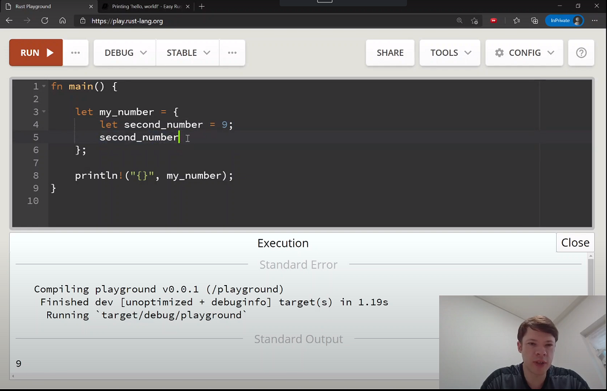

## 更新


2021年5月23日: 現在有 [印尼語](https://github.com/ariandy/easy-rust-indonesia) 翻譯可用，感謝 [Ariandy](https://github.com/ariandy)/[1kb](https://1kilobyte.github.io/)。

2021年4月2日: 增加 [BuyMeACoffee 連結](https://www.buymeacoffee.com/mithridates) 給那些想請我喝杯咖啡的人。

2021年2月1日: [Youtube影片！](https://www.youtube.com/playlist?list=PLfllocyHVgsRwLkTAhG0E-2QxCf-ozBkk) 兩個月後： 到2021年4月1日為止，總共有186支影片全部完成（稍微超過23小時）。

2021年1月4日: mdBook [線上閱讀](https://dhghomon.github.io/easy_rust)。

2020年11月28日: 現在也有[簡體中文](https://github.com/kumakichi/easy_rust_chs) 翻譯可用，感謝 [kumakichi](https://github.com/kumakichi)！

2021年11月27日: [現在有韓語錄製的Easy Rust影片了！](https://www.youtube.com/watch?v=W9DO6m8JSSs&list=PLfllocyHVgsSJf1zO6k6o3SX2mbZjAqYE) 한국어판 비디오도 녹화 시작!




## 介紹

Rust是一門已經有了很好教科書的新程式設計語言。但有時候它的教材很難，因為難在它是寫給以英語為母語的人看的。現在有許多公司及人們在學習Rust，如果能有一本使用簡單英語寫的書，他們可以學習得更快。這本書就是用簡單英語寫給這些公司和人們來學習Rust的。

Rust是一門相當新卻已經非常流行的程式設計語言。它之所以受歡迎，是因為它給了你C或C++的運作速度和控制能力，但也有在其他像Python等較新型語言上有的記憶體安全機制。它有時以不同於其他語言的新想法做到這一點。這也意味著需要學習一些新東西，不能只是 "邊走邊想辦法"。Rust更是一門你必須思考一段時間才能理解的語言。但它看起來還是蠻熟悉的如果你會其他程式設計語言的話，它是為了幫助你寫好程式碼而生的。

## 我是誰？

我是一個生活在韓國的加拿大人，我在寫Easy Rust的同時，也在思考如何讓這裡的公司更容易開始使用它。我希望其他母語不是英語的國家也能使用它。

## 簡單英語學 Rust

*簡單英語學Rust* 寫於2020年7月至8月，長達400多頁。如果你有任何問題，可以在這裡或[在LinkedIn上](https://www.linkedin.com/in/davemacleod)或[在Twitter上](https://twitter.com/mithridates)聯絡我。如果你發現有什麼不對的地方，或者要提出pull request，去做吧。已經有超過20人幫助我們修復了程式碼中的錯別字和問題，所以你也可以。我不是世界上最好的Rust專家，所以我總是喜歡聽到新的想法，或者看看哪裡可以讓這本書變得更好。


- [第1部 - 瀏覽器中的 Rust](#第1部---瀏覽器中的-rust)
  - [Rust Playground](#rust-playground)
  - [🚧 和 ⚠️](#-和-️)
  - [註解](#註解)
  - [型別](#型別)
    - [原始型別](#原始型別)
  - [型別推導](#型別推導)
    - [浮點數](#浮點數)
  - [列印 hello, world!](#列印-hello-world)
    - [宣告變數和程式碼區塊](#宣告變數和程式碼區塊)
  - [顯示和除錯](#顯示和除錯)
    - [最小和最大的數](#最小和最大的數)
  - [可變性](#可變性)
    - [遮蔽](#遮蔽)
  - [堆疊、堆積和指標](#堆疊堆積和指標)
  - [更多關於列印](#更多關於列印)
  - [字串](#字串)
  - [const 和 static](#const-和-static)
  - [更多關於參考](#更多關於參考)
  - [可變參考](#可變參考)
    - [再談遮蔽](#再談遮蔽)
  - [傳遞參考給函式](#傳遞參考給函式)
  - [複製型別](#複製型別)
    - [無值變數](#無值變數)
  - [集合型別](#集合型別)
    - [陣列](#陣列)
  - [向量](#向量)
  - [元組](#元組)
  - [控制流程](#控制流程)
  - [結構體](#結構體)
  - [列舉](#列舉)
    - [使用多種型別的列舉](#使用多種型別的列舉)
  - [迴圈](#迴圈)
  - [實作結構體和列舉](#實作結構體和列舉)
  - [解構](#解構)
  - [參考和點運算子](#參考和點運算子)
  - [泛型](#泛型)
  - [Option 和 Result](#option-和-result)
    - [Option](#option)
    - [Result](#result)
  - [其他集合型別](#其他集合型別)
    - [HashMap (和 BTreeMap)](#hashmap-和-btreemap)
    - [HashSet 和 BTreeSet](#hashset-和-btreeset)
    - [BinaryHeap](#binaryheap)
    - [VecDeque](#vecdeque)
  - [The ? operator](#the--operator)
    - [When panic and unwrap are good](#when-panic-and-unwrap-are-good)
  - [Traits](#traits)
    - [The From trait](#the-from-trait)
    - [Taking a String and a &str in a function](#taking-a-string-and-a-str-in-a-function)
  - [Chaining methods](#chaining-methods)
  - [Iterators](#iterators)
    - [How an iterator works](#how-an-iterator-works)
  - [Closures](#closures)
    - [|_| in a closure](#_-in-a-closure)
    - [Helpful methods for closures and iterators](#helpful-methods-for-closures-and-iterators)
  - [The dbg! macro and .inspect](#the-dbg-macro-and-inspect)
  - [Types of &str](#types-of-str)
  - [Lifetimes](#lifetimes)
  - [Interior mutability](#interior-mutability)
    - [Cell](#cell)
    - [RefCell](#refcell)
    - [Mutex](#mutex)
    - [RwLock](#rwlock)
  - [Cow](#cow)
  - [Type aliases](#type-aliases)
    - [Importing and renaming inside a function](#importing-and-renaming-inside-a-function)
  - [The todo! macro](#the-todo-macro)
  - [Rc](#rc)
  - [Multiple threads](#multiple-threads)
  - [Closures in functions](#closures-in-functions)
  - [impl Trait](#impl-trait)
  - [Arc](#arc)
  - [Channels](#channels)
  - [Reading Rust documentation](#reading-rust-documentation)
    - [assert_eq!](#assert_eq)
    - [Searching](#searching)
    - [[src] button](#src-button)
    - [Information on traits](#information-on-traits)
  - [Attributes](#attributes)
  - [Box](#box)
  - [Box around traits](#box-around-traits)
  - [Default and the builder pattern](#default-and-the-builder-pattern)
  - [Deref and DerefMut](#deref-and-derefmut)
  - [Crates and modules](#crates-and-modules)
  - [Testing](#testing)
    - [Test-driven development](#test-driven-development)
  - [External crates](#external-crates)
    - [rand](#rand)
    - [rayon](#rayon)
    - [serde](#serde)
    - [regex](#regex)
    - [chrono](#chrono)
  - [A tour of the standard library](#a-tour-of-the-standard-library)
    - [Arrays](#arrays)
    - [char](#char)
    - [Integers](#integers)
    - [Floats](#floats)
    - [bool](#bool)
    - [Vec](#vec)
    - [String](#string)
    - [OsString and CString](#osstring-and-cstring)
    - [mem](#mem)
    - [prelude](#prelude)
    - [time](#time)
    - [Other macros](#other-macros)
  - [Writing macros](#writing-macros)
- [Part 2 - Rust on your computer](#part-2---rust-on-your-computer)
  - [cargo](#cargo)
  - [Taking user input](#taking-user-input)
  - [Using files](#using-files)
  - [cargo doc](#cargo-doc)
  - [The end?](#the-end)

# 第1部 - 瀏覽器中的 Rust

本書有分兩部。第1部，你將在瀏覽器中就能學到儘可能多的Rust知識。實際上你幾乎可以在不安裝Rust的情況下學到所有你需要知道的東西，所以第1部非常長。最後是第二部。它要短得多，是關於電腦上的Rust。在這裡，你將學習到其他一切你需要知道的、只能在瀏覽器之外進行的事情。例如:處理檔案、接受使用者輸入、圖形和個人設定。希望在第一部結束時，你會喜歡Rust到想安裝它。如果你不喜歡，也沒問題--第一部教了你很多，你不會介意的。

## Rust Playground
**[YouTube 上觀看本章內容](https://youtu.be/-lYeJeQ11OI)**

也許你還不想安裝Rust，這也沒關係。不用離開瀏覽器你可以去[https://play.rust-lang.org/](https://play.rust-lang.org/)，開始寫Rust。你可以在那裡寫下你的程式碼，然後點選 Run 來檢視結果。你可以在瀏覽器裡用Playground裡面執行本書中大多數的範例。只有在接近本書結尾的時候，才會看到無法在Playground操作的範例(比如開啟檔案)。

以下是使用Rust Playground時的一些提示。

- 用 RUN 來執行你的程式碼
- 如果你想讓你的程式碼更快，就把 DEBUG 改為 RELEASE 模式。 Debug: 編譯速度較快，執行速度較慢，包含除錯資訊。 Release: 編譯速度較慢，執行速度較快，移除除錯資訊。
- 點選 SHARE ，得到當下程式碼的網址連結。如果你需要幫助，可以用它來分享你的程式碼。點選 SHARE 後，你可以點選 `Open a new thread in the Rust user forum` ，馬上向論壇那裡的人尋求幫助。
- TOOLS: Rustfmt 會幫你的程式碼排版好。
- TOOLS: Clippy 會給你如何讓程式碼更好的額外資訊。
- CONFIG: 你可以在這裡把你的主題改成黑暗模式，方便在晚上工作，以及很多其他配置。

如果你想安裝Rust，請到官方網站[安裝頁面](https://www.rust-lang.org/tools/install)，然後按照說明操作。通常你會使用`rustup`來安裝和更新 Rust。

## 🚧 和 ⚠️

有時書中的程式碼範例是不能用的。如果一個範例不能用，它將會有一個 🚧 (施工路障emoji)或 ⚠️ (警告標誌emoji)在裡面。🚧 就像"正在建設中"一樣: 它意味著程式碼不完整。Rust需要一個`fn main()`(一個主函式)來執行，但有時我們只是想看一些小的程式碼，所以它不會有`fn main()`。這些範例是正確的，但需要一個`fn main()`讓你執行。而有些程式碼範例是向你展示一個我們將解決的問題。那些可能有一個`fn main()`，但會產生錯誤，所以它們會有一個⚠️。

## 註解
**[YouTube 上觀看本章內容](https://youtu.be/fJ7jBZG_Rpo)**

註解是給程式設計師看的，而不是給電腦看的。寫註解是為了幫助別人理解你的程式碼。這也有利於幫助你以後理解你的程式碼。 (很多人寫了很好的程式碼，但後來卻忘記了他們為什麼要寫它。)在Rust中寫註解，你通常會使用 `//`:

```rust
fn main() {
    // Rust 程式從 fn main() 開始
    // 程式碼放在區塊中，用 { 開始和 } 結束
    let some_number = 100; // 我們寫多少在這裡都可以，編譯器都不會看
}
```

當你這樣做時，編譯器不會看到出現在 `//` 右邊的任何東西。

還有一種註解是，你可以用 `/*` 開頭，以 `*/` 結尾。這種寫法在程式碼中間很有用。

```rust
fn main() {
    let some_number/*: i16*/ = 100;
}
```

對編譯器來說，`let some_number/*: i16*/ = 100;`看起來就跟`let some_number = 100;`一樣。

`/* */`註解形式對於超過一行的非常長的註釋也很有用。在這個範例中，你可以看到你需要為每一行去寫`//`。但是如果你輸入 `/*`，它不會停止註解，直到你用 `*/` 結束這個註解。

```rust
fn main() {
    let some_number = 100; /* 讓我來告訴你
    有關這個數字的一些事情。
    它是100，我最愛的數字。
    他叫做 some_number 但實際上我思考的是… */

    let some_number = 100; // 讓我來告訴你
    // 有關這個數字的一些事情。
    // 它是100，我最愛的數字。
    // 他叫做 some_number 但實際上我思考的是…
}
```

## 型別

Rust有許多型別，讓你可以處理數字、字元等等。有些型別很簡單，有些型別比較複雜，你甚至可以建立自己的型別。

### 原始型別
**[YouTube 上觀看本章內容](https://youtu.be/OxTPU5UGMhs)**

Rust有簡單的型別，這些型別被稱為**原始型別**(原始=非常基本)。我們將從整數和`char`(字元)開始。沒有包含小數點的一整個數字就是整數。整數有兩種型別：

- 有符號整數
- 無符號整數

符號是指 `+` (加號)與 `-` (減號)，所以有符號整數可以是正數，也可以是負數(如 +8，-8)。但無符號整數只能是正數，因為它們沒有符號。

有符號整數是 `i8`、`i16`、`i32`、`i64`、`i128` 和 `isize`。
無符號整數是 `u8`、`u16`、`u32`、`u64`、`u128` 和 `usize`。

i 或 u 後面的數字表示該數字的位元數，所以位元數愈多的可以表示更大的數字。8 位元 = 一個位元組，所以 `i8` 是佔用一個位元組空間的型別，`i64` 是 8 個位元組，以此類推。尺寸較大的數字型別可以容納更大的數字。例如，`u8` 最多可以容納最大的數字是 255，但 `u16` 最多可以容納 65535。而 `u128` 最多可以容納 340282366920938463463374607431768211455。

那什麼是 `isize` 和 `usize` 呢？這表示你的電腦類型的位元數。(你的電腦裡中央處理器的位元數叫做電腦的**架構**)。所以在 32 位元電腦上的 `isize` 和 `usize` 就像是 `i32` 和 `u32`，64 位元電腦上的 `isize` 和 `usize` 就像是 `i64` 和 `u64`。

需要不同整數型別的原因有很多。其中之一是電腦效能：位元組數量愈少處理速度愈快。例如，數字 -10 在 `i8` 是 `11110110`，但在 `i128` 會是`11111111111111111111111111111111111111111111111111111111111111111111111111111111111111111111111111111111111111111111111111110110`。不過這裡它還有一些其它用途：

Rust 中的字元稱做 `char`。每一個 `char` 都對應到一個數字：字母 `A` 對應到數字 65，而字元 `友` (中文的"朋友")對應數字 21451。這個數字列表被稱為 "Unicode"。Unicode 給愈常用的字元使用愈小的數字，如字母 A 到 Z，數字 0 到 9，或空格等等。

```rust
fn main() {
    let first_letter = 'A';
    let space = ' '; // ' ' 裡的空白也算一個字元
    let other_language_char = 'Ꮔ'; // 感謝 Unicode，其它語言像是切羅基語 (Cherokee) 也顯示的很好
    let cat_face = '😺'; // Emojis 也算字元
}
```

最常用字元的對應數字少於 256，剛好可以放進 `u8` 裡。要記得，`u8` 是 0 加上到 255 的所有數字，總共 256 種。這意味著 Rust 能使用 `as` 關鍵字安全地將一個 `u8` **轉換型別(cast)** 為 `char`。("轉換 `u8` 為 `char`" 意味著 "假裝 `u8` 是`char`")

透過 `as` 轉型很有用，因為 Rust 對型別非常嚴格。它總是必需知道是什麼型別，也不會讓你一起用不同的兩種型別，即使它們都是整數。舉例來說，不能這樣用：

```rust
fn main() { // main() 是 Rust 程式開始執行的地方。程式碼會放在 {} (大括號)裡

    let my_number = 100; // 我們沒有寫出整數的型別，
                         // 因此 Rust 選擇了 i32。
                         // Rust 總是給整數選擇 i32，
                         // 如果你不教它用不同型別的話。

    println!("{}", my_number as char); // ⚠️
}
```

編譯器給的理由是：

```text
error[E0604]: only `u8` can be cast as `char`, not `i32`
 --> src\main.rs:3:20
  |
3 |     println!("{}", my_number as char);
  |                    ^^^^^^^^^^^^^^^^^
```

幸運的是，我們可以用 `as` 輕鬆修正這個錯誤。我們無法將 `i32` 轉型為 `char`，但我們可以將 `i32` 轉型為 `u8`。接著我們同樣可以將 `u8` 轉型為 `char`。所以在同一行中，我們先用 `as` 讓 `my_number` 變成 `u8`，再變成 `char`。現在它就能通過編譯了：

```rust
fn main() {
    let my_number = 100;
    println!("{}", my_number as u8 as char);
}
```

它會印出 `d` 是因為它就是100對應的 `char`。

然而，更簡單的方法是你只要告訴 Rust 說 `my_number` 的型別是 `u8`。你要像這樣做：

```rust
fn main() {
    let my_number: u8 = 100; //  更改 my_number 為 my_number: u8
    println!("{}", my_number as char);
}
```

所以這些是 Rust 中會有不同整數型別的兩個原因。這裡還有一個原因：`usize` 是 Rust 用來 *索引* 的型別。(索引的意思是"哪項是第一"，"哪項是第二"等等) `usize` 是最佳的索引型別，因為：

- 索引值不能是負數，所以它需要是一個帶 u 的數字(註：指無符號數)
- 它要可以夠大，因為有時你需要索引很多東西，但是
- 它不能是 `u64`，因為 32 位元電腦無法使用 `u64`。

所以Rust使用了 `usize`，這樣你的電腦就能以它能讀取到的最大整數值進行索引。


我們再來了解一下 `char`。你會看到 `char` 總是一個字元，並且使用 `''` 而不是 `""`。

所有的 `chars` 都使用 4 個位元組的記憶體，因為4個位元組足以容納任何種類的字元：
- 基本字母和符號通常只需要4個位元組中的1個：`a b 1 2 + - = $ @`
- 其他字母，如德文元音變音 (Umlauts) 或重音，需要4個位元組中的2個：`ä ö ü ß è é à ñ`
- 韓文、日文或中文字元需要3或4個位元組：`國 안 녕`

當使用字元作為字串的一部分時，字串是用每個字元所需的最少記憶體來編碼的。

我們可以自己用 `.len()` 來觀察這個情況。

```rust
fn main() {
    println!("Size of a char: {}", std::mem::size_of::<char>()); // 4 位元組
    println!("Size of string containing 'a': {}", "a".len()); // .len() 給出以位元組為單位的字串大小
    println!("Size of string containing 'ß': {}", "ß".len());
    println!("Size of string containing '国': {}", "国".len());
    println!("Size of string containing '𓅱': {}", "𓅱".len());
}
```

這個程式會印出：

```text
Size of a char: 4
Size of string containing 'a': 1
Size of string containing 'ß': 2
Size of string containing '国': 3
Size of string containing '𓅱': 4
```

你可以看到 `a` 的大小是一個位元組，德文的 `ß` 是兩個位元組，日文的 `國` 是三個位元組，古埃及的 `𓅱` 是4個位元組。

```rust
fn main() {
    let slice = "Hello!";
    println!("Slice is {} bytes.", slice.len());
    let slice2 = "안녕!"; // 韓文的 "hi"
    println!("Slice2 is {} bytes.", slice2.len());
}
```

這個程式會印出：

```text
Slice is 6 bytes.
Slice2 is 7 bytes.
```

`slice` 長 6 個字元，佔 6 個位元組，但 `slice2` 長 3 個字元，佔 7 個位元組。

如果 `.len()` 給出的是以位元組為單位的大小，那麼以字元為單位的大小呢？我們在後面會學習這些方法，但這裡你只要記得 `.chars().count()` 做得到這件事就可以了。`.chars().count()` 會將你寫的東西變成字元，然後算出有多少個。


```rust
fn main() {
    let slice = "Hello!";
    println!("Slice is {} bytes and also {} characters.", slice.len(), slice.chars().count());
    let slice2 = "안녕!";
    println!("Slice2 is {} bytes but only {} characters.", slice2.len(), slice2.chars().count());
}
```

這個程式會印出：

```text
Slice is 6 bytes and also 6 characters.
Slice2 is 7 bytes but only 3 characters.
```

## 型別推導
**[YouTube 上觀看本章內容](https://youtu.be/q1D2vpy3kEI)**

型別推導的意思是，如果你沒有告訴編譯器型別，但它可以自己判斷時它就會自己決定型別。編譯器總是必需知道變數的型別，但你不需要都告訴它。實際上，通常你不需要告訴它。例如，像 `let my_number = 8`，`my_number` 將會是 `i32`。這是因為如果你不告訴它，編譯器會給整數選擇 i32。但是如果你說 `let my_number: u8 = 8`，它就會把 `my_number` 視為 `u8`，因為你明確告訴它是 `u8`。

通常編譯器都能猜到。但有時你需要告訴它，原因有兩個：

1) 你正在做一些非常複雜的事情，而編譯器不知道你想要的型別。
2) 你想要一個不同的型別 (例如，你想要一個 `i128`，而不是 `i32`)。

這時可以指定一個型別，只要在變數名後新增一個冒號和型別。

```rust
fn main() {
    let small_number: u8 = 10;
}
```

對數字來說，你可以在數字後面加上型別。你不需要空格──只需要在數字後面直接輸入。

```rust
fn main() {
    let small_number = 10u8; // 10u8 = 型別為 u8 的 10
}
```

如果你想讓數字容易閱讀，也可以加上 `_`。

```rust
fn main() {
    let small_number = 10_u8; // 好讀
    let big_number = 100_000_000_i32; // 用 _ 時更容易讀出是 100 百萬
}
```

`_`不會改變數字。它只是為了讓你方便閱讀。而且你用多少個`_`都沒有關係。

```rust
fn main() {
    let number = 0________u8;
    let number2 = 1___6______2____4______i32;
    println!("{}, {}", number, number2);
}
```

這個程式會印出 `0, 1624`.

### 浮點數

浮點數是帶有小數點的數字。5.5 是一個浮點數，6 是一個整數。5.0 也是一個浮點數，甚至 5. 也是一個浮點數。

```rust
fn main() {
    let my_float = 5.; // Rust 看到 . 時，知道它是 float
}
```

但寫出型別時不叫 `float`，叫 `f32` 和 `f64`。這點和整數一樣：`f` 後面的數字顯示的是位元數。如果你不寫型別，Rust 會選擇 `f64`。

當然，只有同樣型別的浮點數可以一起使用。所以你不能把 `f32` 和 `f64` 加起來。

```rust
fn main() {
    let my_float: f64 = 5.0; // 這是 f64
    let my_other_float: f32 = 8.5; // 這是 f32

    let third_float = my_float + my_other_float; // ⚠️
}
```

當你嘗試執行這個程式時，Rust 會說：

```text
error[E0308]: mismatched types
 --> src\main.rs:5:34
  |
5 |     let third_float = my_float + my_other_float;
  |                                  ^^^^^^^^^^^^^^ expected `f64`, found `f32`
```

當你用錯型別時，編譯器會寫 "expected (type), found (type)"。它是像這樣讀你的程式碼：

```rust
fn main() {
    let my_float: f64 = 5.0; // 編譯器見到 f64
    let my_other_float: f32 = 8.5; // 編譯器見到 f32 是個不同型別
    let third_float = my_float + // 你想把 my_float 加上什麼，所以它一定要是 f64 加上另一個 f64。現在它預期有另一個 f64…
    let third_float = my_float + my_other_float;  // ⚠️ 不過它發現是個 f32。它沒辨法把它們加起來。
}
```

所以當你看到 "expected(type), found(type)" 時，你必須找到為什麼編譯器預期的是不同的型別。

當然，單純的數字很容易修正。你可以用 `as` 把 `f32` 轉型成 `f64`：

```rust
fn main() {
    let my_float: f64 = 5.0;
    let my_other_float: f32 = 8.5;

    let third_float = my_float + my_other_float as f64; // my_other_float as f64 = 把 my_other_float 當 f64 來用
}
```

或者更簡單，去掉型別宣告。("宣告一個型別" = "告訴Rust使用該型別") Rust會選擇可以加在一起的型別。

```rust
fn main() {
    let my_float = 5.0; // Rust 會選 f64
    let my_other_float = 8.5; // 這裡還是會選 f64

    let third_float = my_float + my_other_float;
}
```

Rust 編譯器很聰明，如果你需要 f32，就不會選擇 f64：

```rust
fn main() {
    let my_float: f32 = 5.0;
    let my_other_float = 8.5; // 通常 Rust 是選 f64,

    let third_float = my_float + my_other_float; // 但現在它知道你需要把它加上 f32。所以它也選了 f32 給 my_other_float
}
```

## 列印 hello, world!
**YouTube 上觀看本章內容: [影片 1](https://youtu.be/yYlPHRl2geQ), [影片 2](https://youtu.be/DTCSfBJJZb8)**

當你啟動一個新的Rust程式時，它總是有這樣的程式碼。

```rust
fn main() {
    println!("Hello, world!");
}
```

- `fn` 的意思是函式，
- `main` 是啟動程式的函式。
- `()` 表示我們沒有給函式任何變數來啟動。

`{}` 被稱為**程式碼區塊**。這是程式碼所在的空間。

`println!` 是一個列印訊息到控制台(console)的**巨集**，。一個**巨集**就像一個為你寫程式碼的函式。巨集名稱後面都有一個 `!`。我們以後會學習如何建立巨集。現在只要記住有 `!` 表示它是一個巨集。

為了學習 `;`，我們將建立另一個函式。首先，在 `main` 中，我們將印出數字 8。

```rust
fn main() {
    println!("Hello, world number {}!", 8);
}
```

`println!` 中的 `{}` 的意思是 "把變數放在這裡面"。這樣就會印出 `Hello, world number 8!`。


我們可以像之前一樣，放更多的東西進去。

```rust
fn main() {
    println!("Hello, worlds number {} and {}!", 8, 9);
}
```

這將會印出 `Hello, worlds number 8 and 9!`。

現在我們來建立函式。

```rust
fn number() -> i32 {
    8
}

fn main() {
    println!("Hello, world number {}!", number());
}
```

這個程式也會印出 `Hello, world number 8!`。當 Rust 觀察到 `number()` 時，它看到一個函式。這個函式：

- 沒有用到引數(因為它是 `()`)
- 回傳一個 `i32`。`->`(稱為 "瘦箭")右邊顯示了函式回傳內容的型別

函式內部只有 `8`。因為行尾沒有 `;`，所以這就是它回傳的值。如果它有 `;`，它將不會回傳任何東西(意思是它會回傳 `()`)。如果它有 `;`，Rust 將無法編譯，因為回傳的是 `i32`，而 `;` 回傳 `()`，不是 `i32`：

```rust
fn main() {
    println!("Hello, world number {}", number());
}

fn number() -> i32 {
    8;  // ⚠️
}
```

```text
5 | fn number() -> i32 {
  |    ------      ^^^ expected `i32`, found `()`
  |    |
  |    implicitly returns `()` as its body has no tail or `return` expression
6 |     8;
  |      - help: consider removing this semicolon
```

這意味著 "你告訴我 `number()` 回傳的是 `i32`，但你加了 `;`，它就沒回傳值了"。所以編譯器建議去掉分號。

你也可以寫 `return 8;`，但在Rust中，正常情況下只需將`;`去掉即可`回傳`。

當你想提供變數給函式時，把它們放在 `()` 裡。還必須給它們命名並寫上型別。

```rust
fn multiply(number_one: i32, number_two: i32) { // 兩個 i32 傳入函式。將它們取名為number_one和number_two。
    let result = number_one * number_two;
    println!("{} times {} is {}", number_one, number_two, result);
}

fn main() {
    multiply(8, 9); // 可以直接給數值
    let some_number = 10; // 或者宣告兩個變數
    let some_other_number = 2;
    multiply(some_number, some_other_number); // 把它們給函式當作引數
}
```

我們也可以回傳 `i32`。只要把行尾的分號拿掉就可以了：

```rust
fn multiply(number_one: i32, number_two: i32) -> i32 {
    let result = number_one * number_two;
    println!("{} times {} is {}", number_one, number_two, result);
    result // 這是我們要回傳的 i32
}

fn main() {
    let multiply_result = multiply(8, 9); // 我們用multiply()印出結果並回傳給multiply_result
}
```

### 宣告變數和程式碼區塊

使用 `let` 宣告變數(宣告一個變數 = 告訴 Rust 建立一個變數)。

```rust
fn main() {
    let my_number = 8;
    println!("Hello, number {}", my_number);
}
```

變數使用範圍的開始和結束都在程式碼區塊 `{}` 內。在這個例子中，`my_number` 在我們呼叫 `println!` 之前結束，因為它在自己的程式區碼塊裡面。

```rust
fn main() {
    {
        let my_number = 8; // my_number 在這裡開始
                           // my_number 在這裡結束!
    }

    println!("Hello, number {}", my_number); // ⚠️ 沒有 my_number，而且
                                             // println!() 也找不到它
}
```

你可以用程式碼區塊來回傳一個值：

```rust
fn main() {
    let my_number = {
    let second_number = 8;
        second_number + 9 // 沒分號，程式碼區塊回傳 returns 8 + 9。
                          // 就像函式一樣運作
    };

    println!("My number is: {}", my_number);
}
```

如果在程式碼區塊內結束前加上分號，它將回傳 `()` (沒有值)：

```rust
fn main() {
    let my_number = {
    let second_number = 8; // 宣告 second_number,
        second_number + 9; // 加 9 到 second_number
                           // 但沒回傳它!
                           // second_number 現在就結束
    };

    println!("My number is: {:?}", my_number); // my_number 會是 ()
}
```

那麼為什麼我們要寫 `{:?}` 而不是 `{}` 呢？我們現在就來談談這個問題。

## 顯示和除錯
**[YouTube 上觀看本章內容](https://youtu.be/jd3pC248c0o)**

Rust 中單純的變數可以在 `println!` 裡用 `{}`[^1] 來被印出。但是有些變數不能，你需要用 **除錯列印(debug print)**。除錯列印是給程式設計師用的列印方法，因為它通常會顯示更多的資訊。除錯(Debug)有時看起來並不漂亮，因為它有額外的資訊來幫助你。

你怎麼知道你是否需要 `{:?}`[^2] 而不是 `{}`？編譯器會告訴你。比如說：

```rust
fn main() {
    let doesnt_print = ();
    println!("This will not print: {}", doesnt_print); // ⚠️
}
```

當我們執行這個程式時，編譯器會說：

```text
error[E0277]: `()` doesn't implement `std::fmt::Display`
 --> src\main.rs:3:41
  |
3 |     println!("This will not print: {}", doesnt_print);
  |                                         ^^^^^^^^^^^^ `()` cannot be formatted with the default formatter
  |
  = help: the trait `std::fmt::Display` is not implemented for `()`
  = note: in format strings you may be able to use `{:?}` (or {:#?} for pretty-print) instead
  = note: required by `std::fmt::Display::fmt`
  = note: this error originates in a macro (in Nightly builds, run with -Z macro-backtrace for more info)
```

這有相當多的資訊，但重要的部分是 `you may be able to use {:?} (or {:#?} for pretty-print) instead`。這意味著你可以試試 `{:?}`，也可以試試 `{:#?}`。`{:#?}` 叫做"漂亮列印"。它和 `{:?}` 一樣，但是用更多行和不同的格式印出內容。所以 Display 意思是用 `{}` 列印，Debug 則是用 `{:?}` 列印。還有一點：如果你不想要換行，你也可以使用 `print!` 而不需要有 `ln`。

```rust
fn main() {
    print!("This will not print a new line");
    println!(" so this will be on the same line");
}
```

這個將會印出 `This will not print a new line so this will be on the same line`。

[^1]: 譯註: 即顯示列印 (Display print)。

[^2]: 譯註: 除錯列印的格式。

### 最小和最大的數

如果你想知道最小和最大的數字，你可以在型別名稱後使用 MIN 和 MAX：

```rust
fn main() {
    println!("The smallest i8 is {} and the biggest i8 is {}.", i8::MIN, i8::MAX); // 提示: 印出 std::i8::MIN 表示 "列印在標準函式庫裡 i8 型別的 MIN 值"
    println!("The smallest u8 is {} and the biggest u8 is {}.", u8::MIN, u8::MAX);
    println!("The smallest i16 is {} and the biggest i16 is {}.", i16::MIN, i16::MAX);
    println!("The smallest u16 is {} and the biggest u16 is {}.", u16::MIN, u16::MAX);
    println!("The smallest i32 is {} and the biggest i32 is {}.", i32::MIN, i32::MAX);
    println!("The smallest u32 is {} and the biggest u32 is {}.", u32::MIN, u32::MAX);
    println!("The smallest i64 is {} and the biggest i64 is {}.", i64::MIN, i64::MAX);
    println!("The smallest u64 is {} and the biggest u64 is {}.", u64::MIN, u64::MAX);
    println!("The smallest i128 is {} and the biggest i128 is {}.", i128::MIN, i128::MAX);
    println!("The smallest u128 is {} and the biggest u128 is {}.", u128::MIN, u128::MAX);

}
```

將會印出：

```text
The smallest i8 is -128 and the biggest i8 is 127.
The smallest u8 is 0 and the biggest u8 is 255.
The smallest i16 is -32768 and the biggest i16 is 32767.
The smallest u16 is 0 and the biggest u16 is 65535.
The smallest i32 is -2147483648 and the biggest i32 is 2147483647.
The smallest u32 is 0 and the biggest u32 is 4294967295.
The smallest i64 is -9223372036854775808 and the biggest i64 is 9223372036854775807.
The smallest u64 is 0 and the biggest u64 is 18446744073709551615.
The smallest i128 is -170141183460469231731687303715884105728 and the biggest i128 is 170141183460469231731687303715884105727.
The smallest u128 is 0 and the biggest u128 is 340282366920938463463374607431768211455.
```

## 可變性
**[YouTube 上觀看本章內容](https://youtu.be/Nyyd6qn7dZY)**

當你用 `let` 宣告變數時，它是不可變的(immutable，內容不可被變動)。

這個程式不能編譯：

```rust
fn main() {
    let my_number = 8;
    my_number = 10; // ⚠️
}
```

編譯器說：`error[E0384]: cannot assign twice to immutable variable my_number`。這是因為如果你只寫 `let`，變數是不可變的。

但有時你想更改你的變數。要建立一個可以改變的變數，就要在 `let` 後面加上 `mut`。

```rust
fn main() {
    let mut my_number = 8;
    my_number = 10;
}
```

現在就沒問題了。

但是，你不能改變型別：即使加上 `mut` 也做不到。這樣將會無法編譯：

```rust
fn main() {
    let mut my_variable = 8; // 它現在是 i32. 型別不能被改變
    my_variable = "Hello, world!"; // ⚠️
}
```

你會看到編譯器發出的同樣的"預期"訊息。`expected integer, found &str`。我們很快就會知道 `&str` 是一個字串型別。

### 遮蔽
**[YouTube 上觀看本章內容](https://youtu.be/InULHyRGw7g)**

遮蔽 (Shadowing) 是指使用 `let` 宣告與另一個變數同名的新變數。它看起來像可變性，但完全不同。遮蔽看起來像這樣：

```rust
fn main() {
    let my_number = 8; // 這是 i32
    println!("{}", my_number); // 印出 8
    let my_number = 9.2; // 這是同名的 f64。 但它已經不是第一個 my_number──它完全不一樣!
    println!("{}", my_number) // 印出 9.2
}
```

這裡我們會說我們用一個新的 "let 繫結(binding)" 對 `my_number` 進行了"遮蔽"。

那麼第一個 `my_number` 是否被銷毀了呢？沒有，但是當我們叫用 `my_number` 時，我們現在得到 `f64` 型別的 `my_number`。因為它們在同一個作用域區塊中(同一個 `{}`)，我們無法再看到第一個 `my_number` 了。

但如果它們在不同的區塊中，我們可以同時看到兩者。例如：

```rust
fn main() {
    let my_number = 8; // 這是 i32
    println!("{}", my_number); // 印出 8
    {
        let my_number = 9.2; // 這是 f64。 它不是原先的 my_number──它完全不一樣!
        println!("{}", my_number) // 印出 9.2
                                  // 但是被遮蔽的 my_number 只活到這裡。
                                  // 原來的 my_number 還活著！
    }
    println!("{}", my_number); // 印出 8
}
```

因此，當你對一個變數遮蔽時，你不會銷毀它。你**阻擋**了它。

那麼遮蔽的好處是什麼呢？當你需要經常改變一個變數的時候，遮蔽很好用。想象你想用變數做很多簡單數學運算時：

```rust
fn times_two(number: i32) -> i32 {
    number * 2
}

fn main() {
    let final_number = {
        let y = 10;
        let x = 9; // x 從 9 開始
        let x = times_two(x); // 遮蔽後新的 x: 18
        let x = x + y; // 遮蔽後新的 x: 28
        x // 回傳 x: final_number 現在是 x 的值
    };
    println!("The number is now: {}", final_number)
}
```

如果沒有遮蔽，你將要思考用什麼不同的名稱，即使你並不關心變數 x：

```rust
fn times_two(number: i32) -> i32 {
    number * 2
}

fn main() {
    // Pretending we are using Rust without 遮蔽
    let final_number = {
        let y = 10;
        let x = 9; // x 從 9 開始
        let x_twice = times_two(x); // x 的第二個名字
        let x_twice_and_y = x_twice + y; // x 的第三個名字!
        x_twice_and_y // 真糟糕沒有遮蔽可用──我們只要用 x 就好
    };
    println!("The number is now: {}", final_number)
}
```

一般來說，你在 Rust 中看到的遮蔽就是這種情況。它發生在你想快速得對變數做一些事情，然後再做其他事情的地方。而你通常將它用在那些你不太關心的臨時變數上。

## 堆疊、堆積和指標

堆疊(stack)、堆積(heap)和指標(pointer)在 Rust 中非常重要。

堆疊和堆積是電腦中保存記憶體的兩個地方。主要的區別在:

- 堆疊的速度非常快，但堆積就不那麼快了。它也不是超慢，但堆疊總是更快。但是你不能一直使用堆疊，因為：
- Rust 在編譯時必需知道變數的大小。所以像 `i32` 的簡單變數就放在堆疊上，因為我們知道它們的確切大小。你總是知道 `i32` 要 4 位元組，因為 32 位元 = 4 位元組。所以 `i32` 總是可以放在堆疊上。
- 但有些型別在編譯時不知道大小。但是堆疊需要知道確切的大小。那麼你該怎麼做呢？首先你把資料放在堆積中，因為堆積中可以有任何大小的資料。然後為了找到它，一個指標就會放上堆疊。這樣沒問題，因為我們總是知道指標的大小。所以，電腦就會先去堆疊讀取指標，然後跟著指標到資料所在的堆積。

指標聽起來很複雜，但它們很容易。指標就像一本書的目錄。想象一下這本書：

```text
MY BOOK

TABLE OF CONTENTS

Chapter                        Page
Chapter 1: My life              1
Chapter 2: My cat               15
Chapter 3: My job               23
Chapter 4: My family            30
Chapter 5: Future plans         43
```

所以這就像有五個指標。你可以閱讀它們，找到它們所說的資訊。"My life" 這一章在哪裡？它在第 1 頁(它 *指向* 第 1 頁)。"My job" 這一章在哪裡？它在第23頁。

通常在 Rust 中看到的指標稱做 **參考**。重點在於知道：一個參考指向另一個值的記憶體位置。參考意味著你 *借* 了這個值，但你並不擁有它。這和我們的書一樣：目錄並不擁有資訊。章節裡才有資訊。在 Rust 中，參考的前面有一個 `&`。所以：

- `let my_variable = 8` 是一個正規的變數，但是：
- `let my_reference = &my_variable` 是一個變數參考。

你把 `my_reference = &my_variable` 讀成這樣："my_reference 是對my_variable 的參考" 或者："my_reference 參照到 my_variable"。

這意味著 `my_reference` 只看 `my_variable` 的資料。`my_variable` 仍然擁有它的資料。

你也可以有一個參考的參考，或者任何數量的參考。

```rust
fn main() {
    let my_number = 15; // 這是 i32
    let single_reference = &my_number; //  這是 &i32
    let double_reference = &single_reference; // 這是 &&i32
    let five_references = &&&&&my_number; // 這是 &&&&&i32
}
```

這些都是不同的型別，就像 "朋友的朋友"和 "朋友"不同一樣。

## 更多關於列印

在 Rust 中，你幾乎可以用任何你想要的方式列印東西。這裡可以知道更多關於列印的事情。

加入 `\n` 將會產生一個新行(newline)，而 `\t` 將會產生定位字元(tab)：

```rust
fn main() {
    // Note: 這是 print!, 不是 println!
    print!("\t Start with a tab\nand move to a new line");
}
```

印出:

```text
         Start with a tab
and move to a new line
```

`""` 裡面可以寫上許多行都沒有問題，但是要注意間距：

```rust
fn main() {
    // Note: 第一行後你要從最左邊開始。
    // 如果你直接寫在 println! 下面，它會加入開頭的空白
    println!("Inside quotes
you can write over
many lines
and it will print just fine.");

    println!("If you forget to write
    on the left side, the spaces
    will be added when you print.");
}
```

印出:

```text
Inside quotes
you can write over
many lines
and it will print just fine.
If you forget to write
    on the left side, the spaces
    will be added when you print.
```

如果你想印出 `\n` 這樣的字元(稱為"跳脫字元")，你可以多加一個額外的 `\`。

```rust
fn main() {
    println!("Here are two escape characters: \\n and \\t");
}
```

印出:

```text
Here are two escape characters: \n and \t
```

有時你有太多的 `"` 和跳脫字元，並希望 Rust 忽略所有要處理的東西。要做到這件事，你可以在開頭加上 `r#`，在結尾加上 `#`。

```rust
fn main() {
    println!("He said, \"You can find the file at c:\\files\\my_documents\\file.txt.\" Then I found the file."); // 這裡用了 \ 五次
    println!(r#"He said, "You can find the file at c:\files\my_documents\file.txt." Then I found the file."#)
}
```

這會印出一樣的東西，但是用 `r#` 使人更容易閱讀。

```text
He said, "You can find the file at c:\files\my_documents\file.txt." Then I found the file.
He said, "You can find the file at c:\files\my_documents\file.txt." Then I found the file.
```

如果你需要在內容裡面印出 `#`，那麼你可以用 `r##` 開頭，用 `##` 結尾。如果你要印超過一個 `#`，兩邊要再各多加一個 #。

這有四個範例：

```rust
fn main() {

    let my_string = "'Ice to see you,' he said."; // 單引號
    let quote_string = r#""Ice to see you," he said."#; // 雙引號
    let hashtag_string = r##"The hashtag #IceToSeeYou had become very popular."##; // 一個 # 所以我們至少要用 ##
    let many_hashtags = r####""You don't have to type ### to use a hashtag. You can just use #.""####; // 有三個 ### 所以我們至少要用 ####

    println!("{}\n{}\n{}\n{}\n", my_string, quote_string, hashtag_string, many_hashtags);

}
```

會印出:

```text
'Ice to see you,' he said.
"Ice to see you," he said.
The hashtag #IceToSeeYou had become very popular.
"You don't have to type ### to use a hashtag. You can just use #."
```

`r#` 還有另一個用途：你能用它來把關鍵字(如 `let`、`fn` 等)當作變數名稱。

```rust
fn main() {
    let r#let = 6; // 變數名是 let
    let mut r#mut = 10; // 變數名是 mut
}
```

`r#` 之所以有這個功能，是因為舊版的 Rust 關鍵字比現在的少。所以有了 `r#` 以前不是關鍵字的變數名就能避免出錯。

又或者因為某些原因，你 *確實* 需要一個名字像是 `return` 的函式。那麼你可以這樣寫：

```rust
fn r#return() -> u8 {
    println!("Here is your number.");
    8
}

fn main() {
    let my_number = r#return();
    println!("{}", my_number);
}
```

印出:

```text
Here is your number.
8
```

所以你大概不會需要它，但是如果你真的需要用關鍵字當變數，那就用 `r#`。


如果你想印出 `&str` 或 `char` 的位元組，你可以在字串前寫上 `b` 就可以了。這適用於所有 ASCII 字元。以下這些是所有的 ASCII 字元：

```text
☺☻♥♦♣♠♫☼►◄↕‼¶§▬↨↑↓→∟↔▲▼123456789:;<=>?@ABCDEFGHIJKLMNOPQRSTUVWXYZ[\]^_`abcdefghijklmnopqrstuvwxyz{|}~
```

所以，當你印出這個程式：

```rust
fn main() {
    println!("{:?}", b"This will look like numbers");
}
```

結果是這樣：

```text
[84, 104, 105, 115, 32, 119, 105, 108, 108, 32, 108, 111, 111, 107, 32, 108, 105, 107, 101, 32, 110, 117, 109, 98, 101, 114, 115]
```

對 `char` 來說，這叫做 *位元組*，對 `&str` 來說，這叫做 *位元組字串*。


如果有需要，你也可以把 `b` 和 `r` 放在一起：

```rust
fn main() {
    println!("{:?}", br##"I like to write "#"."##);
}
```

它會印出 `[73, 32, 108, 105, 107, 101, 32, 116, 111, 32, 119, 114, 105, 116, 101, 32, 34, 35, 34, 46]`。


還有一個 Unicode 轉義(escape)，可以讓你在字串中印出任何 Unicode 字元：`\u{}`。`{}` 裡面要有一個可以列印的十六進位制數字。這個是說明如何獲得 Unicode 數字及如何再把它印出來的簡短例子。

```rust
fn main() {
    println!("{:X}", '행' as u32); // char 轉型 u32 來取得十六進位值
    println!("{:X}", 'H' as u32);
    println!("{:X}", '居' as u32);
    println!("{:X}", 'い' as u32);

    println!("\u{D589}, \u{48}, \u{5C45}, \u{3044}"); // 試著以 unicode 轉義 \u 印出它們
}
```


我們知道 `println!` 可以用 `{}`(用於顯示) 或 `{:?}`(用於除錯) 來列印，再加上 `{:#?}` 可以進行漂亮列印。但是還有許多其他列印方式。

例如，如果你有一個變數參考，你可以用 `{:p}` 來印出 *指標地址*。指標地址指的是電腦記憶體中的位置。

```rust
fn main() {
    let number = 9;
    let number_ref = &number;
    println!("{:p}", number_ref);
}
```

這會印出 `0xe2bc0ffcfc` 或者其它地址。它可能每次都不一樣，這取決於你的電腦在哪裡儲存它。

或者你可以列印二進位、十六進位和八進位的值：

```rust
fn main() {
    let number = 555;
    println!("Binary: {:b}, hexadecimal: {:x}, octal: {:o}", number, number, number);
}
```

印出了 `Binary: 1000101011, hexadecimal: 22b, octal: 1053`。

或者你可以加上數字來改變順序。第一個變數將在索引0 中，下一個在索引1 中，以此類推。

```rust
fn main() {
    let father_name = "Vlad";
    let son_name = "Adrian Fahrenheit";
    let family_name = "Țepeș";
    println!("This is {1} {2}, son of {0} {2}.", father_name, son_name, family_name);
}
```

`father_name` 在位置0，`son_name` 在位置1，`family_name` 在位置2。所以它印出的是 `This is Adrian Fahrenheit Țepeș, son of Vlad Țepeș`。


也許你有一個非常複雜的字串要列印，有太多的變數要放在 `{}` 括號內。或者你需要印同一個變數不止一次。那麼在 `{}` 裡加上變數名就幫得上忙：

```rust
fn main() {
    println!(
        "{city1} is in {country} and {city2} is also in {country},
but {city3} is not in {country}.",
        city1 = "Seoul",
        city2 = "Busan",
        city3 = "Tokyo",
        country = "Korea"
    );
}
```

這樣會印出：

```text
Seoul is in Korea and Busan is also in Korea,
but Tokyo is not in Korea.
```


在Rust中也可以進行非常複雜的列印，如果你想的話。這裡看到它是如何做到的：

{variable:padding alignment minimum.maximum}

要理解這個語法，看以下規則

1) 你想要有變數名嗎？先寫出來，就像我們上面寫 {country} 一樣。
(如果你想做更多事，就在後面加一個 `:`)
2) 你想要用填充字元嗎？例如，55 加上三個 "填充零" 就像 00055。
3) 填充的對齊方式(左/中/右)？
4) 你想要有最小長度嗎？(寫數字就行)
5) 你想要有最大長度嗎？(寫數字，前面有個`.`)

例如，我想寫 "a"，在它左邊有五個 ㅎ，在它右邊有五個 ㅎ：

```rust
fn main() {
    let letter = "a";
    println!("{:ㅎ^11}", letter);
}
```

這印出來是 `ㅎㅎㅎㅎㅎaㅎㅎㅎㅎㅎ`。我們看看 1) 到 5) 怎麼解釋這個情況，就能明白編譯器是怎麼解讀的：

- 你要不要變數名？`{:ㅎ^11}` 沒有變數名。`:` 之前沒有任何內容。
- 你需要填充字元嗎？ `{:ㅎ^11}` 是。ㅎ 在 `:` 後面，還有一個 `^`。`<` 表示變數在填充字元左邊，`>` 表示在填充字元右邊，`^` 表示在填充字元中間。
- 要不要設定最小長度？`{:ㅎ^11}` 是：後面有一個 11。
- 要不要設定最大長度？`{:ㅎ^11}` 不是：前面沒有`.`的數字。

下面是許多種型別格式化的例子:

```rust
fn main() {
    let title = "TODAY'S NEWS";
    println!("{:-^30}", title); // 沒變數名, 用-填充, 放中間, 30個字元長
    let bar = "|";
    println!("{: <15}{: >15}", bar, bar); // 沒變數名, 用空白填充, 各是15個字元長, 一左一右
    let a = "SEOUL";
    let b = "TOKYO";
    println!("{city1:-<15}{city2:->15}", city1 = a, city2 = b); // 變數city1和city2, 用-填充, 一左一右
}
```

印出：

```text
---------TODAY'S NEWS---------
|                            |
SEOUL--------------------TOKYO
```

## 字串
**[YouTube 上觀看本章內容](https://youtu.be/pSyaGzGg26o)**

Rust 的字串主要型別有兩類：`String` 和 `&str`。有什麼差別呢？

- `&str` 是種簡單的字串。當你寫 `let my_variable = "Hello, world!"` 時，你建立的是一個 `&str`。`&str` 建立非常快。
- `String` 是比較復雜的字串。它比較慢一點，但它有更多的功能。`String` 是一個指標，資料在堆積上。

另外注意，`&str` 前面有 `&`，因為你需要一個參考來使用 `str`。這是因為我們先前看到的原因：堆疊需要知道資料大小。所以我們給它一個它知道大小的 `&`，然後它就滿意了。另外，因為你是用 `&` 去和 `str` 互動，你並不擁有它。但是 `String` 是一個 *擁有所有權* 的型別。我們很快就會知道為什麼這一點很重要。

`&str` 和`String` 都是UTF-8。例如，你可以寫：

```rust
fn main() {
    let name = "서태지"; // 這是韓國名字。沒問題，因為 &str 是 UTF-8。
    let other_name = String::from("Adrian Fahrenheit Țepeș"); // UTF-8 的 Ț 和 ș 沒問題。
}
```

你可以在 `String::from("Adrian Fahrenheit Țepeș")` 中看到，從 `&str` 中建立 `String` 很容易。這兩種型別雖然不同，但彼此聯繫非常緊密。

你甚至可以寫表情符號，這要感謝 UTF-8。

```rust
fn main() {
    let name = "😂";
    println!("My name is actually {}", name);
}
```

在你的電腦上，會印出 `My name is actually 😂`，除非你的命令列印不出(Unicode字元)。那麼它會顯示 `My name is actually �`。但 Rust 對 emojis 或其他 Unicode (處理上)沒有問題。

我們再來看看 `str` 使用 `&` 的原因，以確保我們有理解。

- `str` 是一個動態大小(dynamically sized)的型別(動態大小 = 大小可以不同)。比如 "서태지" 和 "Adrian Fahrenheit Țepeș" 這兩個名字的大小是不一樣的：

```rust
fn main() {

    println!("A String is always {:?} bytes. It is Sized.", std::mem::size_of::<String>()); // std::mem::size_of::<Type>() 給你型別的位元組單位大小
    println!("And an i8 is always {:?} bytes. It is Sized.", std::mem::size_of::<i8>());
    println!("And an f64 is always {:?} bytes. It is Sized.", std::mem::size_of::<f64>());
    println!("But a &str? It can be anything. '서태지' is {:?} bytes. It is not Sized.", std::mem::size_of_val("서태지")); // std::mem::size_of_val() 給你變數的位元組單位大小
    println!("And 'Adrian Fahrenheit Țepeș' is {:?} bytes. It is not Sized.", std::mem::size_of_val("Adrian Fahrenheit Țepeș"));
}
```

列出:

```text
A String is always 24 bytes. It is Sized.
And an i8 is always 1 bytes. It is Sized.
And an f64 is always 8 bytes. It is Sized.
But a &str? It can be anything. '서태지' is 9 bytes. It is not Sized.
And 'Adrian Fahrenheit Țepeș' is 25 bytes. It is not Sized.
```

這就是為什麼我們需要一個 &，因為 `&` 建立一個指標，而 Rust 知道指標的大小。所以指標會放在堆疊中。如果我們寫的是 `str`，Rust 因為不知道大小就不曉得該怎麼做了。


有很多方法可以建立 `String`。這裡是其中一些：

- `String::from("This is the string text");` 這是 String 型別用文字建立 String 的方法。
- `"This is the string text".to_string()`。 這是 &str 型別用來做出 String 的方法。
- `format!` 巨集。 像是 `println!`，只不過它是建立 String，而不是列印。所以你可以這樣做：

```rust
fn main() {
    let my_name = "Billybrobby";
    let my_country = "USA";
    let my_home = "Korea";

    let together = format!(
        "I am {} and I come from {} but I live in {}.",
        my_name, my_country, my_home
    );
}
```

現在我們有了名為 *together* 的 String，但還沒有印出來。

還有一種建立 String 的方法叫做 `.into()`，但它有點不同，因為 `.into()` 並不只是用來建立 `String`。有些型別可以很容易地使用 `From` 和 `.into()` 來回轉換為另一種型別。而如果你有 `From`，那麼你也有 `.into()`。`From` 更加清晰，因為你已經知道了型別：你知道 `String::from("Some str")` 是來自 `&str` 的 `String`。但是對於 `.into()`，有時候編譯器並不知道：

```rust
fn main() {
    let my_string = "Try to make this a String".into(); // ⚠️
}
```

Rust 不知道你要的是什麼型別，因為很多型別都可以由 `&str` 來組成。它說："我可以把 &str 變成很多東西。你想要哪一種？"

```text
error[E0282]: type annotations needed
 --> src\main.rs:2:9
  |
2 |     let my_string = "Try to make this a String".into();
  |         ^^^^^^^^^ consider giving `my_string` a type
```

所以你可以這樣做：

```rust
fn main() {
    let my_string: String = "Try to make this a String".into();
}
```

現在你得到 String 了。

## const 和 static
**[YouTube 上觀看本章內容](https://youtu.be/Ky3HqkWUcI0)**

有兩種宣告值的方法，不僅僅是用 `let`。它們是 `const` 和 `static`。另外，Rust 不會使用型別推理：你需要為它們編寫型別。這些都是用於不改變的值（`const` 表示常數）。區別在於：

- `const` 是用於不改變的值，當使用它時，名字會被替換成值。
- `static` 與 `const` 類似，但有一個固定的記憶體位置，可以作為一個全域性變數使用。

所以它們幾乎是一樣的。Rust 程式設計師幾乎總是使用 `const`。

你用全大寫字母命名，而且通常放在 `main` 之外，這樣它們就可以在整個程式中生存。

兩個範例是 `const NUMBER_OF_MONTHS: u32 = 12;` 和 `static SEASONS: [&str; 4] = ["Spring", "Summer", "Fall", "Winter"];`

## 更多關於參考
**[YouTube 上觀看本章內容](https://youtu.be/R13sQ8SNoEQ)**

參考在 Rust 中非常重要。Rust 使用參考來確保所有的記憶體訪問是安全的。我們知道，我們用 `&` 來建立參考：

```rust
fn main() {
    let country = String::from("Austria");
    let ref_one = &country;
    let ref_two = &country;

    println!("{}", ref_one);
}
```

這樣會印出 `Austria`。

在程式碼中，`country` 是 `String`。我們接著建立了兩個 `country` 的參考。它們的型別是 `&String`，你會講說這是 "String 的參考"。我們可以建立三個參考或者一百個對 `country` 的參考，這都沒有問題。

但這裡有問題：

```rust
fn return_str() -> &str {
    let country = String::from("Austria");
    let country_ref = &country;
    country_ref // ⚠️
}

fn main() {
    let country = return_str();
}
```

`return_str()` 函式建立了 String，它接著建立了對這個 String 的參考。然後它試圖回傳參考。但是 `country` 這個 String 只活在函式里面，然後它就死了。一旦變數消失了，電腦就會清理記憶體，並將其用於其他用途。所以在函式結束後，`country_ref` 參考到的是已經消失的記憶體，這是不對的。Rust 防止我們在這裡犯記憶體的錯誤。

這就是我們前面講到的 "擁有所有權" 型別的重要部分。因為你擁有 `String`，你可以把它傳給別人。但是如果 `&String` 的 `String` 死了，那麼 `&String` 就會死掉，所以你不能把它的 "所有權" 傳給別人。

## 可變參考
**[YouTube 上觀看本章內容](https://youtu.be/G48z6Rv76vc)**

如果你想使用參考來改變資料，你可以使用可變參考(mutable reference)。可變參考你要寫做 `&mut` 而不是 `&`。

```rust
fn main() {
    let mut my_number = 8; // 這裡不要忘記寫 mut!
    let num_ref = &mut my_number;
}
```

那麼這兩種型別是什麼呢？`my_number` 是 `i32`，而 `num_ref` 是 `&mut i32`(我們讀作 "可變參考 `i32`")。

那麼讓我們用它來給 my_number 加上 10。但是你不能寫 `num_ref += 10`，因為 `num_ref` 不是 `i32` 的值，它是 `&i32`。其實這個值就在 `i32` 裡面。為了達到值所在的地方，我們用 `*`。`*` 的意思是"我不要參考，我想要參考所參照的值"。換句話說，`*` 與 `&` 是相反的動作。也就是一個 `*` 消去了一個 `&`。

```rust
fn main() {
    let mut my_number = 8;
    let num_ref = &mut my_number;
    *num_ref += 10; // 使用 * 來改變 i32 的值.
    println!("{}", my_number);

    let second_number = 800;
    let triple_reference = &&&second_number;
    println!("Second_number = triple_reference? {}", second_number == ***triple_reference);
}
```

印出：

```text
18
Second_number = triple_reference? true
```

因為使用 `&` 時叫做 "參考"，所以用 `*` 叫做 "**反**參考(dereferencing)"。

Rust在可變和不可變參考有兩個規則。它們非常重要卻也容易記住，因為它們很有道理。

- **規則1**：如果你只有不可變參考，你可以同時有任意多的參考。1 個也好，3 個也好，1000 個也好，都沒問題。
- **規則2**：如果是可變參考，你只能有一個。另外，你不能同時有一個不可變參考**和**一個可變參考。

這是因為可變參考能變更資料。如果你在其他參考讀取資料時更改資料，你可能會遇到問題。


理解的好方法是設想一場 Powerpoint 簡報。

情境一是關於**只有一個可變參考**。

情境一： 一位員工正在編寫一個 Powerpoint 簡報，他希望他的經理能幫助他。該員工將自己的登入資訊提供給經理，並請他幫忙進行編輯。現在經理對該員工的簡報有了"可變參考"。經理可以做任何他想做的修改，然後把電腦還回去。這很好，因為沒有其他人看得到這個簡報。

情境二是關於**只有不可變參考**。

情境二： 該員工要給100個人做簡報。現在這100個人都可以看到該員工的資料。他們全都有對該員工簡報的"不可變參考"。這很好，因為他們可以看得到，但沒人可以改動資料。

情境三是**有問題的情形**

情境三： 員工把他的登入資訊給了經理 他的經理現在有了一個 "可變參考"。然後該員工去給 100 個人做簡報，但是經理還是可以登入。這是不對的，因為經理可以登入，可以做任何事情。也許他的經理會登入電腦，然後開始給他的母親打一封信！現在這 100 人不得不看著經理給他母親寫信，而不是簡報。這不是他們期望看到的。

這裡有一個可變借用借用自不可變借用的範例：

```rust
fn main() {
    let mut number = 10;
    let number_ref = &number;
    let number_change = &mut number;
    *number_change += 10;
    println!("{}", number_ref); // ⚠️
}
```

編譯器印出了一則有用的資訊來告訴我們問題所在。

```text
error[E0502]: cannot borrow `number` as mutable because it is also borrowed as immutable
 --> src\main.rs:4:25
  |
3 |     let number_ref = &number;
  |                      ------- immutable borrow occurs here
4 |     let number_change = &mut number;
  |                         ^^^^^^^^^^^ mutable borrow occurs here
5 |     *number_change += 10;
6 |     println!("{}", number_ref);
  |                    ---------- immutable borrow later used here
```

然而，這段程式碼可以運作。為什麼？

```rust
fn main() {
    let mut number = 10;
    let number_change = &mut number; // 建立可變借用
    *number_change += 10; // 用可變借用來加上 10
    let number_ref = &number; // 建立不可變借用
    println!("{}", number_ref); // 印出不可變借用
}
```

它印出 `20` 沒有問題。它能運作是因為編譯器夠聰明，能理解我們的程式碼。它知道我們使用了 `number_change` 來改變 `number`，但沒有再使用它。所以這裡沒有問題。我們並沒有將不可變和可變參考一起使用。

早期在 Rust 中，這種程式碼實際上會產生錯誤，但現在的編譯器更聰明了。它不僅能理解我們輸入的內容，還能理解我們如何使用所有的東西。

### 再談遮蔽

還記得我們說過，遮蔽(shadowing)不會**銷毀**一個值，而是**阻擋**它嗎？現在我們可以用參考來看這個問題。

```rust
fn main() {
    let country = String::from("Austria");
    let country_ref = &country;
    let country = 8;
    println!("{}, {}", country_ref, country);
}
```

這會印出 `Austria, 8` 還是 `8, 8`？它印出的是 `Austria, 8`。首先我們宣告一個 `String`，叫做 `country`。然後我們給這個字串建立一個參考 `country_ref`。然後我們用 8，這是 `i32`，來遮蔽 country。但是第一個 `country` 並沒有被銷毀，所以 `country_ref` 仍然參照著 "Austria"，而不是 "8"。這是同樣的程式碼附上了一些註解來說明它如何運作：

```rust
fn main() {
    let country = String::from("Austria"); // 現在我們有個 String 叫作 country
    let country_ref = &country; // country_ref 是這筆資料的參考。它不會改動
    let country = 8; // 現在我們有個變數叫作 country 型別是 i8。但它和另一個變數或 country_ref 沒有關聯
    println!("{}, {}", country_ref, country); // country_ref 仍然參照自我們給的 String::from("Austria") 的資料.
}
```

## 傳遞參考給函式
**YouTube 上觀看本章內容: [不可變參考](https://youtu.be/mKWXt9YTavc) 及 [可變參考](https://youtu.be/kJV1wIvAbyk)**

參考對函式非常有用。Rust 中關於值的規則是：一個值只能有一個所有者。

這段程式碼將無法運作：

```rust
fn print_country(country_name: String) {
    println!("{}", country_name);
}

fn main() {
    let country = String::from("Austria");
    print_country(country); // 我們印出 "Austria"
    print_country(country); // ⚠️ 蠻有趣的，讓我們再做一次！
}
```

它不能運作，因為 `country` 被銷毀了。它是這麼來的：

- 第一步：我們建立稱為 `country` 的 `String`。`country` 是所有者。
- 第二步：我們把 `country` 給了 `print_country`。`print_country` 沒有 `->`，所以它不回傳任何東西。在 `print_country` 完成後，我們的 `String` 現在已經死了。
- 第三步：我們嘗試把 `country` 給 `print_country`，但我們已經這樣做過了。我們已經沒有 `country` 可以給了。

我們可以讓 `print_country` 給回 `String`，但是有點奇怪。

```rust
fn print_country(country_name: String) -> String {
    println!("{}", country_name);
    country_name // 這裡回傳它
}

fn main() {
    let country = String::from("Austria");
    let country = print_country(country); // 我們現在要在這裡用 let 拿回 String
    print_country(country);
}
```

現在印出了：

```text
Austria
Austria
```

更好的解決方式是加上 `&`。

```rust
fn print_country(country_name: &String) {
    println!("{}", country_name);
}

fn main() {
    let country = String::from("Austria");
    print_country(&country); // 我們印出 "Austria"
    print_country(&country); // 蠻有趣的，讓我們再做一次！
}
```

現在 `print_country()` 是一個函式，接受 `String` 的參考：即 `&String`。另外，我們寫 `&country` 來給 country 一個參考，。這表示 "你可以查看它，但我會保有它"。

現在讓我們用一個可變參考來做類似的事情。這是個使用可變變數的函式範例：

```rust
fn add_hungary(country_name: &mut String) { // 首先我們說函式接受一個可變參考
    country_name.push_str("-Hungary"); // push_str() 加入 &str 到 String
    println!("Now it says: {}", country_name);
}

fn main() {
    let mut country = String::from("Austria");
    add_hungary(&mut country); // 我們也要給它可變參考。
}
```

這印出了 `Now it says: Austria-Hungary`。

所以得出結論：

- `fn function_name(variable: String)` 接受 `String` 並擁有它。如果它不回傳任何東西，那麼這個變數就會死在函數裡面。
- `fn function_name(variable: &String)` 借用 `String` 並可以查看它
- `fn function_name(variable: &mut String)` 借用 `String` 並可以更改

這是個看起來像可變參考但不同的範例。

```rust
fn main() {
    let country = String::from("Austria"); // country 是不可變的，但我們想要印出 Austria-Hungary。怎麼做？
    adds_hungary(country);
}

fn adds_hungary(mut country: String) { // 它是這樣做的：adds_hungary 接受 String 並宣告它是可變的！
    country.push_str("-Hungary");
    println!("{}", country);
}
```

這怎麼可能呢？因為 `mut country` 不是參考。`adds_hungary` 現在擁有 `country`。(記得，它接受的是 `String` 而不是 `&String`)。當你呼叫 `adds_hungary` 的那一刻，它就完全成了 country 的所有者。`country` 與 `String::from("Austria")` 沒有關係了。所以，`adds_hungary` 可以把 `country` 當作可變的，這樣做是完全安全的。

還記得前面我們的員工 Powerpoint 和經理的情況嗎？在這種情況下，就好比員工只是把自己的整臺電腦交給了經理。員工不會再碰它，所以經理可以對它做任何他想做的事情。

## 複製型別

Rust 中的一些型別非常簡單。它們被稱為**複製型別**。這些簡單型別都在堆疊上，編譯器知道它們的大小。這意味著它們非常容易複製，所以當你把它傳送到函式時，編譯器永遠會用複製的方式。它永遠會複製，是因為它們如此的小而容易到沒有理由不複製。所以你不需要擔心這些型別的所有權問題。

這些簡單的型別包括：整數、浮點數、布林值(`true` 和 `false`)和 `char`。

如何知道一個型別是否**實作**複製？(實作 = 能夠使用)你可以檢查文件。例如，這是 char 的文件：

[https://doc.rust-lang.org/std/primitive.char.html](https://doc.rust-lang.org/std/primitive.char.html)

在左邊你可以看到 **Trait Implementations**。例如你可以看到 **Copy**, **Debug**, 和 **Display**。所以你知道 `char`型別：

- 當傳送到函式時就被複制了 (**Copy**)
- 可以用 `{}` 列印 (**Display**)
- 可以用 `{:?}` 列印 (**Debug**)

```rust
fn prints_number(number: i32) { // 沒有 -> 所以不回傳任何東西
                             // 如果數字不是複製型別，它會拿走資料
                             // 我們也不能再拿來用
    println!("{}", number);
}

fn main() {
    let my_number = 8;
    prints_number(my_number); // 印出 8。prints_number 得到 my_number 的拷貝
    prints_number(my_number); // 又印出 8。
                              // 沒問題，因為 my_number 是複製型別！
}
```

但是如果你有看到 String 的文件，它不是複製型別。

[https://doc.rust-lang.org/std/string/struct.String.html](https://doc.rust-lang.org/std/string/struct.String.html)

在左邊的 **Trait Implementations** 中，你可以按字母順序查詢。A、B、C......在 C 裡面沒有 **Copy**，但是有 **Clone**。**Clone** 和 **Copy** 類似，但通常需要更多的記憶體。另外，你必須用 `.clone()` 來呼叫它──它不會為自己克隆(clone)。

在這個範例中，`prints_country()` 印出國家名稱，是個 `String`。我們想印兩次，但沒辦法：

```rust
fn prints_country(country_name: String) {
    println!("{}", country_name);
}

fn main() {
    let country = String::from("Kiribati");
    prints_country(country);
    prints_country(country); // ⚠️
}
```

但現在我們懂這個訊息了。

```text
error[E0382]: use of moved value: `country`
 --> src\main.rs:4:20
  |
2 |     let country = String::from("Kiribati");
  |         ------- move occurs because `country` has type `std::string::String`, which does not implement the `Copy` trait
3 |     prints_country(country);
  |                    ------- value moved here
4 |     prints_country(country);
  |                    ^^^^^^^ value used here after move
```

重點是 `which does not implement the Copy trait`。但在文件中我們看到 String 實現了 `Clone` 特徵。**所以我們可以把 `.clone()` 加到我們的程式碼中**。這樣就建立了一個克隆，然後我們將克隆傳送到函式中。現在 `country` 還活著，所以我們可以使用它。

```rust
fn prints_country(country_name: String) {
    println!("{}", country_name);
}

fn main() {
    let country = String::from("Kiribati");
    prints_country(country.clone()); // 做一個克隆並傳遞給函式。只有克隆送進去，且 country 仍然還活著
    prints_country(country);
}
```

如果 `String` 非常大，當然 `.clone()` 就會佔用很多記憶體。一個 `String` 可以是一整本書的長度，每次我們呼叫 `.clone()` 都會複製這本書。所以這時如果可以用 `&` 來做參考的話會比較快。例如，這段程式碼將 `&str` 推送到 `String` 上，然後每次被使用在函式時都會做一個克隆：

```rust
fn get_length(input: String) { // 接收String的所有權
    println!("It's {} words long.", input.split_whitespace().count()); // 分開算字數
}

fn main() {
    let mut my_string = String::new();
    for _ in 0..50 {
        my_string.push_str("Here are some more words "); // 推送字句
        get_length(my_string.clone()); // 每次給它一份克隆
    }
}
```

印出：

```text
It's 5 words long.
It's 10 words long.
...
It's 250 words long.
```

這樣是 50 次克隆。這裡用參考代替更好：

```rust
fn get_length(input: &String) {
    println!("It's {} words long.", input.split_whitespace().count());
}

fn main() {
    let mut my_string = String::new();
    for _ in 0..50 {
        my_string.push_str("Here are some more words ");
        get_length(&my_string);
    }
}
```

0 次克隆，而不是 50 次。


### 無值變數

一個沒有值的變數叫做"未初始化"變數。未初始化的意思是"還沒有開始"。它們很簡單：只需要寫上 `let` 和變數名：

```rust
fn main() {
    let my_variable; // ⚠️
}
```

但是你還不能使用它，如果有任何東西沒有被初始化 Rust 不會開始編譯。

但有時它們會很有用。一個好範列是：

- 當你有一個程式碼區塊，而你的變數值就在裡面，並且
- 變數需要活在程式碼區塊之外。

```rust
fn loop_then_return(mut counter: i32) -> i32 {
    loop {
        counter += 1;
        if counter % 50 == 0 {
            break;
        }
    }
    counter
}

fn main() {
    let my_number;

    {
        // 假裝我們需要這個程式碼區塊
        let number = {
            // 假裝這有程式碼產生數字
            // 滿滿的程式，終於：
            57
        };

        my_number = loop_then_return(number);
    }

    println!("{}", my_number);
}
```

印出 `100`。

你可以看到 `my_number` 是在 `main()` 函式中宣告的，所以它一直活到最後。但是它的值是在迴圈裡面得到的。然而，這個值和 `my_number` 活得一樣長，因為 `my_number` 擁有這個值。而如果你在區塊裡面寫了 `let my_number = loop_then_return(number)`，它就會馬上死掉。

如果你簡化程式碼，有助於想像這個概念。`loop_then_return(number)` 給出的結果是 100，所以我們刪除它，改寫 `100`。另外，現在我們不需要 `number`，所以我們也刪除它。現在它看起來像這樣：

```rust
fn main() {
    let my_number;
    {
        my_number = 100;
    }

    println!("{}", my_number);
}
```

所以和說 `let my_number = { 100 };` 差不多。

另外注意，`my_number` 不是 `mut`。我們在給它 50 之前並沒有給它一個值，所以它的值不曾改變過。最後，`my_number` 的真正程式碼只是 `let my_number = 100;`。

## 集合型別

Rust 有許多型別用來做出集合(collection)。集合是在某個地方你需要有超過一個值時用的。例如，你可以在一個變數中包含你所在國家的所有城市資訊。我們會先從陣列(array)開始，它的速度最快，但功能也最少。在這方面它們有點像 `&str`。

### 陣列

陣列是放在中括號裡的資料：`[]`。陣列特性：

- 不能改變其大小，
- 必須只包含相同型別資料。

然而它們的速度卻非常快。

陣列的型別是：`[type; number]`。例如，`["One", "Two"]` 的型別是 `[&str; 2]`。這意味著，即使這兩個是陣列也有不同的型別：

```rust
fn main() {
    let array1 = ["One", "Two"]; // 這個型別是 [&str; 2]
    let array2 = ["One", "Two", "Five"]; // 但這個型別是 [&str; 3]。不同型別！
}
```

這裡有個好提示：要想知道變數的型別，你可以藉由給編譯器不正確的程式碼來"詢問"它。比如說：

```rust
fn main() {
    let seasons = ["Spring", "Summer", "Autumn", "Winter"];
    let seasons2 = ["Spring", "Summer", "Fall", "Autumn", "Winter"];
    seasons.ddd(); // ⚠️
    seasons2.thd(); // 還是⚠️
}
```

編譯器說："什麼？seasons 沒有 `.ddd()` 的方法，seasons2 也沒有 `.thd()` 的方法！！" 你可以看到：

```text
error[E0599]: no method named `ddd` found for array `[&str; 4]` in the current scope
 --> src\main.rs:4:13
  |
4 |     seasons.ddd(); // 
  |             ^^^ method not found in `[&str; 4]`

error[E0599]: no method named `thd` found for array `[&str; 5]` in the current scope
 --> src\main.rs:5:14
  |
5 |     seasons2.thd(); // 
  |              ^^^ method not found in `[&str; 5]`
```

所以它告訴你 `` method not found in `[&str; 4]` ``，這就是變數的型別。

如果你想要一個數值都一樣的陣列，你可以像這樣宣告：

```rust
fn main() {
    let my_array = ["a"; 10];
    println!("{:?}", my_array);
}
```

這裡印出 `["a", "a", "a", "a", "a", "a", "a", "a", "a", "a"]`。

這個方法經常用來建立緩衝區(buffer)。例如，`let mut buffer = [0; 640]` 建立一個 640 個零的陣列。然後我們可以將零改為其他數字，以便新增資料。

你可以用 [] 來索引(獲取)陣列中的項目。第一個索引項目是 [0]，第二個是 [1]，以此類推。

```rust
fn main() {
    let my_numbers = [0, 10, -20];
    println!("{}", my_numbers[1]); // 印出 10
}
```

你可以得到陣列的一個切片(slice，一塊)。首先你需要 &，因為編譯器不知道大小。然後你可以使用 `..` 來表示範圍。

例如，讓我們使用這個陣列：`[1, 2, 3, 4, 5, 6, 7, 8, 9, 10]`。

```rust
fn main() {
    let array_of_ten = [1, 2, 3, 4, 5, 6, 7, 8, 9, 10];

    let three_to_five = &array_of_ten[2..5];
    let start_at_two = &array_of_ten[1..];
    let end_at_five = &array_of_ten[..5];
    let everything = &array_of_ten[..];

    println!("Three to five: {:?}, start at two: {:?}, end at five: {:?}, everything: {:?}", three_to_five, start_at_two, end_at_five, everything);
}
```

記住這些：

- 索引號從 0 開始(不是 1)
- 索引範圍是**排除的**(不包括最後一個數字)。

所以 `[0..2]` 是指第一項索引和第二項索引(0 和 1)。或者你也可以稱它為"第零和第一項"索引。它沒有第三項，也就是索引 2。

你也可以有一個 **包含的** 範圍，這意味著它也包括最後一個數字。要做到這一點。加上 `=`，寫成 `..=`，而不是 `..`。所以，如果你想要第一、第二和第三項，可以寫成 `[0..=2]`，而不是 `[0..2]`。

## 向量
**[YouTube 上觀看本章內容](https://youtu.be/Eh-DsRnDKmw)**

就像我們有 `&str` 和 `String` 一樣的方式，我們有陣列和向量(vector)。陣列的功能少了就快，向量的功能多了就慢。(當然，Rust 的速度一直都是非常快的，所以向量並不慢，只是比陣列慢*一點*)。型別被寫作 `Vec`，你也可以直接叫它 "vec"。

向量的宣告主要有兩種方式。一種像 `String` 使用 `new`:

```rust
fn main() {
    let name1 = String::from("Windy");
    let name2 = String::from("Gomesy");

    let mut my_vec = Vec::new();
    // 如果我們現在就跑程式，編譯器會給出錯誤。
    // 它不知道vec的型別。
    
    my_vec.push(name1); // 現在它知道了：它是Vec<String>
    my_vec.push(name2);
}
```

你可以看到 `Vec` 裡面總是有其他東西，這就是 `<>`(角括號)的作用。`Vec<String>`是有一或多個 `String` 的向量。你還可以在裡面有更多的型別。舉例來說：

- `Vec<(i32, i32)>` 這個 `Vec` 的每個元素是元組(tuple)：`(i32, i32)`。
- `Vec<Vec<String>>` 這個 `Vec` 裡面有包含 `String` 的 `Vec`。假設說你想把你喜歡的書保存在 `Vec<String>`。然後你再拿另一本書重做一次，就會得到另一個 `Vec<String>`。為了保留這兩本書，你會把它們放入另一個 `Vec` 中，這就是 `Vec<Vec<String>>`。

與其使用 `.push()` 讓 Rust 決定型別，不如直接宣告型別。

```rust
fn main() {
    let mut my_vec: Vec<String> = Vec::new(); // 編譯器知道型別
                                              // 所以沒有錯誤。
}
```

你可以看到，向量中的元素必須具有相同的型別。

建立向量的另一個簡單方法是使用 `vec!` 巨集。它看起來像一個陣列宣告，但前面有 `vec!`。

```rust
fn main() {
    let mut my_vec = vec![8, 10, 10];
}
```

型別是 `Vec<i32>`。你稱它為 "i32 的 Vec"。而 `Vec<String>` 是 "String 的 Vec"。`Vec<Vec<String>>` 是 "String 的 Vec 的 Vec"。

你也可以對一個向量進行切片，就像用在陣列一樣。

```rust
fn main() {
    let vec_of_ten = vec![1, 2, 3, 4, 5, 6, 7, 8, 9, 10];
    // 所有東西都和前面的陣列一樣，除了我們加上vec!。
    let three_to_five = &vec_of_ten[2..5];
    let start_at_two = &vec_of_ten[1..];
    let end_at_five = &vec_of_ten[..5];
    let everything = &vec_of_ten[..];

    println!("Three to five: {:?},
start at two: {:?}
end at five: {:?}
everything: {:?}", three_to_five, start_at_two, end_at_five, everything);
}
```

因為向量比陣列慢，我們可以用一些方法讓它更快。向量都有**容量**(capacity)，也就是給予向量使用的空間。當你在向量上推送一個新元素時，它會越來越接近容量。然後，如果你超過了容量，它將使其容量翻倍，並將元素複製到新的空間。這就是所謂的再分配(reallocation)。我們將使用名為 `.capacity()` 的方法，在我們向它新增元素時來查看向量的容量。

例如：

```rust
fn main() {
    let mut num_vec = Vec::new();
    println!("{}", num_vec.capacity()); // 0 個元素: 印出 0
    num_vec.push('a'); // 加人一個字元
    println!("{}", num_vec.capacity()); // 1 個元素: 印出 4. 一筆資料的 Vec 容量永遠從 4 開始
    num_vec.push('a'); // 多加一個
    num_vec.push('a'); // 多加一個
    num_vec.push('a'); // 多加一個
    println!("{}", num_vec.capacity()); // 4 個元素: 仍印出 4.
    num_vec.push('a'); // 多加一個
    println!("{}", num_vec.capacity()); // 印出 8. 我們有 5 個元素, 但容量從 4 加倍到 8 騰出了空間
}
```

印出：

```text
0
4
4
8
```

所以這個向量再分配兩次：0 到 4，4 到 8。我們可以讓它更快：

```rust
fn main() {
    let mut num_vec = Vec::with_capacity(8); // 給它容量 8
    num_vec.push('a'); // 加一個字元
    println!("{}", num_vec.capacity()); // 印出 8
    num_vec.push('a'); // 再加一個
    println!("{}", num_vec.capacity()); // 印出 8
    num_vec.push('a'); // 再加一個
    println!("{}", num_vec.capacity()); // 印出 8.
    num_vec.push('a'); // 再加一個
    num_vec.push('a'); // 再加一個 // 現在我們有 5 個元素
    println!("{}", num_vec.capacity()); // 仍是 8
}
```

這個向量比較好再分配是 0 次。所以如果你認為你知道你需要多少元素，你可以使用 `Vec::with_capacity()` 來使它更快。

你記得你可以用 `.into()` 把 `&str` 變成 `String`。你也可以用它把一個陣列變成 `Vec`。你必須告訴 `.into()` 你想要 `Vec`，但你可以不用選擇 `Vec` 的型別。如果你不想選擇，你可以寫 `Vec<_>`。

```rust
fn main() {
    let my_vec: Vec<u8> = [1, 2, 3].into();
    let my_vec2: Vec<_> = [9, 0, 10].into(); // Vec<_> 表示 "幫我選 Vec 的型別"
                                             // Rust 會選 Vec<i32>
}
```

## 元組
**[YouTube 上觀看本章內容](https://youtu.be/U67Diy6SlTg)**

Rust 中的元組(tuple)使用 `()` 表示。我們已經見過很多空元組了，因為函式中的 *nothing* 實際上意味著一個空元組：

```text
fn do_something() {}
```

其實是這個的簡寫：

```text
fn do_something() -> () {}
```

這個函式什麼也得不到(空元組)，也不回傳什麼(空元組)。所以我們已經經常使用元組了。當你在函式中不回傳任何東西時，你實際上回傳的是空元組。

```rust
fn just_prints() {
    println!("I am printing"); // 加上 ; 表示我們回傳空元組
}

fn main() {}
```

但是元組可以容納很多東西，也可以容納不同的型別。元組裡面的元素也是用數字 0、1、2 等來被索引的。但要存取它們，你要用 `.` 而不是 `[]`。讓我們把一大群型別放進元組裡。

```rust
fn main() {
    let random_tuple = ("Here is a name", 8, vec!['a'], 'b', [8, 9, 10], 7.7);
    println!(
        "Inside the tuple is: First item: {:?}
Second item: {:?}
Third item: {:?}
Fourth item: {:?}
Fifth item: {:?}
Sixth item: {:?}",
        random_tuple.0,
        random_tuple.1,
        random_tuple.2,
        random_tuple.3,
        random_tuple.4,
        random_tuple.5,
    )
}
```

印出:

```text
Inside the tuple is: First item: "Here is a name"
Second item: 8
Third item: ['a']
Fourth item: 'b'
Fifth item: [8, 9, 10]
Sixth item: 7.7
```

這個元組的型別是 `(&str, i32, Vec<char>, char, [i32; 3], f64)`。


你可以使用一個元組來建立多個變數。看看這段程式碼：

```rust
fn main() {
    let str_vec = vec!["one", "two", "three"];
}
```

`str_vec` 裡面有三個元素。如果我們想把它們拉出來呢？這時我們可以使用元組。

```rust
fn main() {
    let str_vec = vec!["one", "two", "three"];

    let (a, b, c) = (str_vec[0], str_vec[1], str_vec[2]); // 叫它們 a, b, 和 c
    println!("{:?}", b);
}
```

它印出 `"two"`，也就是 `b`。這就是所謂的*解構*(destructuring)。這是因為變數一開始是在結構體裡面的，但接著我們又做了 `a`、`b`、`c` 這些不是在結構體裡面的變數。

如果你需要解構，但又不想要所有的變數，你可以使用 `_`。

```rust
fn main() {
    let str_vec = vec!["one", "two", "three"];

    let (_, _, variable) = (str_vec[0], str_vec[1], str_vec[2]);
}
```

現在它只建立了一個叫 `variable` 的變數，但沒有為其他值做變數。

還有很多集合型別，及許許多多使用陣列、向量和元組的方式。我們也將學習更多關於它們的知識，但我們將先學習控制流程。

## 控制流程
**YouTube 上觀看本章內容: [Part 1](https://youtu.be/UAymDOpv_us) 及 [Part 2](https://youtu.be/eqysTfiiQZs)**

控制流程(control flow)的意思是告訴你的程式碼在不同的情況下該怎麼做。最簡單的控制流程是 `if`。

```rust
fn main() {
    let my_number = 5;
    if my_number == 7 {
        println!("It's seven");
    }
}
```

另外注意，你用的是 `==` 而不是 `=`。`==` 是用來比較的，`=` 是用來*賦值*的(給一個值)。另外注意，我們寫的是 `if my_number == 7` 而不是 `if (my_number == 7)`。在 Rust 中，你不需要在 `if` 條件用括號。

`else if` 和 `else` 給你更多的控制：

```rust
fn main() {
    let my_number = 5;
    if my_number == 7 {
        println!("It's seven");
    } else if my_number == 6 {
        println!("It's six")
    } else {
        println!("It's a different number")
    }
}
```

印出 `It's a different number`，因為它不等於 7 或 6。

您可以使用 `&&`(和)和 `||`(或)來新增更多條件。

```rust
fn main() {
    let my_number = 5;
    if my_number % 2 == 1 && my_number > 0 { // % 2 表示除以2之後的餘下的數
        println!("It's a positive odd number");
    } else if my_number == 6 {
        println!("It's six")
    } else {
        println!("It's a different number")
    }
}
```

印出 `It's a positive odd number`，因為當你把它除以 2 時，你有餘數 1，且它大於0。


你可以看到，過多的 `if`、`else` 和 `else if` 會很難讀。在這種情況下，你可以使用 `match` 來代替，它看起來更乾淨。但是您必須為每一個可能的結果進行匹配(match)。例如，這將無法運作：

```rust
fn main() {
    let my_number: u8 = 5;
    match my_number {
        0 => println!("it's zero"),
        1 => println!("it's one"),
        2 => println!("it's two"),
        // ⚠️
    }
}
```

編譯器說：

```text
error[E0004]: non-exhaustive patterns: `3u8..=std::u8::MAX` not covered
 --> src\main.rs:3:11
  |
3 |     match my_number {
  |           ^^^^^^^^^ pattern `3u8..=std::u8::MAX` not covered
```

這就意味著"你告訴我 0 到 2，但 `u8` 可以到 255。那 3 呢？4 呢？5 呢？"以此類推。所以你可以加上 `_`，意思是"其他任何東西"。

```rust
fn main() {
    let my_number: u8 = 5;
    match my_number {
        0 => println!("it's zero"),
        1 => println!("it's one"),
        2 => println!("it's two"),
        _ => println!("It's some other number"),
    }
}
```

印出 `It's some other number`。

記住這些匹配的規則：

- 你寫下 `match`，然後做一個 `{}` 程式碼區塊。
- 在左邊寫上*模式*，用 `=>` 胖箭頭說明匹配時該怎麼做。
- 每一行稱為一個"分支(arm)"。
- 在分支之間放一個逗號(不是分號)。

你可以用匹配結果來宣告一個值：

```rust
fn main() {
    let my_number = 5;
    let second_number = match my_number {
        0 => 0,
        5 => 10,
        _ => 2,
    };
}
```

`second_number` 將是 10。你看到最後的分號了嗎？那是因為，在 match 結束後，我們實際上告訴了編譯器這個資訊：`let second_number = 10;`


你也可以在更復雜的事情上進行匹配。你要用元組來做到。

```rust
fn main() {
    let sky = "cloudy";
    let temperature = "warm";

    match (sky, temperature) {
        ("cloudy", "cold") => println!("It's dark and unpleasant today"),
        ("clear", "warm") => println!("It's a nice day"),
        ("cloudy", "warm") => println!("It's dark but not bad"),
        _ => println!("Not sure what the weather is."),
    }
}
```

印出 `It's dark but not bad`，因為它與 `sky` 和 `temperature` 的 "cloudy" 和 "warm" 相匹配。

你甚至可以把 `if` 放在 `match` 裡面。這稱為 "match guard"：

```rust
fn main() {
    let children = 5;
    let married = true;

    match (children, married) {
        (children, married) if married == false => println!("Not married with {} children", children),
        (children, married) if children == 0 && married == true => println!("Married but no children"),
        _ => println!("Married? {}. Number of children: {}.", married, children),
    }
}
```

這將印出 `Married? true. Number of children: 5.`

在匹配時，你可以隨意多次使用 _。在這個關於顏色的匹配中，我們有三個顏色，但一次只能選中一個。

```rust
fn match_colours(rbg: (i32, i32, i32)) {
    match rbg {
        (r, _, _) if r < 10 => println!("Not much red"),
        (_, b, _) if b < 10 => println!("Not much blue"),
        (_, _, g) if g < 10 => println!("Not much green"),
        _ => println!("Each colour has at least 10"),
    }
}

fn main() {
    let first = (200, 0, 0);
    let second = (50, 50, 50);
    let third = (200, 50, 0);

    match_colours(first);
    match_colours(second);
    match_colours(third);

}
```

印出：

```text
Not much blue
Each colour has at least 10
Not much green
```

這也說明了 `match` 陳述式的作用，因為在第一個例子中，它只印了 `Not much blue`。但是 `first` 也沒有多少綠色。`match` 陳述式總是在找到一個匹配項時停止，而不檢查其他的。這就是程式碼編譯得很好，但不是你想要的程式碼的一個好例子。

你可以做一個非常大的 `match` 陳述式來解決這個問題，但是使用 `for` 迴圈(loop)可能更好。我們將很快會討論到迴圈。

匹配必須回傳相同的型別。所以你不能這樣做：

```rust
fn main() {
    let my_number = 10;
    let some_variable = match my_number {
        10 => 8,
        _ => "Not ten", // ⚠️
    };
}
```

編譯器告訴你：

```text
error[E0308]: `match` arms have incompatible types
  --> src\main.rs:17:14
   |
15 |       let some_variable = match my_number {
   |  _________________________-
16 | |         10 => 8,
   | |               - this is found to be of type `{integer}`
17 | |         _ => "Not ten",
   | |              ^^^^^^^^^ expected integer, found `&str`
18 | |     };
   | |_____- `match` arms have incompatible types
```

這樣也不行，原因同上。

```rust
fn main() {
    let some_variable = if my_number == 10 { 8 } else { "something else "}; // ⚠️
}
```

但是這樣就可以了，因為不是 `match`，所以你每次都有不同的 `let` 陳述式：

```rust
fn main() {
    let my_number = 10;

    if my_number == 10 {
        let some_variable = 8;
    } else {
        let some_variable = "Something else";
    }
}
```

你也可以使用 `@` 給 `match` 表示式的值命名，然後你就可以使用它。在這個範例中，我們在函式中匹配 `i32` 輸入。如果是 4 或 13，我們要在 `println!` 陳述式中使用這個數字。否則，我們不需要使用它。

```rust
fn match_number(input: i32) {
    match input {
    number @ 4 => println!("{} is an unlucky number in China (sounds close to 死)!", number),
    number @ 13 => println!("{} is unlucky in North America, lucky in Italy! In bocca al lupo!", number),
    _ => println!("Looks like a normal number"),
    }
}

fn main() {
    match_number(50);
    match_number(13);
    match_number(4);
}
```

印出：

```text
Looks like a normal number
13 is unlucky in North America, lucky in Italy! In bocca al lupo!
4 is an unlucky number in China (sounds close to 死)!
```

## 結構體
**YouTube 上觀看本章內容: [Part 1](https://youtu.be/W23uQghBOFk) 及 [Part 2](https://youtu.be/GSVhrjLCuNA)**

有了結構體(struct)，你可以建立自己的型別。在 Rust 中，你會無時無刻用著結構體，因為它們非常方便。結構體是用關鍵字 `struct` 建立的。結構體的名稱應該用大駝峰式命名法(UpperCamelCase，每個字首用大寫字母，不含空格)。如果你用全小寫的結構體，編譯器會告訴你。

結構體有三種類型。一種是"單元結構體"。單元的意思是"沒有任何東西"。對於一個單元結構體，你只需要寫名字和一個分號。

```rust
struct FileDirectory;
fn main() {}
```

下一種是元組結構體(tuple struct)，或者說是未具名結構體。之所以是"未具名"，是因為你只需要寫型別，而不是欄位(field)名。元組結構體適合在你需要一個簡單的結構，並且不需要記住名字時。

```rust
struct Colour(u8, u8, u8);

fn main() {
    let my_colour = Colour(50, 0, 50); // 從RGB (red, green, blue)做出顏色
    println!("The second part of the colour is: {}", my_colour.1);
}
```

印出 `The second part of the colour is: 0`。

第三種類型是具名結構體。這可能是最常見的結構體。在這個結構體中，你在 `{}` 程式碼區塊中宣告欄位名和型別。請注意，在具名結構體後面不要寫分號，因為它後面是一整個程式碼區塊。

```rust
struct Colour(u8, u8, u8); // 宣告一樣的 Colour 元組結構體

struct SizeAndColour {
    size: u32,
    colour: Colour, // 並且我們把它放在我們的新具名結構體裡
}

fn main() {
    let my_colour = Colour(50, 0, 50);

    let size_and_colour = SizeAndColour {
        size: 150,
        colour: my_colour
    };
}
```

在具名結構體中，你也可以用逗號來分隔欄位。對於最後一個欄位，你可以加或不加逗號──這取決於你。`SizeAndColour` 在 `colour` 後面有一個逗號：

```rust
struct Colour(u8, u8, u8); // 宣告一樣的 Colour 結構體

struct SizeAndColour {
    size: u32,
    colour: Colour, // 並且我們把它放在我們的新具名結構體裡
}

fn main() {}
```

但你不需要它。但總是放一個逗號可能是個好主意，因為有時你會改變欄位的順序：

```rust
struct Colour(u8, u8, u8); // 宣告一樣的 Colour 結構體

struct SizeAndColour {
    size: u32,
    colour: Colour // 這裡沒有逗號
}

fn main() {}
```

然後我們決定改變順序...

```rust
struct SizeAndColour {
    colour: Colour // ⚠️ Whoops! 現在這裡沒有逗號。
    size: u32,
}

fn main() {}
```

但無論哪種方式都不是很重要，所以你可以選擇是否要使用逗號。


我們建立一個 `Country` 結構體來舉例說明。`Country` 結構有 `population`、`capital` 和 `leader_name` 三個欄位。

```rust
struct Country {
    population: u32,
    capital: String,
    leader_name: String
}

fn main() {
    let population = 500_000;
    let capital = String::from("Elista");
    let leader_name = String::from("Batu Khasikov");

    let kalmykia = Country {
        population: population,
        capital: capital,
        leader_name: leader_name,
    };
}
```

你有沒有注意到，我們把同樣的東西寫了兩次？我們寫了 `population: population`、`capital: capital` 和 `leader_name: leader_name`。實際上，你不需要這樣做。如果欄位名和變數名相同，你就不用寫兩次。

```rust
struct Country {
    population: u32,
    capital: String,
    leader_name: String
}

fn main() {
    let population = 500_000;
    let capital = String::from("Elista");
    let leader_name = String::from("Batu Khasikov");

    let kalmykia = Country {
        population,
        capital,
        leader_name,
    };
}
```

## 列舉
**YouTube 上觀看本章內容: [Part 1](https://youtu.be/SRnqNTJUgjs), [Part 2](https://youtu.be/F_EcbWM63lk), [Part 3](https://youtu.be/2uh64U9JesA) 及 [Part 4](https://youtu.be/LOHVUYTc5Us)**

`enum` 是列舉(enumeration)的簡稱。它們看起來與結構體非常相似，但又有所不同。區別有：

- 當你想要一個東西**和**另一個東西時，使用`struct`。
- 當你想要一個東西**或**另一個東西時，請使用 `enum`。

所以，結構體是用於**多個事物**在一起，而列舉則是用於**多個選擇**在一起。

要宣告列舉時，寫下 `enum`，並用程式碼區塊將包含的選項用逗號分隔。就像 `struct` 一樣，最後一部分的逗號則可有可無。我們將建立一個名為 `ThingsInTheSky` 的列舉：

```rust
enum ThingsInTheSky {
    Sun,
    Stars,
}

fn main() {}
```

這是個列舉，因為你可以看到太陽**或**星星：你必須選擇一個。這些叫做**變體(variants)**。

```rust
// 建立兩個選擇的列舉
enum ThingsInTheSky {
    Sun,
    Stars,
}

// 有這個函式我們可以用i32來建立ThingsInTheSky。
fn create_skystate(time: i32) -> ThingsInTheSky {
    match time {
        6..=18 => ThingsInTheSky::Sun, // 介於6到18小時之間我們可以見到太陽
        _ => ThingsInTheSky::Stars, // 除此之外，我們可以見到星星
    }
}

// 有這個函式我們可以匹配到ThingsInTheSky的兩個選擇。
fn check_skystate(state: &ThingsInTheSky) {
    match state {
        ThingsInTheSky::Sun => println!("I can see the sun!"),
        ThingsInTheSky::Stars => println!("I can see the stars!")
    }
}

fn main() {
    let time = 8; // 這是 8 點鐘
    let skystate = create_skystate(time); // create_skystate回傳ThingsInTheSky
    check_skystate(&skystate); // 給它參考那麼它就能讀到變數skystate
}
```

印出 `I can see the sun!`。

你也可以將資料新增到列舉中。

```rust
enum ThingsInTheSky {
    Sun(String), // 現在每個變體都有字串
    Stars(String),
}

fn create_skystate(time: i32) -> ThingsInTheSky {
    match time {
        6..=18 => ThingsInTheSky::Sun(String::from("I can see the sun!")), // 這裡寫下字串
        _ => ThingsInTheSky::Stars(String::from("I can see the stars!")),
    }
}

fn check_skystate(state: &ThingsInTheSky) {
    match state {
        ThingsInTheSky::Sun(description) => println!("{}", description), // 給字串命名為description那麼我們就能使用它
        ThingsInTheSky::Stars(n) => println!("{}", n), // 或你能命名成 n。或其它任何東西──它無關緊要
    }
}

fn main() {
    let time = 8; // 這是 8 點鐘
    let skystate = create_skystate(time); // create_skystate 回傳 ThingsInTheSky
    check_skystate(&skystate); // 給它參考那麼它就能讀到變數skystate
}
```

印出來的結果一樣：`I can see the sun!`。

你也可以"匯入(import)"一個列舉，這樣你就不用打那麼多字了。下面這個例子裡，我們每次在匹配我們的 mood 時都要輸入 `Mood::`：

```rust
enum Mood {
    Happy,
    Sleepy,
    NotBad,
    Angry,
}

fn match_mood(mood: &Mood) -> i32 {
    let happiness_level = match mood {
        Mood::Happy => 10, // 我們每次都要輸入 Mood::
        Mood::Sleepy => 6,
        Mood::NotBad => 7,
        Mood::Angry => 2,
    };
    happiness_level
}

fn main() {
    let my_mood = Mood::NotBad;
    let happiness_level = match_mood(&my_mood);
    println!("Out of 1 to 10, my happiness is {}", happiness_level);
}
```

印出的是 `Out of 1 to 10, my happiness is 7`。讓我們匯入，這樣我們就可以少打點字了。要匯入所有的東西時寫做 `*`。注意：它和反參考關鍵字的 `*` 一樣，但完全不同。

```rust
enum Mood {
    Happy,
    Sleepy,
    NotBad,
    Angry,
}

fn match_mood(mood: &Mood) -> i32 {
    use Mood::*; // 我們匯入Mood裡的所有東西。現在我們可以只寫Happy、Sleepy等變體名。
    let happiness_level = match mood {
        Happy => 10, // 我們不用再寫 Mood:: 了
        Sleepy => 6,
        NotBad => 7,
        Angry => 2,
    };
    happiness_level
}

fn main() {
    let my_mood = Mood::Happy;
    let happiness_level = match_mood(&my_mood);
    println!("Out of 1 to 10, my happiness is {}", happiness_level);
}
```


`enum` 的一部分也可以轉變成整數。這是因為 Rust 給 `enum` 提供了以 0 開頭的數字給每個分支各自使用。如果你的列舉中沒有任何其他資料的話，你可以拿它來做些事情。

```rust
enum Season {
    Spring, // 如果這是 Spring(String) 或其它東西，它就不能這樣用
    Summer,
    Autumn,
    Winter,
}

fn main() {
    use Season::*;
    let four_seasons = vec![Spring, Summer, Autumn, Winter];
    for season in four_seasons {
        println!("{}", season as u32);
    }
}
```

印出：

```text
0
1
2
3
```

不過如果你想的話，你也可以給它一個不同的數字──Rust 並不在意，可以用同樣的方式來使用它。只要在你想要有數值的變體加上 `=` 和數字。你不必給數字到所有變體。但如果你不這樣做，Rust 就會給變體從前一個分支數字加 1 的數字。

```rust
enum Star {
    BrownDwarf = 10,
    RedDwarf = 50,
    YellowStar = 100,
    RedGiant = 1000,
    DeadStar, // 想想看這個數字會有多少？
}

fn main() {
    use Star::*;
    let starvec = vec![BrownDwarf, RedDwarf, YellowStar, RedGiant];
    for star in starvec {
        match star as u32 {
            size if size <= 80 => println!("Not the biggest star."), // 記得: size 沒有任何意思。只不過是我們為了可以列印所選的名稱 
            size if size >= 80 => println!("This is a good-sized star."),
            _ => println!("That star is pretty big!"),
        }
    }
    println!("What about DeadStar? It's the number {}.", DeadStar as u32);
}
```

印出：


```text
Not the biggest star.
Not the biggest star.
This is a good-sized star.
This is a good-sized star.
What about DeadStar? It's the number 1001.
```

`DeadStar` 本來是 4 號，但現在是 1001。

### 使用多種型別的列舉

你知道向量、陣列等等之中的元素都需要相同的型別(只有 tuple 不同)。但其實你可以用列舉來放不同的型別。想象一下，我們想要有個向量，有 `u32` 或 `i32`。當然，你可以做出 `Vec<(u32, i32)>`(帶有 `(u32, i32)` 元組的向量)，但是我們想要每次只有一種。所以這裡可以使用列舉。這是簡單的範例：

```rust
enum Number {
    U32(u32),
    I32(i32),
}

fn main() {}
```

所以這有兩個變體：`U32` 變體裡有 `u32`，`I32` 變體裡有 `i32`。`U32` 和 `I32` 只是我們取的名字。它們可以取名叫 `UThirtyTwo`、`IThirtyTwo` 或其他任何東西。

現在，如果我們把它們放到向量中，我們就會有 `Vec<Number>`，因為都是同一個型別編譯器會很開心。編譯器並不在乎我們有的是 `u32` 或者是 `i32`，因為它們都在一個叫做 `Number` 的單一型別裡面。因為它是列舉，你必須選擇一種，這就是我們想要的。我們將使用 `.is_positive()` 方法來挑選。如果是 `true`，那麼我們將選擇 `U32`，如果是 `false`，那麼我們將選擇 `I32`。

現在程式碼像這樣：

```rust
enum Number {
    U32(u32),
    I32(i32),
}

fn get_number(input: i32) -> Number {
    let number = match input.is_positive() {
        true => Number::U32(input as u32), // 如果是正數改成 u32
        false => Number::I32(input), // 不然就給數字因為它已經是 i32
    };
    number
}


fn main() {
    let my_vec = vec![get_number(-800), get_number(8)];

    for item in my_vec {
        match item {
            Number::U32(number) => println!("It's a u32 with the value {}", number),
            Number::I32(number) => println!("It's an i32 with the value {}", number),
        }
    }
}
```

印出了我們想看到的結果：

```text
It's an i32 with the value -800
It's a u32 with the value 8
```


## 迴圈

有了迴圈，你可以告訴 Rust 繼續做某件事，直到你想停止它。你也能使用 `loop` 來啟動一個不會停止的迴圈，除非你告訴它何時 `break`(中斷)。

```rust
fn main() { // 這個程式永不停止
    loop {

    }
}
```

那讓我們告訴編譯器什麼時候能停止。

```rust
fn main() {
    let mut counter = 0; // 設定計數器為 0
    loop {
        counter +=1; // 計數器遞增 1
        println!("The counter is now: {}", counter);
        if counter == 5 { // 當計數器 == 5 時停止
            break;
        }
    }
}
```

將會印出：

```text
The counter is now: 1
The counter is now: 2
The counter is now: 3
The counter is now: 4
The counter is now: 5
```

如果你的迴圈裡面還有迴圈，你可以給它們命名。有了名字，你可以告訴 Rust 要從哪個迴圈中 `break` 出來。使用 `'` (稱為 "tick") 和 `:` 來給它命名：

```rust
fn main() {
    let mut counter = 0;
    let mut counter2 = 0;
    println!("Now entering the first loop.");

    'first_loop: loop {
        // 給第一個迴圈名字
        counter += 1;
        println!("The counter is now: {}", counter);
        if counter > 9 {
            // 在迴圈裡開始第二個迴圈
            println!("Now entering the second loop.");

            'second_loop: loop {
                // 現在我們在 'second_loop 裡面
                println!("The second counter is now: {}", counter2);
                counter2 += 1;
                if counter2 == 3 {
                    break 'first_loop; // 中斷到 'first_loop 標籤外我們才能離開程式
                }
            }
        }
    }
}
```

將會印出：

```text
Now entering the first loop.
The counter is now: 1
The counter is now: 2
The counter is now: 3
The counter is now: 4
The counter is now: 5
The counter is now: 6
The counter is now: 7
The counter is now: 8
The counter is now: 9
The counter is now: 10
Now entering the second loop.
The second counter is now: 0
The second counter is now: 1
The second counter is now: 2
```

`while` 迴圈是指在某件事物還在 `true` 時繼續運作的迴圈。每一次迴圈，Rust 都會檢查它是否仍然是 `true`。如果變成 `false`，Rust 會停止迴圈。

```rust
fn main() {
    let mut counter = 0;

    while counter < 5 {
        counter +=1;
        println!("The counter is now: {}", counter);
    }
}
```

`for` 迴圈讓你告訴 Rust 每次要做什麼。但是在 `for` 迴圈中，迴圈會在一定次數後停止。`for` 迴圈經常使用**範圍(range)**。你能用 `..` 和 `..=` 來建立範圍。

- `..`  建立一個**排除的**範圍： `0..3`  建立 `0, 1, 2`。
- `..=` 建立一個**包含的**範圍： `0..=3` 建立 `0, 1, 2, 3`。

```rust
fn main() {
    for number in 0..3 {
        println!("The number is: {}", number);
    }

    for number in 0..=3 {
        println!("The next number is: {}", number);
    }
}
```

印出：

```text
The number is: 0
The number is: 1
The number is: 2
The next number is: 0
The next number is: 1
The next number is: 2
The next number is: 3
```

同時注意到，`number` 成為 0..3 的變數名。我們也能叫它做 `n`，或者 `ntod_het___hno_f`，或者任何名字。然後我們就可以在 `println!` 中使用這個名字。

如果你不需要變數名，就用 `_`。

```rust
fn main() {
    for _ in 0..3 {
        println!("Printing the same thing three times");
    }
}
```

印出：

```text
Printing the same thing three times
Printing the same thing three times
Printing the same thing three times
```

因為我們每次都沒有給它任何數字來列印。

而實際上，如果你給了變數名卻沒用，Rust 會告訴你：

```rust
fn main() {
    for number in 0..3 {
        println!("Printing the same thing three times");
    }
}
```

印出的內容和上面一樣。程式編譯正常，但 Rust 會提醒你沒有使用 `number`：

```text
warning: unused variable: `number`
 --> src\main.rs:2:9
  |
2 |     for number in 0..3 {
  |         ^^^^^^ help: if this is intentional, prefix it with an underscore: `_number`
```

Rust 建議寫 `_number` 而不是 `_`。在變數名前加上 `_` 意味著 "也許我以後會用到它"。但是只用 `_` 意味著"我根本不關心這個變數"。所以，如果你以後會使用它們，並且不想讓編譯器告訴你，你可以在變數名前面加上`_`。

你也可以用 `break` 來回傳值。只要把值寫在 `break` 後面以及 `;`。這個有 `loop` 和 break 的範例賦值給 `my_number`。

```rust
fn main() {
    let mut counter = 5;
    let my_number = loop {
        counter +=1;
        if counter % 53 == 3 {
            break counter;
        }
    };
    println!("{}", my_number);
}
```

印出 `56`。`break counter;` 的意思是"中斷並回傳計數器的值"。而且因為整個區塊以 `let` 開始，`my_number` 最後會得到回傳值。

現在我們知道了如何使用迴圈，對於我們之前的顏色"匹配"問題這是更好的解決方案。這個解決方案更好是因為我們要比較所有的東西，而"for"迴圈會檢視每一項元素。

```rust
fn match_colours(rbg: (i32, i32, i32)) {
    println!("Comparing a colour with {} red, {} blue, and {} green:", rbg.0, rbg.1, rbg.2);
    let new_vec = vec![(rbg.0, "red"), (rbg.1, "blue"), (rbg.2, "green")]; // 將顏色放進向量。裡面是含顏色名的元組
    let mut all_have_at_least_10 = true; // 從true開始。我們會設定為false如果其中一種顏色少於10
    for item in new_vec {
        if item.0 < 10 {
            all_have_at_least_10 = false; // 現在是false
            println!("Not much {}.", item.1) // 接著我們印出顏色。
        }
    }
    if all_have_at_least_10 { // 檢查是否仍是true，是就印出
        println!("Each colour has at least 10.")
    }
    println!(); // 多加一行
}

fn main() {
    let first = (200, 0, 0);
    let second = (50, 50, 50);
    let third = (200, 50, 0);

    match_colours(first);
    match_colours(second);
    match_colours(third);
}
```

印出：

```text
Comparing a colour with 200 red, 0 blue, and 0 green:
Not much blue.
Not much green.

Comparing a colour with 50 red, 50 blue, and 50 green:
Each colour has at least 10.

Comparing a colour with 200 red, 50 blue, and 0 green:
Not much green.
```

## 實作結構體和列舉

從這裡開始你可以給予你的結構體和列舉一些真正的威力。要對 `struct` 或 `enum` 呼叫的函式，要寫在 `impl` 區塊。這些函式被稱為**方法(method)**。`impl` 區塊中的方法有兩類。

- 方法：這些方法會取用 **self**(或是 **&self** 或 **&mut self**)。正規方法使用"."(英文句號)。`.clone()` 是一個正規方法的例子。
- 關聯函式(associated function, 在某些語言中被稱為"靜態(static)"方法)：這些函式不使用 self。關聯的意思是"有相關的"。它們的書寫方式不同，用的是 `::`。`String::from()` 是一個關聯函式，`Vec::new()` 也是。你看到的關聯函式最常被用來建立新變數。

我們將在我們的範例中建立 Animal 並印出它們。

對於新的 `struct` 或 `enum`，如果你想使用 `{:?}` 印出來，你需要給它**Debug**，我們也將會這樣做。如果你在結構體或列舉上面寫了 `#[derive(Debug)]`，那麼你就可以用 `{:?}` 印出來。這些帶有 `#[]` 的訊息被稱為**屬性(attributes)**。你有時可以用它們來告訴編譯器給你的結構體像是 `Debug` 的能力。屬性有很多種，我們以後會學到。但是 `derive` 可能是最常見的，你經常在結構體和列舉上面看到它。

```rust
#[derive(Debug)]
struct Animal {
    age: u8,
    animal_type: AnimalType,
}

#[derive(Debug)]
enum AnimalType {
    Cat,
    Dog,
}

impl Animal {
    fn new() -> Self {
        // Self 指的是 Animal。
        // 你也可以寫 Animal 而非 Self

        Self {
            // 當我們寫 Animal::new() 我們永遠會得到10歲的貓
            age: 10,
            animal_type: AnimalType::Cat,
        }
    }

    fn change_to_dog(&mut self) { // 因為我們在Animal裡, &mut self 指的是 &mut Animal
                                  // 用 .change_to_dog() 把貓改成狗
                                  // 有了 &mut self 我們就能更改
        println!("Changing animal to dog!");
        self.animal_type = AnimalType::Dog;
    }

    fn change_to_cat(&mut self) {
        // 用 .change_to_cat() 把狗改成貓
        // 有了 &mut self 我們就能更改
        println!("Changing animal to cat!");
        self.animal_type = AnimalType::Cat;
    }

    fn check_type(&self) {
        // we want to read self
        match self.animal_type {
            AnimalType::Dog => println!("The animal is a dog"),
            AnimalType::Cat => println!("The animal is a cat"),
        }
    }
}


fn main() {
    let mut new_animal = Animal::new(); // 用關聯函式建立新動物
                                        // 它是一隻10歲的貓
    new_animal.check_type();
    new_animal.change_to_dog();
    new_animal.check_type();
    new_animal.change_to_cat();
    new_animal.check_type();
}
```

印出：

```text
The animal is a cat
Changing animal to dog!
The animal is a dog
Changing animal to cat!
The animal is a cat
```


記住，Self(型別 Self)和 self(變數 self)是縮寫。(縮寫 = 簡寫方式)

所以在我們的程式碼中，Self = Animal。另外，`fn change_to_dog(&mut self)` 的意思是 `fn change_to_dog(&mut Animal)`。

下面再舉一個小例子。這次我們將在 `enum` 上使用 `impl`：

```rust
enum Mood {
    Good,
    Bad,
    Sleepy,
}

impl Mood {
    fn check(&self) {
        match self {
            Mood::Good => println!("Feeling good!"),
            Mood::Bad => println!("Eh, not feeling so good"),
            Mood::Sleepy => println!("Need sleep NOW"),
        }
    }
}

fn main() {
    let my_mood = Mood::Sleepy;
    my_mood.check();
}
```

印出 `Need sleep NOW`。

## 解構

我們再來多看些解構(destructuring)。你可以反過來透過使用 `let` 從結構體或列舉中獲取值。我們瞭解到這是 `destructuring`，因為你得到的變數不是結構體的一部分。現在你分別得到了它們的值。首先是一個簡單的範例：

```rust
struct Person { // 為個人資料做一個簡單的結構體
    name: String,
    real_name: String,
    height: u8,
    happiness: bool
}

fn main() {
    let papa_doc = Person { // 建立變數 papa_doc
        name: "Papa Doc".to_string(),
        real_name: "Clarence".to_string(),
        height: 170,
        happiness: false
    };

    let Person { // 解構 papa_doc
        name: a,
        real_name: b,
        height: c,
        happiness: d
    } = papa_doc;

    println!("They call him {} but his real name is {}. He is {} cm tall and is he happy? {}", a, b, c, d);
}
```

印出：`They call him Papa Doc but his real name is Clarence. He is 170 cm tall and is he happy? false`

你可以看到它是反過來的。首先我們說 `let papa_doc = Person { fields }` 來建立結構體。然後我們說 `let Person { fields } = papa_doc` 來解構它。

你不必寫 `name: a`──你可以直接寫 `name`。但這裡我們寫 `name: a` 是因為我們想使用一個名字為 `a` 的變數。

現在再舉一個更大的例子。在這個例子中，我們有一個 `City` 結構體。我們給它一個 `new` 函式來做出它。然後我們有一個 `process_city_values` 函式來處理這些值。在函式中，我們只是建立了一個 `Vec`，但你可以想象，我們可以在解構它之後做更多的事情。

```rust
struct City {
    name: String,
    name_before: String,
    population: u32,
    date_founded: u32,
}

impl City {
    fn new(name: String, name_before: String, population: u32, date_founded: u32) -> Self {
        Self {
            name,
            name_before,
            population,
            date_founded,
        }
    }
}

fn process_city_values(city: &City) {
    let City {
        name,
        name_before,
        population,
        date_founded,
    } = city;
        // 現在我們有可分別使用的值了
    let two_names = vec![name, name_before];
    println!("The city's two names are {:?}", two_names);
}

fn main() {
    let tallinn = City::new("Tallinn".to_string(), "Reval".to_string(), 426_538, 1219);
    process_city_values(&tallinn);
}
```

印出 `The city's two names are ["Tallinn", "Reval"]`。


## 參考和點運算子

我們學過當你有一個參考時，你要用 `*` 來取得值。參考是一種不同的型別，所以這是無法執行的：

```rust
fn main() {
    let my_number = 9;
    let reference = &my_number;

    println!("{}", my_number == reference); // ⚠️
}
```

編譯器印出：

```text
error[E0277]: can't compare `{integer}` with `&{integer}`
 --> src\main.rs:5:30
  |
5 |     println!("{}", my_number == reference);
  |                              ^^ no implementation for `{integer} == &{integer}`
```

所以我們把第 5 行改成 `println!("{}", my_number == *reference);`，現在印出的是 `true`，因為現在是比較 `i32` == `i32`，而不是比較 `i32` == `&i32`。這就是所謂的反參考。

但是當你使用方法時，Rust 會為你反參考。方法中的 `.` 被稱為點運算子(dot operator)，用來免費做反參考。

首先，讓我們寫一個有 `u8` 欄位的結構。然後，我們將對它做參考，並嘗試進行比較。它將無法執行：

```rust
struct Item {
    number: u8,
}

fn main() {
    let item = Item {
        number: 8,
    };

    let reference_number = &item.number; // 型別是 &u8

    println!("{}", reference_number == 8); // ⚠️ &u8 和 u8 不能比較
}
```

為了讓它能執行，我們需要去反參考：`println!("{}", *reference_number == 8);`。

但用了點運算子，我們就不需要`*`。例如：

```rust
struct Item {
    number: u8,
}

fn main() {
    let item = Item {
        number: 8,
    };

    let reference_item = &item;

    println!("{}", reference_item.number == 8); // 我們不要需寫成 *reference_item.number
}
```

現在讓我們為 `Item` 建立方法來比較 `number` 與另一個數字。我們不需要在任何地方使用 `*`：

```rust
struct Item {
    number: u8,
}

impl Item {
    fn compare_number(&self, other_number: u8) { // 接受 self 的參考
        println!("Are {} and {} equal? {}", self.number, other_number, self.number == other_number);
            // 我們不需要寫 *self.number
    }
}

fn main() {
    let item = Item {
        number: 8,
    };

    let reference_item = &item; // 型別 &Item
    let reference_item_two = &reference_item; // 型別 &&Item

    item.compare_number(8); // 方法可以執行
    reference_item.compare_number(8); // 它在這裡也可以執行
    reference_item_two.compare_number(8); // 還有這裡

}
```

所以只要記住：當你使用 `.` 運算子時，你不需要擔心有沒有 `*`。


## 泛型

在函式中，你要寫出拿什麼型別作為輸入：

```rust
fn return_number(number: i32) -> i32 {
    println!("Here is your number.");
    number
}

fn main() {
    let number = return_number(5);
}
```

但是如果你想用的不僅僅是 `i32` 呢？你可以用泛型(Generics)來解決。泛型的意思是 "也許是某一種型別，也許是另一種型別"。

泛型的寫法要用角括號裡面加上型別，像這樣：`<T>` 這個意思是"你放進函式的任意型別"。通常泛型會使用一個大寫字母的型別(T、U、V等)，儘管你不必只使用一個字母。

這個範例是你如何改變函式讓它用泛型：

```rust
fn return_number<T>(number: T) -> T {
    println!("Here is your number.");
    number
}

fn main() {
    let number = return_number(5);
}
```

重點是函式名稱後的 `<T>`。如果沒有這個，Rust 會認為 T 是一個具體的(concrete，具體的 = 不是泛型的)型別，像是 `String` 或 `i8`。

如果我們能寫出型別名，就更容易理解了。看看我們把 `T` 改成 `MyType` 會發生什麼：

```rust
fn return_number(number: MyType) -> MyType { // ⚠️
    println!("Here is your number.");
    number
}
```

大家可以看到，`MyType` 是具體的，不是泛型的。所以我們需要寫成這樣，它現在就可以執行了：

```rust
fn return_number<MyType>(number: MyType) -> MyType {
    println!("Here is your number.");
    number
}

fn main() {
    let number = return_number(5);
}
```

所以單字母 `T` 是給人眼看的，但函式名稱後的部分是給編譯器的"眼睛"看的。沒有了它，就不是泛型了。

現在我們再回到型別 `T`，因為 Rust 程式碼通常使用 `T`。

你會記得 Rust 中有些型別是 **Copy**，有些是 **Clone**，有些是 **Display**，有些是 **Debug**，等等。有 **Debug**，我們可以用 `{:?}` 來列印。所以現在大家可以看到，我們如果要印出 `T` 就有問題了：

```rust
fn print_number<T>(number: T) {
    println!("Here is your number: {:?}", number); // ⚠️
}

fn main() {
    print_number(5);
}
```

`print_number` 需要 **Debug** 印出 `number`，但是 `T` 是一個有 `Debug` 的型別嗎？也許不是。也許它沒有 `#[derive(Debug)]`，誰知道呢？編譯器也不知道，所以它給了錯誤：

```text
error[E0277]: `T` doesn't implement `std::fmt::Debug`
  --> src\main.rs:29:43
   |
29 |     println!("Here is your number: {:?}", number);
   |                                           ^^^^^^ `T` cannot be formatted using `{:?}` because it doesn't implement `std::fmt::Debug`
```

T 沒有實作 **Debug**。那麼我們是否要為 T 實現 Debug 呢？不，因為我們不知道(具體的) T 是什麼。但是我們可以告訴函式："別擔心，因為這個函式用的任何 T 型別都會有 Debug"

```rust
use std::fmt::Debug; // 聲明 Debug 是來自 std::fmt::Debug。所以後面我們可以只寫 'Debug'。

fn print_number<T: Debug>(number: T) { // <T: Debug> 是重點
    println!("Here is your number: {:?}", number);
}

fn main() {
    print_number(5);
}
```

所以現在編譯器知道："好的，這個型別 T 會有 Debug"。現在程式碼執行了，因為 `i32` 有 Debug。現在我們可以給它很多型別。`String`、`&str` 等，因為它們都有 Debug.

現在我們可以建立結構，並用 `#[derive(Debug)]` 給它實作 Debug，所以現在我們也可以印出它。我們的函式能接受 `i32`、Animal 結構體及更多型別：

```rust
use std::fmt::Debug;

#[derive(Debug)]
struct Animal {
    name: String,
    age: u8,
}

fn print_item<T: Debug>(item: T) {
    println!("Here is your item: {:?}", item);
}

fn main() {
    let charlie = Animal {
        name: "Charlie".to_string(),
        age: 1,
    };

    let number = 55;

    print_item(charlie);
    print_item(number);
}
```

印出：

```text
Here is your item: Animal { name: "Charlie", age: 1 }
Here is your item: 55
```

有時我們在泛型函式中需要不止一種型別。我們必須寫出每個型別的名稱，並思考我們想要如何使用它。在這個範例中，我們想要兩個型別。首先我們想印出型別為 T 的陳述式。用 `{}` 列印更好，所以我們會要求用 `Display` 來列印 `T`。

下個是型別 U 和 `num_1` 和 `num_2` 這兩個型別為 U(U 是某種數字)的變數。我們想要比較它們，所以我們需要 `PartialOrd`。這個特性讓我們可以使用 `<`、`>`、`==` 等。我們也想印出它們，所以我們也要求有 `Display` 來印出 `U`。

```rust
use std::fmt::Display;
use std::cmp::PartialOrd;

fn compare_and_display<T: Display, U: Display + PartialOrd>(statement: T, num_1: U, num_2: U) {
    println!("{}! Is {} greater than {}? {}", statement, num_1, num_2, num_1 > num_2);
}

fn main() {
    compare_and_display("Listen up!", 9, 8);
}
```

印出 `Listen up!! Is 9 greater than 8? true`。

所以 `fn compare_and_display<T: Display, U: Display + PartialOrd>(statement: T, num_1: U, num_2: U)` 說得是：

- 函式名稱是 `compare_and_display`，
- 第一個型別是泛型的 T。它必須是一個可以用 {} 列印的型別。
- 下一個型別是泛型的 U。它必須是一個可以用 {} 列印的型別。另外，它必須是一個可以比較的型別(使用 `>`、`<` 和 `==`)。

現在我們可以給 `compare_and_display` 不同的型別。`statement` 可以是 `String`、`&str`，或任何有 Display 的型別。

為了讓泛型函式更容易讀懂，我們也可以這樣寫得像這個範例，在程式碼區塊之前用 `where`。

```rust
use std::cmp::PartialOrd;
use std::fmt::Display;

fn compare_and_display<T, U>(statement: T, num_1: U, num_2: U)
where
    T: Display,
    U: Display + PartialOrd,
{
    println!("{}! Is {} greater than {}? {}", statement, num_1, num_2, num_1 > num_2);
}

fn main() {
    compare_and_display("Listen up!", 9, 8);
}
```

尤其當你有很多泛型型別時，使用 `where` 是一個好主意。

還要注意：

- 如果你有一個型別 T 和另一個型別 T，它們必須是相同的。
- 如果你有一個型別 T 和另一個型別 U，它們可以是不同的。但它們也可以是相同的。

比如說：

```rust
use std::fmt::Display;

fn say_two<T: Display, U: Display>(statement_1: T, statement_2: U) { // T型別要有 Display，U型別要有 Display
    println!("I have two things to say: {} and {}", statement_1, statement_2);
}

fn main() {

    say_two("Hello there!", String::from("I hate sand.")); // T型別是 &str，但U型別是 String。
    say_two(String::from("Where is Padme?"), String::from("Is she all right?")); // 兩者型別皆是 String。
}
```

印出：

```text
I have two things to say: Hello there! and I hate sand.
I have two things to say: Where is Padme? and Is she all right?
```

## Option 和 Result

我們現在理解了列舉和泛型，所以我們也能理解 `Option` 和 `Result`。Rust 用這兩種列舉來使程式碼更安全。

我們將從 `Option` 開始。

### Option

當你有一個值，它可能存在，也可能不存在時，你就該用 `Option`。當一個值存在時它就是 `Some(value)`，不存在時就是 `None`，下面是一個可以用`Option` 來改進的壞程式碼範例。

```rust
    // ⚠️
fn take_fifth(value: Vec<i32>) -> i32 {
    value[4]
}

fn main() {
    let new_vec = vec![1, 2];
    let index = take_fifth(new_vec);
}
```

當我們執行這段程式碼時，它發生恐慌(panic)。這是訊息：

```text
thread 'main' panicked at 'index out of bounds: the len is 2 but the index is 4', src\main.rs:34:5
```

恐慌的意思是，程式在問題發生前就停止了。Rust 看到函式想要做些不可能的事情，就會停止。它"解開(unwind)堆疊"(從堆疊中取出值)，並告訴你"對不起，我不能那樣做"。

所以現在我們將回傳型別從 `i32` 改為 `Option<i32>`。這意味著"如果有的話給我 `Some(i32)`，如果沒有的話給我 `None`"。我們說 `i32` 是"包"在 `Option` 裡面，也就是說它放在 `Option` 裡面。你必須做些事情才能把這個值取出來。

```rust
fn take_fifth(value: Vec<i32>) -> Option<i32> {
    if value.len() < 5 { // .len() 給出向量的長度。
                         // 它必需是至少是 5。
        None
    } else {
        Some(value[4])
    }
}

fn main() {
    let new_vec = vec![1, 2];
    let bigger_vec = vec![1, 2, 3, 4, 5];
    println!("{:?}, {:?}", take_fifth(new_vec), take_fifth(bigger_vec));
}
```

印出的是 `None, Some(5)`。這下好了，因為現在我們再也不恐慌了。但是我們要如何得到 5 這個值呢？

我們可以用 `.unwrap()` 從 Option 裡面得取值，但要小心使用 `.unwrap()`。這就像拆禮物一樣：也許裡面有好東西，也許裡面有條憤怒的蛇。只有在你確定的情況下，你才會想要用 `.unwrap()`。如果你拆開一個 `None` 的值，程式就會恐慌。

```rust
// ⚠️
fn take_fifth(value: Vec<i32>) -> Option<i32> {
    if value.len() < 5 {
        None
    } else {
        Some(value[4])
    }
}

fn main() {
    let new_vec = vec![1, 2];
    let bigger_vec = vec![1, 2, 3, 4, 5];
    println!("{:?}, {:?}",
        take_fifth(new_vec).unwrap(), // 這個是 None。 .unwrap() 會恐慌！
        take_fifth(bigger_vec).unwrap()
    );
}
```

訊息是：

```text
thread 'main' panicked at 'called `Option::unwrap()` on a `None` value', src\main.rs:14:9
```

但我們可以不需要用 `.unwrap()`。我們能用 `match`。那麼我們就可以把我們有 `Some` 的值印出來，如果是 `None` 的值就不要碰。比如說：

```rust
fn take_fifth(value: Vec<i32>) -> Option<i32> {
    if value.len() < 5 {
        None
    } else {
        Some(value[4])
    }
}

fn handle_option(my_option: Vec<Option<i32>>) {
  for item in my_option {
    match item {
      Some(number) => println!("Found a {}!", number),
      None => println!("Found a None!"),
    }
  }
}

fn main() {
    let new_vec = vec![1, 2];
    let bigger_vec = vec![1, 2, 3, 4, 5];
    let mut option_vec = Vec::new(); // 用新的向量存放我們的 option
                                     // 向量的型別: Vec<Option<i32>>。那是 Option<i32> 的向量。

    option_vec.push(take_fifth(new_vec)); // 這會推送 "None" 進向量
    option_vec.push(take_fifth(bigger_vec)); // 這會推送 "Some(5)" 進向量

    handle_option(option_vec); // handle_option 查看向量裡的每個 option。
                               // 並印出值如果是 Some。如果是 None 就不碰。
}
```

印出：

```text
Found a None!
Found a 5!
```

因為我們知道泛型，所以我們能夠讀懂 `Option` 的程式碼。它看起來像這樣：

```rust
enum Option<T> {
    None,
    Some(T),
}

fn main() {}
```

要記得的重點是：有了 `Some`，你就有了型別為 `T` 的值(任何型別)。還要注意的是，`enum` 名字後面有圍繞著 `T` 的角括號是用來告訴編譯器它是泛型。且它沒有 `Display` 這樣的特徵(trait)或任何東西來限制它，所以它可以是任何東西。但 `None` 的話，你就什麼都沒有。

所以在 Option 的 `match` 陳述式中，你不能說：

```rust
// 🚧
Some(value) => println!("The value is {}", value),
None(value) => println!("The value is {}", value),
```

因為 `None` 就只是 `None`。

當然，還有更簡單的方式來使用 Option。在這段程式碼中，我們將會使用一個叫做 `.is_some()` 的方法來告訴我們它是否是 `Some`。(對，還有個叫做 `.is_none()` 的方法。)在這個更簡單的方式中，我們不再需要 `handle_option()` 了。我們也不需要存放 Option 的向量了。

```rust
fn take_fifth(value: Vec<i32>) -> Option<i32> {
    if value.len() < 5 {
        None
    } else {
        Some(value[4])
    }
}

fn main() {
    let new_vec = vec![1, 2];
    let bigger_vec = vec![1, 2, 3, 4, 5];
    let vec_of_vecs = vec![new_vec, bigger_vec];
    for vec in vec_of_vecs {
        let inside_number = take_fifth(vec);
        if inside_number.is_some() {
            // 如果我們得到 Some，.is_some() 就回傳 true，None 就回傳 false
            println!("We got: {}", inside_number.unwrap()); // 因為我們已經檢查過了，現在它能安全的使用 .unwrap()
        } else {
            println!("We got nothing.");
        }
    }
}
```

印出：

```text
We got nothing.
We got: 5
```

### Result

Result 和 Option 類似，但區別是：

- Option 和 `Some` 或 `None` 有關 (有值或無值)，
- Result 和 `Ok` 或 `Err` 有關 (成功的，或錯誤的結果)。

所以 `Option` 是用在如果你思考的是："也許會有東西，也許不會有。"但 `Result` 則是用在如果你思考的是："也許會失敗。"

比較一下，這是 Option 和 Result 的簽名(signature)。

```rust
enum Option<T> {
    None,
    Some(T),
}

enum Result<T, E> {
    Ok(T),
    Err(E),
}

fn main() {}
```

所以 Result 在 "Ok" 裡面有值，在 "Err" 裡面也有值。這是因為錯誤裡通常有包含描述錯誤的資訊。

`Result<T, E>` 的意思是你要想好 `Ok` 要回傳什麼，`Err` 要回傳什麼。其實，你可以決定任何事情。甚至這樣也可以：

```rust
fn check_error() -> Result<(), ()> {
    Ok(())
}

fn main() {
    check_error();
}
```

`check_error` 說"如果得到 `Ok` 就回傳 `()`，如果得到 `Err` 就回傳 `()`"。然後我們用 `()` 回傳 `Ok`。

編譯器給了我們有趣的警告：

```text
warning: unused `std::result::Result` that must be used
 --> src\main.rs:6:5
  |
6 |     check_error();
  |     ^^^^^^^^^^^^^^
  |
  = note: `#[warn(unused_must_use)]` on by default
  = note: this `Result` may be an `Err` variant, which should be handled
```

這是真的：我們只回傳了 `Result`，但它可能是 `Err`。所以讓我們稍微處理一下這個錯誤，儘管我們仍然沒有真的做任何事情。

```rust
fn give_result(input: i32) -> Result<(), ()> {
    if input % 2 == 0 {
        return Ok(())
    } else {
        return Err(())
    }
}

fn main() {
    if give_result(5).is_ok() {
        println!("It's okay, guys")
    } else {
        println!("It's an error, guys")
    }
}
```

印出 `It's an error, guys`。所以我們只處理了第一個錯誤。

記住，輕鬆檢查的四種方法是`.is_some()`、`is_none()`、`is_ok()` 和 `is_err()`。


有時一個帶有 Result 的函式會用 `String` 來表示 `Err` 的值。這不是最好的方法，但比我們目前所做的要好一些。

```rust
fn check_if_five(number: i32) -> Result<i32, String> {
    match number {
        5 => Ok(number),
        _ => Err("Sorry, the number wasn't five.".to_string()), // 這是我們的錯誤訊息
    }
}

fn main() {
    let mut result_vec = Vec::new(); // 建立新的向量放結果

    for number in 2..7 {
        result_vec.push(check_if_five(number)); // 推送每個結果進向量
    }

    println!("{:?}", result_vec);
}
```

我們的向量印出：

```text
[Err("Sorry, the number wasn\'t five."), Err("Sorry, the number wasn\'t five."), Err("Sorry, the number wasn\'t five."), Ok(5),
Err("Sorry, the number wasn\'t five.")]
```

就像 Option 一樣，在 `Err` 上用 `.unwrap()` 就會恐慌。

```rust
    // ⚠️
fn main() {
    let error_value: Result<i32, &str> = Err("There was an error"); // 建立已經是Err的Result
    println!("{}", error_value.unwrap()); // 拆開它
}
```

程式恐慌並印出：

```text
thread 'main' panicked at 'called `Result::unwrap()` on an `Err` value: "There was an error"', src\main.rs:30:20
```

這些資訊幫助你修正你的程式碼。`src\main.rs:30:20` 的意思是"在目錄 src 的 main.rs 內，第 30 行和第 20 列"。所以你可以去那裡檢視你的程式碼並修復問題。

你也可以建立自己的錯誤型別，標準函式庫中的 Result 函式和其他人的程式碼通常都會這樣做。例如，標準函式庫中的這個函式：

```rust
// 🚧
pub fn from_utf8(vec: Vec<u8>) -> Result<String, FromUtf8Error>
```

這個函式接受位元組向量(`u8`)，並嘗試做出 `String`，所以 Result 的成功情況是 `String`，錯誤情況是 `FromUtf8Error`。你可以給你的錯誤型別取任何你想要的名字。

和 `Option` 及 `Result` 一起使用的 `match` 有時需要很多程式碼。例如，在 `Vec` 的 `.get()` 方法回傳 `Option`。

```rust
fn main() {
    let my_vec = vec![2, 3, 4];
    let get_one = my_vec.get(0); // 用 0 來取得第一個數
    let get_two = my_vec.get(10); // 回傳 None
    println!("{:?}", get_one);
    println!("{:?}", get_two);
}
```

印出：

```text
Some(2)
None
```

所以現在我們可以匹配得到值了。讓我們使用 0 到 10 的範圍，看看是否匹配 `my_vec` 中的數字。

```rust
fn main() {
    let my_vec = vec![2, 3, 4];

    for index in 0..10 {
      match my_vec.get(index) {
        Some(number) => println!("The number is: {}", number),
        None => {}
      }
    }
}
```

這不錯，但是我們不對 `None` 做任何處理，因為我們不關心。這裡我們可以用 `if let` 讓程式碼變小。`if let` 的意思是"匹配就做，否則不做"。`if let` 是在你不要求對所有的東西都匹配的時候使用。

```rust
fn main() {
    let my_vec = vec![2, 3, 4];

    for index in 0..10 {
      if let Some(number) = my_vec.get(index) {
        println!("The number is: {}", number);
      }
    }
}
```

**切記**：`if let Some(number) = my_vec.get(index)` 的意思是 "如果你從 `my_vec.get(index)` 得到 `Some(number)`"。

另外注意：它使用的是 `=`。它不是布林值。

`while let` 是像 `if let` 的 while 迴圈。想象一下，我們有這樣的氣象站資料：

```text
["Berlin", "cloudy", "5", "-7", "78"]
["Athens", "sunny", "not humid", "20", "10", "50"]
```

我們想拿到數字，而不是文字。對於數字，我們可以使用叫做 `parse::<i32>()` 的方法。`parse()` 是方法，`::<i32>` 是型別。它將嘗試把 `&str` 變成 `i32`，如果成功的話就把結果給我們。它回傳 `Result`，因為它可能無法執行(比如你想讓它解析"Billybrobby"──那不是一個數字)。

我們也會用 `.pop()`。這會從向量中取出最後一個元素。

```rust
fn main() {
    let weather_vec = vec![
        vec!["Berlin", "cloudy", "5", "-7", "78"],
        vec!["Athens", "sunny", "not humid", "20", "10", "50"],
    ];
    for mut city in weather_vec {
        println!("For the city of {}:", city[0]); // 在我們的資料中，每一筆的第一個元素都是城市名
        while let Some(information) = city.pop() {
            // 這行意思是：直到你不能 pop 前繼續執迴圈
            // 當向量沒有元素時，它會回傳 None
            // 並且它會停正。
            if let Ok(number) = information.parse::<i32>() {
                // 試著解析我們稱作information的變數
                // 這裡的回傳結果如果是 Ok(number)，它會印出數值
                println!("The number is: {}", number);
            }  // 這裡我們不寫任何東西，因為如果我們遇到錯誤我們不做處理。會把(錯誤)它們都拋出去
        }
    }
}
```

將印出：

```text
For the city of Berlin:
The number is: 78
The number is: -7
The number is: 5
For the city of Athens:
The number is: 50
The number is: 10
The number is: 20
```

## 其他集合型別

Rust 還有很多集合型別。你可以在標準函式庫中的 https://doc.rust-lang.org/beta/std/collections/ 看到它們。那個頁面對為什麼要使用某種型別有很好的解釋，所以如果你不知道你想要什麼型別就去那裡。這些集合都在標準函式庫的 `std::collections` 裡面。使用它們最好的方法是使用 `use` 陳述式。就像我們對 `enums` 做的。我們將從非常常見的 `HashMap` 開始。

### HashMap (和 BTreeMap)

HashMap 是由 *鍵(key)* 和 *值(value)* 組成的集合。你使用鍵來查詢與鍵匹配的值。你可以只用 `HashMap::new()` 建立一個新的`HashMap`，並使用`.insert(key, value)`來插入元素。

`HashMap` 是沒有順序的，所以如果你把 `HashMap` 中的每個鍵都一起印出來，可能每次會印出不同的結果。我們可以在範例中看到這一點：

```rust
use std::collections::HashMap; // 因此這是我們能只寫 HashMap 而不用每次都寫 std::collections::HashMap

struct City {
    name: String,
    population: HashMap<u32, u32>, // 這會記錄年度和該年度的人口數
}

fn main() {

    let mut tallinn = City {
        name: "Tallinn".to_string(),
        population: HashMap::new(), // 目前為止 HashMap 是空的
    };

    tallinn.population.insert(1372, 3_250); // 插入三筆年度資料
    tallinn.population.insert(1851, 24_000);
    tallinn.population.insert(2020, 437_619);


    for (year, population) in tallinn.population { // HashMap 型別是 HashMap<u32, u32> 所以它每次回傳有兩個元素的元組
        println!("In the year {} the city of {} had a population of {}.", year, tallinn.name, population);
    }
}
```

印出：

```text
In the year 1372 the city of Tallinn had a population of 3250.
In the year 2020 the city of Tallinn had a population of 437619.
In the year 1851 the city of Tallinn had a population of 24000.
```

或者可能印出：

```text
In the year 1851 the city of Tallinn had a population of 24000.
In the year 2020 the city of Tallinn had a population of 437619.
In the year 1372 the city of Tallinn had a population of 3250.
```

你可以看到它沒有按順序排列。

如果你想要一個可以排序的 `HashMap`，你可以用 `BTreeMap`。其實它們之間是非常相似的，所以我們可以快速的把我們的 `HashMap` 改成 `BTreeMap` 來看看。大家可以看到，這幾乎是一樣的程式碼。

```rust
use std::collections::BTreeMap; // HashMap 只改成 BTreeMap

struct City {
    name: String,
    population: BTreeMap<u32, u32>, // HashMap 只改成 BTreeMap
}

fn main() {

    let mut tallinn = City {
        name: "Tallinn".to_string(),
        population: BTreeMap::new(), // HashMap 只改成 BTreeMap
    };

    tallinn.population.insert(1372, 3_250);
    tallinn.population.insert(1851, 24_000);
    tallinn.population.insert(2020, 437_619);

    for (year, population) in tallinn.population {
        println!("In the year {} the city of {} had a population of {}.", year, tallinn.name, population);
    }
}
```

現在總是會印出：

```text
In the year 1372 the city of Tallinn had a population of 3250.
In the year 1851 the city of Tallinn had a population of 24000.
In the year 2020 the city of Tallinn had a population of 437619.
```

現在我們再回來看看 `HashMap`。

只要把鍵放在 `[]` 的方括號裡，就可以得到 `HashMap` 的值。在接下來的這個範例中，我們將帶出 `Bielefeld` 這個鍵的值，也就是 `Germany`。但是要注意，因為如果沒有鍵，程式會崩潰(crash)。比如你寫了 `println!("{:?}", city_hashmap["Bielefeldd"]);`，那麼就會崩潰，因為 `Bielefeldd` 不存在。

如果你不確定會有鍵，你可以使用 `.get()`，它會回傳 `Option`。如果它存在就會是 `Some(value)`，如果不存在你將得到 `None`，而不是使程式崩潰。這就是為什麼 `.get()` 是從 `HashMap` 中取值較安全的方法。

```rust
use std::collections::HashMap;

fn main() {
    let canadian_cities = vec!["Calgary", "Vancouver", "Gimli"];
    let german_cities = vec!["Karlsruhe", "Bad Doberan", "Bielefeld"];

    let mut city_hashmap = HashMap::new();

    for city in canadian_cities {
        city_hashmap.insert(city, "Canada");
    }
    for city in german_cities {
        city_hashmap.insert(city, "Germany");
    }

    println!("{:?}", city_hashmap["Bielefeld"]);
    println!("{:?}", city_hashmap.get("Bielefeld"));
    println!("{:?}", city_hashmap.get("Bielefeldd"));
}
```

印出：

```text
"Germany"
Some("Germany")
None
```

這是因為 *Bielefeld* 存在，但 *Bielefeldd* 不存在。

如果 `HashMap` 已經有一個鍵，當你試圖把它放進去時，它的值將被覆蓋：

```rust
use std::collections::HashMap;

fn main() {
    let mut book_hashmap = HashMap::new();

    book_hashmap.insert(1, "L'Allemagne Moderne");
    book_hashmap.insert(1, "Le Petit Prince");
    book_hashmap.insert(1, "섀도우 오브 유어 스마일");
    book_hashmap.insert(1, "Eye of the World");

    println!("{:?}", book_hashmap.get(&1));
}
```

印出 `Some("Eye of the World")`，因為它是你最後用 `.insert()` 的值。

檢查項目存在很容易，因為你可以用會回傳 `Option` 的 `.get()` 檢查：

```rust
use std::collections::HashMap;

fn main() {
    let mut book_hashmap = HashMap::new();

    book_hashmap.insert(1, "L'Allemagne Moderne");

    if book_hashmap.get(&1).is_none() { // is_none()回傳布林值: true如果是None, false如果是Some
        book_hashmap.insert(1, "Le Petit Prince");
    }

    println!("{:?}", book_hashmap.get(&1));
}
```

印出 `Some("L\'Allemagne Moderne")` 是因為已經有個 key 為 `1`，所以我們沒有插入 `Le Petit Prince`。

`HashMap` 有個非常有趣的方法叫做 `.entry()`，你肯定想試試。有了它，你可以在沒有鍵的情況下，加入一筆項目 (entry) 並用像是 `.or_insert()` 這類方法來插入值。有趣的是，它還傳回了可變參考，所以如果你想的話你可以改變它。首先的範例是我們每次插入書名到 `HashMap` 時，我們就在值插入 `true`。

讓我們假裝我們有個圖書館，並希望跟蹤我們的書籍。

```rust
use std::collections::HashMap;

fn main() {
    let book_collection = vec!["L'Allemagne Moderne", "Le Petit Prince", "Eye of the World", "Eye of the World"]; // Eye of the World 出現兩次

    let mut book_hashmap = HashMap::new();

    for book in book_collection {
        book_hashmap.entry(book).or_insert(true);
    }
    for (book, true_or_false) in book_hashmap {
        println!("Do we have {}? {}", book, true_or_false);
    }
}
```

印出：

```text
Do we have Eye of the World? true
Do we have Le Petit Prince? true
Do we have L'Allemagne Moderne? true
```

但這並不是我們想要的。也許最好數一下書的數量，這樣我們就知道 *世界之眼* 有兩本。首先讓我們看看 `.entry()` 做了什麼，以及 `.or_insert()` 做了什麼。`.entry()` 其實是回傳了名為 `Entry` 的 `enum`：

```rust
pub fn entry(&mut self, key: K) -> Entry<K, V> // 🚧
```


可以查看[Entry 文件](https://doc.rust-lang.org/std/collections/hash_map/enum.Entry.html)的網頁。下面是它的原始程式碼的簡化版。`K` 表示 key，`V` 表示 value。

```rust
// 🚧
use std::collections::hash_map::*;

enum Entry<K, V> {
    Occupied(OccupiedEntry<K, V>),
    Vacant(VacantEntry<K, V>),
}
```

然後當我們呼叫 `.or_insert()` 時，它就會檢視列舉，並決定該怎麼做。

```rust
fn or_insert(self, default: V) -> &mut V { // 🚧
    match self {
        Occupied(entry) => entry.into_mut(),
        Vacant(entry) => entry.insert(default),
    }
}
```

有趣的是，它回傳 `mut` 的引用：`&mut V`。這意味著你可以使用 `let` 將其附加到變數上，並藉由改變這個變數來改變 `HashMap` 中的值。所以對於每本書，如果沒有項目，我們就會插入 0。而如果有的話，我們將在參考上使用 `+= 1` 來增加數字。現在它看起來像這樣：

```rust
use std::collections::HashMap;

fn main() {
    let book_collection = vec!["L'Allemagne Moderne", "Le Petit Prince", "Eye of the World", "Eye of the World"];

    let mut book_hashmap = HashMap::new();

    for book in book_collection {
        let return_value = book_hashmap.entry(book).or_insert(0); // return_value 是個可變參考。如果原先沒東西，它會是 0
        *return_value +=1; // 現在 return_value 至少是 1。 且如果已經有另一本書，它會往上加 1
    }

    for (book, number) in book_hashmap {
        println!("{}, {}", book, number);
    }
}
```


重點在 `let return_value = book_hashmap.entry(book).or_insert(0);`。如果去掉 `let`，你會得到 `book_hashmap.entry(book).or_insert(0)`。沒有 `let` 時它什麼也不做：它只插入了 0，也沒有取得指向 0 的可變參考。所以我們把它連結到 `return_value` 上，這樣我們就可以保留 0。然後我們把值增加 1，這樣 `HashMap` 中的每本書都至少有 1。接著當 `.entry()` 再拿到 *世界之眼* 時，它就不會插入任何東西，但它給我們一個可變的 1。然後我們把它增加到 2，這也是為什麼它會印出這樣的結果：

```text
L'Allemagne Moderne, 1
Le Petit Prince, 1
Eye of the World, 2
```


你也可以用 `.or_insert()` 做一些事情，比如插入向量，然後往向量裡推入資料。讓我們假設我們問街上的男女他們對一個政治家的看法。他們給出的評分從 0 到 10。然後我們要把這些數字放在一起，看看這個政治家是更受男性還是女性的歡迎。它可以像這樣：


```rust
use std::collections::HashMap;

fn main() {
    let data = vec![ // 原始資料
        ("male", 9),
        ("female", 5),
        ("male", 0),
        ("female", 6),
        ("female", 5),
        ("male", 10),
    ];

    let mut survey_hash = HashMap::new();

    for item in data { // 給的型別是 (&str, i32) 的元組
        survey_hash.entry(item.0).or_insert(Vec::new()).push(item.1); // 推入數字到向量裡
    }

    for (male_or_female, numbers) in survey_hash {
        println!("{:?}: {:?}", male_or_female, numbers);
    }
}
```

印出：

```text
"female", [5, 6, 5]
"male", [9, 0, 10]
```

重點行是：`survey_hash.entry(item.0).or_insert(Vec::new()).push(item.1);`，所以如果它看到 "female"，就會檢查 `HashMap` 中是否已經有 "female"。如果沒有，它就會插入 `Vec::new()`，然後把數字推入。如果它看到 "female" 已經在 `HashMap` 中，它將不會插入新的向量，而只是將數字推入其中。

### HashSet 和 BTreeSet

`HashSet` 實際上是只有 key 的 `HashMap`。在 [HashSet 文件](https://doc.rust-lang.org/std/collections/struct.HashSet.html)的網頁上面有解釋：

`A hash set implemented as a HashMap where the value is ().` 所以它是有鍵無值的 `HashMap`。

如果你只是想知道某個鍵是不是存在，或者不存在，你經常會選擇用 `HashSet`。

想像一下，你有 100 個隨機數，每個數字介於 1 和 100 之間。如果你這樣做，有些數字會出現不止一次，而有些數字根本不會出現。如果你把它們放到 `HashSet` 中，那麼你就會有一個所有已出現的數字列表。

```rust
use std::collections::HashSet;

fn main() {
    let many_numbers = vec![
        94, 42, 59, 64, 32, 22, 38, 5, 59, 49, 15, 89, 74, 29, 14, 68, 82, 80, 56, 41, 36, 81, 66,
        51, 58, 34, 59, 44, 19, 93, 28, 33, 18, 46, 61, 76, 14, 87, 84, 73, 71, 29, 94, 10, 35, 20,
        35, 80, 8, 43, 79, 25, 60, 26, 11, 37, 94, 32, 90, 51, 11, 28, 76, 16, 63, 95, 13, 60, 59,
        96, 95, 55, 92, 28, 3, 17, 91, 36, 20, 24, 0, 86, 82, 58, 93, 68, 54, 80, 56, 22, 67, 82,
        58, 64, 80, 16, 61, 57, 14, 11];

    let mut number_hashset = HashSet::new();

    for number in many_numbers {
        number_hashset.insert(number);
    }

    let hashset_length = number_hashset.len(); // 長度會告訴我們有多少數字在裡面
    println!("There are {} unique numbers, so we are missing {}.", hashset_length, 100 - hashset_length);

    // 讓我們看看漏了什麼數字
    let mut missing_vec = vec![];
    for number in 0..100 {
        if number_hashset.get(&number).is_none() { // 如果 .get() 回傳 None,
            missing_vec.push(number);
        }
    }

    print!("It does not contain: ");
    for number in missing_vec {
        print!("{} ", number);
    }
}
```

印出：

```text
There are 66 unique numbers, so we are missing 34.
It does not contain: 1 2 4 6 7 9 12 21 23 27 30 31 39 40 45 47 48 50 52 53 62 65 69 70 72 75 77 78 83 85 88 97 98 99
```

`BTreeSet` 與 `HashSet` 相似，就像 `BTreeMap` 與 `HashMap` 相似一樣。如果把 `HashSet` 中的每一項都印出來，我們就不知道順序會是什麼了：

```rust
for entry in number_hashset { // 🚧
    print!("{} ", entry);
}
```

也許它會印出這樣：`67 28 42 25 95 59 87 11 5 81 64 34 8 15 13 86 10 89 63 93 49 41 46 57 60 29 17 22 74 43 32 38 36 76 71 18 14 84 61 16 35 90 56 54 91 19 94 44 3 0 68 80 51 92 24 20 82 26 58 33 55 96 37 66 79 73`。但它幾乎不會再以同樣的方式印出。

在這裡也一樣，如果你決定需要有序印出的話，把你的 `HashSet` 改成 `BTreeSet` 也很容易。在我們的程式碼中，我們只需要做兩處改動，就可以從 `HashSet` 切換到 `BTreeSet`。

```rust
use std::collections::BTreeSet; // 把 HashSet 改成 BTreeSet

fn main() {
    let many_numbers = vec![
        94, 42, 59, 64, 32, 22, 38, 5, 59, 49, 15, 89, 74, 29, 14, 68, 82, 80, 56, 41, 36, 81, 66,
        51, 58, 34, 59, 44, 19, 93, 28, 33, 18, 46, 61, 76, 14, 87, 84, 73, 71, 29, 94, 10, 35, 20,
        35, 80, 8, 43, 79, 25, 60, 26, 11, 37, 94, 32, 90, 51, 11, 28, 76, 16, 63, 95, 13, 60, 59,
        96, 95, 55, 92, 28, 3, 17, 91, 36, 20, 24, 0, 86, 82, 58, 93, 68, 54, 80, 56, 22, 67, 82,
        58, 64, 80, 16, 61, 57, 14, 11];

    let mut number_btreeset = BTreeSet::new(); // 把 HashSet 改成 BTreeSet

    for number in many_numbers {
        number_btreeset.insert(number);
    }
    for entry in number_btreeset {
        print!("{} ", entry);
    }
}
```

現在會依照順序印出： `0 3 5 8 10 11 13 14 15 16 17 18 19 20 22 24 25 26 28 29 32 33 34 35 36 37 38 41 42 43 44 46 49 51 54 55 56 57 58 59 60 61 63 64 66 67 68 71 73 74 76 79 80 81 82 84 86 87 89 90 91 92 93 94 95 96`。

### BinaryHeap

`BinaryHeap` 是種有趣的集合型別，因為它大部分是無序的，但也有一點有序性。它把最大的元素放前面，但其他元素是以任意順序排列的。

我們將用另一個列表來舉例，但這次資料少一些。

```rust
use std::collections::BinaryHeap;

fn show_remainder(input: &BinaryHeap<i32>) -> Vec<i32> { // 這個函式呈現BinaryHeap中剩餘部分。實際上
                                                         // 疊代器會比函式快- 我們會在之後學到。
    let mut remainder_vec = vec![];
    for number in input {
        remainder_vec.push(*number)
    }
    remainder_vec
}

fn main() {
    let many_numbers = vec![0, 5, 10, 15, 20, 25, 30]; // 這些數字是有序的

    let mut my_heap = BinaryHeap::new();

    for number in many_numbers {
        my_heap.push(number);
    }

    while let Some(number) = my_heap.pop() { // 如果有數字 .pop() 回傳 Some(number)，否則 None。且從前面 pop
        println!("Popped off {}. Remaining numbers are: {:?}", number, show_remainder(&my_heap));
    }
}
```

印出：

```text
Popped off 30. Remaining numbers are: [25, 15, 20, 0, 10, 5]
Popped off 25. Remaining numbers are: [20, 15, 5, 0, 10]
Popped off 20. Remaining numbers are: [15, 10, 5, 0]
Popped off 15. Remaining numbers are: [10, 0, 5]
Popped off 10. Remaining numbers are: [5, 0]
Popped off 5. Remaining numbers are: [0]
Popped off 0. Remaining numbers are: []
```

你可以看到索引 0 的數字總是最大的25、20、15、10、5 然後是 0。但其它都不一樣。

使用 `BinaryHeap<(u8, &str)>` 的好方法是用在待處理事物的集合。這裡我們建立 `BinaryHeap<(u8, &str)>`，其中 `u8` 是任務重要性的數字。`&str` 是對要處理什麼的描述。

```rust
use std::collections::BinaryHeap;

fn main() {
    let mut jobs = BinaryHeap::new();

    // 加入一整天要做的工作
    jobs.push((100, "Write back to email from the CEO"));
    jobs.push((80, "Finish the report today"));
    jobs.push((5, "Watch some YouTube"));
    jobs.push((70, "Tell your team members thanks for always working hard"));
    jobs.push((30, "Plan who to hire next for the team"));

    while let Some(job) = jobs.pop() {
        println!("You need to: {}", job.1);
    }
}
```

總是會印出：

```text
You need to: Write back to email from the CEO
You need to: Finish the report today
You need to: Tell your team members thanks for always working hard
You need to: Plan who to hire next for the team
You need to: Watch some YouTube
```

### VecDeque

`VecDeque` 是一種既能從前面彈出元素，又能從後面彈出元素的 `Vec`。Rust 有 `VecDeque` 是因為 `Vec` 適合從後面(最後一個元素)彈出，但從前面彈出就不那麼好了。當你在 `Vec` 上使用 `.pop()` 的時候，它只是把右邊最後一個元素取出，其他的都不會動。但是如果你從其他地方取出元素，它右邊的所有元素都會被向左搬移一個位置。你可以在 `.remove()` 的文件描述中看到這一點：


```text
Removes and returns the element at position index within the vector, shifting all elements after it to the left.
```

所以如果你這樣做：

```rust
fn main() {
    let mut my_vec = vec![9, 8, 7, 6, 5];
    my_vec.remove(0);
}
```

它將會刪除 `9`。索引 1 中的 `8` 將移到索引 0，索引 2 中的 `7` 將移到索引 1，以此類推。想像一個大停車場，每當有一輛車離開時，右邊所有的車都要移過來。

舉例來說這對電腦是*很大*的工作量。事實上，如果你在 Playground 上執行時，它很可能會因為工作量太大而直接放棄。

```rust
fn main() {
    let mut my_vec = vec![0; 600_000];
    for i in 0..600000 {
        my_vec.remove(0);
    }
}
```

這是有 60 萬個零的 `Vec`。每次你用 `remove(0)` 時，它就會把每個零向左搬移一個空間。並且它要做上 60 萬次。

用 `VecDeque` 就不用擔心這個問題了。它通常比 `Vec` 慢一點，但如果你要在資料兩端都做事情，那麼它就快多了。你可以直接從 `Vec` 用 `VecDeque::from` 做出來。那麼上面我們的程式碼就會像這樣：

```rust
use std::collections::VecDeque;

fn main() {
    let mut my_vec = VecDeque::from(vec![0; 600000]);
    for i in 0..600000 {
        my_vec.pop_front(); // pop_front 就像 .pop 但是從前面處理
    }
}
```

現在速度快了很多，在 Playground 上它不到一秒就結束，而不是放棄。

在接下來的這個範例中，我們有個記錄待處理事物的 `Vec`。接著我們做出 `VecDeque`，用 `.push_front()` 把它們放到前面，使得我們新增的第一個元素會是在右邊。但是我們推送的每個元素型別是 `(&str, bool)`：`&str` 是描述，`false` 表示還沒完成。我們用 `done()` 函式從後面彈出一個元素，但是我們不想刪除它。我們反而是把 `false` 改成 `true`，然後把它推到前面，使得我們可以保留它。

它看起來像這樣：

```rust
use std::collections::VecDeque;

fn check_remaining(input: &VecDeque<(&str, bool)>) { // 每個元素是 (&str, bool)
    for item in input {
        if item.1 == false {
            println!("You must: {}", item.0);
        }
    }
}

fn done(input: &mut VecDeque<(&str, bool)>) {
    let mut task_done = input.pop_back().unwrap(); // 後面彈出
    task_done.1 = true;                            // 它完成了 - 標記為 true
    input.push_front(task_done);                   // 現在把它放到前面
}

fn main() {
    let mut my_vecdeque = VecDeque::new();
    let things_to_do = vec!["send email to customer", "add new product to list", "phone Loki back"];

    for thing in things_to_do {
        my_vecdeque.push_front((thing, false));
    }

    done(&mut my_vecdeque);
    done(&mut my_vecdeque);

    check_remaining(&my_vecdeque);

    for task in my_vecdeque {
        print!("{:?} ", task);
    }
}
```

印出：

```text
You must: phone Loki back
("add new product to list", true) ("send email to customer", true) ("phone Loki back", false)
```

## The ? operator

There is an even shorter way to deal with `Result` (and `Option`), shorter than `match` and even shorter than `if let`. It is called the "question mark operator", and is just `?`. After a function that returns a result, you can add `?`. This will:

- return what is inside the `Result` if it is `Ok`
- pass the error back if it is `Err`

In other words, it does almost everything for you.

We can try this with `.parse()` again. We will write a function called `parse_str` that tries to turn a `&str` into a `i32`. It looks like this:

```rust
use std::num::ParseIntError;

fn parse_str(input: &str) -> Result<i32, ParseIntError> {
    let parsed_number = input.parse::<i32>()?; // Here is the question mark
    Ok(parsed_number)
}

fn main() {}
```

This function takes a `&str`. If it is `Ok`, it gives an `i32` wrapped in `Ok`. If it is an `Err`, it returns a `ParseIntError`. Then we try to parse the number, and add `?`. That means "check if it is an error, and give what is inside the Result if it is okay". If it is not okay, it will return the error and end. But if it is okay, it will go to the next line. On the next line is the number inside of `Ok()`. We need to wrap it in `Ok` because the return is `Result<i32, ParseIntError>`, not `i32`.

Now, we can try out our function. Let's see what it does with a vec of `&str`s.

```rust
fn parse_str(input: &str) -> Result<i32, std::num::ParseIntError> {
    let parsed_number = input.parse::<i32>()?;
    Ok(parsed_number)
}

fn main() {
    let str_vec = vec!["Seven", "8", "9.0", "nice", "6060"];
    for item in str_vec {
        let parsed = parse_str(item);
        println!("{:?}", parsed);
    }
}
```

This prints:

```text
Err(ParseIntError { kind: InvalidDigit })
Ok(8)
Err(ParseIntError { kind: InvalidDigit })
Err(ParseIntError { kind: InvalidDigit })
Ok(6060)
```

How did we find `std::num::ParseIntError`? One easy way is to "ask" the compiler again.

```rust
fn main() {
    let failure = "Not a number".parse::<i32>();
    failure.rbrbrb(); // ⚠️ Compiler: "What is rbrbrb()???"
}
```

The compiler doesn't understand, and says:

```text
error[E0599]: no method named `rbrbrb` found for enum `std::result::Result<i32, std::num::ParseIntError>` in the current scope
 --> src\main.rs:3:13
  |
3 |     failure.rbrbrb();
  |             ^^^^^^ method not found in `std::result::Result<i32, std::num::ParseIntError>`
```

So `std::result::Result<i32, std::num::ParseIntError>` is the signature we need.

We don't need to write `std::result::Result` because `Result` is always "in scope" (in scope = ready to use). Rust does this for all the types we use a lot so we don't have to write `std::result::Result`, `std::collections::Vec`, etc.

We aren't working with things like files yet, so the ? operator doesn't look too useful yet. But here is a useless but quick example that shows how you can use it on a single line. Instead of making an `i32` with `.parse()`, we'll do a lot more. We'll make an `u16`, then turn it to a `String`, then a `u32`, then to a `String` again, and finally to a `i32`.

```rust
use std::num::ParseIntError;

fn parse_str(input: &str) -> Result<i32, ParseIntError> {
    let parsed_number = input.parse::<u16>()?.to_string().parse::<u32>()?.to_string().parse::<i32>()?; // Add a ? each time to check and pass it on
    Ok(parsed_number)
}

fn main() {
    let str_vec = vec!["Seven", "8", "9.0", "nice", "6060"];
    for item in str_vec {
        let parsed = parse_str(item);
        println!("{:?}", parsed);
    }
}
```

This prints the same thing, but this time we handled three `Result`s in a single line. Later on we will do this with files, because they always return `Result`s because many things can go wrong.

Imagine the following: you want to open a file, write to it, and close it. First you need to successfully find the file (that's a `Result`). Then you need to successfully write to it (that's a `Result`). With `?` you can do that on one line.

### When panic and unwrap are good

Rust has a `panic!` macro that you can use to make it panic. It is easy to use:

```rust
fn main() {
    panic!("Time to panic!");
}
```

The message `"Time to panic!"` displays when you run the program: `thread 'main' panicked at 'Time to panic!', src\main.rs:2:3`

You will remember that `src\main.rs` is the directory and file name, and `2:3` is the line and column name. With this information, you can find the code and fix it.

`panic!` is a good macro to use to make sure that you know when something changes. For example, this function called `prints_three_things` always prints index [0], [1], and [2] from a vector. It is okay because we always give it a vector with three items:

```rust
fn prints_three_things(vector: Vec<i32>) {
    println!("{}, {}, {}", vector[0], vector[1], vector[2]);
}

fn main() {
    let my_vec = vec![8, 9, 10];
    prints_three_things(my_vec);
}
```

It prints `8, 9, 10` and everything is fine.

But imagine that later on we write more and more code, and forget that `my_vec` can only be three things. Now `my_vec` in this part has six things:

```rust
fn prints_three_things(vector: Vec<i32>) {
  println!("{}, {}, {}", vector[0], vector[1], vector[2]);
}

fn main() {
  let my_vec = vec![8, 9, 10, 10, 55, 99]; // Now my_vec has six things
  prints_three_things(my_vec);
}
```

No error happens, because [0] and [1] and [2] are all inside this longer `Vec`. But what if it was really important to only have three things? We wouldn't know that there was a problem because the program doesn't panic. We should have done this instead:

```rust
fn prints_three_things(vector: Vec<i32>) {
    if vector.len() != 3 {
        panic!("my_vec must always have three items") // will panic if the length is not 3
    }
    println!("{}, {}, {}", vector[0], vector[1], vector[2]);
}

fn main() {
    let my_vec = vec![8, 9, 10];
    prints_three_things(my_vec);
}
```

Now we will know if the vector has six items because it panics as it should:

```rust
    // ⚠️
fn prints_three_things(vector: Vec<i32>) {
    if vector.len() != 3 {
        panic!("my_vec must always have three items")
    }
    println!("{}, {}, {}", vector[0], vector[1], vector[2]);
}

fn main() {
    let my_vec = vec![8, 9, 10, 10, 55, 99];
    prints_three_things(my_vec);
}
```

This gives us `thread 'main' panicked at 'my_vec must always have three items', src\main.rs:8:9`. Thanks to `panic!`, we now remember that `my_vec` should only have three items. So `panic!` is a good macro to create reminders in your code.

There are three other macros that are similar to `panic!` that you use a lot in testing. They are: `assert!`, `assert_eq!`, and `assert_ne!`.

Here is what they mean:

- `assert!()`: if the part inside `()` is not true, the program will panic.
- `assert_eq!()`: the two items inside `()` must be equal.
- `assert_ne!()`: the two items inside `()` must not be equal. (*ne* means not equal)

Some examples:

```rust
fn main() {
    let my_name = "Loki Laufeyson";

    assert!(my_name == "Loki Laufeyson");
    assert_eq!(my_name, "Loki Laufeyson");
    assert_ne!(my_name, "Mithridates");
}
```

This will do nothing, because all three assert macros are okay. (This is what we want)

You can also add a message if you want.

```rust
fn main() {
    let my_name = "Loki Laufeyson";

    assert!(
        my_name == "Loki Laufeyson",
        "{} should be Loki Laufeyson",
        my_name
    );
    assert_eq!(
        my_name, "Loki Laufeyson",
        "{} and Loki Laufeyson should be equal",
        my_name
    );
    assert_ne!(
        my_name, "Mithridates",
        "You entered {}. Input must not equal Mithridates",
        my_name
    );
}
```

These messages will only display if the program panics. So if you run this:

```rust
fn main() {
    let my_name = "Mithridates";

    assert_ne!(
        my_name, "Mithridates",
        "You enter {}. Input must not equal Mithridates",
        my_name
    );
}
```

It will display:

```text
thread 'main' panicked at 'assertion failed: `(left != right)`
  left: `"Mithridates"`,
 right: `"Mithridates"`: You entered Mithridates. Input must not equal Mithridates', src\main.rs:4:5
```

So it is saying "you said that left != right, but left == right". And it displays our message that says `You entered Mithridates. Input must not equal Mithridates`.

`unwrap` is also good when you are writing your program and you want it to crash when there is a problem. Later, when your code is finished it is good to change `unwrap` to something else that won't crash.

You can also use `expect`, which is like `unwrap` but a bit better because you give it your own message. Textbooks usually give this advice: "If you use `.unwrap()` a lot, at least use `.expect()` for better error messages."

This will crash:

```rust
   // ⚠️
fn get_fourth(input: &Vec<i32>) -> i32 {
    let fourth = input.get(3).unwrap();
    *fourth
}

fn main() {
    let my_vec = vec![9, 0, 10];
    let fourth = get_fourth(&my_vec);
}
```

The error message is `thread 'main' panicked at 'called Option::unwrap() on a None value', src\main.rs:7:18`.

Now we write our own message with `expect`:

```rust
   // ⚠️
fn get_fourth(input: &Vec<i32>) -> i32 {
    let fourth = input.get(3).expect("Input vector needs at least 4 items");
    *fourth
}

fn main() {
    let my_vec = vec![9, 0, 10];
    let fourth = get_fourth(&my_vec);
}
```

It crashes again, but the error is better: `thread 'main' panicked at 'Input vector needs at least 4 items', src\main.rs:7:18`. `.expect()` is a little better than `.unwrap()` because of this, but it will still panic on `None`. Now here is an example of a bad practice, a function that tries to unwrap two times. It takes a `Vec<Option<i32>>`, so maybe each part will have a `Some<i32>` or maybe a `None`.

```rust
fn try_two_unwraps(input: Vec<Option<i32>>) {
    println!("Index 0 is: {}", input[0].unwrap());
    println!("Index 1 is: {}", input[1].unwrap());
}

fn main() {
    let vector = vec![None, Some(1000)]; // This vector has a None, so it will panic
    try_two_unwraps(vector);
}
```

The message is: ``thread 'main' panicked at 'called `Option::unwrap()` on a `None` value', src\main.rs:2:32``. We're not sure if it was the first `.unwrap()` or the second `.unwrap()` until we check the line. It would be better to check the length and also to not unwrap. But with `.expect()` at least it will be a *little* better. Here it is with `.expect()`:

```rust
fn try_two_unwraps(input: Vec<Option<i32>>) {
    println!("Index 0 is: {}", input[0].expect("The first unwrap had a None!"));
    println!("Index 1 is: {}", input[1].expect("The second unwrap had a None!"));
}

fn main() {
    let vector = vec![None, Some(1000)];
    try_two_unwraps(vector);
}
```

So that is a bit better: `thread 'main' panicked at 'The first unwrap had a None!', src\main.rs:2:32`. We have the line number as well so we can find it.


You can also use `unwrap_or` if you want to always have a value that you want to choose. If you do this it will never panic. That's:

- 1) good because your program won't panic, but
- 2) maybe not good if you want the program to panic if there's a problem.

But usually we don't want our program to panic, so `unwrap_or` is a good method to use.

```rust
fn main() {
    let my_vec = vec![8, 9, 10];

    let fourth = my_vec.get(3).unwrap_or(&0); // If .get doesn't work, we will make the value &0.
                                              // .get returns a reference, so we need &0 and not 0
                                              // You can write "let *fourth" with a * if you want fourth to be
                                              // a 0 and not a &0, but here we just print so it doesn't matter

    println!("{}", fourth);
}
```

This prints `0` because `.unwrap_or(&0)` gives a 0 even if it is a `None`.

## Traits

We have seen traits before: `Debug`, `Copy`, `Clone` are all traits. To give a type a trait, you have to implement it. Because `Debug` and the others are so common, we have attributes that automatically do it. That's what happens when you write `#[derive(Debug)]`: you are automatically implementing `Debug`.

```rust
#[derive(Debug)]
struct MyStruct {
    number: usize,
}

fn main() {}
```

But other traits are more difficult, so you need to implement them manually with `impl`. For example, `Add` (found at `std::ops::Add`) is used to add two things. But Rust doesn't know exactly how you want to add things, so you have to tell it.

```rust
struct ThingsToAdd {
    first_thing: u32,
    second_thing: f32,
}

fn main() {}
```

We can add `first_thing` and `second_thing`, but we need to give more information. Maybe we want an `f32`, so something like this:

```rust
// 🚧
let result = self.second_thing + self.first_thing as f32
```

But maybe we want an integer, so like this:

```rust
// 🚧
let result = self.second_thing as u32 + self.first_thing
```

Or maybe we want to just put `self.first_thing` next to `self.second_thing` and say that this is how we want to add. So if we add 55 to 33.4, we want to see 5533.4, not 88.4.

So first let's look at how to make a trait. The important thing to remember about `trait`s is that they are about behaviour. To make a trait, write `trait` and then create some functions.

```rust
struct Animal { // A simple struct - an Animal only has a name
    name: String,
}

trait Dog { // The dog trait gives some functionality
    fn bark(&self) { // It can bark
        println!("Woof woof!");
    }
    fn run(&self) { // and it can run
        println!("The dog is running!");
    }
}

impl Dog for Animal {} // Now Animal has the trait Dog

fn main() {
    let rover = Animal {
        name: "Rover".to_string(),
    };

    rover.bark(); // Now Animal can use bark()
    rover.run();  // and it can use run()
}
```

This is okay, but we don't want to print "The dog is running". You can change the methods that a `trait` gives you if you want, but you have to have the same signature. That means that it needs to take the same things, and return the same things. For example, we can change the method `.run()`, but we have to follow the signature. The signature says:

```rust
// 🚧
fn run(&self) {
    println!("The dog is running!");
}
```

`fn run(&self)` means "fn `run()` takes `&self`, and returns nothing". So you can't do this:

```rust
fn run(&self) -> i32 { // ⚠️
    5
}
```

Rust will say:

```text
   = note: expected fn pointer `fn(&Animal)`
              found fn pointer `fn(&Animal) -> i32`
```

But we can do this:

```rust
struct Animal { // A simple struct - an Animal only has a name
    name: String,
}

trait Dog { // The dog trait gives some functionality
    fn bark(&self) { // It can bark
        println!("Woof woof!");
    }
    fn run(&self) { // and it can run
        println!("The dog is running!");
    }
}

impl Dog for Animal {
    fn run(&self) {
        println!("{} is running!", self.name);
    }
}

fn main() {
    let rover = Animal {
        name: "Rover".to_string(),
    };

    rover.bark(); // Now Animal can use bark()
    rover.run();  // and it can use run()
}
```

Now it prints `Rover is running!`. This is okay because we are returning `()`, or nothing, which is what the trait says.


When you are writing a trait, you can just write the function signature. But if you do that, the user will have to write the function. Let's try that. Now we change `bark()` and `run()` to just say `fn bark(&self);` and `fn run(&self);`. This is not a full function, so the user must write it.

```rust
struct Animal {
    name: String,
}

trait Dog {
    fn bark(&self); // bark() says it needs a &self and returns nothing
    fn run(&self); // run() says it needs a &self and returns nothing.
                   // So now we have to write them ourselves.
}

impl Dog for Animal {
    fn bark(&self) {
        println!("{}, stop barking!!", self.name);
    }
    fn run(&self) {
        println!("{} is running!", self.name);
    }
}

fn main() {
    let rover = Animal {
        name: "Rover".to_string(),
    };

    rover.bark();
    rover.run();
}
```

So when you create a trait, you must think: "Which functions should I write? And which functions should the user write?" If you think the user should use the function the same way every time, then write out the function. If you think the user will use it differently, then just write the function signature.

So let's try implementing the Display trait for our struct. First we will make a simple struct:

```rust
struct Cat {
    name: String,
    age: u8,
}

fn main() {
    let mr_mantle = Cat {
        name: "Reggie Mantle".to_string(),
        age: 4,
    };
}
```

Now we want to print `mr_mantle`. Debug is easy to derive:

```rust
#[derive(Debug)]
struct Cat {
    name: String,
    age: u8,
}

fn main() {
    let mr_mantle = Cat {
        name: "Reggie Mantle".to_string(),
        age: 4,
    };

    println!("Mr. Mantle is a {:?}", mr_mantle);
}
```

but Debug print is not the prettiest way to print, because it looks like this.

```text
Mr. Mantle is a Cat { name: "Reggie Mantle", age: 4 }
```

So we need to implement `Display` for `Cat` if we want nicer printing. On [https://doc.rust-lang.org/std/fmt/trait.Display.html](https://doc.rust-lang.org/std/fmt/trait.Display.html) we can see the information for Display, and one example. It says:

```rust
use std::fmt;

struct Position {
    longitude: f32,
    latitude: f32,
}

impl fmt::Display for Position {
    fn fmt(&self, f: &mut fmt::Formatter<'_>) -> fmt::Result {
        write!(f, "({}, {})", self.longitude, self.latitude)
    }
}

fn main() {}
```

Some parts of this we don't understand yet, like `<'_>` and what `f` is doing. But we understand the `Position` struct: it is just two `f32`s. We also understand that `self.longitude` and `self.latitude` are the fields in the struct. So maybe we can just use this code for our struct, with `self.name` and `self.age`. Also, `write!` looks a lot like `println!` so it is pretty familiar. So we write this:

```rust
use std::fmt;

struct Cat {
    name: String,
    age: u8,
}

impl fmt::Display for Cat {
    fn fmt(&self, f: &mut fmt::Formatter<'_>) -> fmt::Result {
        write!(f, "{} is a cat who is {} years old.", self.name, self.age)
    }
}

fn main() {}
```

Let's add a `fn main()`. Now our code looks like this:

```rust
use std::fmt;

struct Cat {
    name: String,
    age: u8,
}

impl fmt::Display for Cat {
  fn fmt(&self, f: &mut fmt::Formatter<'_>) -> fmt::Result {
      write!(f, "{} is a cat who is {} years old.", self.name, self.age)
  }
}

fn main() {
    let mr_mantle = Cat {
        name: "Reggie Mantle".to_string(),
        age: 4,
    };

    println!("{}", mr_mantle);
}
```

Success! Now when we use `{}` to print, we get `Reggie Mantle is a cat who is 4 years old.`. This looks much better.


By the way, if you implement `Display` then you get the `ToString` trait for free. That's because you use the `format!` macro for the `.fmt()` function, which lets you make a `String` with `.to_string()`. So we could do something like this where we pass `reggie_mantle` to a function that wants a `String`, or anything else.

```rust
use std::fmt;
struct Cat {
    name: String,
    age: u8,
}

impl fmt::Display for Cat {
    fn fmt(&self, f: &mut fmt::Formatter<'_>) -> fmt::Result {
        write!(f, "{} is a cat who is {} years old.", self.name, self.age)
    }
}

fn print_cats(pet: String) {
    println!("{}", pet);
}

fn main() {
    let mr_mantle = Cat {
        name: "Reggie Mantle".to_string(),
        age: 4,
    };

    print_cats(mr_mantle.to_string()); // Turn him into a String here
    println!("Mr. Mantle's String is {} letters long.", mr_mantle.to_string().chars().count()); // Turn him into chars and count them
}
```

This prints:

```text
Reggie Mantle is a cat who is 4 years old.
Mr. Mantle's String is 42 letters long.
```


The thing to remember about traits is that they are about the behaviour of something. How does your `struct` act? What can it do? That's what traits are for. If you think of some of the traits we've seen so far, they are all about behaviour: `Copy` is something that a type can do. `Display` is also something that a type can do. `ToString` is another trait, and it's also something that a type can do: it can change into a `String`. In our `Dog` trait the word *dog* doesn't mean something you can do, but it gives some methods that let it do things. You could also implement it for a `struct Poodle` or `struct Beagle` and they would all get `Dog` methods.

Let's look at another example that is even more connected to just behaviour. We'll imagine a fantasy game with some simple characters. One is a `Monster`, the other two are `Wizard` and `Ranger`. The `Monster` just has `health` so we can attack it, the other two don't have anything yet. But we made two traits. One is called `FightClose`, and lets you fight up close. The other is `FightFromDistance`, and lets you fight from far away. Only `Ranger` can use `FightFromDistance`. Here's what it looks like:

```rust
struct Monster {
    health: i32,
}

struct Wizard {}
struct Ranger {}

trait FightClose {
    fn attack_with_sword(&self, opponent: &mut Monster) {
        opponent.health -= 10;
        println!(
            "You attack with your sword. Your opponent now has {} health left.",
            opponent.health
        );
    }
    fn attack_with_hand(&self, opponent: &mut Monster) {
        opponent.health -= 2;
        println!(
            "You attack with your hand. Your opponent now has {} health left.",
            opponent.health
        );
    }
}
impl FightClose for Wizard {}
impl FightClose for Ranger {}

trait FightFromDistance {
    fn attack_with_bow(&self, opponent: &mut Monster, distance: u32) {
        if distance < 10 {
            opponent.health -= 10;
            println!(
                "You attack with your bow. Your opponent now has {} health left.",
                opponent.health
            );
        }
    }
    fn attack_with_rock(&self, opponent: &mut Monster, distance: u32) {
        if distance < 3 {
            opponent.health -= 4;
        }
        println!(
            "You attack with your rock. Your opponent now has {} health left.",
            opponent.health
        );
    }
}
impl FightFromDistance for Ranger {}

fn main() {
    let radagast = Wizard {};
    let aragorn = Ranger {};

    let mut uruk_hai = Monster { health: 40 };

    radagast.attack_with_sword(&mut uruk_hai);
    aragorn.attack_with_bow(&mut uruk_hai, 8);
}
```

This prints:

```text
You attack with your sword. Your opponent now has 30 health left.
You attack with your bow. Your opponent now has 20 health left.
```

We pass `self` inside our trait all the time, but we can't do much with it right now. That's because Rust doesn't know what type is going to use it. It could be a `Wizard`, it could be a `Ranger`, it could be a new struct called `Toefocfgetobjtnode` or anything else. To give `self` some functionality, we can add necessary traits to the trait. If we want to print with `{:?}` for example then we need `Debug`. You can add it to the trait just by writing it after `:` (a colon). Now our code looks like this:


```rust
struct Monster {
    health: i32,
}

#[derive(Debug)] // Now Wizard has Debug
struct Wizard {
    health: i32, // Now Wizard has health
}
#[derive(Debug)] // So does Ranger
struct Ranger {
    health: i32, // So does Ranger
}

trait FightClose: std::fmt::Debug { // Now a type needs Debug to use FightClose
    fn attack_with_sword(&self, opponent: &mut Monster) {
        opponent.health -= 10;
        println!(
            "You attack with your sword. Your opponent now has {} health left. You are now at: {:?}", // We can now print self with {:?} because we have Debug
            opponent.health, &self
        );
    }
    fn attack_with_hand(&self, opponent: &mut Monster) {
        opponent.health -= 2;
        println!(
            "You attack with your hand. Your opponent now has {} health left.  You are now at: {:?}",
            opponent.health, &self
        );
    }
}
impl FightClose for Wizard {}
impl FightClose for Ranger {}

trait FightFromDistance: std::fmt::Debug { // We could also do trait FightFromDistance: FightClose because FightClose needs Debug
    fn attack_with_bow(&self, opponent: &mut Monster, distance: u32) {
        if distance < 10 {
            opponent.health -= 10;
            println!(
                "You attack with your bow. Your opponent now has {} health left.  You are now at: {:?}",
                opponent.health, self
            );
        }
    }
    fn attack_with_rock(&self, opponent: &mut Monster, distance: u32) {
        if distance < 3 {
            opponent.health -= 4;
        }
        println!(
            "You attack with your rock. Your opponent now has {} health left.  You are now at: {:?}",
            opponent.health, self
        );
    }
}
impl FightFromDistance for Ranger {}

fn main() {
    let radagast = Wizard { health: 60 };
    let aragorn = Ranger { health: 80 };

    let mut uruk_hai = Monster { health: 40 };

    radagast.attack_with_sword(&mut uruk_hai);
    aragorn.attack_with_bow(&mut uruk_hai, 8);
}
```

Now this prints:

```text
You attack with your sword. Your opponent now has 30 health left. You are now at: Wizard { health: 60 }
You attack with your bow. Your opponent now has 20 health left.  You are now at: Ranger { health: 80 }
```

In a real game it might be better to rewrite this for each type, because `You are now at: Wizard { health: 60 }` looks funny. That's also why methods inside traits are usually simple, because you don't know what type is going to use it. You can't write things like `self.0 += 10` for example. But this example shows that we can use other traits inside a trait we are writing. And when we do that, we get some methods that we can use.


One other way to use a trait is with what are called `trait bounds`. That means "limitations by a trait". Trait bounds are easy because a trait actually doesn't need any methods, or anything at all. Let's rewrite our code with something similar but different. This time our trait doesn't have any methods, but we have other functions that require traits to use.

```rust
use std::fmt::Debug;  // So we don't have to write std::fmt::Debug every time now

struct Monster {
    health: i32,
}

#[derive(Debug)]
struct Wizard {
    health: i32,
}
#[derive(Debug)]
struct Ranger {
    health: i32,
}

trait Magic{} // No methods for any of these traits. They are just trait bounds
trait FightClose {}
trait FightFromDistance {}

impl FightClose for Ranger{} // Each type gets FightClose,
impl FightClose for Wizard {}
impl FightFromDistance for Ranger{} // but only Ranger gets FightFromDistance
impl Magic for Wizard{}  // and only Wizard gets Magic

fn attack_with_bow<T: FightFromDistance + Debug>(character: &T, opponent: &mut Monster, distance: u32) {
    if distance < 10 {
        opponent.health -= 10;
        println!(
            "You attack with your bow. Your opponent now has {} health left.  You are now at: {:?}",
            opponent.health, character
        );
    }
}

fn attack_with_sword<T: FightClose + Debug>(character: &T, opponent: &mut Monster) {
    opponent.health -= 10;
    println!(
        "You attack with your sword. Your opponent now has {} health left. You are now at: {:?}",
        opponent.health, character
    );
}

fn fireball<T: Magic + Debug>(character: &T, opponent: &mut Monster, distance: u32) {
    if distance < 15 {
        opponent.health -= 20;
        println!("You raise your hands and cast a fireball! Your opponent now has {} health left. You are now at: {:?}",
    opponent.health, character);
    }
}

fn main() {
    let radagast = Wizard { health: 60 };
    let aragorn = Ranger { health: 80 };

    let mut uruk_hai = Monster { health: 40 };

    attack_with_sword(&radagast, &mut uruk_hai);
    attack_with_bow(&aragorn, &mut uruk_hai, 8);
    fireball(&radagast, &mut uruk_hai, 8);
}
```

This prints almost the same thing:

```text
You attack with your sword. Your opponent now has 30 health left. You are now at: Wizard { health: 60 }
You attack with your bow. Your opponent now has 20 health left.  You are now at: Ranger { health: 80 }
You raise your hands and cast a fireball! Your opponent now has 0 health left. You are now at: Wizard { health: 60 }
```

So you can see there are many ways to do the same thing when you use traits. It all depends on what makes the most sense for the program that you are writing.

Now let's look at how to implement some of the main traits you will use in Rust.

### The From trait

*From* is a very convenient trait to use, and you know this because you have seen it so much already. With *From* you can make a `String` from a `&str`, but you can make many types from many other types. For example, Vec uses *From* for the following:

```text
From<&'_ [T]>
From<&'_ mut [T]>
From<&'_ str>
From<&'a Vec<T>>
From<[T; N]>
From<BinaryHeap<T>>
From<Box<[T]>>
From<CString>
From<Cow<'a, [T]>>
From<String>
From<Vec<NonZeroU8>>
From<Vec<T>>
From<VecDeque<T>>
```

That is a lot of `Vec::from()` that we have not tried yet. Let's make a few and see what happens.

```rust
use std::fmt::Display; // We will make a generic function to print them so we want Display

fn print_vec<T: Display>(input: &Vec<T>) { // Take any Vec<T> if type T has Display
    for item in input {
        print!("{} ", item);
    }
    println!();
}

fn main() {

    let array_vec = Vec::from([8, 9, 10]); // Try from an array
    print_vec(&array_vec);

    let str_vec = Vec::from("What kind of vec will I be?"); // An array from a &str? This will be interesting
    print_vec(&str_vec);

    let string_vec = Vec::from("What kind of vec will a String be?".to_string()); // Also from a String
    print_vec(&string_vec);
}
```

It prints the following:

```text
8 9 10
87 104 97 116 32 107 105 110 100 32 111 102 32 118 101 99 32 119 105 108 108 32 73 32 98 101 63
87 104 97 116 32 107 105 110 100 32 111 102 32 118 101 99 32 119 105 108 108 32 97 32 83 116 114 105 110 103 32 98 101 63
```

If you look at the type, the second and third vectors are `Vec<u8>`, which means the bytes of the `&str` and the `String`. So you can see that `From` is very flexible and used a lot. Let's try it with our own types.

We'll make two structs and then implement `From` for one of them. One struct will be `City`, and the other will be `Country`. We want to be able to do this: `let country_name = Country::from(vector_of_cities)`.

It looks like this:

```rust
#[derive(Debug)] // So we can print City
struct City {
    name: String,
    population: u32,
}

impl City {
    fn new(name: &str, population: u32) -> Self { // just a new function
        Self {
            name: name.to_string(),
            population,
        }
    }
}
#[derive(Debug)] // Country also needs to be printed
struct Country {
    cities: Vec<City>, // Our cities go in here
}

impl From<Vec<City>> for Country { // Note: we don't have to write From<City>, we can also do
                                   // From<Vec<City>>. So we can also implement on a type that
                                   // we didn't create
    fn from(cities: Vec<City>) -> Self {
        Self { cities }
    }
}

impl Country {
    fn print_cities(&self) { // function to print the cities in Country
        for city in &self.cities {
            // & because Vec<City> isn't Copy
            println!("{:?} has a population of {:?}.", city.name, city.population);
        }
    }
}

fn main() {
    let helsinki = City::new("Helsinki", 631_695);
    let turku = City::new("Turku", 186_756);

    let finland_cities = vec![helsinki, turku]; // This is the Vec<City>
    let finland = Country::from(finland_cities); // So now we can use From

    finland.print_cities();
}
```

This prints:

```text
"Helsinki" has a population of 631695.
"Turku" has a population of 186756.
```

You can see that `From` is easy to implement from types you didn't create like `Vec`, `i32`, and so on. Here is one more example where we create a vector that has two vectors. The first vector holds even numbers, and the second holds odd numbers. With `From` you can give it a vector of `i32`s and it will turn it into a `Vec<Vec<i32>>`: a vector that holds vectors of `i32`.

```rust
use std::convert::From;

struct EvenOddVec(Vec<Vec<i32>>);

impl From<Vec<i32>> for EvenOddVec {
    fn from(input: Vec<i32>) -> Self {
        let mut even_odd_vec: Vec<Vec<i32>> = vec![vec![], vec![]]; // A vec with two empty vecs inside
                                                                    // This is the return value but first we must fill it
        for item in input {
            if item % 2 == 0 {
                even_odd_vec[0].push(item);
            } else {
                even_odd_vec[1].push(item);
            }
        }
        Self(even_odd_vec) // Now it is done so we return it as Self (Self = EvenOddVec)
    }
}

fn main() {
    let bunch_of_numbers = vec![8, 7, -1, 3, 222, 9787, -47, 77, 0, 55, 7, 8];
    let new_vec = EvenOddVec::from(bunch_of_numbers);

    println!("Even numbers: {:?}\nOdd numbers: {:?}", new_vec.0[0], new_vec.0[1]);
}
```

This prints:

```text
Even numbers: [8, 222, 0, 8]
Odd numbers: [7, -1, 3, 9787, -47, 77, 55, 7]
```

A type like `EvenOddVec` is probably better as a generic `T` so we can use many number types. You can try to make the example generic if you want for practice.

### Taking a String and a &str in a function

Sometimes you want a function that can take both a `String` and a `&str`. You can do this with generics and the `AsRef` trait. `AsRef` is used to give a reference from one type to another type. If you look at the documentation for `String`, you can see that it has `AsRef` for many types:

[https://doc.rust-lang.org/std/string/struct.String.html](https://doc.rust-lang.org/std/string/struct.String.html)

Here are some function signatures for them.

`AsRef<str>`:

```rust
// 🚧
impl AsRef<str> for String

fn as_ref(&self) -> &str
```

`AsRef<[u8]>`:

```rust
// 🚧
impl AsRef<[u8]> for String

fn as_ref(&self) -> &[u8]
```

`AsRef<OsStr>`:

```rust
// 🚧
impl AsRef<OsStr> for String

fn as_ref(&self) -> &OsStr
```

You can see that it takes `&self` and gives a reference to the other type. This means that if you have a generic type T, you can say that it needs `AsRef<str>`. If you do that, it will be able to take a `&str` and a `String`.

Let's start with the generic function. This doesn't work yet:

```rust
fn print_it<T>(input: T) {
    println!("{}", input) // ⚠️
}

fn main() {
    print_it("Please print me");
}
```

Rust says `error[E0277]: T doesn't implement std::fmt::Display`. So we will require T to implement Display.

```rust
use std::fmt::Display;

fn print_it<T: Display>(input: T) {
    println!("{}", input)
}

fn main() {
    print_it("Please print me");
}
```

Now it works and prints `Please print me`. That is good, but T can still be too many things. It can be an `i8`, an `f32` and anything else with just `Display`. So we add `AsRef<str>`, and now T needs both `AsRef<str>` and `Display`.

```rust
use std::fmt::Display;

fn print_it<T: AsRef<str> + Display>(input: T) {
    println!("{}", input)
}

fn main() {
    print_it("Please print me");
    print_it("Also, please print me".to_string());
    // print_it(7); <- This will not print
}
```

Now it won't take types like `i8`.

Don't forget that you can use `where` to write the function differently when it gets long. If we add Debug then it becomes `fn print_it<T: AsRef<str> + Display + Debug>(input: T)` which is long for one line. So we can write it like this:

```rust
use std::fmt::{Debug, Display}; // add Debug

fn print_it<T>(input: T) // Now this line is easy to read
where
    T: AsRef<str> + Debug + Display, // and these traits are easy to read
{
    println!("{}", input)
}

fn main() {
    print_it("Please print me");
    print_it("Also, please print me".to_string());
}
```

## Chaining methods

Rust is a systems programming language like C and C++, and its code can be written as separate commands in separate lines, but it also has a functional style. Both styles are okay, but functional style is usually shorter. Here is an example of the non-functional style (called "imperative style") to make a `Vec` from 1 to 10:

```rust
fn main() {
    let mut new_vec = Vec::new();
    let mut counter = 1;

    while counter < 11 {
        new_vec.push(counter);
        counter += 1;
    }

    println!("{:?}", new_vec);
}
```

This prints `[1, 2, 3, 4, 5, 6, 7, 8, 9, 10]`.

And here is an example of functional style:

```rust
fn main() {
    let new_vec = (1..=10).collect::<Vec<i32>>();
    // Or you can write it like this:
    // let new_vec: Vec<i32> = (1..=10).collect();
    println!("{:?}", new_vec);
}
```

`.collect()` can make collections of many types, so we have to tell it the type.

With functional style you can chain methods. "Chaining methods" means to put many methods together in a single statement. Here is an example of many methods chained together:

```rust
fn main() {
    let my_vec = vec![0, 1, 2, 3, 4, 5, 6, 7, 8, 9, 10];

    let new_vec = my_vec.into_iter().skip(3).take(4).collect::<Vec<i32>>();

    println!("{:?}", new_vec);
}
```

This creates a Vec with `[3, 4, 5, 6]`. This is a lot of information for one line, so it can help to put each method on a new line. Let's do that to make it easier to read:

```rust
fn main() {
    let my_vec = vec![0, 1, 2, 3, 4, 5, 6, 7, 8, 9, 10];

    let new_vec = my_vec
        .into_iter() // "iterate" over the items (iterate = work with each item inside it). into_iter() gives us owned values, not references
        .skip(3) // skip over three items: 0, 1, and 2
        .take(4) // take the next four: 3, 4, 5, and 6
        .collect::<Vec<i32>>(); // put them in a new Vec<i32>

    println!("{:?}", new_vec);
}
```

You can use this functional style best when you understand closures and iterators. So we will learn them next.

## Iterators

An iterator is a construct that can give you the items in the collection, one at a time. Actually, we have already used iterators a lot: the `for` loop gives you an iterator. When you want to use an iterator other times, you have to choose what kind:

- `.iter()` for an iterator of references
- `.iter_mut()` for an iterator of mutable references
- `.into_iter()` for an iterator of values (not references)

A `for` loop is actually just an iterator that owns its values. That's why it can make it mutable and then you can change the values when you use it.

We can use iterators like this:

```rust
fn main() {
    let vector1 = vec![1, 2, 3]; // we will use .iter() and .into_iter() on this one
    let vector1_a = vector1.iter().map(|x| x + 1).collect::<Vec<i32>>();
    let vector1_b = vector1.into_iter().map(|x| x * 10).collect::<Vec<i32>>();

    let mut vector2 = vec![10, 20, 30]; // we will use .iter_mut() on this one
    vector2.iter_mut().for_each(|x| *x +=100);

    println!("{:?}", vector1_a);
    println!("{:?}", vector2);
    println!("{:?}", vector1_b);
}
```

This prints:

```text
[2, 3, 4]
[110, 120, 130]
[10, 20, 30]
```

The first two we used a method called `.map()`. This method lets you do something to every item, then pass it on. The last one we used is one called `.for_each()`. This method just lets you do something to every item. `.iter_mut()` plus `for_each()` is basically just a `for` loop. Inside each method we can give a name to every item (we just called it `x`) and use that to change it. These are called closures and we will learn about them in the next section.

Let's go over them again, one at a time.

First we used `.iter()` on `vector1` to get references. We added 1 to each, and made it into a new Vec. `vector1` is still alive because we only used references: we didn't take by value. Now we have `vector1`, and a new Vec called `vector1_a`. Because `.map()` just passes it on, we needed to use `.collect()` to make it into a `Vec`.

Then we used `into_iter` to get an iterator by value from `vector1`. This destroys `vector1`, because that's what `into_iter()` does. So after we make `vector1_b` we can't use `vector1` again.

Finally we used `.iter_mut()` for `vector2`. It is mutable, so we don't need to use `.collect()` to create a new Vec. Instead, we change the values in the same Vec with mutable references. So `vector2` is still there. Because we don't need a new Vec, we use `for_each`: it's just like a `for` loop.


### How an iterator works

An iterator works by using a method called `.next()`, which gives an `Option`. When you use an iterator, Rust calls `next()` over and over again. If it gets `Some`, it keeps going. If it gets `None`, it stops.

Do you remember the `assert_eq!` macro? In documentation, you see it all the time. Here it is showing how an iterator works.

```rust
fn main() {
    let my_vec = vec!['a', 'b', '거', '柳']; // Just a regular Vec

    let mut my_vec_iter = my_vec.iter(); // This is an Iterator type now, but we haven't called it yet

    assert_eq!(my_vec_iter.next(), Some(&'a'));  // Call the first item with .next()
    assert_eq!(my_vec_iter.next(), Some(&'b'));  // Call the next
    assert_eq!(my_vec_iter.next(), Some(&'거')); // Again
    assert_eq!(my_vec_iter.next(), Some(&'柳')); // Again
    assert_eq!(my_vec_iter.next(), None);        // Nothing is left: just None
    assert_eq!(my_vec_iter.next(), None);        // You can keep calling .next() but it will always be None
}
```

Implementing `Iterator` for your own struct or enum is not too hard. First let's make a book library and think about it.

```rust
#[derive(Debug)] // we want to print it with {:?}
struct Library {
    library_type: LibraryType, // this is our enum
    books: Vec<String>, // list of books
}

#[derive(Debug)]
enum LibraryType { // libraries can be city libraries or country libraries
    City,
    Country,
}

impl Library {
    fn add_book(&mut self, book: &str) { // we use add_book to add new books
        self.books.push(book.to_string()); // we take a &str and turn it into a String, then add it to the Vec
    }

    fn new() -> Self { // this creates a new Library
        Self {
            library_type: LibraryType::City, // most are in the city so we'll choose City
                                             // most of the time
            books: Vec::new(),
        }
    }
}

fn main() {
    let mut my_library = Library::new(); // make a new library
    my_library.add_book("The Doom of the Darksword"); // add some books
    my_library.add_book("Demian - die Geschichte einer Jugend");
    my_library.add_book("구운몽");
    my_library.add_book("吾輩は猫である");

    println!("{:?}", my_library.books); // we can print our list of books
}
```

That works well. Now we want to implement `Iterator` for the library so we can use it in a `for` loop. Right now if we try a `for` loop, it doesn't work:

```rust
for item in my_library {
    println!("{}", item); // ⚠️
}
```

It says:

```text
error[E0277]: `Library` is not an iterator
  --> src\main.rs:47:16
   |
47 |    for item in my_library {
   |                ^^^^^^^^^^ `Library` is not an iterator
   |
   = help: the trait `std::iter::Iterator` is not implemented for `Library`
   = note: required by `std::iter::IntoIterator::into_iter`
```

But we can make library into an iterator with `impl Iterator for Library`. Information on the `Iterator` trait is here in the standard library: [https://doc.rust-lang.org/std/iter/trait.Iterator.html](https://doc.rust-lang.org/std/iter/trait.Iterator.html)

On the top left of the page it says: `Associated Types: Item` and `Required Methods: next`. An "associated type" means "a type that goes together". Our associated type will be `String`, because we want the iterator to give us Strings.

In the page it has an example that looks like this:

```rust
// an iterator which alternates between Some and None
struct Alternate {
    state: i32,
}

impl Iterator for Alternate {
    type Item = i32;

    fn next(&mut self) -> Option<i32> {
        let val = self.state;
        self.state = self.state + 1;

        // if it's even, Some(i32), else None
        if val % 2 == 0 {
            Some(val)
        } else {
            None
        }
    }
}

fn main() {}
```

You can see that under `impl Iterator for Alternate` it says `type Item = i32`. This is the associated type. Our iterator will be for our list of books, which is a `Vec<String>`. When we call next, it will give us a `String`. So we will write `type Item = String;`. That is the associated item.

To implement `Iterator`, you need to write the `fn next()` function. This is where you decide what the iterator should do. For our `Library`, we want it to give us the last books first. So we will `match` with `.pop()` which takes the last item off if it is `Some`. We also want to print " is found!" for each item. Now it looks like this:

```rust
#[derive(Debug, Clone)]
struct Library {
    library_type: LibraryType,
    books: Vec<String>,
}

#[derive(Debug, Clone)]
enum LibraryType {
    City,
    Country,
}

impl Library {
    fn add_book(&mut self, book: &str) {
        self.books.push(book.to_string());
    }

    fn new() -> Self {
        Self {
            library_type: LibraryType::City,
            // most of the time
            books: Vec::new(),
        }
    }
}

impl Iterator for Library {
    type Item = String;

    fn next(&mut self) -> Option<String> {
        match self.books.pop() {
            Some(book) => Some(book + " is found!"), // Rust allows String + &str
            None => None,
        }
    }
}

fn main() {
    let mut my_library = Library::new();
    my_library.add_book("The Doom of the Darksword");
    my_library.add_book("Demian - die Geschichte einer Jugend");
    my_library.add_book("구운몽");
    my_library.add_book("吾輩は猫である");

    for item in my_library.clone() { // we can use a for loop now. Give it a clone so Library won't be destroyed
        println!("{}", item);
    }
}
```

This prints:

```text
吾輩は猫である is found!
구운몽 is found!
Demian - die Geschichte einer Jugend is found!
The Doom of the Darksword is found!
```

## Closures

Closures are like quick functions that don't need a name. Sometimes they are called lambdas. Closures are easy to find because they use `||` instead of `()`. They are very common in Rust, and once you learn to use them you will wonder how you lived without them.

You can bind a closure to a variable, and then it looks exactly like a function when you use it:

```rust
fn main() {
    let my_closure = || println!("This is a closure");
    my_closure();
}
```

So this closure takes nothing: `||` and prints a message: `This is a closure`.

In between the `||` we can add input variables and types, like inside `()` for a function:

```rust
fn main() {
    let my_closure = |x: i32| println!("{}", x);

    my_closure(5);
    my_closure(5+5);
}
```

This prints:

```text
5
10
```

When the closure becomes more complicated, you can add a code block. Then it can be as long as you want.

```rust
fn main() {
    let my_closure = || {
        let number = 7;
        let other_number = 10;
        println!("The two numbers are {} and {}.", number, other_number);
          // This closure can be as long as we want, just like a function.
    };

    my_closure();
}
```

But closures are special because they can take variables that are outside the closure even if you only write `||`. So you can do this:

```rust
fn main() {
    let number_one = 6;
    let number_two = 10;

    let my_closure = || println!("{}", number_one + number_two);
    my_closure();
}
```

So this prints `16`. You didn't need to put anything in `||` because it can just take `number_one` and `number_two` and add them.

By the way, that is where the name **closure** comes from, because they take variables and "enclose" them inside. And if you want to be very correct:

- a `||` that doesn't enclose a variable from outside is an "anonymous function". Anonymous means "doesn't have a name". It works more like a regular function.
- a `||` that does enclose a variable from outside is a "closure". It "encloses" the variables around it to use them.

But people will often call all `||` functions closures, so you don't have to worry about the name. We will just say "closure" for anything with a `||`, but remember that it can mean an "anonymous function".

Why is it good to know the difference? It's because an anonymous function actually makes the same machine code as a function with a name. They feel "high level", so sometimes people think that the machine code will be complicated. But the machine code that Rust makes from it is just as fast as a regular function.


So let's look at some more things that closures can do. You can also do this:

```rust
fn main() {
    let number_one = 6;
    let number_two = 10;

    let my_closure = |x: i32| println!("{}", number_one + number_two + x);
    my_closure(5);
}
```

This closure takes `number_one` and `number_two`. We also gave it a new variable `x` and said that `x` is 5. Then it adds all three together to print `21`.

Usually you see closures in Rust inside of a method, because it is very convenient to have a closure inside. We saw closures in the last section with `.map()` and `.for_each()`. In that section we wrote `|x|` to bring in the next item in an iterator, and that was a closure.

Here is another example: the `unwrap_or` method that we know that you can use to give a value if `unwrap` doesn't work. Before, we wrote: `let fourth = my_vec.get(3).unwrap_or(&0);`. But there is also an `unwrap_or_else` method that has a closure inside. So you can do this:

```rust
fn main() {
    let my_vec = vec![8, 9, 10];

    let fourth = my_vec.get(3).unwrap_or_else(|| { // try to unwrap. If it doesn't work,
        if my_vec.get(0).is_some() {               // see if my_vec has something at index [0]
            &my_vec[0]                             // Give the number at index 0 if there is something
        } else {
            &0 // otherwise give a &0
        }
    });

    println!("{}", fourth);
}
```

Of course, a closure can be very simple. You can just write `let fourth = my_vec.get(3).unwrap_or_else(|| &0);` for example. You don't always need to use a `{}` and write complicated code just because there is a closure. As long as you put the `||` in, the compiler knows that you have put in the closure that you need.

The most frequent closure method is maybe `.map()`. Let's take a look at it again. Here is one way to use it:

```rust
fn main() {
    let num_vec = vec![2, 4, 6];

    let double_vec = num_vec        // take num_vec
        .iter()                     // iterate over it
        .map(|number| number * 2)   // for each item, multiply by two
        .collect::<Vec<i32>>();     // then make a new Vec from this
    println!("{:?}", double_vec);
}
```

Another good example is with `.for_each()` after `.enumerate()`. The `.enumerate()` method gives an iterator with the index number and the item. For example: `[10, 9, 8]` becomes `(0, 10), (1, 9), (2, 8)`. The type for each item here is `(usize, i32)`. So you can do this:

```rust
fn main() {
    let num_vec = vec![10, 9, 8];

    num_vec
        .iter()      // iterate over num_vec
        .enumerate() // get (index, number)
        .for_each(|(index, number)| println!("Index number {} has number {}", index, number)); // do something for each one
}
```

This prints:

```text
Index number 0 has number 10
Index number 1 has number 9
Index number 2 has number 8
```

In this case we use `for_each` instead of `map`. `map` is for **doing something to** each item and passing it on, and `for_each` is **doing something when you see each item**. Also, `map` doesn't do anything unless you use a method like `collect`.

Actually, this is the interesting thing about iterators. If you try to `map` without a method like `collect`, the compiler will tell you that it doesn't do anything. It won't panic, but the compiler will tell you that you didn't do anything.

```rust
fn main() {
    let num_vec = vec![10, 9, 8];

    num_vec
        .iter()
        .enumerate()
        .map(|(index, number)| println!("Index number {} has number {}", index, number));

}
```

It says:

```text
warning: unused `std::iter::Map` that must be used
 --> src\main.rs:4:5
  |
4 | /     num_vec
5 | |         .iter()
6 | |         .enumerate()
7 | |         .map(|(index, number)| println!("Index number {} has number {}", index, number));
  | |_________________________________________________________________________________________^
  |
  = note: `#[warn(unused_must_use)]` on by default
  = note: iterators are lazy and do nothing unless consumed
```

This is a **warning**, so it's not an error: the program runs fine. But why doesn't num_vec do anything? We can look at the types to see.

- `let num_vec = vec![10, 9, 8];` Right now it is a `Vec<i32>`.
- `.iter()` Now it is an `Iter<i32>`. So it is an iterator with items of `i32`.
- `.enumerate()` Now it is an `Enumerate<Iter<i32>>`. So it is a type `Enumerate` of type `Iter` of `i32`s.
- `.map()` Now it is a type `Map<Enumerate<Iter<i32>>>`. So it is a type `Map` of type `Enumerate` of type `Iter` of `i32`s.

All we did was make a more and more complicated structure. So this `Map<Enumerate<Iter<i32>>>` is a structure that is ready to go, but only when we tell it what to do. Rust does this because it needs to be fast. It doesn't want to do this:

- iterate over all the `i32`s in the Vec
- then enumerate over all the `i32`s from the iterator
- then map over all the enumerated `i32`s

Rust only wants to do one calculation, so it creates the structure and waits. Then if we say `.collect::<Vec<i32>>()` it knows what to do, and starts moving. This is what `iterators are lazy and do nothing unless consumed` means. The iterators don't do anything until you "consume" them (use them up).


You can even create complicated things like `HashMap` using `.collect()`, so it is very powerful. Here is an example of how to put two vecs into a `HashMap`. First we make the two vectors, and then we will use `.into_iter()` on them to get an iterator of values. Then we use the `.zip()` method. This method takes two iterators and attaches them together, like a zipper. Finally, we use `.collect()` to make the `HashMap`.

Here is the code:

```rust
use std::collections::HashMap;

fn main() {
    let some_numbers = vec![0, 1, 2, 3, 4, 5]; // a Vec<i32>
    let some_words = vec!["zero", "one", "two", "three", "four", "five"]; // a Vec<&str>

    let number_word_hashmap = some_numbers
        .into_iter()                 // now it is an iter
        .zip(some_words.into_iter()) // inside .zip() we put in the other iter. Now they are together.
        .collect::<HashMap<_, _>>();

    println!("For key {} we get {}.", 2, number_word_hashmap.get(&2).unwrap());
}
```

This prints:

```text
For key 2 we get two.
```

You can see that we wrote `<HashMap<_, _>>` because that is enough information for Rust to decide on the type `HashMap<i32, &str>`. You can write `.collect::<HashMap<i32, &str>>();` if you want, or you can write it like this if you prefer:

```rust
use std::collections::HashMap;

fn main() {
    let some_numbers = vec![0, 1, 2, 3, 4, 5]; // a Vec<i32>
    let some_words = vec!["zero", "one", "two", "three", "four", "five"]; // a Vec<&str>
    let number_word_hashmap: HashMap<_, _> = some_numbers  // Because we tell it the type here...
        .into_iter()
        .zip(some_words.into_iter())
        .collect(); // we don't have to tell it here
}
```

There is another method that is like `.enumerate()` for `char`s: `char_indices()`. (Indices means "indexes"). You use it in the same way. Let's pretend we have a big string that made of 3-digit numbers.

```rust
fn main() {
    let numbers_together = "140399923481800622623218009598281";

    for (index, number) in numbers_together.char_indices() {
        match (index % 3, number) {
            (0..=1, number) => print!("{}", number), // just print the number if there is a remainder
            _ => print!("{}\t", number), // otherwise print the number with a tab space
        }
    }
}
```

This prints `140     399     923     481     800     622     623     218     009     598    281`.


### |_| in a closure

Sometimes you see `|_|` in a closure. This means that the closure needs an argument (like `x`), but you don't want to use it. So `|_|` means "Okay, this closure takes an argument but I won't give it a name because I don't care about it".

Here is an example of an error when you don't do that:

```rust
fn main() {
    let my_vec = vec![8, 9, 10];

    println!("{:?}", my_vec.iter().for_each(|| println!("We didn't use the variables at all"))); // ⚠️
}
```

Rust says that

```text
error[E0593]: closure is expected to take 1 argument, but it takes 0 arguments
  --> src\main.rs:28:36
   |
28 |     println!("{:?}", my_vec.iter().for_each(|| println!("We didn't use the variables at all")));
   |                                    ^^^^^^^^ -- takes 0 arguments
   |                                    |
   |                                    expected closure that takes 1 argument
```

The compiler actually gives you some help:

```text
help: consider changing the closure to take and ignore the expected argument
   |
28 |     println!("{:?}", my_vec.iter().for_each(|_| println!("We didn't use the variables at all")));
```

This is good advice. If you change `||` to `|_|` then it will work.

### Helpful methods for closures and iterators

Rust becomes a very fun to language once you become comfortable with closures. With closures you can *chain* methods to each other and do a lot of things with very little code. Here are some closures and methods used with closures that we didn't see yet.

`.filter()`: This lets you keep the items in an iterator that you want to keep. Let's filter the months of the year.

```rust
fn main() {
    let months = vec!["January", "February", "March", "April", "May", "June", "July", "August", "September", "October", "November", "December"];

    let filtered_months = months
        .into_iter()                         // make an iter
        .filter(|month| month.len() < 5)     // We don't want months more than 5 bytes in length.
                                             // We know that each letter is one byte so .len() is fine
        .filter(|month| month.contains("u")) // Also we only like months with the letter u
        .collect::<Vec<&str>>();

    println!("{:?}", filtered_months);
}
```

This prints `["June", "July"]`.


`.filter_map()`. This is called `filter_map()` because it does `.filter()` and `.map()`. The closure must return an `Option<T>`, and then `filter_map()` takes the value out of each `Option` if it is `Some`. So for example if you were to `.filter_map()` a `vec![Some(2), None, Some(3)]`, it would return `[2, 3]`.

We will write an example with a `Company` struct. Each company has a `name` so that field is `String`, but the CEO might have recently quit. So the `ceo` field is `Option<String>`. We will `.filter_map()` over some companies to just keep the CEO names.

```rust
struct Company {
    name: String,
    ceo: Option<String>,
}

impl Company {
    fn new(name: &str, ceo: &str) -> Self {
        let ceo = match ceo {
            "" => None,
            ceo => Some(ceo.to_string()),
        }; // ceo is decided, so now we return Self
        Self {
            name: name.to_string(),
            ceo,
        }
    }

    fn get_ceo(&self) -> Option<String> {
        self.ceo.clone() // Just returns a clone of the CEO (struct is not Copy)
    }
}

fn main() {
    let company_vec = vec![
        Company::new("Umbrella Corporation", "Unknown"),
        Company::new("Ovintiv", "Doug Suttles"),
        Company::new("The Red-Headed League", ""),
        Company::new("Stark Enterprises", ""),
    ];

    let all_the_ceos = company_vec
        .into_iter()
        .filter_map(|company| company.get_ceo()) // filter_map needs Option<T>
        .collect::<Vec<String>>();

    println!("{:?}", all_the_ceos);
}
```

This prints `["Unknown", "Doug Suttles"]`.

Since `.filter_map()` needs an `Option`, what about `Result`? No problem: there is a method called `.ok()` that turns `Result` into `Option`. It is called `.ok()` because all it can send is the `Ok` result (the `Err` information is gone). You remember that `Option` is `Option<T>` while `Result` is `Result<T, E>` with information for both `Ok` and `Err`. So when you use `.ok()`, any `Err` information is lost and it becomes `None`.

Using `.parse()` is an easy example for this, where we try to parse some user input. `.parse()` here takes a `&str` and tries to turn it into an `f32`. It returns a `Result`, but we are using `filter_map()` so we just throw out the errors. Anything that is `Err` becomes `None` and is filtered out by `.filter_map()`.

```rust
fn main() {
    let user_input = vec!["8.9", "Nine point nine five", "8.0", "7.6", "eleventy-twelve"];

    let actual_numbers = user_input
        .into_iter()
        .filter_map(|input| input.parse::<f32>().ok())
        .collect::<Vec<f32>>();

    println!("{:?}", actual_numbers);
}
```

This prints `[8.9, 8.0, 7.6]`.

On the opposite side of `.ok()` is `.ok_or()` and `ok_or_else()`. This turns an `Option` into a `Result`. It is called `.ok_or()` because a `Result` gives an `Ok` **or** an `Err`, so you have to let it know what the `Err` value will be. That is because `None` in an `Option` doesn't have any information. Also, you can see now that the *else* part in the names of these methods means that it has a closure.

We can take our `Option` from the `Company` struct and turn it into a `Result` this way. For long-term error handling it is good to create your own type of error. But for now we just give it an error message, so it becomes a `Result<String, &str>`.

```rust
// Everything before main() is exactly the same
struct Company {
    name: String,
    ceo: Option<String>,
}

impl Company {
    fn new(name: &str, ceo: &str) -> Self {
        let ceo = match ceo {
            "" => None,
            ceo => Some(ceo.to_string()),
        };
        Self {
            name: name.to_string(),
            ceo,
        }
    }

    fn get_ceo(&self) -> Option<String> {
        self.ceo.clone()
    }
}

fn main() {
    let company_vec = vec![
        Company::new("Umbrella Corporation", "Unknown"),
        Company::new("Ovintiv", "Doug Suttles"),
        Company::new("The Red-Headed League", ""),
        Company::new("Stark Enterprises", ""),
    ];

    let mut results_vec = vec![]; // Pretend we need to gather error results too

    company_vec
        .iter()
        .for_each(|company| results_vec.push(company.get_ceo().ok_or("No CEO found")));

    for item in results_vec {
        println!("{:?}", item);
    }
}
```

This line is the biggest change:

```rust
// 🚧
.for_each(|company| results_vec.push(company.get_ceo().ok_or("No CEO found")));
```

It means: "For each company, use `get_ceo()`. If you get it, then pass on the value inside `Ok`. And if you don't, pass on "No CEO found" inside `Err`. Then push this into the vec."

So when we print `results_vec` we get this:

```text
Ok("Unknown")
Ok("Doug Suttles")
Err("No CEO found")
Err("No CEO found")
```

So now we have all four entries. Now let's use `.ok_or_else()` so we can use a closure and get a better error message. Now we have space to use `format!` to create a `String`, and put the company name in that. Then we return the `String`.

```rust
// Everything before main() is exactly the same
struct Company {
    name: String,
    ceo: Option<String>,
}

impl Company {
    fn new(name: &str, ceo: &str) -> Self {
        let ceo = match ceo {
            "" => None,
            name => Some(name.to_string()),
        };
        Self {
            name: name.to_string(),
            ceo,
        }
    }

    fn get_ceo(&self) -> Option<String> {
        self.ceo.clone()
    }
}

fn main() {
    let company_vec = vec![
        Company::new("Umbrella Corporation", "Unknown"),
        Company::new("Ovintiv", "Doug Suttles"),
        Company::new("The Red-Headed League", ""),
        Company::new("Stark Enterprises", ""),
    ];

    let mut results_vec = vec![];

    company_vec.iter().for_each(|company| {
        results_vec.push(company.get_ceo().ok_or_else(|| {
            let err_message = format!("No CEO found for {}", company.name);
            err_message
        }))
    });

    for item in results_vec {
        println!("{:?}", item);
    }
}
```

This gives us:

```text
Ok("Unknown")
Ok("Doug Suttles")
Err("No CEO found for The Red-Headed League")
Err("No CEO found for Stark Enterprises")
```


`.and_then()` is a helpful method that takes an `Option`, then lets you do something to its value and pass it on. So its input is an `Option`, and its output is also an `Option`. It is sort of like a safe "unwrap, then do something, then wrap again".

An easy example is a number that we get from a vec using `.get()`, because that returns an `Option`. Now we can pass it to `and_then()`, and do some math on it if it is `Some`. If it is `None`, then the `None` just gets passed through.

```rust
fn main() {
    let new_vec = vec![8, 9, 0]; // just a vec with numbers

    let number_to_add = 5;       // use this in the math later
    let mut empty_vec = vec![];  // results go in here


    for index in 0..5 {
        empty_vec.push(
            new_vec
               .get(index)
                .and_then(|number| Some(number + 1))
                .and_then(|number| Some(number + number_to_add))
        );
    }
    println!("{:?}", empty_vec);
}
```

This prints `[Some(14), Some(15), Some(6), None, None]`. You can see that `None` isn't filtered out, just passed on.


`.and()` is sort of like a `bool` for `Option`. You can match many `Option`s to each other, and if they are all `Some` then it will give the last one. And if one of them is a `None`, then it will give `None`.

First here is a `bool` example to help imagine. You can see that if you are using `&&` (and), even one `false` makes everything `false`.

```rust
fn main() {
    let one = true;
    let two = false;
    let three = true;
    let four = true;

    println!("{}", one && three); // prints true
    println!("{}", one && two && three && four); // prints false
}
```

Now here is the same thing with `.and()`. Imagine we did five operations and put the results in a Vec<Option<&str>>. If we get a value, we push `Some("success!")` to the vec. Then we do this two more times. After that we use `.and()` to only show the indexes that got `Some` every time.

```rust
fn main() {
    let first_try = vec![Some("success!"), None, Some("success!"), Some("success!"), None];
    let second_try = vec![None, Some("success!"), Some("success!"), Some("success!"), Some("success!")];
    let third_try = vec![Some("success!"), Some("success!"), Some("success!"), Some("success!"), None];

    for i in 0..first_try.len() {
        println!("{:?}", first_try[i].and(second_try[i]).and(third_try[i]));
    }
}
```

This prints:

```text
None
None
Some("success!")
Some("success!")
None
```

The first one (index 0) is `None` because there is a `None` for index 0 in `second_try`. The second is `None` because there is a `None` in `first_try`. The next is `Some("success!")` because there is no `None` for `first_try`, `second try`, or `third_try`.


`.any()` and `.all()` are very easy to use in iterators. They return a `bool` depending on your input. In this example we make a very large vec (about 20,000 items) with all the characters from `'a'` to `'働'`. Then we make a function to check if a character is inside it.

Next we make a smaller vec and ask it whether it is all alphabetic (with the `.is_alphabetic()` method). Then we ask it if all the characters are less than the Korean character `'행'`.

Also note that you put a reference in, because `.iter()` gives a reference and you need a `&` to compare with another `&`.

```rust
fn in_char_vec(char_vec: &Vec<char>, check: char) {
    println!("Is {} inside? {}", check, char_vec.iter().any(|&char| char == check));
}

fn main() {
    let char_vec = ('a'..'働').collect::<Vec<char>>();
    in_char_vec(&char_vec, 'i');
    in_char_vec(&char_vec, '뷁');
    in_char_vec(&char_vec, '鑿');

    let smaller_vec = ('A'..'z').collect::<Vec<char>>();
    println!("All alphabetic? {}", smaller_vec.iter().all(|&x| x.is_alphabetic()));
    println!("All less than the character 행? {}", smaller_vec.iter().all(|&x| x < '행'));
}
```

This prints:

```text
Is i inside? true
Is 뷁 inside? false
Is 鑿 inside? false
All alphabetic? false
All less than the character 행? true
```

By the way, `.any()` only checks until it finds one matching item, and then it stops. It won't check them all if it has already found a match. If you are going to use `.any()` on a `Vec`, it might be a good idea to push the items that might match near the front. Or you can use `.rev()` after `.iter()` to reverse the iterator. Here's one vec like that:

```rust
fn main() {
    let mut big_vec = vec![6; 1000];
    big_vec.push(5);
}
```

So this `Vec` has 1000 `6` followed by one `5`. Let's pretend that we want to use `.any()` to see if it contains 5. First let's make sure that `.rev()` is working. Remember, an `Iterator` always has `.next()` that lets you check what it does every time.

```rust
fn main() {
    let mut big_vec = vec![6; 1000];
    big_vec.push(5);

    let mut iterator = big_vec.iter().rev();
    println!("{:?}", iterator.next());
    println!("{:?}", iterator.next());
}
```

It prints:

```text
Some(5)
Some(6)
```

We were right: there is one `Some(5)` and then the 1000 `Some(6)` start. So we can write this:

```rust
fn main() {
    let mut big_vec = vec![6; 1000];
    big_vec.push(5);

    println!("{:?}", big_vec.iter().rev().any(|&number| number == 5));
}
```

And because it's `.rev()`, it only calls `.next()` one time and stops. If we don't use `.rev()` then it will call `.next()` 1001 times before it stops. This code shows it:

```rust
fn main() {
    let mut big_vec = vec![6; 1000];
    big_vec.push(5);

    let mut counter = 0; // Start counting
    let mut big_iter = big_vec.into_iter(); // Make it an Iterator

    loop {
        counter +=1;
        if big_iter.next() == Some(5) { // Keep calling .next() until we get Some(5)
            break;
        }
    }
    println!("Final counter is: {}", counter);
}
```

This prints `Final counter is: 1001` so we know that it had to call `.next()` 1001 times before it found 5.


`.find()` tells you if an iterator has something, and `.position()` tells you where it is. `.find()` is different from `.any()` because it returns an `Option` with the value inside (or `None`). Meanwhile, `.position()` is also an `Option` with the position number, or `None`. In other words:

- `.find()`: "I'll try to get it for you"
- `.position()`: "I'll try to find where it is for you"

Here is a simple example:

```rust
fn main() {
    let num_vec = vec![10, 20, 30, 40, 50, 60, 70, 80, 90, 100];

    println!("{:?}", num_vec.iter().find(|&number| number % 3 == 0)); // find takes a reference, so we give it &number
    println!("{:?}", num_vec.iter().find(|&number| number * 2 == 30));

    println!("{:?}", num_vec.iter().position(|&number| number % 3 == 0));
    println!("{:?}", num_vec.iter().position(|&number| number * 2 == 30));

}
```

This prints:

```text
Some(30) // This is the number itself
None // No number inside times 2 == 30
Some(2) // This is the position
None
```


With `.cycle()` you can create an iterator that loops forever. This type of iterator works well with `.zip()` to create something new, like this example which creates a `Vec<(i32, &str)>`:

```rust
fn main() {
    let even_odd = vec!["even", "odd"];

    let even_odd_vec = (0..6)
        .zip(even_odd.into_iter().cycle())
        .collect::<Vec<(i32, &str)>>();
    println!("{:?}", even_odd_vec);
}
```

So even though `.cycle()` might never end, the other iterator only runs six times when zipping them together. That means that the iterator made by `.cycle()` doesn't get a `.next()` call again so it is done after six times. The output is:

```
[(0, "even"), (1, "odd"), (2, "even"), (3, "odd"), (4, "even"), (5, "odd")]
```

Something similar can be done with a range that doesn't have an ending. If you write `0..` then you create a range that never stops. You can use this very easily:

```rust
fn main() {
    let ten_chars = ('a'..).take(10).collect::<Vec<char>>();
    let skip_then_ten_chars = ('a'..).skip(1300).take(10).collect::<Vec<char>>();

    println!("{:?}", ten_chars);
    println!("{:?}", skip_then_ten_chars);
}
```

Both print ten characters, but the second one skipped 1300 places and prints ten letters in Armenian.

```
['a', 'b', 'c', 'd', 'e', 'f', 'g', 'h', 'i', 'j']
['յ', 'ն', 'շ', 'ո', 'չ', 'պ', 'ջ', 'ռ', 'ս', 'վ']
```


Another popular method is called `.fold()`. This method is used a lot to add together the items in an iterator, but you can also do a lot more. It is somewhat similar to `.for_each()`. In `.fold()`, you first add a starting value (if you are adding items together, then 0), then a comma, then the closure. The closure gives you two items: the total so far, and the next item. First here is a simple example showing `.fold()` to add items together.

```rust
fn main() {
    let some_numbers = vec![9, 6, 9, 10, 11];

    println!("{}", some_numbers
        .iter()
        .fold(0, |total_so_far, next_number| total_so_far + next_number)
    );
}
```

So:

- on step 1 it starts with 0 and adds the next number: 9.
- Then it takes that 9 and adds the 6: 15.
- Then it takes that 15, and adds the 9: 24.
- Then it takes that 24, and adds the 10: 34.
- Finally it takes that 34, and adds the 11: 45. So it prints `45`.


But you don't just need to add things with it. Here is an example where we add a '-' to every character to make a `String`.

```rust
fn main() {
    let a_string = "I don't have any dashes in me.";

    println!(
        "{}",
        a_string
            .chars() // Now it's an iterator
            .fold("-".to_string(), |mut string_so_far, next_char| { // Start with a String "-". Bring it in as mutable each time along with the next char
                string_so_far.push(next_char); // Push the char on, then '-'
                string_so_far.push('-');
                string_so_far} // Don't forget to pass it on to the next loop
            ));
}
```

This prints:

```text
-I- -d-o-n-'-t- -h-a-v-e- -a-n-y- -d-a-s-h-e-s- -i-n- -m-e-.-
```


There are many other convenient methods like:

- `.take_while()` which takes into an iterator as long as it gets `true` (`take while x > 5` for example)
- `.cloned()` which makes a clone inside the iterator. This turns a reference into a value.
- `.by_ref()` which makes an iterator take a reference. This is good to make sure that you can use a `Vec` or something similar after you use it to make an iterator.
- Many other `_while` methods: `.skip_while()`, `.map_while()`, and so on
- `.sum()`: just adds everything together.


`.chunks()` and `.windows()` are two ways of cutting up a vector into a size you want. You put the size you want into the brackets. Let's say you have a vector with 10 items, and you want a size of 3. It will work like this:

- `.chunks()` will give you four slices: [0, 1, 2], then [3, 4, 5], then [6, 7, 8], and finally [9]. So it will try to make a slice of three items, but if it doesn't have three then it won't panic. It will just give you what is left.

- `.windows()` will first give you a slice of [0, 1, 2]. Then it will move over one and give you [1, 2, 3]. It will do that until it finally reaches the last slice of three and stop.

So let's use them on a simple vector of numbers. It looks like this:

```rust
fn main() {
    let num_vec = vec![1, 2, 3, 4, 5, 6, 7, 8, 9, 0];

    for chunk in num_vec.chunks(3) {
        println!("{:?}", chunk);
    }
    println!();
    for window in num_vec.windows(3) {
        println!("{:?}", window);
    }
}
```

This prints:

```text
[1, 2, 3]
[4, 5, 6]
[7, 8, 9]
[0]

[1, 2, 3]
[2, 3, 4]
[3, 4, 5]
[4, 5, 6]
[5, 6, 7]
[6, 7, 8]
[7, 8, 9]
[8, 9, 0]
```

By the way, `.chunks()` will panic if you give it nothing. You can write `.chunks(1000)` for a vector with one item, but you can't write `.chunks()` with anything with a length of 0. You can see that right in the function if you click on [src] because it says `assert!(chunk_size != 0);`.


`.match_indices()` lets you pull out everything inside a `String` or `&str` that matches your input, and gives you the index too. It is similar to `.enumerate()` because it returns a tuple with two items.

```rust
fn main() {
    let rules = "Rule number 1: No fighting. Rule number 2: Go to bed at 8 pm. Rule number 3: Wake up at 6 am.";
    let rule_locations = rules.match_indices("Rule").collect::<Vec<(_, _)>>(); // This is Vec<usize, &str> but we just tell Rust to do it
    println!("{:?}", rule_locations);
}
```

This prints:

```text
[(0, "Rule"), (28, "Rule"), (62, "Rule")]
```


`.peekable()` lets you make an iterator where you can see (peek at) the next item. It's like calling `.next()` (it gives an `Option`) except that the iterator doesn't move, so you can use it as many times as you want. You can actually think of peekable as "stoppable", because you can stop for as long as you want. Here is an example of us using `.peek()` three times for every item. We can use `.peek()` forever until we use `.next()` to move to the next item.

```rust
fn main() {
    let just_numbers = vec![1, 5, 100];
    let mut number_iter = just_numbers.iter().peekable(); // This actually creates a type of iterator called Peekable

    for _ in 0..3 {
        println!("I love the number {}", number_iter.peek().unwrap());
        println!("I really love the number {}", number_iter.peek().unwrap());
        println!("{} is such a nice number", number_iter.peek().unwrap());
        number_iter.next();
    }
}
```

This prints:

```text
I love the number 1
I really love the number 1
1 is such a nice number
I love the number 5
I really love the number 5
5 is such a nice number
I love the number 100
I really love the number 100
100 is such a nice number
```

Here is another example where we use `.peek()` to match on an item. After we are done using it, we call `.next()`.


```rust
fn main() {
    let locations = vec![
        ("Nevis", 25),
        ("Taber", 8428),
        ("Markerville", 45),
        ("Cardston", 3585),
    ];
    let mut location_iter = locations.iter().peekable();
    while location_iter.peek().is_some() {
        match location_iter.peek() {
            Some((name, number)) if *number < 100 => { // .peek() gives us a reference so we need *
                println!("Found a hamlet: {} with {} people", name, number)
            }
            Some((name, number)) => println!("Found a town: {} with {} people", name, number),
            None => break,
        }
        location_iter.next();
    }
}
```

This prints:

```text
Found a hamlet: Nevis with 25 people
Found a town: Taber with 8428 people
Found a hamlet: Markerville with 45 people
Found a town: Cardston with 3585 people
```

Finally, here is an example where we also use `.match_indices()`. In this example we put names into a `struct` depending on the number of spaces in the `&str`.

```rust
#[derive(Debug)]
struct Names {
    one_word: Vec<String>,
    two_words: Vec<String>,
    three_words: Vec<String>,
}

fn main() {
    let vec_of_names = vec![
        "Caesar",
        "Frodo Baggins",
        "Bilbo Baggins",
        "Jean-Luc Picard",
        "Data",
        "Rand Al'Thor",
        "Paul Atreides",
        "Barack Hussein Obama",
        "Bill Jefferson Clinton",
    ];

    let mut iter_of_names = vec_of_names.iter().peekable();

    let mut all_names = Names { // start an empty Names struct
        one_word: vec![],
        two_words: vec![],
        three_words: vec![],
    };

    while iter_of_names.peek().is_some() {
        let next_item = iter_of_names.next().unwrap(); // We can use .unwrap() because we know it is Some
        match next_item.match_indices(' ').collect::<Vec<_>>().len() { // Create a quick vec using .match_indices and check the length
            0 => all_names.one_word.push(next_item.to_string()),
            1 => all_names.two_words.push(next_item.to_string()),
            _ => all_names.three_words.push(next_item.to_string()),
        }
    }

    println!("{:?}", all_names);
}
```

This will print:

```text
Names { one_word: ["Caesar", "Data"], two_words: ["Frodo Baggins", "Bilbo Baggins", "Jean-Luc Picard", "Rand Al\'Thor", "Paul Atreides"], three_words:
["Barack Hussein Obama", "Bill Jefferson Clinton"] }
```


## The dbg! macro and .inspect

`dbg!` is a very useful macro that prints quick information. It is a good alternative to `println!` because it is faster to type and gives more information:

```rust
fn main() {
    let my_number = 8;
    dbg!(my_number);
}
```

This prints `[src\main.rs:4] my_number = 8`.

But actually, you can put `dbg!` in many other places, and even wrap code in it. Look at this code for example:

```rust
fn main() {
    let mut my_number = 9;
    my_number += 10;

    let new_vec = vec![8, 9, 10];

    let double_vec = new_vec.iter().map(|x| x * 2).collect::<Vec<i32>>();
}
```

This code creates a new mutable number and changes it. Then it creates a vec, and uses `iter` and `map` and `collect` to create a new vec. We can put `dbg!` almost everywhere in this code. `dbg!` asks the compiler: "What are you doing at this moment?" and tells you.

```rust
fn main() {
    let mut my_number = dbg!(9);
    dbg!(my_number += 10);

    let new_vec = dbg!(vec![8, 9, 10]);

    let double_vec = dbg!(new_vec.iter().map(|x| x * 2).collect::<Vec<i32>>());

    dbg!(double_vec);
}
```

So this prints:

```text
[src\main.rs:3] 9 = 9
```

and:

```text
[src\main.rs:4] my_number += 10 = ()
```

and:

```text
[src\main.rs:6] vec![8, 9, 10] = [
    8,
    9,
    10,
]
```

and this one, which even shows you the value of the expression:

```text
[src\main.rs:8] new_vec.iter().map(|x| x * 2).collect::<Vec<i32>>() = [
    16,
    18,
    20,
]
```

and:

```text
[src\main.rs:10] double_vec = [
    16,
    18,
    20,
]
```

`.inspect` is a bit similar to `dbg!` but you use it like `map` in an iterator. It gives you the iterator item and you can print it or do whatever you want. For example, let's look at our `double_vec` again.

```rust
fn main() {
    let new_vec = vec![8, 9, 10];

    let double_vec = new_vec
        .iter()
        .map(|x| x * 2)
        .collect::<Vec<i32>>();
}
```

We want to know more information about what the code is doing. So we add `inspect()` in two places:

```rust
fn main() {
    let new_vec = vec![8, 9, 10];

    let double_vec = new_vec
        .iter()
        .inspect(|first_item| println!("The item is: {}", first_item))
        .map(|x| x * 2)
        .inspect(|next_item| println!("Then it is: {}", next_item))
        .collect::<Vec<i32>>();
}
```

This prints:

```text
The item is: 8
Then it is: 16
The item is: 9
Then it is: 18
The item is: 10
Then it is: 20
```

And because `.inspect` takes a closure, we can write as much as we want:

```rust
fn main() {
    let new_vec = vec![8, 9, 10];

    let double_vec = new_vec
        .iter()
        .inspect(|first_item| {
            println!("The item is: {}", first_item);
            match **first_item % 2 { // first item is a &&i32 so we use **
                0 => println!("It is even."),
                _ => println!("It is odd."),
            }
            println!("In binary it is {:b}.", first_item);
        })
        .map(|x| x * 2)
        .collect::<Vec<i32>>();
}
```

This prints:

```text
The item is: 8
It is even.
In binary it is 1000.
The item is: 9
It is odd.
In binary it is 1001.
The item is: 10
It is even.
In binary it is 1010.
```

## Types of &str

There is more than one type of `&str`. We have:

- String literals: you make these when you write `let my_str = "I am a &str"`. They last for the whole program, because they are written directly into the binary. They have the type `&'static str`. `'` means its lifetime, and string literal have a lifetime called `static`.
- Borrowed str: This is the regular `&str` form without a `static` lifetime. If you create a `String` and get a reference to it, Rust will convert it to a `&str` when you need it. For example:

```rust
fn prints_str(my_str: &str) { // it can use &String like a &str
    println!("{}", my_str);
}

fn main() {
    let my_string = String::from("I am a string");
    prints_str(&my_string); // we give prints_str a &String
}
```

So what is a lifetime? We will learn that now.

## Lifetimes

A lifetime means "how long the variable lives". You only need to think about lifetimes with references. This is because references can't live longer than the object they come from. For example, this function does not work:

```rust
fn returns_reference() -> &str {
    let my_string = String::from("I am a string");
    &my_string // ⚠️
}

fn main() {}
```

The problem is that `my_string` only lives inside `returns_reference`. We try to return `&my_string`, but `&my_string` can't exist without `my_string`. So the compiler says no.

This code also doesn't work:

```rust
fn returns_str() -> &str {
    let my_string = String::from("I am a string");
    "I am a str" // ⚠️
}

fn main() {
    let my_str = returns_str();
    println!("{}", my_str);
}
```

But it almost works. The compiler says:

```text
error[E0106]: missing lifetime specifier
 --> src\main.rs:6:21
  |
6 | fn returns_str() -> &str {
  |                     ^ expected named lifetime parameter
  |
  = help: this function's return type contains a borrowed value, but there is no value for it to be borrowed from
help: consider using the `'static` lifetime
  |
6 | fn returns_str() -> &'static str {
  |                     ^^^^^^^^
```

`missing lifetime specifier` means that we need to add a `'` with the lifetime. Then it says that it `contains a borrowed value, but there is no value for it to be borrowed from`. That means that `I am a str` isn't borrowed from anything. It says `consider using the 'static lifetime` by writing `&'static str`. So it thinks we should try saying that this is a string literal.

Now it works:

```rust
fn returns_str() -> &'static str {
    let my_string = String::from("I am a string");
    "I am a str"
}

fn main() {
    let my_str = returns_str();
    println!("{}", my_str);
}
```

That's because we returned a `&str` with a lifetime of `static`. Meanwhile, `my_string` can only be returned as a `String`: we can't return a reference to it because it is going to die in the next line.

So now `fn returns_str() -> &'static str` tells Rust: "don't worry, we will only return a string literal". String literals live for the whole program, so Rust is happy. You'll notice that this is similar to generics. When we tell the compiler something like `<T: Display>`, we promise that we will only use inputs with `Display`. Lifetimes are similar: we are not changing any variable lifetimes. We are just telling the compiler what the lifetimes of the inputs will be.

But `'static` is not the only lifetime. Actually, every variable has a lifetime, but usually we don't have to write it. The compiler is pretty smart and can usually figure out for itself. We only have to write the lifetime when the compiler doesn't know.

Here is an example of another lifetime. Imagine we want to create a `City` struct and give it a `&str` for the name. We might want to do that because it gives faster performance than with `String`. So we write it like this, but it won't work yet:

```rust
#[derive(Debug)]
struct City {
    name: &str, // ⚠️
    date_founded: u32,
}

fn main() {
    let my_city = City {
        name: "Ichinomiya",
        date_founded: 1921,
    };
}
```

The compiler says:

```text
error[E0106]: missing lifetime specifier
 --> src\main.rs:3:11
  |
3 |     name: &str,
  |           ^ expected named lifetime parameter
  |
help: consider introducing a named lifetime parameter
  |
2 | struct City<'a> {
3 |     name: &'a str,
  |
```

Rust needs a lifetime for `&str` because `&str` is a reference. What happens when the value that `name` points to is dropped? That would be unsafe.

What about `'static`, will that work? We used it before. Let's try:

```rust
#[derive(Debug)]
struct City {
    name: &'static str, // change &str to &'static str
    date_founded: u32,
}

fn main() {
    let my_city = City {
        name: "Ichinomiya",
        date_founded: 1921,
    };

    println!("{} was founded in {}", my_city.name, my_city.date_founded);
}
```

Okay, that works. And maybe this is what you wanted for the struct. However, note that we can only take "string literals", so not references to something else. So this will not work:

```rust
#[derive(Debug)]
struct City {
    name: &'static str, // must live for the whole program
    date_founded: u32,
}

fn main() {
    let city_names = vec!["Ichinomiya".to_string(), "Kurume".to_string()]; // city_names does not live for the whole program

    let my_city = City {
        name: &city_names[0], // ⚠️ This is a &str, but not a &'static str. It is a reference to a value inside city_names
        date_founded: 1921,
    };

    println!("{} was founded in {}", my_city.name, my_city.date_founded);
}
```

The compiler says:

```text
error[E0597]: `city_names` does not live long enough
  --> src\main.rs:12:16
   |
12 |         name: &city_names[0],
   |                ^^^^^^^^^^
   |                |
   |                borrowed value does not live long enough
   |                requires that `city_names` is borrowed for `'static`
...
18 | }
   | - `city_names` dropped here while still borrowed
```

This is important to understand, because the reference we gave it actually lives long enough. But we promised that we would only give it a `&'static str`, and that is the problem.

So now we will try what the compiler suggested before. It said to try writing `struct City<'a>` and `name: &'a str`. This means that it will only take a reference for `name` if it lives as long as `City`.

```rust
#[derive(Debug)]
struct City<'a> { // City has lifetime 'a
    name: &'a str, // and name also has lifetime 'a.
    date_founded: u32,
}

fn main() {
    let city_names = vec!["Ichinomiya".to_string(), "Kurume".to_string()];

    let my_city = City {
        name: &city_names[0],
        date_founded: 1921,
    };

    println!("{} was founded in {}", my_city.name, my_city.date_founded);
}
```

Also remember that you can write anything instead of `'a` if you want. This is also similar to generics where we write `T` and `U` but can actually write anything.

```rust
#[derive(Debug)]
struct City<'city> { // The lifetime is now called 'city
    name: &'city str, // and name has the 'city lifetime
    date_founded: u32,
}

fn main() {}
```

So usually you will write `'a, 'b, 'c` etc. because it is quick and the usual way to write. But you can always change it if you want. One good tip is that changing the lifetime to a "human-readable" name can help you read code if it is very complicated.

Let's look at the comparison to traits for generics again. For example:

```rust
use std::fmt::Display;

fn prints<T: Display>(input: T) {
    println!("T is {}", input);
}

fn main() {}
```

When you write `T: Display`, it means "please only take T if it has Display".
It does not mean: "I am giving Display to T".

The same is true for lifetimes. When you write 'a here:

```rust
#[derive(Debug)]
struct City<'a> {
    name: &'a str,
    date_founded: u32,
}

fn main() {}
```

It means "please only take an input for `name` if it lives at least as long as `City`".
It does not mean: "I will make the input for `name` live as long as `City`".

Now we can learn about `<'_>` that we saw before. This is called the "anonymous lifetime" and is an indicator that references are being used. Rust will suggest it to you when you are implementing structs, for example. Here is one struct that almost works, but not yet:

```rust
    // ⚠️
struct Adventurer<'a> {
    name: &'a str,
    hit_points: u32,
}

impl Adventurer {
    fn take_damage(&mut self) {
        self.hit_points -= 20;
        println!("{} has {} hit points left!", self.name, self.hit_points);
    }
}

fn main() {}
```

So we did what we needed to do for the `struct`: first we said that `name` comes from a `&str`. That means we need a lifetime, so we gave it `<'a>`. Then we had to do the same for the `struct` to show that they are at least as long as this lifetime. But then Rust tells us to do this:

```text
error[E0726]: implicit elided lifetime not allowed here
 --> src\main.rs:6:6
  |
6 | impl Adventurer {
  |      ^^^^^^^^^^- help: indicate the anonymous lifetime: `<'_>`
```

It wants us to add that anonymous lifetime to show that there is a reference being used. So if we write that, it will be happy:

```rust
struct Adventurer<'a> {
    name: &'a str,
    hit_points: u32,
}

impl Adventurer<'_> {
    fn take_damage(&mut self) {
        self.hit_points -= 20;
        println!("{} has {} hit points left!", self.name, self.hit_points);
    }
}

fn main() {}
```

This lifetime was made so that you don't always have to write things like `impl<'a> Adventurer<'a>`, because the struct already shows the lifetime.

Lifetimes can be difficult in Rust, but here are some tips to avoid getting too stressed about them:

- You can stay with owned types, use clones etc. if you want to avoid them for the time being.
- Much of the time, when the compiler wants a lifetime you will just end up writing <'a> here and there and then it will work. It's just a way of saying "don't worry, I won't give you anything that doesn't live long enough".
- You can explore lifetimes just a bit at a time. Write some code with owned values, then make one a reference. The compiler will start to complain, but also give some suggestions. And if it gets too complicated, you can undo it and try again next time.

Let's do this with our code and see what the compiler says. First we'll go back and take the lifetimes out, and also implement `Display`. `Display` will just print the `Adventurer`'s name.

```rust
// ⚠️
struct Adventurer {
    name: &str,
    hit_points: u32,
}

impl Adventurer {
    fn take_damage(&mut self) {
        self.hit_points -= 20;
        println!("{} has {} hit points left!", self.name, self.hit_points);
    }
}

impl std::fmt::Display for Adventurer {
        fn fmt(&self, f: &mut std::fmt::Formatter<'_>) -> std::fmt::Result {
            write!(f, "{} has {} hit points.", self.name, self.hit_points)
        }
}

fn main() {}
```

First complaint is this:

```text
error[E0106]: missing lifetime specifier
 --> src\main.rs:2:11
  |
2 |     name: &str,
  |           ^ expected named lifetime parameter
  |
help: consider introducing a named lifetime parameter
  |
1 | struct Adventurer<'a> {
2 |     name: &'a str,
  |
```

It suggests what to do: `<'a>` after Adventurer, and `&'a str`. So we do that:

```rust
// ⚠️
struct Adventurer<'a> {
    name: &'a str,
    hit_points: u32,
}

impl Adventurer {
    fn take_damage(&mut self) {
        self.hit_points -= 20;
        println!("{} has {} hit points left!", self.name, self.hit_points);
    }
}

impl std::fmt::Display for Adventurer {
        fn fmt(&self, f: &mut std::fmt::Formatter<'_>) -> std::fmt::Result {
            write!(f, "{} has {} hit points.", self.name, self.hit_points)
        }
}

fn main() {}
```

Now it's happy with those parts, but is wondering about the `impl` blocks. It wants us to mention that it's using references:

```text
error[E0726]: implicit elided lifetime not allowed here
 --> src\main.rs:6:6
  |
6 | impl Adventurer {
  |      ^^^^^^^^^^- help: indicate the anonymous lifetime: `<'_>`

error[E0726]: implicit elided lifetime not allowed here
  --> src\main.rs:12:28
   |
12 | impl std::fmt::Display for Adventurer {
   |                            ^^^^^^^^^^- help: indicate the anonymous lifetime: `<'_>`
```

Okay, so we will write those in...and now it works! Now we can make an `Adventurer` and do some things with it.

```rust
struct Adventurer<'a> {
    name: &'a str,
    hit_points: u32,
}

impl Adventurer<'_> {
    fn take_damage(&mut self) {
        self.hit_points -= 20;
        println!("{} has {} hit points left!", self.name, self.hit_points);
    }
}

impl std::fmt::Display for Adventurer<'_> {

        fn fmt(&self, f: &mut std::fmt::Formatter<'_>) -> std::fmt::Result {
            write!(f, "{} has {} hit points.", self.name, self.hit_points)
        }
}

fn main() {
    let mut billy = Adventurer {
        name: "Billy",
        hit_points: 100_000,
    };
    println!("{}", billy);
    billy.take_damage();
}
```

This prints:

```text
Billy has 100000 hit points.
Billy has 99980 hit points left!
```

So you can see that lifetimes are often just the compiler wanting to make sure. And it is usually smart enough to almost guess at what lifetimes you want, and just needs you to tell it so it can be certain.

## Interior mutability

### Cell

**Interior mutability** means having a little bit of mutability on the inside. Remember how in Rust you need to use `mut` to change a variable? There are also some ways to change them without the word `mut`. This is because Rust has some ways to let you safely change values inside of a struct that is immutable. Each one of them follows some rules that make sure that changing the values is still safe.

First, let's look at a simple example where we would want this. Imagine a `struct` called `PhoneModel` with many fields:

```rust
struct PhoneModel {
    company_name: String,
    model_name: String,
    screen_size: f32,
    memory: usize,
    date_issued: u32,
    on_sale: bool,
}

fn main() {
    let super_phone_3000 = PhoneModel {
        company_name: "YY Electronics".to_string(),
        model_name: "Super Phone 3000".to_string(),
        screen_size: 7.5,
        memory: 4_000_000,
        date_issued: 2020,
        on_sale: true,
    };

}
```

It is better for the fields in `PhoneModel` to be immutable, because we don't want the data to change. The `date_issued` and `screen_size` never change, for example.

But inside is one field called `on_sale`. A phone model will first be on sale (`true`), but later the company will stop selling it. Can we make just this one field mutable? Because we don't want to write `let mut super_phone_3000`. If we do, then every field will become mutable.

Rust has many ways to allow some safe mutability inside of something that is immutable. The most simple way is called `Cell`. First we use `use std::cell::Cell` so that we can just write `Cell` instead of `std::cell::Cell` every time.

Then we change `on_sale: bool` to `on_sale: Cell<bool>`. Now it isn't a bool: it's a `Cell` that holds a `bool`.

`Cell` has a method called `.set()` where you can change the value. We use `.set()` to change `on_sale: true` to `on_sale: Cell::new(true)`.

```rust
use std::cell::Cell;

struct PhoneModel {
    company_name: String,
    model_name: String,
    screen_size: f32,
    memory: usize,
    date_issued: u32,
    on_sale: Cell<bool>,
}

fn main() {
    let super_phone_3000 = PhoneModel {
        company_name: "YY Electronics".to_string(),
        model_name: "Super Phone 3000".to_string(),
        screen_size: 7.5,
        memory: 4_000_000,
        date_issued: 2020,
        on_sale: Cell::new(true),
    };

    // 10 years later, super_phone_3000 is not on sale anymore
    super_phone_3000.on_sale.set(false);
}
```

`Cell` works for all types, but works best for simple Copy types because it gives values, not references. `Cell` has a method called `get()` for example that only works on Copy types.

Another type you can use is `RefCell`.

### RefCell

A `RefCell` is another way to change values without needing to declare `mut`. It means "reference cell", and is like a `Cell` but uses references instead of copies.

We will create a `User` struct. So far you can see that it is similar to `Cell`:

```rust
use std::cell::RefCell;

#[derive(Debug)]
struct User {
    id: u32,
    year_registered: u32,
    username: String,
    active: RefCell<bool>,
    // Many other fields
}

fn main() {
    let user_1 = User {
        id: 1,
        year_registered: 2020,
        username: "User 1".to_string(),
        active: RefCell::new(true),
    };

    println!("{:?}", user_1.active);
}
```

This prints `RefCell { value: true }`.

There are many methods for `RefCell`. Two of them are `.borrow()` and `.borrow_mut()`. With these methods, you can do the same thing you do with `&` and `&mut`. The rules are the same:

- Many borrows is fine,
- one mutable borrow is fine,
- but mutable and immutable together is not fine.

So changing the value in a `RefCell` is very easy:

```rust
// 🚧
user_1.active.replace(false);
println!("{:?}", user_1.active);
```

And there are many other methods like `replace_with` that uses a closure:

```rust
// 🚧
let date = 2020;

user_1
    .active
    .replace_with(|_| if date < 2000 { true } else { false });
println!("{:?}", user_1.active);
```

But you have to be careful with a `RefCell`, because it checks borrows at runtime, not compilation time. Runtime means when the program is actually running (after compilation). So this will compile, even though it is wrong:

```rust
use std::cell::RefCell;

#[derive(Debug)]
struct User {
    id: u32,
    year_registered: u32,
    username: String,
    active: RefCell<bool>,
    // Many other fields
}

fn main() {
    let user_1 = User {
        id: 1,
        year_registered: 2020,
        username: "User 1".to_string(),
        active: RefCell::new(true),
    };

    let borrow_one = user_1.active.borrow_mut(); // first mutable borrow - okay
    let borrow_two = user_1.active.borrow_mut(); // second mutable borrow - not okay
}
```

But if you run it, it will immediately panic.

```text
thread 'main' panicked at 'already borrowed: BorrowMutError', C:\Users\mithr\.rustup\toolchains\stable-x86_64-pc-windows-msvc\lib/rustlib/src/rust\src\libcore\cell.rs:877:9
note: run with `RUST_BACKTRACE=1` environment variable to display a backtrace
error: process didn't exit successfully: `target\debug\rust_book.exe` (exit code: 101)
```

`already borrowed: BorrowMutError` is the important part. So when you use a `RefCell`, it is good to compile **and** run to check.

### Mutex

`Mutex` is another way to change values without declaring `mut`. Mutex means `mutual exclusion`, which means "only one at a time". This is why a `Mutex` is safe, because it only lets one process change it at a time. To do this, it uses `.lock()`. `Lock` is like locking a door from the inside. You go into a room, lock the door, and now you can change things inside the room. Nobody else can come in and stop you, because you locked the door.

A `Mutex` is easier to understand through examples.

```rust
use std::sync::Mutex;

fn main() {
    let my_mutex = Mutex::new(5); // A new Mutex<i32>. We don't need to say mut
    let mut mutex_changer = my_mutex.lock().unwrap(); // mutex_changer is a MutexGuard
                                                     // It has to be mut because we will change it
                                                     // Now it has access to the Mutex
                                                     // Let's print my_mutex to see:

    println!("{:?}", my_mutex); // This prints "Mutex { data: <locked> }"
                                // So we can't access the data with my_mutex now,
                                // only with mutex_changer

    println!("{:?}", mutex_changer); // This prints 5. Let's change it to 6.

    *mutex_changer = 6; // mutex_changer is a MutexGuard<i32> so we use * to change the i32

    println!("{:?}", mutex_changer); // Now it says 6
}
```

But `mutex_changer` still has a lock after it is done. How do we stop it? A `Mutex` is unlocked when the `MutexGuard` goes out of scope. "Go out of scope" means the code block is finished. For example:

```rust
use std::sync::Mutex;

fn main() {
    let my_mutex = Mutex::new(5);
    {
        let mut mutex_changer = my_mutex.lock().unwrap();
        *mutex_changer = 6;
    } // mutex_changer goes out of scope - now it is gone. It is not locked anymore

    println!("{:?}", my_mutex); // Now it says: Mutex { data: 6 }
}
```

If you don't want to use a different `{}` code block, you can use `std::mem::drop(mutex_changer)`. `std::mem::drop` means "make this go out of scope".

```rust
use std::sync::Mutex;

fn main() {
    let my_mutex = Mutex::new(5);
    let mut mutex_changer = my_mutex.lock().unwrap();
    *mutex_changer = 6;
    std::mem::drop(mutex_changer); // drop mutex_changer - it is gone now
                                   // and my_mutex is unlocked

    println!("{:?}", my_mutex); // Now it says: Mutex { data: 6 }
}
```

You have to be careful with a `Mutex` because if another variable tries to `lock` it, it will wait:

```rust
use std::sync::Mutex;

fn main() {
    let my_mutex = Mutex::new(5);
    let mut mutex_changer = my_mutex.lock().unwrap(); // mutex_changer has the lock
    let mut other_mutex_changer = my_mutex.lock().unwrap(); // other_mutex_changer wants the lock
                                                            // the program is waiting
                                                            // and waiting
                                                            // and will wait forever.

    println!("This will never print...");
}
```

One other method is `try_lock()`. Then it will try once, and if it doesn't get the lock it will give up. Don't do `try_lock().unwrap()`, because it will panic if it doesn't work. `if let` or `match` is better:

```rust
use std::sync::Mutex;

fn main() {
    let my_mutex = Mutex::new(5);
    let mut mutex_changer = my_mutex.lock().unwrap();
    let mut other_mutex_changer = my_mutex.try_lock(); // try to get the lock

    if let Ok(value) = other_mutex_changer {
        println!("The MutexGuard has: {}", value)
    } else {
        println!("Didn't get the lock")
    }
}
```

Also, you don't need to make a variable to change the `Mutex`. You can just do this:

```rust
use std::sync::Mutex;

fn main() {
    let my_mutex = Mutex::new(5);

    *my_mutex.lock().unwrap() = 6;

    println!("{:?}", my_mutex);
}
```

`*my_mutex.lock().unwrap() = 6;` means "unlock my_mutex and make it 6". There is no variable that holds it so you don't need to call `std::mem::drop`. You can do it 100 times if you want - it doesn't matter:

```rust
use std::sync::Mutex;

fn main() {
    let my_mutex = Mutex::new(5);

    for _ in 0..100 {
        *my_mutex.lock().unwrap() += 1; // locks and unlocks 100 times
    }

    println!("{:?}", my_mutex);
}
```

### RwLock

`RwLock` means "read write lock". It is like a `Mutex` but also like a `RefCell`. You use `.write().unwrap()` instead of `.lock().unwrap()` to change it. But you can also use `.read().unwrap()` to get read access. It is like `RefCell` because it follows the rules:

- many `.read()` variables is okay,
- one `.write()` variable is okay,
- but more than one `.write()` or `.read()` together with `.write()` is not okay.

The program will run forever if you try to `.write()` when you can't get access:

```rust
use std::sync::RwLock;

fn main() {
    let my_rwlock = RwLock::new(5);

    let read1 = my_rwlock.read().unwrap(); // one .read() is fine
    let read2 = my_rwlock.read().unwrap(); // two .read()s is also fine

    println!("{:?}, {:?}", read1, read2);

    let write1 = my_rwlock.write().unwrap(); // uh oh, now the program will wait forever
}
```

So we use `std::mem::drop`, just like in a `Mutex`.

```rust
use std::sync::RwLock;
use std::mem::drop; // We will use drop() many times

fn main() {
    let my_rwlock = RwLock::new(5);

    let read1 = my_rwlock.read().unwrap();
    let read2 = my_rwlock.read().unwrap();

    println!("{:?}, {:?}", read1, read2);

    drop(read1);
    drop(read2); // we dropped both, so we can use .write() now

    let mut write1 = my_rwlock.write().unwrap();
    *write1 = 6;
    drop(write1);
    println!("{:?}", my_rwlock);
}
```

And you can use `try_read()` and `try_write()` too.

```rust
use std::sync::RwLock;

fn main() {
    let my_rwlock = RwLock::new(5);

    let read1 = my_rwlock.read().unwrap();
    let read2 = my_rwlock.read().unwrap();

    if let Ok(mut number) = my_rwlock.try_write() {
        *number += 10;
        println!("Now the number is {}", number);
    } else {
        println!("Couldn't get write access, sorry!")
    };
}
```

## Cow

Cow is a very convenient enum. It means "clone on write" and lets you return a `&str` if you don't need a `String`, and a `String` if you need it. (It can also do the same with arrays vs. Vecs, etc.)

To understand it, let's look at the signature. It says:

```rust
pub enum Cow<'a, B>
where
    B: 'a + ToOwned + ?Sized,
 {
    Borrowed(&'a B),
    Owned(<B as ToOwned>::Owned),
}

fn main() {}
```

You know right away that `'a` means it works with references. The `ToOwned` trait means that it is a type that can be turned into an owned type. For example, `str` is usually a reference (`&str`) and you can turn it into an owned `String`.

Next is `?Sized`. This means "maybe Sized, but maybe not". Almost every type in Rust is Sized, but types like `str` are not. That is why we need a `&` for a `str`, because the compiler doesn't know the size. So if you want a trait that can use something like a `str`, you add `?Sized.`

Next are the `enum` variants. They are `Borrowed` and `Owned`.

Imagine that you have a function that returns `Cow<'static, str>`. If you tell the function to return `"My message".into()`, it will look at the type: "My message" is a `str`. This is a `Borrowed` type, so it chooses `Borrowed(&'a B)`. So it becomes `Cow::Borrowed(&'static str)`.

And if you give it a `format!("{}", "My message").into()` then it will look at the type. This time it is a `String`, because `format!` makes a `String`. So this time it will select "Owned".

Here is an example to test `Cow`. We will put a number into a function that returns a `Cow<'static, str>`. Depending on the number, it will create a `&str` or a `String`. Then it uses `.into()` to turn it into a `Cow`. When you do that, it will choose either `Cow::Borrowed` or `Cow::Owned`. Then we will match to see which one it chose.

```rust
use std::borrow::Cow;

fn modulo_3(input: u8) -> Cow<'static, str> {
    match input % 3 {
        0 => "Remainder is 0".into(),
        1 => "Remainder is 1".into(),
        remainder => format!("Remainder is {}", remainder).into(),
    }
}

fn main() {
    for number in 1..=6 {
        match modulo_3(number) {
            Cow::Borrowed(message) => println!("{} went in. The Cow is borrowed with this message: {}", number, message),
            Cow::Owned(message) => println!("{} went in. The Cow is owned with this message: {}", number, message),
        }
    }
}
```

This prints:

```text
1 went in. The Cow is borrowed with this message: Remainder is 1
2 went in. The Cow is owned with this message: Remainder is 2
3 went in. The Cow is borrowed with this message: Remainder is 0
4 went in. The Cow is borrowed with this message: Remainder is 1
5 went in. The Cow is owned with this message: Remainder is 2
6 went in. The Cow is borrowed with this message: Remainder is 0
```

`Cow` has some other methods like `into_owned` or `into_borrowed` so you can change it if you need to.

## Type aliases

A type alias means "giving a new name to another type". Type aliases are very easy. Usually you use them when you have a very long type and don't want to write it every time. It is also good when you want to give a type a better name that is easy to remember. Here are two examples of type aliases.

Here is a type that is not difficult, but you want to make your code easier to understand for other people (or for you):

```rust
type CharacterVec = Vec<char>;

fn main() {}
```

Here's a type that is very difficult to read:

```rust
// this return type is extremely long
fn returns<'a>(input: &'a Vec<char>) -> std::iter::Take<std::iter::Skip<std::slice::Iter<'a, char>>> {
    input.iter().skip(4).take(5)
}

fn main() {}
```

So you can change it to this:

```rust
type SkipFourTakeFive<'a> = std::iter::Take<std::iter::Skip<std::slice::Iter<'a, char>>>;

fn returns<'a>(input: &'a Vec<char>) -> SkipFourTakeFive {
    input.iter().skip(4).take(5)
}

fn main() {}
```

Of course, you can also import items to make the type shorter:

```rust
use std::iter::{Take, Skip};
use std::slice::Iter;

fn returns<'a>(input: &'a Vec<char>) -> Take<Skip<Iter<'a, char>>> {
    input.iter().skip(4).take(5)
}

fn main() {}
```

So you can decide what looks best in your code depending on what you like.

Note that this doesn't create an actual new type. It's just a name to use instead of an existing type. So if you write `type File = String;`, the compiler just sees a `String`. So this will print `true`:

```rust
type File = String;

fn main() {
    let my_file = File::from("I am file contents");
    let my_string = String::from("I am file contents");
    println!("{}", my_file == my_string);
}
```

So what if you want an actual new type?

If you want a new file type that the compiler sees as a `File`, you can put it in a struct. (This is actually called the `newtype` idiom)

```rust
struct File(String); // File is a wrapper around String

fn main() {
    let my_file = File(String::from("I am file contents"));
    let my_string = String::from("I am file contents");
}
```

Now this will not work, because they are two different types:

```rust
struct File(String); // File is a wrapper around String

fn main() {
    let my_file = File(String::from("I am file contents"));
    let my_string = String::from("I am file contents");
    println!("{}", my_file == my_string);  // ⚠️ cannot compare File with String
}
```

If you want to compare the String inside, you can use my_file.0:

```rust
struct File(String);

fn main() {
    let my_file = File(String::from("I am file contents"));
    let my_string = String::from("I am file contents");
    println!("{}", my_file.0 == my_string); // my_file.0 is a String, so this prints true
}
```

And now this type doesn't have any traits, so you can implement them yourself. This is not too surprising:

```rust
#[derive(Clone, Debug)]
struct File(String);
```

So when you use the `File` type here you can clone it and Debug print it, but it doesn't have the traits of String unless you use `.0` to get to the String inside it. But in other people's code you can only use `.0` if it's marked `pub` for public. And that's why these sorts of types use the `Deref` trait a lot. We will learn about both `pub` and `Deref` later.

### Importing and renaming inside a function

Usually you write `use` at the top of the program, like this:

```rust
use std::cell::{Cell, RefCell};

fn main() {}
```

But we saw that you can do this anywhere, especially in functions with enums that have long names. Here is an example.

```rust
enum MapDirection {
    North,
    NorthEast,
    East,
    SouthEast,
    South,
    SouthWest,
    West,
    NorthWest,
}

fn main() {}

fn give_direction(direction: &MapDirection) {
    match direction {
        MapDirection::North => println!("You are heading north."),
        MapDirection::NorthEast => println!("You are heading northeast."),
        // So much more left to type...
        // ⚠️ because we didn't write every possible variant
    }
}
```

So now we will import MapDirection inside the function. That means that inside the function you can just write `North` and so on.

```rust
enum MapDirection {
    North,
    NorthEast,
    East,
    SouthEast,
    South,
    SouthWest,
    West,
    NorthWest,
}

fn main() {}

fn give_direction(direction: &MapDirection) {
    use MapDirection::*; // Import everything in MapDirection
    let m = "You are heading";

    match direction {
        North => println!("{} north.", m),
        NorthEast => println!("{} northeast.", m),
        // This is a bit better
        // ⚠️
    }
}
```

We've seen that `::*` means "import everything after the ::". In our case, that means `North`, `NorthEast`...and all the way to `NorthWest`. When you import other people's code you can do that too, but if the code is very large you might have problems. What if it has some items that are the same as your code? So it's usually best to not use `::*` all the time unless you're sure. A lot of times you see  a section called `prelude` in other people's code with all the main items you probably need. So then you will usually use it like this: `name::prelude::*`. We will talk about this more in the sections for `modules` and `crates`.

You can also use `as` to change the name. For example, maybe you are using someone else's code and you can't change the names in an enum:

```rust
enum FileState {
    CannotAccessFile,
    FileOpenedAndReady,
    NoSuchFileExists,
    SimilarFileNameInNextDirectory,
}

fn main() {}
```

So then you can 1) import everything and 2) change the names:

```rust
enum FileState {
    CannotAccessFile,
    FileOpenedAndReady,
    NoSuchFileExists,
    SimilarFileNameInNextDirectory,
}

fn give_filestate(input: &FileState) {
    use FileState::{
        CannotAccessFile as NoAccess,
        FileOpenedAndReady as Good,
        NoSuchFileExists as NoFile,
        SimilarFileNameInNextDirectory as OtherDirectory
    };
    match input {
        NoAccess => println!("Can't access file."),
        Good => println!("Here is your file"),
        NoFile => println!("Sorry, there is no file by that name."),
        OtherDirectory => println!("Please check the other directory."),
    }
}

fn main() {}
```

So now you can write `OtherDirectory` instead of `FileState::SimilarFileNameInNextDirectory`.

## The todo! macro

Sometimes you want to write code in general to help you imagine your project. For example, imagine a simple project to do something with books. Here's what you think as you write it:

```rust
struct Book {} // Okay, first I need a book struct.
               // Nothing in there yet - will add later

enum BookType { // A book can be hardcover or softcover, so add an enum
    HardCover,
    SoftCover,
}

fn get_book(book: &Book) -> Option<String> {} // ⚠️ get_book should take a &Book and return an Option<String>

fn delete_book(book: Book) -> Result<(), String> {} // delete_book should take a Book and return a Result...
                                                    // TODO: impl block and make these functions methods...
fn check_book_type(book_type: &BookType) { // Let's make sure the match statement works
    match book_type {
        BookType::HardCover => println!("It's hardcover"),
        BookType::SoftCover => println!("It's softcover"),
    }
}

fn main() {
    let book_type = BookType::HardCover;
    check_book_type(&book_type); // Okay, let's check this function!
}
```

But Rust is not happy with `get_book` and `delete_book`. It says:

```text
error[E0308]: mismatched types
  --> src\main.rs:32:29
   |
32 | fn get_book(book: &Book) -> Option<String> {}
   |    --------                 ^^^^^^^^^^^^^^ expected enum `std::option::Option`, found `()`
   |    |
   |    implicitly returns `()` as its body has no tail or `return` expression
   |
   = note:   expected enum `std::option::Option<std::string::String>`
           found unit type `()`

error[E0308]: mismatched types
  --> src\main.rs:34:31
   |
34 | fn delete_book(book: Book) -> Result<(), String> {}
   |    -----------                ^^^^^^^^^^^^^^^^^^ expected enum `std::result::Result`, found `()`
   |    |
   |    implicitly returns `()` as its body has no tail or `return` expression
   |
   = note:   expected enum `std::result::Result<(), std::string::String>`
           found unit type `()`
```

But you don't care about `get_book` and `delete_book` right now. This is where you can use `todo!()`. If you add that to the function, Rust will not complain, and will compile.

```rust
struct Book {}

fn get_book(book: &Book) -> Option<String> {
    todo!() // todo means "I will do it later, please be quiet"
}

fn delete_book(book: Book) -> Result<(), String> {
    todo!()
}

fn main() {}
```

So now the code compiles and you can see the result of `check_book_type`: `It's hardcover`.

But careful, because it only compiles - you can't use the function. If you call a function with `todo!()` inside it, it will panic.

Also, `todo!()` functions still need real input and output types. If you just write this, it will not compile:

```rust
struct Book {}

fn get_book(book: &Book) -> WorldsBestType { // ⚠️
    todo!()
}

fn main() {}
```

It will say:

```text
error[E0412]: cannot find type `WorldsBestType` in this scope
  --> src\main.rs:32:29
   |
32 | fn get_book(book: &Book) -> WorldsBestType {
   |                             ^^^^^^^^^^^^^^ not found in this scope
```

`todo!()` is actually the same as another macro: `unimplemented!()`. Programmers were using `unimplemented!()` a lot but it was long to type, so they created `todo!()` which is shorter.

## Rc

Rc means "reference counter". You know that in Rust, every variable can only have one owner. That is why this doesn't work:

```rust
fn takes_a_string(input: String) {
    println!("It is: {}", input)
}

fn also_takes_a_string(input: String) {
    println!("It is: {}", input)
}

fn main() {
    let user_name = String::from("User MacUserson");

    takes_a_string(user_name);
    also_takes_a_string(user_name); // ⚠️
}
```

After `takes_a_string` takes `user_name`, you can't use it anymore. Here that is no problem: you can just give it `user_name.clone()`. But sometimes a variable is part of a struct, and maybe you can't clone the struct. Or maybe the `String` is really long and you don't want to clone it. These are some reasons for `Rc`, which lets you have more than one owner. An `Rc` is like a good office worker: `Rc` writes down who has ownership, and how many. Then once the number of owners goes down to 0, the variable can disappear.

Here's how you use an `Rc`. First imagine two structs: one called `City`, and another called `CityData`. `City` has information for one city, and `CityData` puts all the cities together in `Vec`s.

```rust
#[derive(Debug)]
struct City {
    name: String,
    population: u32,
    city_history: String,
}

#[derive(Debug)]
struct CityData {
    names: Vec<String>,
    histories: Vec<String>,
}

fn main() {
    let calgary = City {
        name: "Calgary".to_string(),
        population: 1_200_000,
           // Pretend that this string is very very long
        city_history: "Calgary began as a fort called Fort Calgary that...".to_string(),
    };

    let canada_cities = CityData {
        names: vec![calgary.name], // This is using calgary.name, which is short
        histories: vec![calgary.city_history], // But this String is very long
    };

    println!("Calgary's history is: {}", calgary.city_history);  // ⚠️
}
```

Of course, it doesn't work because `canada_cities` now owns the data and `calgary` doesn't. It says:

```text
error[E0382]: borrow of moved value: `calgary.city_history`
  --> src\main.rs:27:42
   |
24 |         histories: vec![calgary.city_history], // But this String is very long
   |                         -------------------- value moved here
...
27 |     println!("Calgary's history is: {}", calgary.city_history);  // ⚠️
   |                                          ^^^^^^^^^^^^^^^^^^^^ value borrowed here after move
   |
   = note: move occurs because `calgary.city_history` has type `std::string::String`, which does not implement the `Copy` trait
```

We can clone the name: `names: vec![calgary.name.clone()]` but we don't want to clone the `city_history`, which is long. So we can use an `Rc`.

Add the `use` declaration:

```rust
use std::rc::Rc;

fn main() {}
```

Then put `Rc` around `String`.

```rust
use std::rc::Rc;

#[derive(Debug)]
struct City {
    name: String,
    population: u32,
    city_history: Rc<String>,
}

#[derive(Debug)]
struct CityData {
    names: Vec<String>,
    histories: Vec<Rc<String>>,
}

fn main() {}
```

To add a new reference, you have to `clone` the `Rc`. But hold on, didn't we want to avoid using `.clone()`? Not exactly: we didn't want to clone the whole String. But a clone of an `Rc` just clones the pointer - it's basically free. It's like putting a name sticker on a box of books to show that two people own it, instead of making a whole new box.

You can clone an `Rc` called `item` with `item.clone()` or with `Rc::clone(&item)`. So calgary.city_history has 2 owners. We can check the number of owners with `Rc::strong_count(&item)`. Also let's add a new owner. Now our code looks like this:

```rust
use std::rc::Rc;

#[derive(Debug)]
struct City {
    name: String,
    population: u32,
    city_history: Rc<String>, // String inside an Rc
}

#[derive(Debug)]
struct CityData {
    names: Vec<String>,
    histories: Vec<Rc<String>>, // A Vec of Strings inside Rcs
}

fn main() {
    let calgary = City {
        name: "Calgary".to_string(),
        population: 1_200_000,
           // Pretend that this string is very very long
        city_history: Rc::new("Calgary began as a fort called Fort Calgary that...".to_string()), // Rc::new() to make the Rc
    };

    let canada_cities = CityData {
        names: vec![calgary.name],
        histories: vec![calgary.city_history.clone()], // .clone() to increase the count
    };

    println!("Calgary's history is: {}", calgary.city_history);
    println!("{}", Rc::strong_count(&calgary.city_history));
    let new_owner = calgary.city_history.clone();
}
```

This prints `2`. And `new_owner` is now an `Rc<String>`. Now if we use `println!("{}", Rc::strong_count(&calgary.city_history));`, we get `3`.

So if there are strong pointers, are there weak pointers? Yes, there are. Weak pointers are useful because if two `Rc`s point at each other, they can't die. This is called a "reference cycle". If item 1 has an Rc to item 2, and item 2 has an Rc to item 1, they can't get to 0. In this case you want to use weak references. Then `Rc` will count the references, but if it only has weak references then it can die. You use `Rc::downgrade(&item)` instead of `Rc::clone(&item)` to make weak references. Also, you use `Rc::weak_count(&item)` to see the weak count.

## Multiple threads

If you use multiple threads, you can do many things at the same time. Modern computers have more than one core so they can do more than one thing at the same time, and Rust lets you use them. Rust uses threads that are called "OS threads". OS thread means the operating system creates the thread on a different core. (Some other languages use "green threads", which are less powerful)


You create threads with `std::thread::spawn` and then a closure to tell it what to do. Threads are interesting because they run at the same time, and you can test it to see what happens. Here is a simple example:

```rust
fn main() {
    std::thread::spawn(|| {
        println!("I am printing something");
    });
}
```

If you run this, it will be different every time. Sometimes it will print, and sometimes it won't print (this depends on your computer speed too). That is because sometimes `main()` finishes before the thread finishes. And when `main()` finishes, the program is over. This is easier to see in a `for` loop:

```rust
fn main() {
    for _ in 0..10 { // set up ten threads
        std::thread::spawn(|| {
            println!("I am printing something");
        });
    }   // Now the threads start.
}       // How many can finish before main() ends here?
```

Usually about four threads will print before `main` ends, but it is always different. If your computer is faster then it might not print any. Also, sometimes the threads will panic:

```text
thread 'thread 'I am printing something
thread '<unnamed><unnamed>thread '' panicked at '<unnamed>I am printing something
' panicked at 'thread '<unnamed>cannot access stdout during shutdown' panicked at '<unnamed>thread 'cannot access stdout during
shutdown
```

This is the error when the thread tries to do something right when the program is shutting down.

You can give the computer something to do so it won't shut down right away:

```rust
fn main() {
    for _ in 0..10 {
        std::thread::spawn(|| {
            println!("I am printing something");
        });
    }
    for _ in 0..1_000_000 { // make the program declare "let x = 9" one million times
                            // It has to finish this before it can exit the main function
        let _x = 9;
    }
}
```

But that is a silly way to give the threads time to finish. The better way is to bind the threads to a variable. If you add `let`, then you will create a `JoinHandle`. You can see this in the signature for `spawn`:

```text
pub fn spawn<F, T>(f: F) -> JoinHandle<T>
where
    F: FnOnce() -> T,
    F: Send + 'static,
    T: Send + 'static,
```

(`f` is the closure - we will learn how to put closures into our functions later)

So now we have a `JoinHandle` every time.

```rust
fn main() {
    for _ in 0..10 {
        let handle = std::thread::spawn(|| {
            println!("I am printing something");
        });

    }
}
```

`handle` is now a `JoinHandle`. What do we do with it? We use a method called `.join()`. This method means "wait until all the threads are done" (it waits for the threads to join it). So now just write `handle.join()` and it will wait for each of the threads to finish.

```rust
fn main() {
    for _ in 0..10 {
        let handle = std::thread::spawn(|| {
            println!("I am printing something");
        });

        handle.join(); // Wait for the threads to finish
    }
}
```

Now we will learn about the three types of closures. The three types are:

- `FnOnce`: takes the whole value
- `FnMut`: takes a mutable reference
- `Fn`: takes a regular reference

A closure will try to use `Fn` if it can. But if it needs to change the value it will use `FnMut`, and if it needs to take the whole value, it will use `FnOnce`. `FnOnce` is a good name because it explains what it does: it takes the value once, and then it can't take it again.

Here is an example:

```rust
fn main() {
    let my_string = String::from("I will go into the closure");
    let my_closure = || println!("{}", my_string);
    my_closure();
    my_closure();
}
```

`String` is not `Copy`, so `my_closure()` is `Fn`: it takes a reference.

If we change `my_string`, it will be `FnMut`.

```rust
fn main() {
    let mut my_string = String::from("I will go into the closure");
    let mut my_closure = || {
        my_string.push_str(" now");
        println!("{}", my_string);
    };
    my_closure();
    my_closure();
}
```

This prints:

```text
I will go into the closure now
I will go into the closure now now
```

And if you take by value, then it will be `FnOnce`.

```rust
fn main() {
    let my_vec: Vec<i32> = vec![8, 9, 10];
    let my_closure = || {
        my_vec
            .into_iter() // into_iter takes ownership
            .map(|x| x as u8) // turn it into u8
            .map(|x| x * 2) // multiply by 2
            .collect::<Vec<u8>>() // collect into a Vec
    };
    let new_vec = my_closure();
    println!("{:?}", new_vec);
}
```

We took by value, so we can't run `my_closure()` more than once. That is where the name comes from.

So now back to threads. Let's try to use a value from outside:

```rust
fn main() {
    let mut my_string = String::from("Can I go inside the thread?");

    let handle = std::thread::spawn(|| {
        println!("{}", my_string); // ⚠️
    });

    handle.join();
}
```

The compiler says that this won't work.

```text
error[E0373]: closure may outlive the current function, but it borrows `my_string`, which is owned by the current function
  --> src\main.rs:28:37
   |
28 |     let handle = std::thread::spawn(|| {
   |                                     ^^ may outlive borrowed value `my_string`
29 |         println!("{}", my_string);
   |                        --------- `my_string` is borrowed here
   |
note: function requires argument type to outlive `'static`
  --> src\main.rs:28:18
   |
28 |       let handle = std::thread::spawn(|| {
   |  __________________^
29 | |         println!("{}", my_string);
30 | |     });
   | |______^
help: to force the closure to take ownership of `my_string` (and any other referenced variables), use the `move` keyword
   |
28 |     let handle = std::thread::spawn(move || {
   |                                     ^^^^^^^
```

It is a long message, but helpful: it says to ``use the `move` keyword``. The problem is that we can do anything to `my_string` while the thread is using it, but it doesn't own it. That would be unsafe.

Let's try something else that doesn't work:

```rust
fn main() {
    let mut my_string = String::from("Can I go inside the thread?");

    let handle = std::thread::spawn(|| {
        println!("{}", my_string); // now my_string is being used as a reference
    });

    std::mem::drop(my_string);  // ⚠️ We try to drop it here. But the thread still needs it.

    handle.join();
}
```

So you have to take the value with `move`. Now it is safe:

```rust
fn main() {
    let mut my_string = String::from("Can I go inside the thread?");

    let handle = std::thread::spawn(move|| {
        println!("{}", my_string);
    });

    std::mem::drop(my_string);  // ⚠️ we can't drop, because handle has it. So this won't work

    handle.join();
}
```

So we delete the `std::mem::drop`, and now it is okay. `handle` takes `my_string` and our code is safe.

```rust
fn main() {
    let my_string = String::from("Can I go inside the thread?");

    let handle = std::thread::spawn(move|| {
        println!("{}", my_string);
    });

    handle.join().unwrap();
}
```

So just remember: if you need a value in a thread from outside the thread, you need to use `move`.


## Closures in functions

Closures are great. So how do we put them into our own functions?

You can make your own functions that take closures, but inside them it is less free and you have to decide the type. Outside a function a closure can decide by itself between `Fn`, `FnMut` and `FnOnce`, but inside you have to choose one. The best way to understand is to look at a few function signatures. Here is the one for `.all()`. We remember that it checks an iterator to see if everything is `true` (depending on what you decide is `true` or `false`). Part of its signature says this:


```rust
    fn all<F>(&mut self, f: F) -> bool    // 🚧
    where
        F: FnMut(Self::Item) -> bool,
```

`fn all<F>`: this tells you that there is a generic type `F`. A closure is always generic because every time it is a different type.

`(&mut self, f: F)`: `&mut self` tells you that it's a method. `f: F` is usually what you see for a closure: this is the variable name and the type.  Of course, there is nothing special about `f` and `F` and they could be different names. You could write `my_closure: Closure` if you wanted - it doesn't matter. But in signatures you almost always see `f: F`.

Next is the part about the closure: `F: FnMut(Self::Item) -> bool`. Here it decides that the closure is `FnMut`, so it can change the values. It changes the values of `Self::Item`, which is the iterator that it takes. And it has to return `true` or `false`.

Here is a much simpler signature with a closure:

```rust
fn do_something<F>(f: F)    // 🚧
where
    F: FnOnce(),
{
    f();
}
```

This just says that it takes a closure, takes the value (`FnOnce` = takes the value), and doesn't return anything. So now we can call this closure that takes nothing and do whatever we like. We will create a `Vec` and then iterate over it just to show what we can do now.

```rust
fn do_something<F>(f: F)
where
    F: FnOnce(),
{
    f();
}

fn main() {
    let some_vec = vec![9, 8, 10];
    do_something(|| {
        some_vec
            .into_iter()
            .for_each(|x| println!("The number is: {}", x));
    })
}
```

For a more real example, we will create a `City` struct again. This time the `City` struct has more data about years and populations. It has a `Vec<u32>` for all the years, and another `Vec<u32>` for all the populations.

`City` has two functions: `new()` to create a new `City`, and `.city_data()` which has a closure. When we use `.city_data()`, it gives us the years and the populations and a closure, so we can do what we want with the data. The closure type is `FnMut` so we can change the data. It looks like this:

```rust
#[derive(Debug)]
struct City {
    name: String,
    years: Vec<u32>,
    populations: Vec<u32>,
}

impl City {
    fn new(name: &str, years: Vec<u32>, populations: Vec<u32>) -> Self {

        Self {
            name: name.to_string(),
            years,
            populations,
        }
    }

    fn city_data<F>(&mut self, mut f: F) // We bring in self, but only f is generic F. f is the closure

    where
        F: FnMut(&mut Vec<u32>, &mut Vec<u32>), // The closure takes mutable vectors of u32
                                                // which are the year and population data
    {
        f(&mut self.years, &mut self.populations) // Finally this is the actual function. It says
                                                  // "use a closure on self.years and self.populations"
                                                  // We can do whatever we want with the closure
    }
}

fn main() {
    let years = vec![
        1372, 1834, 1851, 1881, 1897, 1925, 1959, 1989, 2000, 2005, 2010, 2020,
    ];
    let populations = vec![
        3_250, 15_300, 24_000, 45_900, 58_800, 119_800, 283_071, 478_974, 400_378, 401_694,
        406_703, 437_619,
    ];
    // Now we can create our city
    let mut tallinn = City::new("Tallinn", years, populations);

    // Now we have a .city_data() method that has a closure. We can do anything we want.

    // First let's put the data for 5 years together and print it.
    tallinn.city_data(|city_years, city_populations| { // We can call the input anything we want
        let new_vec = city_years
            .into_iter()
            .zip(city_populations.into_iter()) // Zip the two together
            .take(5)                           // but only take the first 5
            .collect::<Vec<(_, _)>>(); // Tell Rust to decide the type inside the tuple
        println!("{:?}", new_vec);
    });

    // Now let's add some data for the year 2030
    tallinn.city_data(|x, y| { // This time we just call the input x and y
        x.push(2030);
        y.push(500_000);
    });

    // We don't want the 1834 data anymore
    tallinn.city_data(|x, y| {
        let position_option = x.iter().position(|x| *x == 1834);
        if let Some(position) = position_option {
            println!(
                "Going to delete {} at position {:?} now.",
                x[position], position
            ); // Confirm that we delete the right item
            x.remove(position);
            y.remove(position);
        }
    });

    println!(
        "Years left are {:?}\nPopulations left are {:?}",
        tallinn.years, tallinn.populations
    );
}
```

This will print the result of all the times we called `.city_data().` It is:

```text
[(1372, 3250), (1834, 15300), (1851, 24000), (1881, 45900), (1897, 58800)]
Going to delete 1834 at position 1 now.
Years left are [1372, 1851, 1881, 1897, 1925, 1959, 1989, 2000, 2005, 2010, 2020, 2030]
Populations left are [3250, 24000, 45900, 58800, 119800, 283071, 478974, 400378, 401694, 406703, 437619, 500000]
```


## impl Trait

`impl Trait` is similar to generics. You remember that generics use a type `T` (or any other name) which then gets decided when the program compiles. First let's look at a concrete type:

```rust
fn gives_higher_i32(one: i32, two: i32) {
    let higher = if one > two { one } else { two };
    println!("{} is higher.", higher);
}

fn main() {
    gives_higher_i32(8, 10);
}
```

This prints: `10 is higher.`.

But this only takes `i32`, so now we will make it generic. We need to compare and we need to print with `{}`, so our type T needs `PartialOrd` and `Display`. Remember, this means "only take types that already have `PartialOrd` and `Display`".

```rust
use std::fmt::Display;

fn gives_higher_i32<T: PartialOrd + Display>(one: T, two: T) {
    let higher = if one > two { one } else { two };
    println!("{} is higher.", higher);
}

fn main() {
    gives_higher_i32(8, 10);
}
```

Now let's look at `impl Trait`, which is similar. Instead of a type `T`, we can bring in a type `impl Trait`. Then it will take in a type that implements that trait. It is almost the same:

```rust
fn prints_it(input: impl Into<String> + std::fmt::Display) { // Takes anything that can turn into a String and has Display
    println!("You can print many things, including {}", input);
}

fn main() {
    let name = "Tuon";
    let string_name = String::from("Tuon");
    prints_it(name);
    prints_it(string_name);
}
```

However, the more interesting part is that we can return `impl Trait`, and that lets us return closures because their function signatures are traits. You can see this in the signatures for methods that have them. For example, this is the signature for `.map()`:

```rust
fn map<B, F>(self, f: F) -> Map<Self, F>     // 🚧
    where
        Self: Sized,
        F: FnMut(Self::Item) -> B,
    {
        Map::new(self, f)
    }
```

`fn map<B, F>(self, f: F)` mean that it takes two generic types. `F` is a function that takes one item from the container implementing `.map()` and `B` is the return type of that function. Then after the `where` we see the trait bounds. ("Trait bound" means "it must have this trait".) One is `Sized`, and the next is the closure signature. It must be an `FnMut`, and do the closure on `Self::Item`, which is the iterator that you give it. Then it returns `B`.

So we can do the same thing to return a closure. To return a closure, use `impl` and then the closure signature. Once you return it, you can use it just like a function. Here is a small example of a function that gives you a closure depending on the text you put in. If you put "double" or "triple" in then it multiplies it by 2 or 3, and otherwise it gives you the same number. Because it's a closure we can do anything we want, so we also print a message.

```rust
fn returns_a_closure(input: &str) -> impl FnMut(i32) -> i32 {
    match input {
        "double" => |mut number| {
            number *= 2;
            println!("Doubling number. Now it is {}", number);
            number
        },
        "triple" => |mut number| {
            number *= 40;
            println!("Tripling number. Now it is {}", number);
            number
        },
        _ => |number| {
            println!("Sorry, it's the same: {}.", number);
            number
        },
    }
}

fn main() {
    let my_number = 10;

    // Make three closures
    let mut doubles = returns_a_closure("double");
    let mut triples = returns_a_closure("triple");
    let mut quadruples = returns_a_closure("quadruple");

    doubles(my_number);
    triples(my_number);
    quadruples(my_number);
}
```

Here is a bit longer example. Let's imagine a game where your character is facing monsters that are stronger at night. We can make an enum called `TimeOfDay` to keep track of the day. Your character is named Simon and has a number called `character_fear`, which is an `f64`. It goes up at night and down during the day. We will make a `change_fear` function that changes his fear, but also does other things like write messages. It could look like this:


```rust
enum TimeOfDay { // just a simple enum
    Dawn,
    Day,
    Sunset,
    Night,
}

fn change_fear(input: TimeOfDay) -> impl FnMut(f64) -> f64 { // The function takes a TimeOfDay. It returns a closure.
                                                             // We use impl FnMut(64) -> f64 to say that it needs to
                                                             // change the value, and also gives the same type back.
    use TimeOfDay::*; // So we only have to write Dawn, Day, Sunset, Night
                      // Instead of TimeOfDay::Dawn, TimeOfDay::Day, etc.
    match input {
        Dawn => |x| { // This is the variable character_fear that we give it later
            println!("The morning sun has vanquished the horrible night. You no longer feel afraid.");
            println!("Your fear is now {}", x * 0.5);
            x * 0.5
        },
        Day => |x| {
            println!("What a nice day. Maybe put your feet up and rest a bit.");
            println!("Your fear is now {}", x * 0.2);
            x * 0.2
        },
        Sunset => |x| {
            println!("The sun is almost down! This is no good.");
            println!("Your fear is now {}", x * 1.4);
            x * 1.4
        },
        Night => |x| {
            println!("What a horrible night to have a curse.");
            println!("Your fear is now {}", x * 5.0);
            x * 5.0
        },
    }
}

fn main() {
    use TimeOfDay::*;
    let mut character_fear = 10.0; // Start Simon with 10

    let mut daytime = change_fear(Day); // Make four closures here to call every time we want to change Simon's fear.
    let mut sunset = change_fear(Sunset);
    let mut night = change_fear(Night);
    let mut morning = change_fear(Dawn);

    character_fear = daytime(character_fear); // Call the closures on Simon's fear. They give a message and change the fear number.
                                              // In real life we would have a Character struct and use it as a method instead,
                                              // like this: character_fear.daytime()
    character_fear = sunset(character_fear);
    character_fear = night(character_fear);
    character_fear = morning(character_fear);
}
```

This prints:

```text
What a nice day. Maybe put your feet up and rest a bit.
Your fear is now 2
The sun is almost down! This is no good.
Your fear is now 2.8
What a horrible night to have a curse.
Your fear is now 14
The morning sun has vanquished the horrible night. You no longer feel afraid.
Your fear is now 7
```

## Arc

You remember that we used an `Rc` to give a variable more than one owner. If we are doing the same thing in a thread, we need an `Arc`. `Arc` means "atomic reference counter". Atomic means that it uses the computer's processor so that data only gets written once each time. This is important because if two threads write data at the same time, you will get the wrong result. For example, imagine if you could do this in Rust:

```rust
// 🚧
let mut x = 10;

for i in 0..10 { // Thread 1
    x += 1
}
for i in 0..10 { // Thread 2
    x += 1
}
```

If Thread 1 and Thread 2 just start together, maybe this will happen:

- Thread 1 sees 10, writes 11. Then Thread 2 sees 11, writes 12. No problem so far.
- Thread 1 sees 12. At the same time, Thread 2 sees 12. Thread 1 writes 13. And Thread 2 writes 13. Now we have 13, but it should be 14. That's a big problem.

An `Arc` uses the processor to make sure this doesn't happen, so it is the method you must use when you have threads. You don't want an `Arc` for just one thread though, because `Rc` is a bit faster.

You can't change data with just an `Arc` though. So you wrap the data in a `Mutex`, and then you wrap the `Mutex` in an `Arc`.

So let's use a `Mutex` inside an `Arc` to change the value of a number. First let's set up one thread:

```rust
fn main() {

    let handle = std::thread::spawn(|| {
        println!("The thread is working!") // Just testing the thread
    });

    handle.join().unwrap(); // Make the thread wait here until it is done
    println!("Exiting the program");
}
```

So far this just prints:

```text
The thread is working!
Exiting the program
```

Good. Now let's put it in a `for` loop for `0..5`:

```rust
fn main() {

    let handle = std::thread::spawn(|| {
        for _ in 0..5 {
            println!("The thread is working!")
        }
    });

    handle.join().unwrap();
    println!("Exiting the program");
}
```

This works too. We get the following:

```text
The thread is working!
The thread is working!
The thread is working!
The thread is working!
The thread is working!
Exiting the program
```

Now let's make one more thread. Each thread will do the same thing. You can see that the threads are working at the same time. Sometimes it will say `Thread 1 is working!` first, but other times `Thread 2 is working!` is first. This is called **concurrency**, which means "running together".

```rust
fn main() {

    let thread1 = std::thread::spawn(|| {
        for _ in 0..5 {
            println!("Thread 1 is working!")
        }
    });

    let thread2 = std::thread::spawn(|| {
        for _ in 0..5 {
            println!("Thread 2 is working!")
        }
    });

    thread1.join().unwrap();
    thread2.join().unwrap();
    println!("Exiting the program");
}
```

This will print:

```text
Thread 1 is working!
Thread 1 is working!
Thread 1 is working!
Thread 1 is working!
Thread 1 is working!
Thread 2 is working!
Thread 2 is working!
Thread 2 is working!
Thread 2 is working!
Thread 2 is working!
Exiting the program
```

Now we want to change the value of `my_number`. Right now it is an `i32`. We will change it to an `Arc<Mutex<i32>>`: an `i32` that can be changed, protected by an `Arc`.

```rust
// 🚧
let my_number = Arc::new(Mutex::new(0));
```

Now that we have this, we can clone it. Each clone can go into a different thread. We have two threads, so we will make two clones:

```rust
// 🚧
let my_number = Arc::new(Mutex::new(0));

let my_number1 = Arc::clone(&my_number); // This clone goes into Thread 1
let my_number2 = Arc::clone(&my_number); // This clone goes into Thread 2
```

Now that we have safe clones attached to `my_number`, we can `move` them into other threads with no problem.

```rust
use std::sync::{Arc, Mutex};

fn main() {
    let my_number = Arc::new(Mutex::new(0));

    let my_number1 = Arc::clone(&my_number);
    let my_number2 = Arc::clone(&my_number);

    let thread1 = std::thread::spawn(move || { // Only the clone goes into Thread 1
        for _ in 0..10 {
            *my_number1.lock().unwrap() +=1; // Lock the Mutex, change the value
        }
    });

    let thread2 = std::thread::spawn(move || { // Only the clone goes into Thread 2
        for _ in 0..10 {
            *my_number2.lock().unwrap() += 1;
        }
    });

    thread1.join().unwrap();
    thread2.join().unwrap();
    println!("Value is: {:?}", my_number);
    println!("Exiting the program");
}
```

The program prints:

```text
Value is: Mutex { data: 20 }
Exiting the program
```

So it was a success.

Then we can join the two threads together in a single `for` loop, and make the code smaller.

We need to save the handles so we can call `.join()` on each one outside of the loop. If we do this inside the loop, it will wait for the first thread to finish before starting the new one.

```rust
use std::sync::{Arc, Mutex};

fn main() {
    let my_number = Arc::new(Mutex::new(0));
    let mut handle_vec = vec![]; // JoinHandles will go in here

    for _ in 0..2 { // do this twice
        let my_number_clone = Arc::clone(&my_number); // Make the clone before starting the thread
        let handle = std::thread::spawn(move || { // Put the clone in
            for _ in 0..10 {
                *my_number_clone.lock().unwrap() += 1;
            }
        });
        handle_vec.push(handle); // save the handle so we can call join on it outside of the loop
                                 // If we don't push it in the vec, it will just die here
    }

    handle_vec.into_iter().for_each(|handle| handle.join().unwrap()); // call join on all handles
    println!("{:?}", my_number);
}
```

Finally this prints `Mutex { data: 20 }`.

This looks complicated but `Arc<Mutex<SomeType>>>` is used very often in Rust, so it becomes natural. Also, you can always write your code to make it cleaner. Here is the same code with one more `use` statement and two functions. The functions don't do anything new, but they move some code out of `main()`. You can try rewriting code like this if it is hard to read.

```rust
use std::sync::{Arc, Mutex};
use std::thread::spawn; // Now we just write spawn

fn make_arc(number: i32) -> Arc<Mutex<i32>> { // Just a function to make a Mutex in an Arc
    Arc::new(Mutex::new(number))
}

fn new_clone(input: &Arc<Mutex<i32>>) -> Arc<Mutex<i32>> { // Just a function so we can write new_clone
    Arc::clone(&input)
}

// Now main() is easier to read
fn main() {
    let mut handle_vec = vec![]; // each handle will go in here
    let my_number = make_arc(0);

    for _ in 0..2 {
        let my_number_clone = new_clone(&my_number);
        let handle = spawn(move || {
            for _ in 0..10 {
                let mut value_inside = my_number_clone.lock().unwrap();
                *value_inside += 1;
            }
        });
        handle_vec.push(handle);    // the handle is done, so put it in the vector
    }

    handle_vec.into_iter().for_each(|handle| handle.join().unwrap()); // Make each one wait

    println!("{:?}", my_number);
}
```

## Channels

A channel is an easy way to use many threads that send to one place. They are fairly popular because they are pretty simple to put together. You can create a channel in Rust with `std::sync::mpsc`. `mpsc` means "multiple producer, single consumer", so "many threads sending to one place". To start a channel, you use `channel()`. This creates a `Sender` and a `Receiver` that are tied together. You can see this in the function signature:

```rust
// 🚧
pub fn channel<T>() -> (Sender<T>, Receiver<T>)
```

So you have to choose one name for the sender and one for the receiver. Usually you see something like `let (sender, receiver) = channel();` to start. Because it's generic, Rust won't know the type if that is all you write:

```rust
use std::sync::mpsc::channel;

fn main() {
    let (sender, receiver) = channel(); // ⚠️
}
```

The compiler says:

```text
error[E0282]: type annotations needed for `(std::sync::mpsc::Sender<T>, std::sync::mpsc::Receiver<T>)`
  --> src\main.rs:30:30
   |
30 |     let (sender, receiver) = channel();
   |         ------------------   ^^^^^^^ cannot infer type for type parameter `T` declared on the function `channel`
   |         |
   |         consider giving this pattern the explicit type `(std::sync::mpsc::Sender<T>, std::sync::mpsc::Receiver<T>)`, where
the type parameter `T` is specified
```

It suggests adding a type for the `Sender` and `Receiver`. You can do that if you want:

```rust
use std::sync::mpsc::{channel, Sender, Receiver}; // Added Sender and Receiver here

fn main() {
    let (sender, receiver): (Sender<i32>, Receiver<i32>) = channel();
}
```

but you don't have to. Once you start using the `Sender` and `Receiver`, Rust can guess the type.

So let's look at the simplest way to use a channel.

```rust
use std::sync::mpsc::channel;

fn main() {
    let (sender, receiver) = channel();

    sender.send(5);
    receiver.recv(); // recv = receive, not "rec v"
}
```

Now the compiler knows the type. `sender` is a `Result<(), SendError<i32>>` and `receiver` is a `Result<i32, RecvError>`. So you can use `.unwrap()` to see if the sending works, or use better error handling. Let's add `.unwrap()` and also `println!` to see what we get:

```rust
use std::sync::mpsc::channel;

fn main() {
    let (sender, receiver) = channel();

    sender.send(5).unwrap();
    println!("{}", receiver.recv().unwrap());
}
```

This prints `5`.

A `channel` is like an `Arc` because you can clone it and send the clones into other threads. Let's make two threads and send values to `receiver`. This code will work, but it is not exactly what we want.

```rust
use std::sync::mpsc::channel;

fn main() {
    let (sender, receiver) = channel();
    let sender_clone = sender.clone();

    std::thread::spawn(move|| { // move sender in
        sender.send("Send a &str this time").unwrap();
    });

    std::thread::spawn(move|| { // move sender_clone in
        sender_clone.send("And here is another &str").unwrap();
    });

    println!("{}", receiver.recv().unwrap());
}
```

The two threads start sending, and then we `println!`. It might say `Send a &str this time` or `And here is another &str`, depending on which thread finished first. Let's make a join handle to make them wait.

```rust
use std::sync::mpsc::channel;

fn main() {
    let (sender, receiver) = channel();
    let sender_clone = sender.clone();
    let mut handle_vec = vec![]; // Put our handles in here

    handle_vec.push(std::thread::spawn(move|| {  // push this into the vec
        sender.send("Send a &str this time").unwrap();
    }));

    handle_vec.push(std::thread::spawn(move|| {  // and push this into the vec
        sender_clone.send("And here is another &str").unwrap();
    }));

    for _ in handle_vec { // now handle_vec has 2 items. Let's print them
        println!("{:?}", receiver.recv().unwrap());
    }
}
```

This prints:

```text
"Send a &str this time"
"And here is another &str"
```

Now let's make a `results_vec` instead of printing.

```rust
use std::sync::mpsc::channel;

fn main() {
    let (sender, receiver) = channel();
    let sender_clone = sender.clone();
    let mut handle_vec = vec![];
    let mut results_vec = vec![];

    handle_vec.push(std::thread::spawn(move|| {
        sender.send("Send a &str this time").unwrap();
    }));

    handle_vec.push(std::thread::spawn(move|| {
        sender_clone.send("And here is another &str").unwrap();
    }));

    for _ in handle_vec {
        results_vec.push(receiver.recv().unwrap());
    }

    println!("{:?}", results_vec);
}
```

Now the results are in our vec: `["Send a &str this time", "And here is another &str"]`.

Now let's pretend that we have a lot of work to do, and want to use threads. We have a big vec with 1 million items, all 0. We want to change each 0 to a 1. We will use ten threads, and each thread will do one tenth of the work. We will create a new vec and use `.extend()` to put the work in.

```rust
use std::sync::mpsc::channel;
use std::thread::spawn;

fn main() {
    let (sender, receiver) = channel();
    let hugevec = vec![0; 1_000_000];
    let mut newvec = vec![];
    let mut handle_vec = vec![];

    for i in 0..10 {
        let sender_clone = sender.clone();
        let mut work: Vec<u8> = Vec::with_capacity(hugevec.len() / 10); // new vec to put the work in. 1/10th the size
        work.extend(&hugevec[i*100_000..(i+1)*100_000]); // first part gets 0..100_000, next gets 100_000..200_000, etc.
        let handle =spawn(move || { // make a handle

            for number in work.iter_mut() { // do the actual work
                *number += 1;
            };
            sender_clone.send(work).unwrap(); // use the sender_clone to send the work to the receiver
        });
        handle_vec.push(handle);
    }
    
    for handle in handle_vec { // stop until the threads are done
        handle.join().unwrap();
    }
    
    while let Ok(results) = receiver.try_recv() {
        newvec.push(results); // push the results from receiver.recv() into the vec
    }

    // Now we have a Vec<Vec<u8>>. To put it together we can use .flatten()
    let newvec = newvec.into_iter().flatten().collect::<Vec<u8>>(); // Now it's one vec of 1_000_000 u8 numbers
    
    println!("{:?}, {:?}, total length: {}", // Let's print out some numbers to make sure they are all 1
        &newvec[0..10], &newvec[newvec.len()-10..newvec.len()], newvec.len() // And show that the length is 1_000_000 items
    );
    
    for number in newvec { // And let's tell Rust that it can panic if even one number is not 1
        if number != 1 {
            panic!();
        }
    }
}
```

## Reading Rust documentation

It's important to know how to read documentation in Rust so you can understand what other people wrote. Here are some things to know in Rust documentation:

### assert_eq!

You saw that `assert_eq!` is used when doing testing. You put two items inside the function and the program will panic if they are not equal. Here is a simple example where we need an even number.

```rust
fn main() {
    prints_number(56);
}

fn prints_number(input: i32) {
    assert_eq!(input % 2, 0); // number must be equal.
                              // If number % 2 is not 0, it panics
    println!("The number is not odd. It is {}", input);
}
```

Maybe you don't have any plans to use `assert_eq!` in your code, but it is everywhere in Rust documentation. This is because in a document you would need a lot of room to `println!` everything. Also, you would require `Display` or `Debug` for the things you want to print. That's why documentation has `assert_eq!` everywhere. Here is an example from here [https://doc.rust-lang.org/std/vec/struct.Vec.html](https://doc.rust-lang.org/std/vec/struct.Vec.html) showing how to use a Vec:

```rust
fn main() {
    let mut vec = Vec::new();
    vec.push(1);
    vec.push(2);

    assert_eq!(vec.len(), 2);
    assert_eq!(vec[0], 1);

    assert_eq!(vec.pop(), Some(2));
    assert_eq!(vec.len(), 1);

    vec[0] = 7;
    assert_eq!(vec[0], 7);

    vec.extend([1, 2, 3].iter().copied());

    for x in &vec {
        println!("{}", x);
    }
    assert_eq!(vec, [7, 1, 2, 3]);
}
```

In these examples, you can just think of `assert_eq!(a, b)` as saying "a is b". Now look at the same example with comments on the right. The comments show what it actually means.

```rust
fn main() {
    let mut vec = Vec::new();
    vec.push(1);
    vec.push(2);

    assert_eq!(vec.len(), 2); // "The vec length is 2"
    assert_eq!(vec[0], 1); // "vec[0] is 1"

    assert_eq!(vec.pop(), Some(2)); // "When you use .pop(), you get Some()"
    assert_eq!(vec.len(), 1); // "The vec length is now 1"

    vec[0] = 7;
    assert_eq!(vec[0], 7); // "Vec[0] is 7"

    vec.extend([1, 2, 3].iter().copied());

    for x in &vec {
        println!("{}", x);
    }
    assert_eq!(vec, [7, 1, 2, 3]); // "The vec now has [7, 1, 2, 3]"
}
```

### Searching

The top bar of a Rust document is the search bar. It shows you results as you type. When you go down a page you can't see the search bar anymore, but if you press the **s** key on the keyboard you can search again. So pressing **s** anywhere lets you search right away.

### [src] button

Usually the code for a method, struct, etc. will not be complete. This is because you don't usually need to see the full source to know how it works, and the full code can be confusing. But if you want to know more, you can click on [src] and see everything. For example, on the page for `String` you can see this signature for `.with_capacity()`:

```rust
// 🚧
pub fn with_capacity(capacity: usize) -> String
```

Okay, so you put a number in and it gives you a `String`. That's easy, but maybe we are curious and want to see more. If you click on [src] you can see this:

```rust
// 🚧
pub fn with_capacity(capacity: usize) -> String {
    String { vec: Vec::with_capacity(capacity) }
}
```

Interesting! Now you can see that a String is a kind of `Vec`. And actually a `String` is a vector of `u8` bytes, which is interesting to know. You didn't need to know that to use the `with_capacity` method so you only see it if you click [src]. So clicking on [src] is a good idea if the document doesn't have much detail and you want to know more.

### Information on traits

The important part of the documentation for a trait is "Required Methods" on the left. If you see Required Methods, it probably means that you have to write the method yourself. For example, for `Iterator` you need to write the `.next()` method. And for `From` you need to write the `.from()` method. But some traits can be implemented with just an **attribute**, like we see in `#[derive(Debug)]`. `Debug` needs the `.fmt()` method, but usually you just use `#[derive(Debug)]` unless you want to do it yourself. That's why the page on `std::fmt::Debug` says that "Generally speaking, you should just derive a Debug implementation."

## Attributes

You have seen code like `#[derive(Debug)]` before: this type of code is called an *attribute*. These attributes are small pieces of code that give information to the compiler. They are not easy to create, but they are very easy to use. If you write an attribute with just `#` then it will affect the code on the next line. But if you write it with `#!` then it will affect everything in its own space.

Here are some attributes you will see a lot:

`#[allow(dead_code)]` and `#[allow(unused_variables)]`. If you write code that you don't use, Rust will still compile but it will let you know. For example, here is a struct with nothing in it and one variable. We don't use either of them.

```rust
struct JustAStruct {}

fn main() {
    let some_char = 'ん';
}
```

If you write this, Rust will remind you that you didn't use them:

```text
warning: unused variable: `some_char`
 --> src\main.rs:4:9
  |
4 |     let some_char = 'ん';
  |         ^^^^^^^^^ help: if this is intentional, prefix it with an underscore: `_some_char`
  |
  = note: `#[warn(unused_variables)]` on by default

warning: struct is never constructed: `JustAStruct`
 --> src\main.rs:1:8
  |
1 | struct JustAStruct {}
  |        ^^^^^^^^^^^
  |
  = note: `#[warn(dead_code)]` on by default
```

We know that you can write a `_` before the name to make the compiler be quiet:

```rust
struct _JustAStruct {}

fn main() {
    let _some_char = 'ん';
}
```

but you can also use attributes. You'll notice in the message that it uses `#[warn(unused_variables)]` and `#[warn(dead_code)]`. In our code, `JustAStruct` is dead code, and `some_char` is an unused variable. The opposite of `warn` is `allow`, so we can write this and it will not say anything:

```rust
#![allow(dead_code)]
#![allow(unused_variables)]

struct Struct1 {} // Create five structs
struct Struct2 {}
struct Struct3 {}
struct Struct4 {}
struct Struct5 {}

fn main() {
    let char1 = 'ん'; // and four variables. We don't use any of them but the compiler is quiet
    let char2 = ';';
    let some_str = "I'm just a regular &str";
    let some_vec = vec!["I", "am", "just", "a", "vec"];
}
```

Of course, dealing with dead code and unused variables is important. But sometimes you want the compiler to be quiet for a while. Or you might need to show some code or teach people Rust and don't want to confuse them with compiler messages.

`#[derive(TraitName)]` lets you derive some traits for structs and enums that you create. This works with many common traits that can be automatically derived. Some like `Display` can't be automatically derived, because for `Display` you have to choose how to display:

```rust
// ⚠️
#[derive(Display)]
struct HoldsAString {
    the_string: String,
}

fn main() {
    let my_string = HoldsAString {
        the_string: "Here I am!".to_string(),
    };
}
```

The error message will tell you that.

```text
error: cannot find derive macro `Display` in this scope
 --> src\main.rs:2:10
  |
2 | #[derive(Display)]
  |
```

But for traits that you can automatically derive, you can put in as many as you like. Let's give `HoldsAString` seven traits in a single line, just for fun, even though it only needs one.

```rust
#[derive(Debug, PartialEq, Eq, Ord, PartialOrd, Hash, Clone)]
struct HoldsAString {
    the_string: String,
}

fn main() {
    let my_string = HoldsAString {
        the_string: "Here I am!".to_string(),
    };
    println!("{:?}", my_string);
}
```

Also, you can make a struct `Copy` if (and only if) its fields are all `Copy`. `HoldsAString` has `String` which is not `Copy` so you can't use `#[derive(Copy)]` for it. But for this struct you can:

```rust
#[derive(Clone, Copy)] // You also need Clone to use Copy
struct NumberAndBool {
    number: i32, // i32 is Copy
    true_or_false: bool // bool is also Copy. So no problem
}

fn does_nothing(input: NumberAndBool) {

}

fn main() {
    let number_and_bool = NumberAndBool {
        number: 8,
        true_or_false: true
    };

    does_nothing(number_and_bool);
    does_nothing(number_and_bool); // If it didn't have copy, this would make an error
}
```

`#[cfg()]` means configuration and tells the compiler whether to run code or not. You see it usually like this: `#[cfg(test)]`. You use that when writing test functions so that it knows not to run them unless you are testing. Then you can have tests next to your code but the compiler won't run them unless you tell it to.

One other example using `cfg` is `#[cfg(target_os = "windows")]`. With that you can tell the compiler to only run the code on Windows, or Linux, or anything else.

`#![no_std]` is an interesting attribute that tells Rust not to bring in the standard library. That means you don't have `Vec`, `String`, and anything else in the standard library. You will see this in code for small devices that don't have much memory or space.

You can see many more attributes [here](https://doc.rust-lang.org/reference/attributes.html).


## Box

`Box` is a very convenient type in Rust. When you use a `Box`, you can put a type on the heap instead of the stack. To make a new `Box`, just use `Box::new()` and put the item inside.

```rust
fn just_takes_a_variable<T>(item: T) {} // Takes anything and drops it.

fn main() {
    let my_number = 1; // This is an i32
    just_takes_a_variable(my_number);
    just_takes_a_variable(my_number); // Using this function twice is no problem, because it's Copy

    let my_box = Box::new(1); // This is a Box<i32>
    just_takes_a_variable(my_box.clone()); // Without .clone() the second function would make an error
    just_takes_a_variable(my_box); // because Box is not Copy
}
```

At first it is hard to imagine where to use it, but you use it in Rust a lot. You remember that `&` is used for `str` because the compiler doesn't know the size of a `str`: it can be any length. But the `&` reference is always the same length, so the compiler can use it. `Box` is similar. Also, you can use `*` on a `Box` to get to the value, just like with `&`:

```rust
fn main() {
    let my_box = Box::new(1); // This is a Box<i32>
    let an_integer = *my_box; // This is an i32
    println!("{:?}", my_box);
    println!("{:?}", an_integer);
}
```

This is why Box is called a "smart pointer", because it is like a `&` reference (a kind of pointer) but can do more things.

You can also use a Box to create structs with the same struct inside. These are called *recursive*, which means that inside Struct A is maybe another Struct A. Sometimes you can use Boxes to create linked lists, although these lists are not very popular in Rust. But if you want to create a recursive struct, you can use a `Box`. Here's what happens if you try without a `Box`:


```rust
struct List {
    item: Option<List>, // ⚠️
}
```

This simple `List` has one item, that may be `Some<List>` (another list), or `None`. Because you can choose `None`, it will not be recursive forever. But the compiler still doesn't know the size:

```text
error[E0072]: recursive type `List` has infinite size
  --> src\main.rs:16:1
   |
16 | struct List {
   | ^^^^^^^^^^^ recursive type has infinite size
17 |     item: Option<List>,
   |     ------------------ recursive without indirection
   |
   = help: insert indirection (e.g., a `Box`, `Rc`, or `&`) at some point to make `List` representable
```

You can see that it even suggests trying a `Box`. So let's put a `Box` around List:

```rust
struct List {
    item: Option<Box<List>>,
}
fn main() {}
```

Now the compiler is fine with the `List`, because everything is behind a `Box`, and it knows the size of a `Box`. Then a very simple list might look like this:

```rust
struct List {
    item: Option<Box<List>>,
}

impl List {
    fn new() -> List {
        List {
            item: Some(Box::new(List { item: None })),
        }
    }
}

fn main() {
    let mut my_list = List::new();
}
```

Even without data it is a bit complicated, and Rust does not use this type of pattern very much. This is because Rust has strict rules on borrowing and ownership, as you know. But if you want to start a list like this (a linked list), `Box` can help.

A `Box` also lets you use `std::mem::drop` on it, because it's on the heap. That can be convenient sometimes.

## Box around traits

`Box` is very useful for returning traits. You know that you can write traits in generic functions like in this example:

```rust
use std::fmt::Display;

struct DoesntImplementDisplay {}

fn displays_it<T: Display>(input: T) {
    println!("{}", input);
}

fn main() {}
```

This only takes something with `Display`, so it can't accept our struct `DoesntImplementDisplay`. But it can take in a lot of others like `String`.

You also saw that we can use `impl Trait` to return other traits, or closures. `Box` can be used in a similar way. You can use a `Box` because otherwise the compiler won't know the size of the value. This example shows that a trait can be used on something of any size:

```rust
#![allow(dead_code)] // Tell the compiler to be quiet
use std::mem::size_of; // This gives the size of a type

trait JustATrait {} // We will implement this on everything

enum EnumOfNumbers {
    I8(i8),
    AnotherI8(i8),
    OneMoreI8(i8),
}
impl JustATrait for EnumOfNumbers {}

struct StructOfNumbers {
    an_i8: i8,
    another_i8: i8,
    one_more_i8: i8,
}
impl JustATrait for StructOfNumbers {}

enum EnumOfOtherTypes {
    I8(i8),
    AnotherI8(i8),
    Collection(Vec<String>),
}
impl JustATrait for EnumOfOtherTypes {}

struct StructOfOtherTypes {
    an_i8: i8,
    another_i8: i8,
    a_collection: Vec<String>,
}
impl JustATrait for StructOfOtherTypes {}

struct ArrayAndI8 {
    array: [i8; 1000], // This one will be very large
    an_i8: i8,
    in_u8: u8,
}
impl JustATrait for ArrayAndI8 {}

fn main() {
    println!(
        "{}, {}, {}, {}, {}",
        size_of::<EnumOfNumbers>(),
        size_of::<StructOfNumbers>(),
        size_of::<EnumOfOtherTypes>(),
        size_of::<StructOfOtherTypes>(),
        size_of::<ArrayAndI8>(),
    );
}
```

When we print the size of these, we get `2, 3, 32, 32, 1002`. So if you were to do this, it would give an error:

```rust
// ⚠️
fn returns_just_a_trait() -> JustATrait {
    let some_enum = EnumOfNumbers::I8(8);
    some_enum
}
```

It says:

```text
error[E0746]: return type cannot have an unboxed trait object
  --> src\main.rs:53:30
   |
53 | fn returns_just_a_trait() -> JustATrait {
   |                              ^^^^^^^^^^ doesn't have a size known at compile-time
```

And this is true, because the size could be 2, 3, 32, 1002, or anything else. So we put it in a `Box` instead. Here we also add the keyword `dyn`. `dyn` is a word that shows you that you are talking about a trait, not a struct or anything else.

So you can change the function to this:

```rust
// 🚧
fn returns_just_a_trait() -> Box<dyn JustATrait> {
    let some_enum = EnumOfNumbers::I8(8);
    Box::new(some_enum)
}
```

And now it works, because on the stack is just a `Box` and we know the size of `Box`.

You see this a lot in the form `Box<dyn Error>`, because sometimes you can have more than one possible error.

We can quickly create two error types to show this. To make an official error type, you have to implement `std::error::Error` for it. That part is easy: just write `impl std::error::Error {}`. But errors also need `Debug` and `Display` so they can give information on the problem. `Debug` is easy with `#[derive(Debug)]` but `Display` needs the `.fmt()` method. We did this once before.

The code looks like this:

```rust
use std::error::Error;
use std::fmt;

#[derive(Debug)]
struct ErrorOne;

impl Error for ErrorOne {} // Now it is an error type with Debug. Time for Display:

impl fmt::Display for ErrorOne {
    fn fmt(&self, f: &mut fmt::Formatter) -> fmt::Result {
        write!(f, "You got the first error!") // All it does is write this message
    }
}


#[derive(Debug)] // Do the same thing with ErrorTwo
struct ErrorTwo;

impl Error for ErrorTwo {}

impl fmt::Display for ErrorTwo {
    fn fmt(&self, f: &mut fmt::Formatter) -> fmt::Result {
        write!(f, "You got the second error!")
    }
}

// Make a function that just returns a String or an error
fn returns_errors(input: u8) -> Result<String, Box<dyn Error>> { // With Box<dyn Error> you can return anything that has the Error trait

    match input {
        0 => Err(Box::new(ErrorOne)), // Don't forget to put it in a box
        1 => Err(Box::new(ErrorTwo)),
        _ => Ok("Looks fine to me".to_string()), // This is the success type
    }

}

fn main() {

    let vec_of_u8s = vec![0_u8, 1, 80]; // Three numbers to try out

    for number in vec_of_u8s {
        match returns_errors(number) {
            Ok(input) => println!("{}", input),
            Err(message) => println!("{}", message),
        }
    }
}
```

This will print:

```text
You got the first error!
You got the second error!
Looks fine to me
```

If we didn't have a `Box<dyn Error>` and wrote this, we would have a problem:

```rust
// ⚠️
fn returns_errors(input: u8) -> Result<String, Error> {
    match input {
        0 => Err(ErrorOne),
        1 => Err(ErrorTwo),
        _ => Ok("Looks fine to me".to_string()),
    }
}
```

It will tell you:

```text
21  | fn returns_errors(input: u8) -> Result<String, Error> {
    |                                 ^^^^^^^^^^^^^^^^^^^^^ doesn't have a size known at compile-time
```

This is not surprising, because we know that a trait can work on many things, and they each have different sizes.

## Default and the builder pattern

You can implement the `Default` trait to give values to a `struct` or `enum` that you think will be most common. The builder pattern works nicely with this to let users easily make changes when they want. First let's look at `Default`. Actually, most general types in Rust already have `Default`. They are not surprising: 0, "" (empty strings), `false`, etc.

```rust
fn main() {
    let default_i8: i8 = Default::default();
    let default_str: String = Default::default();
    let default_bool: bool = Default::default();

    println!("'{}', '{}', '{}'", default_i8, default_str, default_bool);
}
```

This prints `'0', '', 'false'`.

So `Default` is like the `new` function except you don't have to enter anything. First we will make a `struct` that doesn't implement `Default` yet. It has a `new` function which we use to make a character named Billy with some stats.

```rust
struct Character {
    name: String,
    age: u8,
    height: u32,
    weight: u32,
    lifestate: LifeState,
}

enum LifeState {
    Alive,
    Dead,
    NeverAlive,
    Uncertain
}

impl Character {
    fn new(name: String, age: u8, height: u32, weight: u32, alive: bool) -> Self {
        Self {
            name,
            age,
            height,
            weight,
            lifestate: if alive { LifeState::Alive } else { LifeState::Dead },
        }
    }
}

fn main() {
    let character_1 = Character::new("Billy".to_string(), 15, 170, 70, true);
}
```

But maybe in our world we want most of the characters to be named Billy, age 15, height 170, weight 70, and alive. We can implement `Default` so that we can just write `Character::default()`. It looks like this:

```rust
#[derive(Debug)]
struct Character {
    name: String,
    age: u8,
    height: u32,
    weight: u32,
    lifestate: LifeState,
}

#[derive(Debug)]
enum LifeState {
    Alive,
    Dead,
    NeverAlive,
    Uncertain,
}

impl Character {
    fn new(name: String, age: u8, height: u32, weight: u32, alive: bool) -> Self {
        Self {
            name,
            age,
            height,
            weight,
            lifestate: if alive {
                LifeState::Alive
            } else {
                LifeState::Dead
            },
        }
    }
}

impl Default for Character {
    fn default() -> Self {
        Self {
            name: "Billy".to_string(),
            age: 15,
            height: 170,
            weight: 70,
            lifestate: LifeState::Alive,
        }
    }
}

fn main() {
    let character_1 = Character::default();

    println!(
        "The character {:?} is {:?} years old.",
        character_1.name, character_1.age
    );
}
```

It prints `The character "Billy" is 15 years old.` Much easier!

Now comes the builder pattern. We will have many Billys, so we will keep the default. But a lot of other characters will be only a bit different. The builder pattern lets us chain very small methods to change one value each time. Here is one such method for `Character`:

```rust
fn height(mut self, height: u32) -> Self {    // 🚧
    self.height = height;
    self
}
```

Make sure to notice that it takes a `mut self`. We saw this once before, and it is not a mutable reference (`&mut self`). It takes ownership of `Self` and with `mut` it will be mutable, even if it wasn't mutable before. That's because `.height()` has full ownership and nobody else can touch it, so it is safe to be mutable. Then it just changes `self.height` and returns `Self` (which is `Character`).

So let's have three of these builder methods. They are almost the same:

```rust
fn height(mut self, height: u32) -> Self {     // 🚧
    self.height = height;
    self
}

fn weight(mut self, weight: u32) -> Self {
    self.weight = weight;
    self
}

fn name(mut self, name: &str) -> Self {
    self.name = name.to_string();
    self
}
```

Each one of those changes one variable and gives `Self` back: this is what you see in the builder pattern. So now we can write something like this to make a character: `let character_1 = Character::default().height(180).weight(60).name("Bobby");`. If you are building a library for someone else to use, this can make it easy for them. It's easy for the end user because it almost looks like natural English: "Give me a default character but with height of 180, weight of 60, and name of Bobby." So far our code looks like this:

```rust
#[derive(Debug)]
struct Character {
    name: String,
    age: u8,
    height: u32,
    weight: u32,
    lifestate: LifeState,
}

#[derive(Debug)]
enum LifeState {
    Alive,
    Dead,
    NeverAlive,
    Uncertain,
}

impl Character {
    fn new(name: String, age: u8, height: u32, weight: u32, alive: bool) -> Self {
        Self {
            name,
            age,
            height,
            weight,
            lifestate: if alive {
                LifeState::Alive
            } else {
                LifeState::Dead
            },
        }
    }

    fn height(mut self, height: u32) -> Self {
        self.height = height;
        self
    }

    fn weight(mut self, weight: u32) -> Self {
        self.weight = weight;
        self
    }

    fn name(mut self, name: &str) -> Self {
        self.name = name.to_string();
        self
    }
}

impl Default for Character {
    fn default() -> Self {
        Self {
            name: "Billy".to_string(),
            age: 15,
            height: 170,
            weight: 70,
            lifestate: LifeState::Alive,
        }
    }
}

fn main() {
    let character_1 = Character::default().height(180).weight(60).name("Bobby");

    println!("{:?}", character_1);
}
```

One last method to add is usually called `.build()`. This method is a sort of final check. When you give a user a method like `.height()` you can make sure that they only put in a `u32()`, but what if they enter 5000 for height? That might not be okay in the game you are making. We will use a final method called `.build()` that returns a `Result`. Inside it we will check if the user input is okay, and if it is, we will return an `Ok(Self)`.

First though let's change the `.new()` method. We don't want users to be free to create any kind of character anymore. So we'll move the values from `impl Default` to `.new()`. And now `.new()` doesn't take any input.

```rust
    fn new() -> Self {    // 🚧
        Self {
            name: "Billy".to_string(),
            age: 15,
            height: 170,
            weight: 70,
            lifestate: LifeState::Alive,
        }
    }
```

That means we don't need `impl Default` anymore, because `.new()` has all the default values. So we can delete `impl Default`.

Now our code looks like this:

```rust
#[derive(Debug)]
struct Character {
    name: String,
    age: u8,
    height: u32,
    weight: u32,
    lifestate: LifeState,
}

#[derive(Debug)]
enum LifeState {
    Alive,
    Dead,
    NeverAlive,
    Uncertain,
}

impl Character {
    fn new() -> Self {
        Self {
            name: "Billy".to_string(),
            age: 15,
            height: 170,
            weight: 70,
            lifestate: LifeState::Alive,
        }
    }

    fn height(mut self, height: u32) -> Self {
        self.height = height;
        self
    }

    fn weight(mut self, weight: u32) -> Self {
        self.weight = weight;
        self
    }

    fn name(mut self, name: &str) -> Self {
        self.name = name.to_string();
        self
    }
}

fn main() {
    let character_1 = Character::new().height(180).weight(60).name("Bobby");

    println!("{:?}", character_1);
}
```

This prints the same thing: `Character { name: "Bobby", age: 15, height: 180, weight: 60, lifestate: Alive }`.

We are almost ready to write the method `.build()`, but there is one problem: how do we make the user use it? Right now a user can write `let x = Character::new().height(76767);` and get a `Character`. There are many ways to do this, and maybe you can imagine your own. But we will add a `can_use: bool` value to `Character`.

```rust
#[derive(Debug)]       // 🚧
struct Character {
    name: String,
    age: u8,
    height: u32,
    weight: u32,
    lifestate: LifeState,
    can_use: bool, // Set whether the user can use the character
}

\\ Cut other code

    fn new() -> Self {
        Self {
            name: "Billy".to_string(),
            age: 15,
            height: 170,
            weight: 70,
            lifestate: LifeState::Alive,
            can_use: true, // .new() always gives a good character, so it's true
        }
    }
```

And for the other methods like `.height()`, we will set `can_use` to `false`. Only `.build()` will set it to `true` again, so now the user has to do a final check with `.build()`. We will make sure that `height` is not above 200 and `weight` is not above 300. Also, in our game there is a bad word called `smurf` that we don't want characters to use.

Our `.build()` method looks like this:

```rust
fn build(mut self) -> Result<Character, String> {      // 🚧
    if self.height < 200 && self.weight < 300 && !self.name.to_lowercase().contains("smurf") {
        self.can_use = true;
        Ok(self)
    } else {
        Err("Could not create character. Characters must have:
1) Height below 200
2) Weight below 300
3) A name that is not Smurf (that is a bad word)"
            .to_string())
    }
}
```

`!self.name.to_lowercase().contains("smurf")` makes sure that the user doesn't write something like "SMURF" or "IamSmurf" . It makes the whole `String` lowercase (small letters), and checks for `.contains()` instead of `==`. And the `!` in front means "not".

If everything is okay, we set `can_use` to `true`, and give the character to the user inside `Ok`.

Now that our code is done, we will create three characters that don't work, and one character that does work. The final code looks like this:

```rust
#[derive(Debug)]
struct Character {
    name: String,
    age: u8,
    height: u32,
    weight: u32,
    lifestate: LifeState,
    can_use: bool, // Here is the new value
}

#[derive(Debug)]
enum LifeState {
    Alive,
    Dead,
    NeverAlive,
    Uncertain,
}

impl Character {
    fn new() -> Self {
        Self {
            name: "Billy".to_string(),
            age: 15,
            height: 170,
            weight: 70,
            lifestate: LifeState::Alive,
            can_use: true,  // .new() makes a fine character, so it is true
        }
    }

    fn height(mut self, height: u32) -> Self {
        self.height = height;
        self.can_use = false; // Now the user can't use the character
        self
    }

    fn weight(mut self, weight: u32) -> Self {
        self.weight = weight;
        self.can_use = false;
        self
    }

    fn name(mut self, name: &str) -> Self {
        self.name = name.to_string();
        self.can_use = false;
        self
    }

    fn build(mut self) -> Result<Character, String> {
        if self.height < 200 && self.weight < 300 && !self.name.to_lowercase().contains("smurf") {
            self.can_use = true;   // Everything is okay, so set to true
            Ok(self)               // and return the character
        } else {
            Err("Could not create character. Characters must have:
1) Height below 200
2) Weight below 300
3) A name that is not Smurf (that is a bad word)"
                .to_string())
        }
    }
}

fn main() {
    let character_with_smurf = Character::new().name("Lol I am Smurf!!").build(); // This one contains "smurf" - not okay
    let character_too_tall = Character::new().height(400).build(); // Too tall - not okay
    let character_too_heavy = Character::new().weight(500).build(); // Too heavy - not okay
    let okay_character = Character::new()
        .name("Billybrobby")
        .height(180)
        .weight(100)
        .build();   // This character is okay. Name is fine, height and weight are fine

    // Now they are not Character, they are Result<Character, String>. So let's put them in a Vec so we can see them:
    let character_vec = vec![character_with_smurf, character_too_tall, character_too_heavy, okay_character];

    for character in character_vec { // Now we will print the character if it's Ok, and print the error if it's Err
        match character {
            Ok(character_info) => println!("{:?}", character_info),
            Err(err_info) => println!("{}", err_info),
        }
        println!(); // Then add one more line
    }
}
```

This will print:

```text
Could not create character. Characters must have:
1) Height below 200
2) Weight below 300
3) A name that is not Smurf (that is a bad word)

Could not create character. Characters must have:
1) Height below 200
2) Weight below 300
3) A name that is not Smurf (that is a bad word)

Could not create character. Characters must have:
1) Height below 200
2) Weight below 300
3) A name that is not Smurf (that is a bad word)

Character { name: "Billybrobby", age: 15, height: 180, weight: 100, lifestate: Alive, can_use: true }
```


## Deref and DerefMut

`Deref` is the trait that lets you use `*` to dereference something. We saw the word `Deref` before when using a tuple struct to make a new type, and now it's time to learn it.

We know that a reference is not the same as a value:

```rust
// ⚠️
fn main() {
    let value = 7; // This is an i32
    let reference = &7; // This is a &i32
    println!("{}", value == reference);
}
```

And Rust won't even give a `false` because it won't even compare the two.

```text
error[E0277]: can't compare `{integer}` with `&{integer}`
 --> src\main.rs:4:26
  |
4 |     println!("{}", value == reference);
  |                          ^^ no implementation for `{integer} == &{integer}`
```

Of course, the solution here is `*`. So this will print `true`:

```rust
fn main() {
    let value = 7;
    let reference = &7;
    println!("{}", value == *reference);
}
```


Now let's imagine a simple type that just holds a number. It will be like a `Box`, and we have some ideas for some extra functions for it. But if we just give it a number, it won't be able to do much with it.

We can't use `*` like we can with `Box`:

```rust
// ⚠️
struct HoldsANumber(u8);

fn main() {
    let my_number = HoldsANumber(20);
    println!("{}", *my_number + 20);
}
```

The error is:

```text
error[E0614]: type `HoldsANumber` cannot be dereferenced
  --> src\main.rs:24:22
   |
24 |     println!("{:?}", *my_number + 20);
```

We can of course do this: `println!("{:?}", my_number.0 + 20);`. But then we are just adding a separate `u8` to the 20. It would be nice if we could just add them together. The message `cannot be dereferenced` gives us a clue: we need to implement `Deref`. Something simple that implements `Deref` is sometimes called a "smart pointer". A smart pointer can point to its item, has information about it, and can use its methods. Because right now we can add `my_number.0`, which is a `u8`, but we can't do much else with a `HoldsANumber`: all it has so far is `Debug`.

Interesting fact: `String` is actually a smart pointer to `&str` and `Vec` is a smart pointer to array (or other types). So we have actually been using smart pointers since the beginning.

Implementing `Deref` is not too hard and the examples in the standard library are easy. [Here's the sample code from the standard library](https://doc.rust-lang.org/std/ops/trait.Deref.html):

```rust
use std::ops::Deref;

struct DerefExample<T> {
    value: T
}

impl<T> Deref for DerefExample<T> {
    type Target = T;

    fn deref(&self) -> &Self::Target {
        &self.value
    }
}

fn main() {
    let x = DerefExample { value: 'a' };
    assert_eq!('a', *x);
}
```


So we follow that and now our `Deref` looks like this:

```rust
// 🚧
impl Deref for HoldsANumber {
    type Target = u8; // Remember, this is the "associated type": the type that goes together.
                      // You have to use the right type Target = (the type you want to return)

    fn deref(&self) -> &Self::Target { // Rust calls .deref() when you use *. We just defined Target as a u8 so this is easy to understand
        &self.0   // We chose &self.0 because it's a tuple struct. In a named struct it would be something like "&self.number"
    }
}
```

So now we can do this with `*`:

```rust
use std::ops::Deref;
#[derive(Debug)]
struct HoldsANumber(u8);

impl Deref for HoldsANumber {
    type Target = u8;

    fn deref(&self) -> &Self::Target {
        &self.0
    }
}

fn main() {
    let my_number = HoldsANumber(20);
    println!("{:?}", *my_number + 20);
}
```

So that will print `40` and we didn't need to write `my_number.0`. That means we get the methods of `u8` and we can write our own methods for `HoldsANumber`. We will add our own simple method and use another method we get from `u8` called `.checked_sub()`. The `.checked_sub()` method is a safe subtraction that returns an `Option`. If it can do the subtraction then it gives it to you inside `Some`, and if it can't do it then it gives a `None`. Remember, a `u8` can't be negative so it's safer to do `.checked_sub()` so we don't panic.

```rust
use std::ops::Deref;

struct HoldsANumber(u8);

impl HoldsANumber {
    fn prints_the_number_times_two(&self) {
        println!("{}", self.0 * 2);
    }
}

impl Deref for HoldsANumber {
    type Target = u8;

    fn deref(&self) -> &Self::Target {
        &self.0
    }
}

fn main() {
    let my_number = HoldsANumber(20);
    println!("{:?}", my_number.checked_sub(100)); // This method comes from u8
    my_number.prints_the_number_times_two(); // This is our own method
}
```

This prints:

```text
None
40
```

We can also implement `DerefMut` so we can change the values through `*`. It looks almost the same. You need `Deref` before you can implement `DerefMut`.

```rust
use std::ops::{Deref, DerefMut};

struct HoldsANumber(u8);

impl HoldsANumber {
    fn prints_the_number_times_two(&self) {
        println!("{}", self.0 * 2);
    }
}

impl Deref for HoldsANumber {
    type Target = u8;

    fn deref(&self) -> &Self::Target {
        &self.0
    }
}

impl DerefMut for HoldsANumber { // You don't need type Target = u8; here because it already knows thanks to Deref
    fn deref_mut(&mut self) -> &mut Self::Target { // Everything else is the same except it says mut everywhere
        &mut self.0
    }
}

fn main() {
    let mut my_number = HoldsANumber(20);
    *my_number = 30; // DerefMut lets us do this
    println!("{:?}", my_number.checked_sub(100));
    my_number.prints_the_number_times_two();
}
```

So you can see that `Deref` gives your type a lot of power.

This is also why the standard library says: `Deref should only be implemented for smart pointers to avoid confusion`. That's because you can do some strange things with `Deref` for a complicated type. Let's imagine a really confusing example to understand what they mean. We'll start with `Character` struct for a game. A new `Character` needs some stats like intelligence and strength. So here is our first character:

```rust
struct Character {
    name: String,
    strength: u8,
    dexterity: u8,
    health: u8,
    intelligence: u8,
    wisdom: u8,
    charm: u8,
    hit_points: i8,
    alignment: Alignment,
}

impl Character {
    fn new(
        name: String,
        strength: u8,
        dexterity: u8,
        health: u8,
        intelligence: u8,
        wisdom: u8,
        charm: u8,
        hit_points: i8,
        alignment: Alignment,
    ) -> Self {
        Self {
            name,
            strength,
            dexterity,
            health,
            intelligence,
            wisdom,
            charm,
            hit_points,
            alignment,
        }
    }
}

enum Alignment {
    Good,
    Neutral,
    Evil,
}

fn main() {
    let billy = Character::new("Billy".to_string(), 9, 8, 7, 10, 19, 19, 5, Alignment::Good);
}
```

Now let's imagine that we want to keep character hit points in a big vec. Maybe we'll put monster data in there too, and keep it all together. Since `hit_points` is an `i8`, we implement `Deref` so we can do all sorts of math on it. But look at how strange it looks in our `main()` function now:


```rust
use std::ops::Deref;

// All the other code is the same until after the enum Alignment
struct Character {
    name: String,
    strength: u8,
    dexterity: u8,
    health: u8,
    intelligence: u8,
    wisdom: u8,
    charm: u8,
    hit_points: i8,
    alignment: Alignment,
}

impl Character {
    fn new(
        name: String,
        strength: u8,
        dexterity: u8,
        health: u8,
        intelligence: u8,
        wisdom: u8,
        charm: u8,
        hit_points: i8,
        alignment: Alignment,
    ) -> Self {
        Self {
            name,
            strength,
            dexterity,
            health,
            intelligence,
            wisdom,
            charm,
            hit_points,
            alignment,
        }
    }
}

enum Alignment {
    Good,
    Neutral,
    Evil,
}

impl Deref for Character { // impl Deref for Character. Now we can do any integer math we want!
    type Target = i8;

    fn deref(&self) -> &Self::Target {
        &self.hit_points
    }
}


fn main() {
    let billy = Character::new("Billy".to_string(), 9, 8, 7, 10, 19, 19, 5, Alignment::Good); // Create two characters, billy and brandy
    let brandy = Character::new("Brandy".to_string(), 9, 8, 7, 10, 19, 19, 5, Alignment::Good);

    let mut hit_points_vec = vec![]; // Put our hit points data in here
    hit_points_vec.push(*billy);     // Push *billy?
    hit_points_vec.push(*brandy);    // Push *brandy?

    println!("{:?}", hit_points_vec);
}
```

This just prints `[5, 5]`. Our code is now very strange for someone to read. We can read `Deref` just above `main()` and figure out that `*billy` means `i8`, but what if there was a lot of code? Maybe our code is 2000 lines long, and suddenly we have to figure out why we are `.push()`ing `*billy`. `Character` is certainly more than just a smart pointer for `i8`.

Of course, it is not illegal to write `hit_points_vec.push(*billy)`, but it makes the code look very strange. Probably a simple `.get_hp()` method would be much better, or another struct that holds the characters. Then you could iterate through and push the `hit_points` for each one. `Deref` gives a lot of power but it's good to make sure that the code is logical.


## Crates and modules

Every time you write code in Rust, you are writing it in a `crate`. A `crate` is the file, or files, that go together for your code. Inside the file you write you can also make a `mod`. A `mod` is a space for functions, structs, etc. and is used for a few reasons:

- Building your code: it helps you think about the general structure of your code. This can be important as your code gets larger and larger.
- Reading your code: people can understand your code more easily. For example, the name `std::collections::HashMap` tells you that it's in `std` inside the module `collections`. This gives you a hint that maybe there are more collection types inside `collections` that you can try.
- Privacy: everything starts out as private. That lets you keep users from using functions directly.

To make a `mod`, just write `mod` and start a code block with `{}`. We will make a mod called `print_things` that has some printing-related functions.

```rust
mod print_things {
    use std::fmt::Display;

    fn prints_one_thing<T: Display>(input: T) { // Print anything that implements Display
        println!("{}", input)
    }
}

fn main() {}
```

You can see that we wrote `use std::fmt::Display;` inside `print_things`, because it is a separate space. If you wrote `use std::fmt::Display;` inside `main()` it wouldn't help. Also, we can't call it from `main()` right now. Without the `pub` keyword in front of `fn` it will stay private. Let's try to call it without `pub`. Here's one way to write it:

```rust
// 🚧
fn main() {
    crate::print_things::prints_one_thing(6);
}
```

`crate` means "inside this project", but for our simple example it's the same as "inside this file". Inside that is the mod `print_things`, then finally the `prints_one_thing()` function. You can write that every time, or you can write `use` to import it. Now we can see the error that says that it's private:

```rust
// ⚠️
mod print_things {
    use std::fmt::Display;

    fn prints_one_thing<T: Display>(input: T) {
        println!("{}", input)
    }
}

fn main() {
    use crate::print_things::prints_one_thing;

    prints_one_thing(6);
    prints_one_thing("Trying to print a string...".to_string());
}
```

Here's the error:

```text
error[E0603]: function `prints_one_thing` is private
  --> src\main.rs:10:30
   |
10 |     use crate::print_things::prints_one_thing;
   |                              ^^^^^^^^^^^^^^^^ private function
   |
note: the function `prints_one_thing` is defined here
  --> src\main.rs:4:5
   |
4  |     fn prints_one_thing<T: Display>(input: T) {
   |     ^^^^^^^^^^^^^^^^^^^^^^^^^^^^^^^^^^^^^^^^^
```
It's easy to understand that function `prints_one_thing` is private. It also shows us with `src\main.rs:4:5` where to find the function. This is helpful because you can write `mod`s not just in one file, but over a lot of files as well.

Now we just write `pub fn` instead of `fn` and everything works.

```rust
mod print_things {
    use std::fmt::Display;

    pub fn prints_one_thing<T: Display>(input: T) {
        println!("{}", input)
    }
}

fn main() {
    use crate::print_things::prints_one_thing;

    prints_one_thing(6);
    prints_one_thing("Trying to print a string...".to_string());
}
```

This prints:

```text
6
Trying to print a string...
```

How about `pub` for a struct, enum, trait, or module? `pub` works like this for them:

- `pub` for a struct: it makes the struct public, but the items are not public. To make an item public, you have to write `pub` for each one too.
- `pub` for an enum or trait: everything becomes public. This makes sense because traits are about giving the same behaviour to something. And enums are about choosing between items, and you need to see them all to choose them.
- `pub` for a module: a top level module will be `pub` because if it isn't pub then nobody can touch anything in it at all. But modules inside modules need `pub` to be public.

So let's put a struct named `Billy` inside `print_things`. This struct will be almost all public, but not quite. The struct is public so it will say `pub struct Billy`. Inside it will have a `name` and `times_to_print`. `name` will not be public, because we only want the user to create structs named `"Billy".to_string()`. But the user can select the number of times to print, so that will be public. It looks like this:

```rust
mod print_things {
    use std::fmt::{Display, Debug};

    #[derive(Debug)]
    pub struct Billy { // Billy is public
        name: String, // but name is private.
        pub times_to_print: u32,
    }

    impl Billy {
        pub fn new(times_to_print: u32) -> Self { // That means the user needs to use new to create a Billy. The user can only change the number of times_to_print
            Self {
                name: "Billy".to_string(), // We choose the name - the user can't
                times_to_print,
            }
        }

        pub fn print_billy(&self) { // This function prints a Billy
            for _ in 0..self.times_to_print {
                println!("{:?}", self.name);
            }
        }
    }

    pub fn prints_one_thing<T: Display>(input: T) {
        println!("{}", input)
    }
}

fn main() {
    use crate::print_things::*; // Now we use *. This imports everything from print_things

    let my_billy = Billy::new(3);
    my_billy.print_billy();
}
```

This will print:

```text
"Billy"
"Billy"
"Billy"
```

By the way, the `*` to import everything is called the "glob operator". Glob means "global", so it means everything.

Inside a `mod` you can create other mods. A child mod (a mod inside of a mod) can always use anything inside a parent mod. You can see this in the next example where we have a `mod city` inside a `mod province` inside a `mod country`.

You can think of the structure like this: even if you are in a country, you might not be in a province. And even if you are in a province, you might not be in a city. But if you are in a city, you are in its province and you are in its country.


```rust
mod country { // The main mod doesn't need pub
    fn print_country(country: &str) { // Note: this function isn't public
        println!("We are in the country of {}", country);
    }
    pub mod province { // Make this mod public

        fn print_province(province: &str) { // Note: this function isn't public
            println!("in the province of {}", province);
        }

        pub mod city { // Make this mod public
            pub fn print_city(country: &str, province: &str, city: &str) {  // This function is public though
                crate::country::print_country(country);
                crate::country::province::print_province(province);
                println!("in the city of {}", city);
            }
        }
    }
}

fn main() {
    crate::country::province::city::print_city("Canada", "New Brunswick", "Moncton");
}
```

The interesting part is that `print_city` can access `print_province` and `print_country`. That's because `mod city` is inside the other mods. It doesn't need `pub` in front of `print_province` to use it. And that makes sense: a city doesn't need to do anything to be inside a province and inside a country.

You probably noticed that `crate::country::province::print_province(province);` is very long. When we are inside a module we can use `super` to bring in items from above. Actually the word super itself means "above", like in "superior". In our example we only used the function once, but if you use it more then it is a good idea to import. It can also be a good idea if it makes your code easier to read, even if you only use the function once. The code is almost the same now, but a bit easier to read:

```rust
mod country {
    fn print_country(country: &str) {
        println!("We are in the country of {}", country);
    }
    pub mod province {
        fn print_province(province: &str) {
            println!("in the province of {}", province);
        }

        pub mod city {
            use super::super::*; // use everything in "above above": that means mod country
            use super::*;        // use everything in "above": that means mod province

            pub fn print_city(country: &str, province: &str, city: &str) {
                print_country(country);
                print_province(province);
                println!("in the city of {}", city);
            }
        }
    }
}

fn main() {
    use crate::country::province::city::print_city; // bring in the function

    print_city("Canada", "New Brunswick", "Moncton");
    print_city("Korea", "Gyeonggi-do", "Gwangju"); // Now it's less work to use it again
}
```


## Testing

Testing is a good subject to learn now that we understand modules. Testing your code is very easy in Rust, because you can write tests right next to your code.

The easiest way to start testing is to add `#[test]` above a function. Here is a simple one:

```rust
#[test]
fn two_is_two() {
    assert_eq!(2, 2);
}
```

But if you try to run it in the Playground, it gives an error: ``error[E0601]: `main` function not found in crate `playground``. That's because you don't use _Run_ for tests, you use _Test_. Also, you don't use a `main()` function for tests - they go outside. To run this in the Playground, click on `···` next to _RUN_ and change it to _Test_. Now if you click on it, it will run the test. (If you have Rust installed already, you will type `cargo test` to do this)

Here is the output:

```text
running 1 test
test two_is_two ... ok

test result: ok. 1 passed; 0 failed; 0 ignored; 0 measured; 0 filtered out
```

Let's change `assert_eq!(2, 2)` to `assert_eq!(2, 3)` and see what we get. When a test fails you get a lot more information:

```text
running 1 test
test two_is_two ... FAILED

failures:

---- two_is_two stdout ----
thread 'two_is_two' panicked at 'assertion failed: `(left == right)`
  left: `2`,
 right: `3`', src/lib.rs:3:5
note: run with `RUST_BACKTRACE=1` environment variable to display a backtrace


failures:
    two_is_two

test result: FAILED. 0 passed; 1 failed; 0 ignored; 0 measured; 0 filtered out
```

`assert_eq!(left, right)` is the main way to test a function in Rust. If it doesn't work, it will show the different values: left has 2, but right has 3.

What does `RUST_BACKTRACE=1` mean? This is a setting on your computer to give a lot more information about errors. Luckily the Playground has it too: click on `···` next to `STABLE` and set backtrace to `ENABLED`. If you do that, it will give you *a lot* of information:

```text
running 1 test
test two_is_two ... FAILED

failures:

---- two_is_two stdout ----
thread 'two_is_two' panicked at 'assertion failed: 2 == 3', src/lib.rs:3:5
stack backtrace:
   0: backtrace::backtrace::libunwind::trace
             at /cargo/registry/src/github.com-1ecc6299db9ec823/backtrace-0.3.46/src/backtrace/libunwind.rs:86
   1: backtrace::backtrace::trace_unsynchronized
             at /cargo/registry/src/github.com-1ecc6299db9ec823/backtrace-0.3.46/src/backtrace/mod.rs:66
   2: std::sys_common::backtrace::_print_fmt
             at src/libstd/sys_common/backtrace.rs:78
   3: <std::sys_common::backtrace::_print::DisplayBacktrace as core::fmt::Display>::fmt
             at src/libstd/sys_common/backtrace.rs:59
   4: core::fmt::write
             at src/libcore/fmt/mod.rs:1076
   5: std::io::Write::write_fmt
             at /rustc/c367798cfd3817ca6ae908ce675d1d99242af148/src/libstd/io/mod.rs:1537
   6: std::io::impls::<impl std::io::Write for alloc::boxed::Box<W>>::write_fmt
             at src/libstd/io/impls.rs:176
   7: std::sys_common::backtrace::_print
             at src/libstd/sys_common/backtrace.rs:62
   8: std::sys_common::backtrace::print
             at src/libstd/sys_common/backtrace.rs:49
   9: std::panicking::default_hook::{{closure}}
             at src/libstd/panicking.rs:198
  10: std::panicking::default_hook
             at src/libstd/panicking.rs:215
  11: std::panicking::rust_panic_with_hook
             at src/libstd/panicking.rs:486
  12: std::panicking::begin_panic
             at /rustc/c367798cfd3817ca6ae908ce675d1d99242af148/src/libstd/panicking.rs:410
  13: playground::two_is_two
             at src/lib.rs:3
  14: playground::two_is_two::{{closure}}
             at src/lib.rs:2
  15: core::ops::function::FnOnce::call_once
             at /rustc/c367798cfd3817ca6ae908ce675d1d99242af148/src/libcore/ops/function.rs:232
  16: <alloc::boxed::Box<F> as core::ops::function::FnOnce<A>>::call_once
             at /rustc/c367798cfd3817ca6ae908ce675d1d99242af148/src/liballoc/boxed.rs:1076
  17: <std::panic::AssertUnwindSafe<F> as core::ops::function::FnOnce<()>>::call_once
             at /rustc/c367798cfd3817ca6ae908ce675d1d99242af148/src/libstd/panic.rs:318
  18: std::panicking::try::do_call
             at /rustc/c367798cfd3817ca6ae908ce675d1d99242af148/src/libstd/panicking.rs:297
  19: std::panicking::try
             at /rustc/c367798cfd3817ca6ae908ce675d1d99242af148/src/libstd/panicking.rs:274
  20: std::panic::catch_unwind
             at /rustc/c367798cfd3817ca6ae908ce675d1d99242af148/src/libstd/panic.rs:394
  21: test::run_test_in_process
             at src/libtest/lib.rs:541
  22: test::run_test::run_test_inner::{{closure}}
             at src/libtest/lib.rs:450
note: Some details are omitted, run with `RUST_BACKTRACE=full` for a verbose backtrace.


failures:
    two_is_two

test result: FAILED. 0 passed; 1 failed; 0 ignored; 0 measured; 0 filtered out
```

You don't need to use a backtrace unless you really can't find where the problem is. But luckily you don't need to understand it all either.  If you keep reading, you will eventually see line 13 where it says `playground` - that's where it talks about your code. Everything else is about what Rust is doing in other libraries to run your program. But these two lines show you that it looked at line 2 and line 3 of playground, which is a hint to check there. Here's that part again:

```text
  13: playground::two_is_two
             at src/lib.rs:3
  14: playground::two_is_two::{{closure}}
             at src/lib.rs:2
```

Edit: Rust improved its backtrace messages in early 2021 to only show the most meaningful information. Now it's much easier to read:

```text
failures:

---- two_is_two stdout ----
thread 'two_is_two' panicked at 'assertion failed: `(left == right)`
  left: `2`,
 right: `3`', src/lib.rs:3:5
stack backtrace:
   0: rust_begin_unwind
             at /rustc/cb75ad5db02783e8b0222fee363c5f63f7e2cf5b/library/std/src/panicking.rs:493:5
   1: core::panicking::panic_fmt
             at /rustc/cb75ad5db02783e8b0222fee363c5f63f7e2cf5b/library/core/src/panicking.rs:92:14
   2: playground::two_is_two
             at ./src/lib.rs:3:5
   3: playground::two_is_two::{{closure}}
             at ./src/lib.rs:2:1
   4: core::ops::function::FnOnce::call_once
             at /rustc/cb75ad5db02783e8b0222fee363c5f63f7e2cf5b/library/core/src/ops/function.rs:227:5
   5: core::ops::function::FnOnce::call_once
             at /rustc/cb75ad5db02783e8b0222fee363c5f63f7e2cf5b/library/core/src/ops/function.rs:227:5
note: Some details are omitted, run with `RUST_BACKTRACE=full` for a verbose backtrace.


failures:
    two_is_two

test result: FAILED. 0 passed; 1 failed; 0 ignored; 0 measured; 0 filtered out; finished in 0.02s
```

Now let's turn backtrace off again and return to regular tests. Now we'll write some other functions, and use test functions to test them. Here are a few:

```rust
fn return_two() -> i8 {
    2
}
#[test]
fn it_returns_two() {
    assert_eq!(return_two(), 2);
}

fn return_six() -> i8 {
    4 + return_two()
}
#[test]
fn it_returns_six() {
    assert_eq!(return_six(), 6)
}
```

Now it runs both:

```text
running 2 tests
test it_returns_two ... ok
test it_returns_six ... ok

test result: ok. 2 passed; 0 failed; 0 ignored; 0 measured; 0 filtered out
```

That's not too hard.

Usually you will want to put your tests in their own module. To do this, use the same `mod` keyword and add `#[cfg(test)]` above it (remember: `cfg` means "configure). You also want to continue to write `#[test]` above each test. This is because later on when you install Rust, you can do more complicated testing. You will be able to run one test, or all of them, or run a few. Also don't forget to write `use super::*;` because the test module needs to use the functions above it. Now it will look like this:

```rust
fn return_two() -> i8 {
    2
}
fn return_six() -> i8 {
    4 + return_two()
}

#[cfg(test)]
mod tests {
    use super::*;

    #[test]
    fn it_returns_six() {
        assert_eq!(return_six(), 6)
    }
    #[test]
    fn it_returns_two() {
        assert_eq!(return_two(), 2);
    }
}
```

### Test-driven development

You might see the words "test-driven development" when reading about Rust or another language. It's one way to write programs, and some people like it while others prefer something else. "Test-driven development" means "writing tests first, then writing the code". When you do this, you will have a lot of tests for everything you want your code to do. Then you start writing the code, and run the tests to see if you did it right. Then the tests are always there to show you if something goes wrong when you add to and rewrite your code. This is pretty easy in Rust because the compiler gives a lot of information about what to fix. Let's write a small example of test-driven development and see what it looks like.

Let's imagine a calculator that takes user input. It can add (+) and it can subtract (-). If the user writes "5 + 6" it should return 11, if the user writes "5 + 6 - 7" it should return 4, and so on. So we'll start with test functions. You can also see that function names in tests are usually quite long. That is because you might run a lot of tests, and you want to understand which tests have failed.

We'll imagine that a single function called `math()` will do everything. It will return an `i32` (we won't use floats). Because it needs to return something, we'll just return `6` every time. Then we will write three test functions. They will all fail, of course. Now the code looks like this:

```rust
fn math(input: &str) -> i32 {
    6
}

#[cfg(test)]
mod tests {
    use super::*;

    #[test]
    fn one_plus_one_is_two() {
        assert_eq!(math("1 + 1"), 2);
    }
    #[test]
    fn one_minus_two_is_minus_one() {
        assert_eq!(math("1 - 2"), -1);
    }
    #[test]
    fn one_minus_minus_one_is_two() {
        assert_eq!(math("1 - -1"), 2);
    }
}
```

It gives us this information:

```text
running 3 tests
test tests::one_minus_minus_one_is_two ... FAILED
test tests::one_minus_two_is_minus_one ... FAILED
test tests::one_plus_one_is_two ... FAILED
```

and all the information about ``thread 'tests::one_plus_one_is_two' panicked at 'assertion failed: `(left == right)` ``. We don't need to print it all here.

Now to think about how to make the calculator. We will accept any number, and the symbols `+-`. We will allow spaces, but nothing else. So let's start with a `const` that contains all the values. Then we will use `.chars()` to iterate by character, and `.all()` to make sure they are all inside.

Then we will add a test that should panic. To do that, add `#[should_panic]` attribute: now if it panics the test will succeed.

Now the code looks like this:

```rust
const OKAY_CHARACTERS: &str = "1234567890+- "; // Don't forget the space at the end

fn math(input: &str) -> i32 {
    if !input.chars().all(|character| OKAY_CHARACTERS.contains(character)) {
        panic!("Please only input numbers, +-, or spaces");
    }
    6 // we still return a 6 for now
}

#[cfg(test)]
mod tests {
    use super::*;

    #[test]
    fn one_plus_one_is_two() {
        assert_eq!(math("1 + 1"), 2);
    }
    #[test]
    fn one_minus_two_is_minus_one() {
        assert_eq!(math("1 - 2"), -1);
    }
    #[test]
    fn one_minus_minus_one_is_two() {
        assert_eq!(math("1 - -1"), 2);
    }

    #[test]
    #[should_panic]  // Here is our new test - it should panic
    fn panics_when_characters_not_right() {
        math("7 + seven");
    }
}
```

Now when we run the tests we get this result:

```text
running 4 tests
test tests::one_minus_two_is_minus_one ... FAILED
test tests::one_minus_minus_one_is_two ... FAILED
test tests::panics_when_characters_not_right ... ok
test tests::one_plus_one_is_two ... FAILED
```

One succeeded! Our `math()` function will only accept good input now.


The next step is to write the actual calculator. This is the interesting part about having tests first: the actual code starts much later. First we will put the logic together for the calculator. We want the following:

- All empty spaces should be removed. This is easy with `.filter()`
- The input should turn into a `Vec` with all the inputs. `+` doesn't need to be an input, but when the program sees `+` it should know that the number is done. For example, the input `11+1` should do something like this: 1) See `1`, push it into an empty string. 2) See another 1, push it into the string (it is now "11"). 3) See a `+`, know the number has ended. It will push the string into the vec, then clear the string.
- The program must count the number of `-`. An odd number (1, 3, 5...) will mean subtract, an even number (2, 4, 6...) will mean add. So "1--9" should give 10, not -8.
- The program should remove anything after the last number. `5+5+++++----` is made out of all the characters in `OKAY_CHARACTERS`, but it should turn to `5+5`. This is easy with `.trim_end_matches()`, where you remove anything that matches at the end of a `&str`.

(By the way, `.trim_end_matches()` and `.trim_start_matches()` used to be `trim_right_matches()` and `trim_left_matches()`. But then people noticed that some languages go from right to left (Persian, Hebrew, etc.) so right and left were wrong. You might still see the older names in some code but they are the same thing.)

First we just want to pass all the tests. After we pass the tests, we can "refactor". Refactor means to make code better, usually through things like structs and enums and methods. Here is our code to make the tests pass:

```rust
const OKAY_CHARACTERS: &str = "1234567890+- ";

fn math(input: &str) -> i32 {
    if !input.chars().all(|character| OKAY_CHARACTERS.contains(character)) ||
       !input.chars().take(2).any(|character| character.is_numeric())
    {
        panic!("Please only input numbers, +-, or spaces.");
    }

    let input = input.trim_end_matches(|x| "+- ".contains(x)).chars().filter(|x| *x != ' ').collect::<String>(); // Remove + and - at the end, and all spaces
    let mut result_vec = vec![]; // Results go in here
    let mut push_string = String::new(); // This is the string we push in every time. We will keep reusing it in the loop.
    for character in input.chars() {
        match character {
            '+' => {
                if !push_string.is_empty() { // If the string is empty, we don't want to push "" into result_vec
                    result_vec.push(push_string.clone()); // But if it's not empty, it will be a number. Push it into the vec
                    push_string.clear(); // Then clear the string
                }
            },
            '-' => { // If we get a -,
                if push_string.contains('-') || push_string.is_empty() { // check to see if it's empty or has a -
                    push_string.push(character) // if so, then push it in
                } else { // otherwise, it will contain a number
                result_vec.push(push_string.clone()); // so push the number into result_vec, clear it and then push -
                push_string.clear();
                push_string.push(character);
                }
            },
            number => { // number here means "anything else that matches". We selected the name here
                if push_string.contains('-') { // We might have some - characters to push in first
                    result_vec.push(push_string.clone());
                    push_string.clear();
                    push_string.push(number);
                } else { // But if we don't, that means we can push the number in
                    push_string.push(number);
                }
            },
        }
    }
    result_vec.push(push_string); // Push one last time after the loop is over. Don't need to .clone() because we don't use it anymore

    let mut total = 0; // Now it's time to do math. Start with a total
    let mut adds = true; // true = add, false = subtract
    let mut math_iter = result_vec.into_iter();
    while let Some(entry) = math_iter.next() { // Iter through the items
        if entry.contains('-') { // If it has a - character, check if it's even or odd
            if entry.chars().count() % 2 == 1 {
                adds = match adds {
                    true => false,
                    false => true
                };
                continue; // Go to the next item
            } else {
                continue;
            }
        }
        if adds == true {
            total += entry.parse::<i32>().unwrap(); // If there is no '-', it must be a number. So we are safe to unwrap
        } else {
            total -= entry.parse::<i32>().unwrap();
            adds = true;  // After subtracting, reset adds to true.
        }
    }
    total // Finally, return the total
}
   /// We'll add a few more tests just to make sure

#[cfg(test)]
mod tests {
    use super::*;

    #[test]
    fn one_plus_one_is_two() {
        assert_eq!(math("1 + 1"), 2);
    }
    #[test]
    fn one_minus_two_is_minus_one() {
        assert_eq!(math("1 - 2"), -1);
    }
    #[test]
    fn one_minus_minus_one_is_two() {
        assert_eq!(math("1 - -1"), 2);
    }
    #[test]
    fn nine_plus_nine_minus_nine_minus_nine_is_zero() {
        assert_eq!(math("9+9-9-9"), 0); // This is a new test
    }
    #[test]
    fn eight_minus_nine_plus_nine_is_eight_even_with_characters_on_the_end() {
        assert_eq!(math("8  - 9     +9-----+++++"), 8); // This is a new test
    }
    #[test]
    #[should_panic]
    fn panics_when_characters_not_right() {
        math("7 + seven");
    }
}
```

And now the tests pass!

```text
running 6 tests
test tests::one_minus_minus_one_is_two ... ok
test tests::nine_plus_nine_minus_nine_minus_nine_is_zero ... ok
test tests::one_minus_two_is_minus_one ... ok
test tests::eight_minus_nine_plus_nine_is_eight_even_with_characters_on_the_end ... ok
test tests::one_plus_one_is_two ... ok
test tests::panics_when_characters_not_right ... ok

test result: ok. 6 passed; 0 failed; 0 ignored; 0 measured; 0 filtered out
```

You can see that there is a back and forth process in test-driven development. It's something like this:

- First you write all the tests you can think of.
- Then you start writing the code.
- As you write the code, you get ideas for other tests.
- You add the tests, and your tests grow as you go. The more tests you have, the more times your code gets checked.

Of course, tests don't check everything and it is wrong to think that "passing all tests = the code is perfect". But tests are great for when you change your code. If you change your code later on and run the tests, if one of them doesn't work you will know what to fix.

Now we can rewrite (refactor) the code a bit. One good way to start is with clippy. If you installed Rust then you can type `cargo clippy`, and if you're using the Playground then click on `TOOLS` and select Clippy. Clippy will look at your code and give you tips to make it simpler. Our code doesn't have any mistakes, but it could be better.

Clippy tells us two things:

```text
warning: this loop could be written as a `for` loop
  --> src/lib.rs:44:5
   |
44 |     while let Some(entry) = math_iter.next() { // Iter through the items
   |     ^^^^^^^^^^^^^^^^^^^^^^^^^^^^^^^^^^^^^^^^ help: try: `for entry in math_iter`
   |
   = note: `#[warn(clippy::while_let_on_iterator)]` on by default
   = help: for further information visit https://rust-lang.github.io/rust-clippy/master/index.html#while_let_on_iterator

warning: equality checks against true are unnecessary
  --> src/lib.rs:53:12
   |
53 |         if adds == true {
   |            ^^^^^^^^^^^^ help: try simplifying it as shown: `adds`
   |
   = note: `#[warn(clippy::bool_comparison)]` on by default
   = help: for further information visit https://rust-lang.github.io/rust-clippy/master/index.html#bool_comparison
```

This is true: `for entry in math_iter` is much simpler than `while let Some(entry) = math_iter.next()`. And a `for` loop is actually an iterator so we don't have any reason to write `.iter()`. Thanks, clippy! And also we didn't need to make `math_iter`: we can just write `for entry in result_vec`.

Now we'll start some real refactoring. Instead of separate variables, we will create a `Calculator` struct. This will have all the variables we used together. We will change two names to make it more clear. `result_vec` will become `results`, and `push_string` will become `current_input` (current means "now"). And so far it only has one method: new.

```rust
// 🚧
#[derive(Clone)]
struct Calculator {
    results: Vec<String>,
    current_input: String,
    total: i32,
    adds: bool,
}

impl Calculator {
    fn new() -> Self {
        Self {
            results: vec![],
            current_input: String::new(),
            total: 0,
            adds: true,
        }
    }
}
```

Now our code is actually a bit longer, but easier to read. For example, `if adds` is now `if calculator.adds`, which is exactly like reading English. It looks like this:

```rust
#[derive(Clone)]
struct Calculator {
    results: Vec<String>,
    current_input: String,
    total: i32,
    adds: bool,
}

impl Calculator {
    fn new() -> Self {
        Self {
            results: vec![],
            current_input: String::new(),
            total: 0,
            adds: true,
        }
    }
}

const OKAY_CHARACTERS: &str = "1234567890+- ";

fn math(input: &str) -> i32 {
    if !input.chars().all(|character| OKAY_CHARACTERS.contains(character)) ||
       !input.chars().take(2).any(|character| character.is_numeric()) {
        panic!("Please only input numbers, +-, or spaces");
    }

    let input = input.trim_end_matches(|x| "+- ".contains(x)).chars().filter(|x| *x != ' ').collect::<String>();
    let mut calculator = Calculator::new();

    for character in input.chars() {
        match character {
            '+' => {
                if !calculator.current_input.is_empty() {
                    calculator.results.push(calculator.current_input.clone());
                    calculator.current_input.clear();
                }
            },
            '-' => {
                if calculator.current_input.contains('-') || calculator.current_input.is_empty() {
                    calculator.current_input.push(character)
                } else {
                calculator.results.push(calculator.current_input.clone());
                calculator.current_input.clear();
                calculator.current_input.push(character);
                }
            },
            number => {
                if calculator.current_input.contains('-') {
                    calculator.results.push(calculator.current_input.clone());
                    calculator.current_input.clear();
                    calculator.current_input.push(number);
                } else {
                    calculator.current_input.push(number);
                }
            },
        }
    }
    calculator.results.push(calculator.current_input);

    for entry in calculator.results {
        if entry.contains('-') {
            if entry.chars().count() % 2 == 1 {
                calculator.adds = match calculator.adds {
                    true => false,
                    false => true
                };
                continue;
            } else {
                continue;
            }
        }
        if calculator.adds {
            calculator.total += entry.parse::<i32>().unwrap();
        } else {
            calculator.total -= entry.parse::<i32>().unwrap();
            calculator.adds = true;
        }
    }
    calculator.total
}

#[cfg(test)]
mod tests {
    use super::*;

    #[test]
    fn one_plus_one_is_two() {
        assert_eq!(math("1 + 1"), 2);
    }
    #[test]
    fn one_minus_two_is_minus_one() {
        assert_eq!(math("1 - 2"), -1);
    }
    #[test]
    fn one_minus_minus_one_is_two() {
        assert_eq!(math("1 - -1"), 2);
    }
    #[test]
    fn nine_plus_nine_minus_nine_minus_nine_is_zero() {
        assert_eq!(math("9+9-9-9"), 0);
    }
    #[test]
    fn eight_minus_nine_plus_nine_is_eight_even_with_characters_on_the_end() {
        assert_eq!(math("8  - 9     +9-----+++++"), 8);
    }
    #[test]
    #[should_panic]
    fn panics_when_characters_not_right() {
        math("7 + seven");
    }
}
```

Finally we add two new methods. One is called `.clear()` and clears the `current_input()`. The other one is called `push_char()` and pushes the input onto `current_input()`. Here is our refactored code:

```rust
#[derive(Clone)]
struct Calculator {
    results: Vec<String>,
    current_input: String,
    total: i32,
    adds: bool,
}

impl Calculator {
    fn new() -> Self {
        Self {
            results: vec![],
            current_input: String::new(),
            total: 0,
            adds: true,
        }
    }

    fn clear(&mut self) {
        self.current_input.clear();
    }

    fn push_char(&mut self, character: char) {
        self.current_input.push(character);
    }
}

const OKAY_CHARACTERS: &str = "1234567890+- ";

fn math(input: &str) -> i32 {
    if !input.chars().all(|character| OKAY_CHARACTERS.contains(character)) ||
       !input.chars().take(2).any(|character| character.is_numeric()) {
        panic!("Please only input numbers, +-, or spaces");
    }

    let input = input.trim_end_matches(|x| "+- ".contains(x)).chars().filter(|x| *x != ' ').collect::<String>();
    let mut calculator = Calculator::new();

    for character in input.chars() {
        match character {
            '+' => {
                if !calculator.current_input.is_empty() {
                    calculator.results.push(calculator.current_input.clone());
                    calculator.clear();
                }
            },
            '-' => {
                if calculator.current_input.contains('-') || calculator.current_input.is_empty() {
                    calculator.push_char(character)
                } else {
                calculator.results.push(calculator.current_input.clone());
                calculator.clear();
                calculator.push_char(character);
                }
            },
            number => {
                if calculator.current_input.contains('-') {
                    calculator.results.push(calculator.current_input.clone());
                    calculator.clear();
                    calculator.push_char(number);
                } else {
                    calculator.push_char(number);
                }
            },
        }
    }
    calculator.results.push(calculator.current_input);

    for entry in calculator.results {
        if entry.contains('-') {
            if entry.chars().count() % 2 == 1 {
                calculator.adds = match calculator.adds {
                    true => false,
                    false => true
                };
                continue;
            } else {
                continue;
            }
        }
        if calculator.adds {
            calculator.total += entry.parse::<i32>().unwrap();
        } else {
            calculator.total -= entry.parse::<i32>().unwrap();
            calculator.adds = true;
        }
    }
    calculator.total
}

#[cfg(test)]
mod tests {
    use super::*;

    #[test]
    fn one_plus_one_is_two() {
        assert_eq!(math("1 + 1"), 2);
    }
    #[test]
    fn one_minus_two_is_minus_one() {
        assert_eq!(math("1 - 2"), -1);
    }
    #[test]
    fn one_minus_minus_one_is_two() {
        assert_eq!(math("1 - -1"), 2);
    }
    #[test]
    fn nine_plus_nine_minus_nine_minus_nine_is_zero() {
        assert_eq!(math("9+9-9-9"), 0);
    }
    #[test]
    fn eight_minus_nine_plus_nine_is_eight_even_with_characters_on_the_end() {
        assert_eq!(math("8  - 9     +9-----+++++"), 8);
    }
    #[test]
    #[should_panic]
    fn panics_when_characters_not_right() {
        math("7 + seven");
    }
}
```

This is probably good enough for now. We could write more methods but lines like `calculator.results.push(calculator.current_input.clone());` are already very clear. Refactoring is best when you can still easily read the code after you are done. You don't want to just refactor to make the code short: `clc.clr()` is much worse than `calculator.clear()`, for example.


## External crates

An external crate means "someone else's crate".

For this section you *almost* need to install Rust, but we can still use just the Playground. Now we are going to learn how to import crates that other people have written. This is important in Rust because of two reasons:

- It is very easy to import other crates, and
- The Rust standard library is quite small.

That means that it is normal in Rust to bring in an external crate for a lot of basic functions. The idea is that if it is easy to use external crates, then you can choose the best one. Maybe one person will make a crate for one function, and then someone else will make a better one.

In this book we will only look at the most popular crates, the crates that everyone who uses Rust knows.

To begin learning external crates, we will start with the most common one: `rand`.

### rand

Did you notice that we didn't use any random numbers yet? That's because random numbers aren't in the standard library. But there are a lot of crates that are "almost standard library" because everybody uses them. In any case, it's very easy to bring in a crate. If you have Rust on your computer, there is a file called `Cargo.toml` that has this information. A `Cargo.toml` file looks like this when you start:

```text
[package]
name = "rust_book"
version = "0.1.0"
authors = ["David MacLeod"]
edition = "2018"

# See more keys and their definitions at https://doc.rust-lang.org/cargo/reference/manifest.html

[dependencies]
```

Now if you want to add the `rand` crate, search for it on `crates.io`, which is where all the crates go. That takes you to `https://crates.io/crates/rand`. And when you click on that, you can see a screen that says `Cargo.toml   rand = "0.7.3"`. All you do is add that under [dependencies] like this:

```text
[package]
name = "rust_book"
version = "0.1.0"
authors = ["David MacLeod"]
edition = "2018"

# See more keys and their definitions at https://doc.rust-lang.org/cargo/reference/manifest.html

[dependencies]
rand = "0.7.3"
```

And then Cargo will do the rest for you. Then you can start writing code like [this example code](https://docs.rs/rand/0.7.3/rand/) on the `rand` document website. To get to the documents you can click on the `docs` button in [the page on crates.io](https://crates.io/crates/rand).

So that's enough about Cargo: we are still using just the Playground. Luckily, the Playground already has the top 100 crates installed. So you don't need to write in `Cargo.toml` yet. On the Playground you can imagine that it has a long list like this with 100 crates:

```text
[dependencies]
rand = "0.7.3"
some_other_crate = "0.1.0"
another_nice_crate = "1.7"
```

That means that to use `rand`, you can just do this.

```rust
use rand; // This means the whole crate rand
          // On your computer you can't just write this;
          // you need to write in the Cargo.toml file first

fn main() {
    for _ in 0..5 {
        let random_u16 = rand::random::<u16>();
        print!("{} ", random_u16);
    }
}
```

It will print a different `u16` number every time, like `42266 52873 56528 46927 6867`.


The main functions in `rand` are `random` and `thread_rng` (rng means "random number generator"). And actually if you look at `random` it says: "This is simply a shortcut for `thread_rng().gen()`". So it's actually just `thread_rng` that does almost everything.

Here is a simple example of numbers from 1 to 10. To get those numbers, we use `.gen_range()` between 1 and 11.

```rust
use rand::{thread_rng, Rng}; // Or just use rand::*; if we are lazy

fn main() {
    let mut number_maker = thread_rng();
    for _ in 0..5 {
        print!("{} ", number_maker.gen_range(1, 11));
    }
}
```

This will print something like `7 2 4 8 6`.

With random numbers we can do fun things like make characters for a game. We will use `rand` and some other things we know to make them. In this game our characters have six stats, and you use a d6 for them. A d6 is a cube that gives 1, 2, 3, 4, 5, or 6 when you throw it. Each character rolls a d6 three times, so each stat is between 3 and 18.

But sometimes it can be unfair if your character has something low like a 3 or 4. If your strength is 3 you can't carry anything, for example. So there is one more method that uses a d6 four times. You roll it four times, and throw away the lowest number. So if you roll 3, 3, 1, 6 then you keep 3, 3, 6 = 12. We will make this method too so the owner of the game can decide.

Here is our simple character creator. We created a `Character` struct for the stats, and even implemented `Display` to print it the way we want.

```rust
use rand::{thread_rng, Rng}; // Or just use rand::*; if we are lazy
use std::fmt; // Going to impl Display for our character


struct Character {
    strength: u8,
    dexterity: u8,    // This means "body quickness"
    constitution: u8, // This means "health"
    intelligence: u8,
    wisdom: u8,
    charisma: u8, // This means "popularity with people"
}

fn three_die_six() -> u8 { // A "die" is the thing you throw to get the number
    let mut generator = thread_rng(); // Create our random number generator
    let mut stat = 0; // This is the total
    for _ in 0..3 {
        stat += generator.gen_range(1..=6); // Add each time
    }
    stat // Return the total
}

fn four_die_six() -> u8 {
    let mut generator = thread_rng();
    let mut results = vec![]; // First put the numbers in a vec
    for _ in 0..4 {
        results.push(generator.gen_range(1..=6));
    }
    results.sort(); // Now a result like [4, 3, 2, 6] becomes [2, 3, 4, 6]
    results.remove(0); // Now it would be [3, 4, 6]
    results.iter().sum() // Return this result
}

enum Dice {
    Three,
    Four
}

impl Character {
    fn new(dice: Dice) -> Self { // true for three dice, false for four
        match dice {
            Dice::Three => Self {
                strength: three_die_six(),
                dexterity: three_die_six(),
                constitution: three_die_six(),
                intelligence: three_die_six(),
                wisdom: three_die_six(),
                charisma: three_die_six(),
            },
            Dice::Four => Self {
                strength: four_die_six(),
                dexterity: four_die_six(),
                constitution: four_die_six(),
                intelligence: four_die_six(),
                wisdom: four_die_six(),
                charisma: four_die_six(),
            },
        }
    }
    fn display(&self) { // We can do this because we implemented Display below
        println!("{}", self);
        println!();
    }
}

impl fmt::Display for Character { // Just follow the code for in https://doc.rust-lang.org/std/fmt/trait.Display.html and change it a bit
    fn fmt(&self, f: &mut fmt::Formatter<'_>) -> fmt::Result {
        write!(
            f,
            "Your character has these stats:
strength: {}
dexterity: {}
constitution: {}
intelligence: {}
wisdom: {}
charisma: {}",
            self.strength,
            self.dexterity,
            self.constitution,
            self.intelligence,
            self.wisdom,
            self.charisma
        )
    }
}


fn main() {
    let weak_billy = Character::new(Dice::Three);
    let strong_billy = Character::new(Dice::Four);
    weak_billy.display();
    strong_billy.display();
}
```

It will print something like this:

```rust
Your character has these stats:
strength: 9
dexterity: 15
constitution: 15
intelligence: 8
wisdom: 11
charisma: 9

Your character has these stats:
strength: 9
dexterity: 13
constitution: 14
intelligence: 16
wisdom: 16
charisma: 10
```

The character with four dice is usually a bit better at most things.


### rayon

`rayon` is a popular crate that lets you speed up your Rust code. It's popular because it creates threads without needing things like `thread::spawn`. In other words, it is popular because it is effective but easy to write. For example:

- `.iter()`, `.iter_mut()`, `into_iter()` in rayon is written like this:
- `.par_iter()`, `.par_iter_mut()`, `par_into_iter()`. So you just add `par_` and your code becomes much faster. (par means "parallel")

Other methods are the same: `.chars()` is `.par_chars()`, and so on.

Here is an example of a simple piece of code that is making the computer do a lot of work:
```rust
fn main() {
    let mut my_vec = vec![0; 200_000];
    my_vec.iter_mut().enumerate().for_each(|(index, number)| *number+=index+1);
    println!("{:?}", &my_vec[5000..5005]);
}
```

It creates a vector with 200,000 items: each one is 0. Then it calls `.enumerate()` to get the index for each number, and changes the 0 to the index number. It's too long to print so we only print items 5000 to 5004. This is still very fast in Rust, but if you want you can make it faster with Rayon. The code is almost the same:

```rust
use rayon::prelude::*; // Import rayon

fn main() {
    let mut my_vec = vec![0; 200_000];
    my_vec.par_iter_mut().enumerate().for_each(|(index, number)| *number+=index+1); // add par_ to iter_mut
    println!("{:?}", &my_vec[5000..5005]);
}
```

And that's it. `rayon` has many other methods to customize what you want to do, but at its most simple it is just "add `_par` to make your program faster".

### serde

`serde` is a popular crate that lets you convert to and from formats like JSON, YAML, etc. The most common way to use it is by creating a `struct` with two attributes on top. [It looks like this](https://serde.rs/):

```rust
#[derive(Serialize, Deserialize, Debug)]
struct Point {
    x: i32,
    y: i32,
}
```

The `Serialize` and `Deserialize` traits are what make the conversion easy. (That's also where the name `serde` comes from) If you have them on your struct, then you can just call a method to turn it into and from JSON or anything else.

### regex

The [regex](https://crates.io/crates/regex) crate lets you search through text using [regular expressions](https://en.wikipedia.org/wiki/Regular_expression). With that you can get matches for something like `colour`, `color`, `colours` and `colors` through a single search. Regular expressions are a whole other language have to learn that too if you want to use them.

### chrono

[chrono](https://crates.io/crates/chrono) is the main crate for people who need more functionality for time. We will look at the standard library now which has functions for time, but if you need more then this is a good crate to use.


## A tour of the standard library

Now that you know a lot of Rust, you will be able to understand most things inside the standard library. The code inside it isn't so scary anymore. Let's take a look at some of the parts in it that we haven't learned yet. This tour will go over most parts of the standard library that you don't need to install Rust for. We will revisit a lot of items we already know so we can learn them with greater understanding.

### Arrays

In the past (before Rust 1.53), arrays didn't implement `Iterator` and you needed to use methods like `.iter()` on them in for `loops`. (People also used `&` to get a slice in `for` loops). So this didn't work in the past:

```rust
fn main() {
    let my_cities = ["Beirut", "Tel Aviv", "Nicosia"];

    for city in my_cities {
        println!("{}", city);
    }
}
```

The compiler used to give this message:

```text
error[E0277]: `[&str; 3]` is not an iterator
 --> src\main.rs:5:17
  |
  |                 ^^^^^^^^^ borrow the array with `&` or call `.iter()` on it to iterate over it
```

Luckily, that isn't a problem anymore! So all three of these work:

```rust
fn main() {
    let my_cities = ["Beirut", "Tel Aviv", "Nicosia"];

    for city in my_cities {
        println!("{}", city);
    }
    for city in &my_cities {
        println!("{}", city);
    }
    for city in my_cities.iter() {
        println!("{}", city);
    }
}
```

This prints:

```text
Beirut
Tel Aviv
Nicosia
Beirut
Tel Aviv
Nicosia
Beirut
Tel Aviv
Nicosia
```


If you want to get variables from an array, you can put their names inside `[]` to destructure it. This is the same as using a tuple in `match` statements or to get variables from a struct.

```rust
fn main() {
    let my_cities = ["Beirut", "Tel Aviv", "Nicosia"];
    let [city1, city2, city3] = my_cities;
    println!("{}", city1);
}
```

This prints `Beirut`.

### char

You can use the `.escape_unicode()` method to get the Unicode number for a `char`:

```rust
fn main() {
    let korean_word = "청춘예찬";
    for character in korean_word.chars() {
        print!("{} ", character.escape_unicode());
    }
}
```

This prints `\u{ccad} \u{cd98} \u{c608} \u{cc2c}`.


You can get a char from `u8` using the `From` trait, but for a `u32` you use `TryFrom` because it might not work. There are many more numbers in `u32` than characters in Unicode. We can see this with a simple demonstration.

```rust
use std::convert::TryFrom; // You need to bring TryFrom in to use it
use rand::prelude::*;      // We will use random numbers too

fn main() {
    let some_character = char::from(99); // This one is easy - no need for TryFrom
    println!("{}", some_character);

    let mut random_generator = rand::thread_rng();
    // This will try 40,000 times to make a char from a u32.
    // The range is 0 (std::u32::MIN) to u32's highest number (std::u32::MAX). If it doesn't work, we will give it '-'.
    for _ in 0..40_000 {
        let bigger_character = char::try_from(random_generator.gen_range(std::u32::MIN..std::u32::MAX)).unwrap_or('-');
        print!("{}", bigger_character)
    }
}
```

Almost every time it will generate a `-`. This is part of the sort of output you will see:

```text
------------------------------------------------------------------------𤒰---------------------
-----------------------------------------------------------------------------------------------
-----------------------------------------------------------------------------------------------
-----------------------------------------------------------------------------------------------
-----------------------------------------------------------------------------------------------
-----------------------------------------------------------------------------------------------
-----------------------------------------------------------------------------------------------
-----------------------------------------------------------------------------------------------
-------------------------------------------------------------춗--------------------------------
-----------------------------------------------------------------------------------------------
-----------------------------------------------------------------------------------------------
-----------------------------------------------------------------------------------------------
------------򇍜----------------------------------------------------
```

So it's a good thing you need to use `TryFrom`.

Also, as of late August 2020 you can now get a `String` from a `char`. (`String` implements `From<char>`) Just write `String::from()` and put a `char` inside.


### Integers

There are a lot of math methods for these types, plus some others. Here are some of the most useful ones.


`.checked_add()`, `.checked_sub()`, `.checked_mul()`, `.checked_div()`. These are good methods if you think you might get a number that won't fit into a type. They return an `Option` so you can safely check that your math works without making the program panic.

```rust
fn main() {
    let some_number = 200_u8;
    let other_number = 200_u8;

    println!("{:?}", some_number.checked_add(other_number));
    println!("{:?}", some_number.checked_add(1));
}
```

This prints:

```text
None
Some(201)
```


You'll notice that on the page for integers it says `rhs` a lot. This means "right hand side", which is the right hand side when you do some math. For example, in `5 + 6`, `5` is on the left and `6` is on the right, so it's the `rhs`. This is not a keyword, but you will see it a lot so it's good to know.

While we are on the subject, let's learn how to implement `Add`. After you implement `Add`, you can use `+` on a type that you create. You need to implement `Add` yourself because add can mean a lot of things. Here's the example in the standard library page:

```rust
use std::ops::Add; // first bring in Add

#[derive(Debug, Copy, Clone, PartialEq)] // PartialEq is probably the most important part here. You want to be able to compare numbers
struct Point {
    x: i32,
    y: i32,
}

impl Add for Point {
    type Output = Self; // Remember, this is called an "associated type": a "type that goes together".
                        // In this case it's just another Point

    fn add(self, other: Self) -> Self {
        Self {
            x: self.x + other.x,
            y: self.y + other.y,
        }
    }
}
```

Now let's implement `Add` for our own type. Let's imagine that we want to add two countries together so we can compare their economies. It looks like this:

```rust
use std::fmt;
use std::ops::Add;

#[derive(Clone)]
struct Country {
    name: String,
    population: u32,
    gdp: u32, // This is the size of the economy
}

impl Country {
    fn new(name: &str, population: u32, gdp: u32) -> Self {
        Self {
            name: name.to_string(),
            population,
            gdp,
        }
    }
}

impl Add for Country {
    type Output = Self;

    fn add(self, other: Self) -> Self {
        Self {
            name: format!("{} and {}", self.name, other.name), // We will add the names together,
            population: self.population + other.population, // and the population,
            gdp: self.gdp + other.gdp,   // and the GDP
        }
    }
}

impl fmt::Display for Country {
    fn fmt(&self, f: &mut fmt::Formatter<'_>) -> fmt::Result {
        write!(
            f,
            "In {} are {} people and a GDP of ${}", // Then we can print them all with just {}
            self.name, self.population, self.gdp
        )
    }
}

fn main() {
    let nauru = Country::new("Nauru", 10_670, 160_000_000);
    let vanuatu = Country::new("Vanuatu", 307_815, 820_000_000);
    let micronesia = Country::new("Micronesia", 104_468, 367_000_000);

    // We could have given Country a &str instead of a String for the name. But we would have to write lifetimes everywhere
    // and that would be too much for a small example. Better to just clone them when we call println!.
    println!("{}", nauru.clone());
    println!("{}", nauru.clone() + vanuatu.clone());
    println!("{}", nauru + vanuatu + micronesia);
}
```

This prints:

```text
In Nauru are 10670 people and a GDP of $160000000
In Nauru and Vanuatu are 318485 people and a GDP of $980000000
In Nauru and Vanuatu and Micronesia are 422953 people and a GDP of $1347000000
```

Later on in this code we could change `.fmt()` to display a number that is easier to read.

The three others are called `Sub`, `Mul`, and `Div`, and they are basically the same to implement. For `+=`, `-=`, `*=` and `/=`, just add `Assign`: `AddAssign`, `SubAssign`, `MulAssign`, and `DivAssign`. You can see the full list [here](https://doc.rust-lang.org/std/ops/index.html#structs), because there are many more. `%` for example is called `Rem`, `-` is called `Neg`, and so on.


### Floats

`f32` and `f64` have a very large number of methods that you use when doing math. We won't look at those, but here are some methods that you might use. They are: `.floor()`, `.ceil()`, `.round()`, and `.trunc()`. All of these return an `f32` or `f64` that is like an integer, with only `0` after the period. They do this:

- `.floor()`: gives you the next lowest integer.
- `.ceil()`: gives you the next highest integer.
- `.round()`: gives you a higher number if 0.5 or more, or the same number if less than 0.5. This is called rounding because it gives you a "round" number (a number that has a short, simple form).
- `.trunc()`: just cuts off the part after the period. Truncate means "to cut off".

Here is a simple function to print them.

```rust
fn four_operations(input: f64) {
    println!(
"For the number {}:
floor: {}
ceiling: {}
rounded: {}
truncated: {}\n",
        input,
        input.floor(),
        input.ceil(),
        input.round(),
        input.trunc()
    );
}

fn main() {
    four_operations(9.1);
    four_operations(100.7);
    four_operations(-1.1);
    four_operations(-19.9);
}
```

This prints:

```text
For the number 9.1:
floor: 9
ceiling: 10
rounded: 9 // because less than 9.5
truncated: 9

For the number 100.7:
floor: 100
ceiling: 101
rounded: 101 // because more than 100.5
truncated: 100

For the number -1.1:
floor: -2
ceiling: -1
rounded: -1
truncated: -1

For the number -19.9:
floor: -20
ceiling: -19
rounded: -20
truncated: -19
```

`f32` and `f64` have a method called `.max()` and `.min()` that gives you the higher or the lower of two numbers. (For other types you can just use `std::cmp::max` and `std::cmp::min`.) Here is a way to use this with `.fold()` to get the highest or lowest number. You can see again that `.fold()` isn't just for adding numbers.

```rust
fn main() {
    let my_vec = vec![8.0_f64, 7.6, 9.4, 10.0, 22.0, 77.345, 10.22, 3.2, -7.77, -10.0];
    let maximum = my_vec.iter().fold(f64::MIN, |current_number, next_number| current_number.max(*next_number)); // Note: start with the lowest possible number for an f64.
    let minimum = my_vec.iter().fold(f64::MAX, |current_number, next_number| current_number.min(*next_number)); // And here start with the highest possible number
    println!("{}, {}", maximum, minimum);
}
```

### bool

In Rust you can turn a `bool` into an integer if you want, because it's safe to do that. But you can't do it the other way around. As you can see, `true` turns to 1 and `false` turns to 0.

```rust
fn main() {
    let true_false = (true, false);
    println!("{} {}", true_false.0 as u8, true_false.1 as i32);
}
```

This prints `1 0`. Or you can use `.into()` if you tell the compiler the type:

```rust
fn main() {
    let true_false: (i128, u16) = (true.into(), false.into());
    println!("{} {}", true_false.0, true_false.1);
}
```

This prints the same thing.

As of Rust 1.50 (released in February 2021), there is now a method called `then()`, which turns a `bool` into an `Option`. With `then()` you write a closure, and the closure is called if the item is `true`. Also, whatever is returned from the closure goes inside the `Option`. Here's a small example:

```rust
fn main() {

    let (tru, fals) = (true.then(|| 8), false.then(|| 8));
    println!("{:?}, {:?}", tru, fals);
}
```

This just prints `Some(8), None`.

And now a bit larger example:

```rust
fn main() {
    let bool_vec = vec![true, false, true, false, false];
    
    let option_vec = bool_vec
        .iter()
        .map(|item| {
            item.then(|| { // Put this inside of map so we can pass it on
                println!("Got a {}!", item);
                "It's true, you know" // This goes inside Some if it's true
                                      // Otherwise it just passes on None
            })
        })
        .collect::<Vec<_>>();

    println!("Now we have: {:?}", option_vec);

    // That printed out the Nones too. Let's filter map them out in a new Vec.
    let filtered_vec = option_vec.into_iter().filter_map(|c| c).collect::<Vec<_>>();

    println!("And without the Nones: {:?}", filtered_vec);
}
```

And here's what this prints:

```text
Got a true!
Got a true!
Now we have: [Some("It\'s true, you know"), None, Some("It\'s true, you know"), None, None]
And without the Nones: ["It\'s true, you know", "It\'s true, you know"]
```

### Vec

Vec has a lot of methods that we haven't looked at yet. Let's start with `.sort()`. `.sort()` is not surprising at all. It uses a `&mut self` to sort a vector.

```rust
fn main() {
    let mut my_vec = vec![100, 90, 80, 0, 0, 0, 0, 0];
    my_vec.sort();
    println!("{:?}", my_vec);
}
```

This prints `[0, 0, 0, 0, 0, 80, 90, 100]`. But there is one more interesting way to sort called `.sort_unstable()`, and it is usually faster. It can be faster because it doesn't care about the order of numbers if they are the same number. In regular `.sort()`, you know that the last `0, 0, 0, 0, 0` will be in the same order after `.sort()`. But `.sort_unstable()` might move the last zero to index 0, then the third last zero to index 2, etc.


`.dedup()` means "de-duplicate". It will remove items that are the same in a vector, but only if they are next to each other. This next code will not just print `"sun", "moon"`:

```rust
fn main() {
    let mut my_vec = vec!["sun", "sun", "moon", "moon", "sun", "moon", "moon"];
    my_vec.dedup();
    println!("{:?}", my_vec);
}
```

It only gets rid of "sun" next to the other "sun", then "moon" next to one "moon", and again with "moon" next to another "moon". The result is: `["sun", "moon", "sun", "moon"]`.

If you want to remove every duplicate, just `.sort()` first:

```rust
fn main() {
    let mut my_vec = vec!["sun", "sun", "moon", "moon", "sun", "moon", "moon"];
    my_vec.sort();
    my_vec.dedup();
    println!("{:?}", my_vec);
}
```

Result: `["moon", "sun"]`.


### String

You will remember that a `String` is kind of like a `Vec`. It is so like a `Vec` that you can do a lot of the same methods. For example, you can start one with `String::with_capacity()`. You want that if you are always going to be pushing a `char` with `.push()` or pushing a `&str` with `.push_str()`. Here's an example of a `String` that has too many allocations.

```rust
fn main() {
    let mut push_string = String::new();
    let mut capacity_counter = 0; // capacity starts at 0
    for _ in 0..100_000 { // Do this 100,000 times
        if push_string.capacity() != capacity_counter { // First check if capacity is different now
            println!("{}", push_string.capacity()); // If it is, print it
            capacity_counter = push_string.capacity(); // then update the counter
        }
        push_string.push_str("I'm getting pushed into the string!"); // and push this in every time
    }
}
```

This prints:

```text
35
70
140
280
560
1120
2240
4480
8960
17920
35840
71680
143360
286720
573440
1146880
2293760
4587520
```

We had to reallocate (copy everything over) 18 times. But now we know the final capacity. So we'll give it the capacity right away, and we don't need to reallocate: just one `String` capacity is enough.

```rust
fn main() {
    let mut push_string = String::with_capacity(4587520); // We know the exact number. Some different big number could work too
    let mut capacity_counter = 0;
    for _ in 0..100_000 {
        if push_string.capacity() != capacity_counter {
            println!("{}", push_string.capacity());
            capacity_counter = push_string.capacity();
        }
        push_string.push_str("I'm getting pushed into the string!");
    }
}
```

And this prints `4587520`. Perfect! We never had to allocate again.

Of course, the actual length is certainly smaller than this. If you try 100,001 times, 101,000 times, etc., it'll still say `4587520`. That's because each time the capacity is two times what it was before. We can shrink it though with `.shrink_to_fit()` (same as for a `Vec`). Our `String` is very large and we don't want to add anything more to it, so we can make it a bit smaller. But only do this if you are sure. Here is why:

```rust
fn main() {
    let mut push_string = String::with_capacity(4587520);
    let mut capacity_counter = 0;
    for _ in 0..100_000 {
        if push_string.capacity() != capacity_counter {
            println!("{}", push_string.capacity());
            capacity_counter = push_string.capacity();
        }
        push_string.push_str("I'm getting pushed into the string!");
    }
    push_string.shrink_to_fit();
    println!("{}", push_string.capacity());
    push_string.push('a');
    println!("{}", push_string.capacity());
    push_string.shrink_to_fit();
    println!("{}", push_string.capacity());
}
```

This prints:

```text
4587520
3500000
7000000
3500001
```

So first we had a size of `4587520`, but we weren't using it all. We used `.shrink_to_fit()` and got the size down to `3500000`. But then we forget that we needed to push an `a` on. When we did that, Rust saw that we needed more space and gave us double: now it's `7000000`. Whoops! So we did `.shrink_to_fit()` again and now it's back down to `3500001`.

`.pop()` works for a `String`, just like for a `Vec`.

```rust
fn main() {
    let mut my_string = String::from(".daer ot drah tib elttil a si gnirts sihT");
    loop {
        let pop_result = my_string.pop();
        match pop_result {
            Some(character) => print!("{}", character),
            None => break,
        }
    }
}
```

This prints `This string is a little bit hard to read.` because it starts from the last character.

`.retain()` is a method that uses a closure, which is rare for `String`. It's just like `.filter()` for an iterator.

```rust
fn main() {
    let mut my_string = String::from("Age: 20 Height: 194 Weight: 80");
    my_string.retain(|character| character.is_alphabetic() || character == ' '); // Keep if a letter or a space
    dbg!(my_string); // Let's use dbg!() for fun this time instead of println!
}
```

This prints:

```text
[src\main.rs:4] my_string = "Age  Height  Weight "
```


### OsString and CString

`std::ffi` is the part of `std` that helps you use Rust with other languages or operating systems. It has types like `OsString` and `CString`, which are like `String` for the operating system or `String` for the language C. They each have their own `&str` type too: `OsStr` and `CStr`. `ffi` means "foreign function interface".

You can use `OsString` when you have to work with an operating system that doesn't have Unicode. All Rust strings are unicode, but not every operating system has it. Here is the simple English explanation from the standard library on why we have `OsString`:

- A string on Unix (Linux, etc.) might be lots of bytes together that don't have zeros. And sometimes you read them as Unicode UTF-8.
- A string on Windows might be made of random 16-bit values that don't have zeros. And sometimes you read them as Unicode UTF-16.
- In Rust, strings are always valid UTF-8, which may contain zeros.

So an `OsString` is made to be read by all of them.

You can do all the regular things with an `OsString` like `OsString::from("Write something here")`. It also has an interesting method called `.into_string()` that tries to make it into a regular `String`. It returns a `Result`, but the `Err` part is just the original `OsString`:

```rust
// 🚧
pub fn into_string(self) -> Result<String, OsString>
```

So if it doesn't work then you just get it back. You can't call `.unwrap()` because it will panic, but you can use `match` to get the `OsString` back. Let's test it out by calling methods that don't exist.

```rust
use std::ffi::OsString;

fn main() {
    // ⚠️
    let os_string = OsString::from("This string works for your OS too.");
    match os_string.into_string() {
        Ok(valid) => valid.thth(),           // Compiler: "What's .thth()??"
        Err(not_valid) => not_valid.occg(),  // Compiler: "What's .occg()??"
    }
}
```

Then the compiler tells us exactly what we want to know:

```text
error[E0599]: no method named `thth` found for struct `std::string::String` in the current scope
 --> src/main.rs:6:28
  |
6 |         Ok(valid) => valid.thth(),
  |                            ^^^^ method not found in `std::string::String`

error[E0599]: no method named `occg` found for struct `std::ffi::OsString` in the current scope
 --> src/main.rs:7:37
  |
7 |         Err(not_valid) => not_valid.occg(),
  |                                     ^^^^ method not found in `std::ffi::OsString`
```

We can see that the type of `valid` is `String` and the type of `not_valid` is `OsString`.

### mem

`std::mem` has some pretty interesting methods. We saw some of them already, such as `.size_of()`, `.size_of_val()` and `.drop()`:


```rust
use std::mem;

fn main() {
    println!("{}", mem::size_of::<i32>());
    let my_array = [8; 50];
    println!("{}", mem::size_of_val(&my_array));
    let mut some_string = String::from("You can drop a String because it's on the heap");
    mem::drop(some_string);
    // some_string.clear();   If we did this it would panic
}
```

This prints:

```text
4
200
```

Here are some other methods in `mem`:

`swap()`: with this you can change the values between two variables. You use a mutable reference for each to do it. This is helpful when you have two things you want to switch and Rust doesn't let you because of borrowing rules. Or just when you want to quickly switch two things.

Here's one example:

```rust
use std::{mem, fmt};

struct Ring { // Create a ring from Lord of the Rings
    owner: String,
    former_owner: String,
    seeker: String, // seeker means "person looking for it"
}

impl Ring {
    fn new(owner: &str, former_owner: &str, seeker: &str) -> Self {
        Self {
            owner: owner.to_string(),
            former_owner: former_owner.to_string(),
            seeker: seeker.to_string(),
        }
    }
}

impl fmt::Display for Ring { // Display to show who has it and who wants it
        fn fmt(&self, f: &mut fmt::Formatter<'_>) -> fmt::Result {
            write!(f, "{} has the ring, {} used to have it, and {} wants it", self.owner, self.former_owner, self.seeker)
        }
}

fn main() {
    let mut one_ring = Ring::new("Frodo", "Gollum", "Sauron");
    println!("{}", one_ring);
    mem::swap(&mut one_ring.owner, &mut one_ring.former_owner); // Gollum got the ring back for a second
    println!("{}", one_ring);
}
```

This will print:

```text
Frodo has the ring, Gollum used to have it, and Sauron wants it
Gollum has the ring, Frodo used to have it, and Sauron wants it
```

`replace()`: this is like swap, and actually uses swap inside it, as you can see:

```rust
pub fn replace<T>(dest: &mut T, mut src: T) -> T {
    swap(dest, &mut src);
    src
}
```

So it just does a swap and then returns the other item. With this you replace the value with something else you put in. And since it returns the old value, so you should use it with `let`. Here's a quick example.

```rust
use std::mem;

struct City {
    name: String,
}

impl City {
    fn change_name(&mut self, name: &str) {
        let old_name = mem::replace(&mut self.name, name.to_string());
        println!(
            "The city once called {} is now called {}.",
            old_name, self.name
        );
    }
}

fn main() {
    let mut capital_city = City {
        name: "Constantinople".to_string(),
    };
    capital_city.change_name("Istanbul");
}
```

This prints `The city once called Constantinople is now called Istanbul.`.

One function called `.take()` is like `.replace()` but it leaves the default value in the item. You will remember that default values are usually things like 0, "", and so on. Here is the signature:

```rust
// 🚧
pub fn take<T>(dest: &mut T) -> T
where
    T: Default,
```

So you can do something like this:

```rust
use std::mem;

fn main() {
    let mut number_vec = vec![8, 7, 0, 2, 49, 9999];
    let mut new_vec = vec![];

    number_vec.iter_mut().for_each(|number| {
        let taker = mem::take(number);
        new_vec.push(taker);
    });

    println!("{:?}\n{:?}", number_vec, new_vec);
}
```

And as you can see, it replaced all the numbers with 0: no index was deleted.

```text
[0, 0, 0, 0, 0, 0]
[8, 7, 0, 2, 49, 9999]
```


Of course, for your own type you can implement `Default` to whatever you want. Let's look at an example where we have a `Bank` and a `Robber`. Every time he robs the `Bank`, he gets the money at the desk. But the desk can take money from the back any time, so it always has 50. We will make our own type for this so it will always have 50. Here is how it works:

```rust
use std::mem;
use std::ops::{Deref, DerefMut}; // We will use this to get the power of u32

struct Bank {
    money_inside: u32,
    money_at_desk: DeskMoney, // This is our "smart pointer" type. It has its own default, but it will use u32
}

struct DeskMoney(u32);

impl Default for DeskMoney {
    fn default() -> Self {
        Self(50) // default is always 50, not 0
    }
}

impl Deref for DeskMoney { // With this we can access the u32 using *
    type Target = u32;

    fn deref(&self) -> &Self::Target {
        &self.0
    }
}

impl DerefMut for DeskMoney { // And with this we can add, subtract, etc.
    fn deref_mut(&mut self) -> &mut Self::Target {
        &mut self.0
    }
}

impl Bank {
    fn check_money(&self) {
        println!(
            "There is ${} in the back and ${} at the desk.\n",
            self.money_inside, *self.money_at_desk // Use * so we can just print the u32
        );
    }
}

struct Robber {
    money_in_pocket: u32,
}

impl Robber {
    fn check_money(&self) {
        println!("The robber has ${} right now.\n", self.money_in_pocket);
    }

    fn rob_bank(&mut self, bank: &mut Bank) {
        let new_money = mem::take(&mut bank.money_at_desk); // Here it takes the money, and leaves 50 because that is the default
        self.money_in_pocket += *new_money; // Use * because we can only add u32. DeskMoney can't add
        bank.money_inside -= *new_money;    // Same here
        println!("She robbed the bank. She now has ${}!\n", self.money_in_pocket);
    }
}

fn main() {
    let mut bank_of_klezkavania = Bank { // Set up our bank
        money_inside: 5000,
        money_at_desk: DeskMoney(50),
    };
    bank_of_klezkavania.check_money();

    let mut robber = Robber { // Set up our robber
        money_in_pocket: 50,
    };
    robber.check_money();

    robber.rob_bank(&mut bank_of_klezkavania); // Rob, then check money
    robber.check_money();
    bank_of_klezkavania.check_money();

    robber.rob_bank(&mut bank_of_klezkavania); // Do it again
    robber.check_money();
    bank_of_klezkavania.check_money();

}
```

This will print:

```text
There is $5000 in the back and $50 at the desk.

The robber has $50 right now.

She robbed the bank. She now has $100!

The robber has $100 right now.

There is $4950 in the back and $50 at the desk.

She robbed the bank. She now has $150!

The robber has $150 right now.

There is $4900 in the back and $50 at the desk.
```

You can see that there is always $50 at the desk.


### prelude

The standard library has a prelude too, which is why you don't have to write things like `use std::vec::Vec` to create a `Vec`. You can see all the items [here](https://doc.rust-lang.org/std/prelude/index.html#prelude-contents), and will already know almost all of them:

- `std::marker::{Copy, Send, Sized, Sync, Unpin}`. You haven't seen `Unpin` before, because it is used for almost every type (like `Sized`, which is also very common). To "pin" means to not let something move. In this case a `Pin` means that it can't move in memory, but most items have `Unpin` so you can. That's why functions like `std::mem::replace` work, because they aren't pinned.
- `std::ops::{Drop, Fn, FnMut, FnOnce}`.
- `std::mem::drop`
- `std::boxed::Box`.
- `std::borrow::ToOwned`. You saw this before a bit with `Cow`, which can take borrowed content and make it owned. It uses `.to_owned()` to do this. You can also use `.to_owned()` on a `&str` to get a `String`, and the same for other borrowed values.
- `std::clone::Clone`
- `std::cmp::{PartialEq, PartialOrd, Eq, Ord}`.
- `std::convert::{AsRef, AsMut, Into, From}`.
- `std::default::Default`.
- `std::iter::{Iterator, Extend, IntoIterator, DoubleEndedIterator, ExactSizeIterator}`. We used `.rev()` for an iterator before: this actually makes a `DoubleEndedIterator`. An `ExactSizeIterator` is just something like `0..10`: it already knows that it has a `.len()` of 10. Other iterators don't know their length for sure.
- `std::option::Option::{self, Some, None}`.
- `std::result::Result::{self, Ok, Err}`.
- `std::string::{String, ToString}`.
- `std::vec::Vec`.

What if you don't want the prelude for some reason? Just add the attribute `#![no_implicit_prelude]`. Let's give it a try and watch the compiler complain:

```rust
// ⚠️
#![no_implicit_prelude]
fn main() {
    let my_vec = vec![8, 9, 10];
    let my_string = String::from("This won't work");
    println!("{:?}, {}", my_vec, my_string);
}
```

Now Rust has no idea what you are trying to do:

```text
error: cannot find macro `println` in this scope
 --> src/main.rs:5:5
  |
5 |     println!("{:?}, {}", my_vec, my_string);
  |     ^^^^^^^

error: cannot find macro `vec` in this scope
 --> src/main.rs:3:18
  |
3 |     let my_vec = vec![8, 9, 10];
  |                  ^^^

error[E0433]: failed to resolve: use of undeclared type or module `String`
 --> src/main.rs:4:21
  |
4 |     let my_string = String::from("This won't work");
  |                     ^^^^^^ use of undeclared type or module `String`

error: aborting due to 3 previous errors
```

So for this simple code you need to tell Rust to use the `extern` (external) crate called `std`, and then the items you want. Here is everything we have to do just to create a Vec and a String and print it:

```rust
#![no_implicit_prelude]

extern crate std; // Now you have to tell Rust that you want to use a crate called std
use std::vec; // We need the vec macro
use std::string::String; // and string
use std::convert::From; // and this to convert from a &str to the String
use std::println; // and this to print

fn main() {
    let my_vec = vec![8, 9, 10];
    let my_string = String::from("This won't work");
    println!("{:?}, {}", my_vec, my_string);
}
```

And now it finally works, printing `[8, 9, 10], This won't work`. So you can see why Rust uses the prelude. But if you want, you don't need to use it. And you can even use `#![no_std]` (we saw this once) for when you can't even use something like stack memory. But most of the time you don't have to think about not using the prelude or `std` at all.

So why didn't we see the `extern` keyword before? It's because you don't need it that much anymore. Before, when bringing in an external crate you had to use it. So to use `rand` in the past, you had to write:

```rust
extern crate rand;
```

and then `use` statements for the mods, traits, etc. that you wanted to use. But the Rust compiler now doesn't need this help anymore - you can just use `use` and it knows where to find it. So you almost never need `extern crate` anymore, but in other people's Rust code you might still see it on the top.


### time

`std::time` is where you can get functions for time. (If you want even more functions, a crate like `chrono` can work.) The simplest function is just getting the system time with `Instant::now()`.

```rust
use std::time::Instant;

fn main() {
    let time = Instant::now();
    println!("{:?}", time);
}
```

If you print it, you'll get something like this: `Instant { tv_sec: 2738771, tv_nsec: 685628140 }`. That's talking about seconds and nanoseconds, but it's not very useful. If you look at 2738771 seconds for example (written in August), it is 31.70 days. That doesn't have anything to do with the month or the day of the year. But the page on `Instant` tells us that it isn't supposed to be useful on its own. It says that it is "opaque and useful only with Duration." Opaque means "you can't figure it out", and duration means "how much time passed". So it's only useful when doing things like comparing times.

If you look at the traits on the left, one of them is `Sub<Instant>`. That means we can use `-` to subtract one from another. And when we click on [src] to see what it does, it says:

```rust
impl Sub<Instant> for Instant {
    type Output = Duration;

    fn sub(self, other: Instant) -> Duration {
        self.duration_since(other)
    }
}
```

So it takes an `Instant` and uses `.duration_since()` to give a `Duration`. Let's try printing that. We'll make two `Instant::now()`s right next to each other, then we'll make the program busy for a while. Then we'll make one more `Instant::now()`. Finally, we'll see how long it took.

```rust
use std::time::Instant;

fn main() {
    let time1 = Instant::now();
    let time2 = Instant::now(); // These two are right next to each other

    let mut new_string = String::new();
    loop {
        new_string.push('წ'); // Make Rust push this Georgian letter onto the String
        if new_string.len() > 100_000 { //  until it is 100,000 bytes long
            break;
        }
    }
    let time3 = Instant::now();
    println!("{:?}", time2 - time1);
    println!("{:?}", time3 - time1);
}
```

This will print something like this:

```text
1.025µs
683.378µs
```

So that's just over 1 microsecond vs. 683 microseconds. We can see that Rust did take some time to do it.

There is one fun thing we can do with just a single `Instant` though. We can turn it into a `String` with `format!("{:?}", Instant::now());`. It looks like this:

```rust
use std::time::Instant;

fn main() {
    let time1 = format!("{:?}", Instant::now());
    println!("{}", time1);
}
```

That prints something like `Instant { tv_sec: 2740773, tv_nsec: 632821036 }`. That's not useful, but if we use `.iter()` and `.rev()` and `.skip(2)`, we can skip the `}` and ` ` at the end. We can use it to make a random number generator.

```rust
use std::time::Instant;

fn bad_random_number(digits: usize) {
    if digits > 9 {
        panic!("Random number can only be up to 9 digits");
    }
    let now = Instant::now();
    let output = format!("{:?}", now);

    output
        .chars()
        .rev()
        .skip(2)
        .take(digits)
        .for_each(|character| print!("{}", character));
    println!();
}

fn main() {
    bad_random_number(1);
    bad_random_number(1);
    bad_random_number(3);
    bad_random_number(3);
}
```

This will print something like:

```text
6
4
967
180
```

The function is called `bad_random_number` because it's not a very good random number generator. Rust has better crates that make random numbers with less code than `rand` like `fastrand`. But it's a good example of how you can use your imagination to do something with `Instant`.

When you have a thread, you can use `std::thread::sleep` to make it stop for a while. When you do this, you have to give it a duration. You don't have to make more than one thread to do this because every program is on at least one thread. `sleep` needs a `Duration` though, so it can know how long to sleep. You can pick the unit like this: `Duration::from_millis()`, `Duration::from_secs`, etc. Here's one example:

```rust
use std::time::Duration;
use std::thread::sleep;

fn main() {
    let three_seconds = Duration::from_secs(3);
    println!("I must sleep now.");
    sleep(three_seconds);
    println!("Did I miss anything?");
}
```

This will just print

```text
I must sleep now.
Did I miss anything?
```

but the thread will do nothing for three seconds. You usually use `.sleep()` when you have many threads that need to try something a lot, like connecting. You don't want the thread to use your processor to try 100,000 times in a second when you just want it to check sometimes. So then you can set a `Duration`, and it will try to do its task every time it wakes up.


### Other macros


Let's take a look at some other macros.

`unreachable!()`

This macro is kind of like `todo!()` except it's for code that you will never do. Maybe you have a `match` in an enum that you know will never choose one of the arms, so the code can never be reached. If that's so, you can write `unreachable!()` so the compiler knows that it can ignore that part.

For example, let's say you have a program that writes something when you choose a place to live in. They are in Ukraine, and all of them are nice except Chernobyl. Your program doesn't let anyone choose Chernobyl, because it's not a good place to live right now. But the enum was made a long time ago in someone else's code, and you can't change it. So in the `match` arm you can use the macro here. It looks like this:

```rust
enum UkrainePlaces {
    Kiev,
    Kharkiv,
    Chernobyl, // Pretend we can't change the enum - Chernobyl will always be here
    Odesa,
    Dnipro,
}

fn choose_city(place: &UkrainePlaces) {
    use UkrainePlaces::*;
    match place {
        Kiev => println!("You will live in Kiev"),
        Kharkiv => println!("You will live in Kharkiv"),
        Chernobyl => unreachable!(),
        Odesa => println!("You will live in Odesa"),
        Dnipro => println!("You will live in Dnipro"),
    }
}

fn main() {
    let user_input = UkrainePlaces::Kiev; // Pretend the user input is made from some other function. The user can't choose Chernobyl, no matter what
    choose_city(&user_input);
}
```

This will print `You will live in Kiev`.

`unreachable!()` is also nice for you to read because it reminds you that some part of the code is unreachable. You have to be sure that the code is actually unreachable though. If the compiler ever calls `unreachable!()`, the program will panic.

Also, if you ever have unreachable code that the compiler knows about, it will tell you. Here is a quick example:

```rust
fn main() {
    let true_or_false = true;

    match true_or_false {
        true => println!("It's true"),
        false => println!("It's false"),
        true => println!("It's true"), // Whoops, we wrote true again
    }
}
```

It will say:

```text
warning: unreachable pattern
 --> src/main.rs:7:9
  |
7 |         true => println!("It's true"),
  |         ^^^^
  |
```

But `unreachable!()` is for when the compiler can't know, like our other example.


`column!`, `line!`, `file!`, `module_path!`

These four macros are kind of like `dbg!()` because you just put them in to give you debug information. But they don't take any variables - you just use them with the brackets and nothing else. They are easy to learn together:

- `column!()` gives you the column where you wrote it,
- `file!()` gives you the name of the file where you wrote it,
- `line!()` gives you the line where you wrote it, and
- `module_path!()` gives you the module where it is.

The next code shows all three in a simple example. We will pretend there is a lot more code (mods inside mods), because that is why we would want to use these macros. You can imagine a big Rust program over many mods and files.

```rust
pub mod something {
    pub mod third_mod {
        pub fn print_a_country(input: &mut Vec<&str>) {
            println!(
                "The last country is {} inside the module {}",
                input.pop().unwrap(),
                module_path!()
            );
        }
    }
}

fn main() {
    use something::third_mod::*;
    let mut country_vec = vec!["Portugal", "Czechia", "Finland"];
    
    // do some stuff
    println!("Hello from file {}", file!());

    // do some stuff
    println!(
        "On line {} we got the country {}",
        line!(),
        country_vec.pop().unwrap()
    );

    // do some more stuff

    println!(
        "The next country is {} on line {} and column {}.",
        country_vec.pop().unwrap(),
        line!(),
        column!(),
    );

    // lots more code

    print_a_country(&mut country_vec);
}
```

It prints this:

```text
Hello from file src/main.rs
On line 23 we got the country Finland
The next country is Czechia on line 32 and column 9.
The last country is Portugal inside the module rust_book::something::third_mod
```


`cfg!`

We know that you can use attributes like `#[cfg(test)]` and `#[cfg(windows)]` to tell the compiler what to do in certain cases. When you have `test`, it will run the code when you run Rust under testing mode (if it's on your computer you type `cargo test`). And when you use `windows`, it will run the code if the user is using Windows. But maybe you just want to change one tiny bit of code depending on the operating system, etc. That's when this macro is useful. It returns a `bool`.

```rust
fn main() {
    let helpful_message = if cfg!(target_os = "windows") { "backslash" } else { "slash" };

    println!(
        "...then in your hard drive, type the directory name followed by a {}. Then you...",
        helpful_message
    );
}
```

This will print differently, depending on your system. The Rust Playground runs on Linux, so it will print:

```text
...then in your hard drive, type the directory name followed by a slash. Then you...
```

`cfg!()` works for any kind of configuration. Here is an example of a function that runs differently when you use it inside a test.

```rust
#[cfg(test)] // cfg! will know to look for the word test
mod testing {
    use super::*;
    #[test]
    fn check_if_five() {
        assert_eq!(bring_number(true), 5); // This bring_number() function should return 5
    }
}

fn bring_number(should_run: bool) -> u32 { // This function takes a bool as to whether it should run
    if cfg!(test) && should_run { // if it should run and has the configuration test, return 5
        5
    } else if should_run { // if it's not a test but it should run, print something. When you run a test it ignores println! statements
        println!("Returning 5. This is not a test");
        5
    } else {
        println!("This shouldn't run, returning 0."); // otherwise return 0
        0
    }
}

fn main() {
    bring_number(true);
    bring_number(false);
}
```

Now it will run differently depending on the configuration. If you just run the program, it will give you this:

```text
Returning 5. This is not a test
This shouldn't run, returning 0.
```

But if you run it in test mode (`cargo test` for Rust on your computer), it will actually run the test. And because the test always returns 5 in this case, it will pass.

```text
running 1 test
test testing::check_if_five ... ok

test result: ok. 1 passed; 0 failed; 0 ignored; 0 measured; 0 filtered out
```


## Writing macros

Writing macros can be very complicated. You almost never need to write one, but sometimes you might want to because they are very convenient. Writing macros is interesting because they are almost a different language. To write one, you actually use another macro called `macro_rules!`. Then you add your macro name and open a `{}` block. Inside is sort of like a `match` statement.

Here's one that only takes `()`, then just returns 6:

```rust
macro_rules! give_six {
    () => {
        6
    };
}

fn main() {
    let six = give_six!();
    println!("{}", six);
}
```

But it's not the same as a `match` statement, because a macro actually doesn't compile anything. It just takes an input and gives an output. Then the compiler checks to see if it makes sense. That's why a macro is like "code that writes code". You will remember that a true `match` statement needs to give the same type, so this won't work:

```rust
fn main() {
// ⚠️
    let my_number = 10;
    match my_number {
        10 => println!("You got a ten"),
        _ => 10,
    }
}
```

It will complain that you want to return `()` in one case, and `i32` in the other.

```text
error[E0308]: `match` arms have incompatible types
 --> src\main.rs:5:14
  |
3 | /     match my_number {
4 | |         10 => println!("You got a ten"),
  | |               ------------------------- this is found to be of type `()`
5 | |         _ => 10,
  | |              ^^ expected `()`, found integer
6 | |     }
  | |_____- `match` arms have incompatible types
```

But a macro doesn't care, because it's just giving an output. It's not a compiler - it's code before code. So you can do this:

```rust
macro_rules! six_or_print {
    (6) => {
        6
    };
    () => {
        println!("You didn't give me 6.");
    };
}

fn main() {
    let my_number = six_or_print!(6);
    six_or_print!();
}
```

This is just fine, and prints `You didn't give me 6.`. You can also see that it's not a match arm because there's no `_` case. We can only give it `(6)`, or `()`. Anything else will make an error. And the `6` we give it isn't even an `i32`, it's just an input 6. You can actually set anything as the input for a macro, because it's just looking at input to see what it gets. For example:

```rust
macro_rules! might_print {
    (THis is strange input 하하はは哈哈 but it still works) => {
        println!("You guessed the secret message!")
    };
    () => {
        println!("You didn't guess it");
    };
}

fn main() {
    might_print!(THis is strange input 하하はは哈哈 but it still works);
    might_print!();
}
```

So this strange macro only responds to two things: `()` and `(THis is strange input 하하はは哈哈 but it still works)`. Nothing else. It prints:

```text
You guessed the secret message!
You didn't guess it
```

So a macro isn't exactly Rust syntax. But a macro can also understand different types of input that you give it. Take this example:

```rust
macro_rules! might_print {
    ($input:expr) => {
        println!("You gave me: {}", $input);
    }
}

fn main() {
    might_print!(6);
}
```

This will print `You gave me: 6`. The `$input:expr` part is important. It means "for an expression, give it the variable name $input". In macros, variables start with a `$`. In this macro, if you give it one expression, it will print it. Let's try it out some more:

```rust
macro_rules! might_print {
    ($input:expr) => {
        println!("You gave me: {:?}", $input); // Now we'll use {:?} because we will give it different kinds of expressions
    }
}

fn main() {
    might_print!(()); // give it a ()
    might_print!(6); // give it a 6
    might_print!(vec![8, 9, 7, 10]); // give it a vec
}
```

This will print:

```text
You gave me: ()
You gave me: 6
You gave me: [8, 9, 7, 10]
```

Also note that we wrote `{:?}`, but it won't check to see if `&input` implements `Debug`. It'll just write the code and try to make it compile, and if it doesn't then it gives an error.

So what can a macro see besides `expr`? They are: `block | expr | ident | item | lifetime | literal  | meta | pat | path | stmt | tt | ty | vis`. This is the complicated part. You can see what each of them means [here](https://doc.rust-lang.org/beta/reference/macros-by-example.html), where it says:

```text
item: an Item
block: a BlockExpression
stmt: a Statement without the trailing semicolon (except for item statements that require semicolons)
pat: a Pattern
expr: an Expression
ty: a Type
ident: an IDENTIFIER_OR_KEYWORD
path: a TypePath style path
tt: a TokenTree (a single token or tokens in matching delimiters (), [], or {})
meta: an Attr, the contents of an attribute
lifetime: a LIFETIME_TOKEN
vis: a possibly empty Visibility qualifier
literal: matches -?LiteralExpression
```

There is another good site called cheats.rs that explains them [here](https://cheats.rs/#macros-attributes) and gives examples for each.

However, for most macros you will use `expr`, `ident`, and `tt`. `ident` means identifier and is for variable or function names. `tt` means token tree and sort of means any type of input. Let's try a simple macro with both.

```rust
macro_rules! check {
    ($input1:ident, $input2:expr) => {
        println!(
            "Is {:?} equal to {:?}? {:?}",
            $input1,
            $input2,
            $input1 == $input2
        );
    };
}

fn main() {
    let x = 6;
    let my_vec = vec![7, 8, 9];
    check!(x, 6);
    check!(my_vec, vec![7, 8, 9]);
    check!(x, 10);
}
```

So this will take one `ident` (like a variable name) and an expression and see if they are the same. It prints:

```text
Is 6 equal to 6? true
Is [7, 8, 9] equal to [7, 8, 9]? true
Is 6 equal to 10? false
```

And here's one macro that takes a `tt` and prints it. It uses a macro called `stringify!` to make a string first.

```rust
macro_rules! print_anything {
    ($input:tt) => {
        let output = stringify!($input);
        println!("{}", output);
    };
}

fn main() {
    print_anything!(ththdoetd);
    print_anything!(87575oehq75onth);
}
```

This prints:

```text
ththdoetd
87575oehq75onth
```

But it won't print if we give it something with spaces, commas, etc. It will think that we are giving it more than one item or extra information, so it will be confused.

This is where macros start to get difficult.

To give a macro more than one item at a time, we have to use a different syntax. Instead of `$input`, it will be `$($input1),*`. This means zero or more (this is what * means), separated by a comma. If you want one or more, use `+` instead of `*`.

Now our macro looks like this:

```rust
macro_rules! print_anything {
    ($($input1:tt),*) => {
        let output = stringify!($($input1),*);
        println!("{}", output);
    };
}


fn main() {
    print_anything!(ththdoetd, rcofe);
    print_anything!();
    print_anything!(87575oehq75onth, ntohe, 987987o, 097);
}
```

So it takes any token tree separated by commas, and uses `stringify!` to make it into a string. Then it prints it. It prints:

```text
ththdoetd, rcofe

87575oehq75onth, ntohe, 987987o, 097
```

If we used `+` instead of `*` it would give an error, because one time we gave it no input. So `*` is a bit safer option.

So now we can start to see the power of macros. In this next example we can actually make our own functions:

```rust
macro_rules! make_a_function {
    ($name:ident, $($input:tt),*) => { // First you give it one name for the function, then it checks everything else
        fn $name() {
            let output = stringify!($($input),*); // It makes everything else into a string
            println!("{}", output);
        }
    };
}


fn main() {
    make_a_function!(print_it, 5, 5, 6, I); // We want a function called print_it() that prints everything else we give it
    print_it();
    make_a_function!(say_its_nice, this, is, really, nice); // Same here but we change the function name
    say_its_nice();
}
```

This prints:

```text
5, 5, 6, I
this, is, really, nice
```


So now we can start to understand other macros. You can see that some of the macros we've already been using are pretty simple. Here's the one for `write!` that we used to write to files:

```rust
macro_rules! write {
    ($dst:expr, $($arg:tt)*) => ($dst.write_fmt($crate::format_args!($($arg)*)))
}
```

So to use it, you enter this:

- an expression (`expr`) that gets the variable name `$dst`.
- everything after that. If it wrote `$arg:tt` then it would only take one, but because it wrote `$($arg:tt)*` it takes zero, one, or any number.

Then it takes `$dst` and uses a method called `write_fmt` on it. Inside that, it uses another macro called `format_args!` that takes all `$($arg)*`, or all the arguments we put in.


Now let's take a look at the `todo!` macro. That's the one you use when you want the program to compile but haven't written your code yet. It looks like this:

```rust
macro_rules! todo {
    () => (panic!("not yet implemented"));
    ($($arg:tt)+) => (panic!("not yet implemented: {}", $crate::format_args!($($arg)+)));
}
```

This one has two options: you can enter `()`, or a number of token trees (`tt`).

- If you enter `()`, it just uses `panic!` with a message. So you could actually just write `panic!("not yet implemented")` instead of `todo!` and it would be the same.
- If you enter some arguments, it will try to print them. You can see the same `format_args!` macro inside, which works like `println!`.

So if you write this, it will work too:

```rust
fn not_done() {
    let time = 8;
    let reason = "lack of time";
    todo!("Not done yet because of {}. Check back in {} hours", reason, time);
}

fn main() {
    not_done();
}
```

This will print:

```text
thread 'main' panicked at 'not yet implemented: Not done yet because of lack of time. Check back in 8 hours', src/main.rs:4:5
```


Inside a macro you can even call the same macro. Here's one:

```rust
macro_rules! my_macro {
    () => {
        println!("Let's print this.");
    };
    ($input:expr) => {
        my_macro!();
    };
    ($($input:expr),*) => {
        my_macro!();
    }
}

fn main() {
    my_macro!(vec![8, 9, 0]);
    my_macro!(toheteh);
    my_macro!(8, 7, 0, 10);
    my_macro!();
}
```

This one takes either `()`, or one expression, or many expressions. But it ignores all the expressions no matter what you put in, and just calls `my_macro!` on `()`. So the output is just `Let's print this`, four times.

You can see the same thing in the `dbg!` macro, which also calls itself.

```rust
macro_rules! dbg {
    () => {
        $crate::eprintln!("[{}:{}]", $crate::file!(), $crate::line!()); //$crate means the crate that it's in.
    };
    ($val:expr) => {
        // Use of `match` here is intentional because it affects the lifetimes
        // of temporaries - https://stackoverflow.com/a/48732525/1063961
        match $val {
            tmp => {
                $crate::eprintln!("[{}:{}] {} = {:#?}",
                    $crate::file!(), $crate::line!(), $crate::stringify!($val), &tmp);
                tmp
            }
        }
    };
    // Trailing comma with single argument is ignored
    ($val:expr,) => { $crate::dbg!($val) };
    ($($val:expr),+ $(,)?) => {
        ($($crate::dbg!($val)),+,)
    };
}
```

(`eprintln!` is the same as `println!` except it prints to `io::stderr` instead of `io::stdout`. There is also `eprint!` that doesn't add a new line)

So we can try this out ourself.

```rust
fn main() {
    dbg!();
}
```

That matches the first arm, so it will print the file name and line name with the `file!` and `line!` macros. It prints `[src/main.rs:2]`.

Let's try it with this:

```rust
fn main() {
    dbg!(vec![8, 9, 10]);
}
```

This will match the next arm, because it's one expression. It will then call the input `tmp` and use this code: ` $crate::eprintln!("[{}:{}] {} = {:#?}", $crate::file!(), $crate::line!(), $crate::stringify!($val), &tmp);`. So it will print with `file!` and `line!`, then `$val` made into a `String`, and pretty print with `{:#?}` for `tmp`. So for our input it will write this:

```text
[src/main.rs:2] vec![8, 9, 10] = [
    8,
    9,
    10,
]
```

And for the rest of it it just calls `dbg!` on itself even if you put in an extra comma.

As you can see, macros are very complicated! Usually you only want a macro to automatically do something that a simple function can't do very well. The best way to learn about macros is to look at other macro examples. Not many people can quickly write macros without problems. So don't think that you need to know everything about macros to know how to write in Rust. But if you read other macros, and change them a little, you can easily borrow their power. Then you might start to get comfortable with writing your own.


# Part 2 - Rust on your computer

You saw that we can learn almost anything in Rust just using the Playground. But if you learned everything so far, you will probably want Rust on your computer now. There are always things that you can't do with the Playground like using files or code in more than just one file. Some other things you need Rust on your computer for are input and flags. But most important is that with Rust on your computer you can use crates. We already learned about crates, but in the Playground you could only use the most popular ones. But with Rust on your computer you can use any crate in your program.

## cargo

`rustc` means Rust compiler, and it's what does the actual compiling. A rust file ends with an `.rs`. But most people don't write something like `rustc main.rs` to compile. They use something called `cargo`, which is the main package manager for Rust.

One note about the name: it's called `cargo` because when you put crates together, you get cargo. A crate is a wooden box that you see on ships or trucks, but you remember that every Rust project is also called a crate. Then when you put them together you get the whole cargo.

You can see this when you use cargo to run a project. Let's try something simple with `rand`: we'll just randomly choose between eight letters.

```rust
use rand::seq::SliceRandom; // Use this for .choose over slices

fn main() {

    let my_letters = vec!['a', 'b', 'c', 'd', 'e', 'f', 'g', 'h'];

    let mut rng = rand::thread_rng();
    for _ in 0..6 {
        print!("{} ", my_letters.choose(&mut rng).unwrap());
    }
}
```

This will print something like `b c g h e a`. But we want to see what `cargo` does first. To use `cargo` and run our program, usually we type `cargo run`. This will build our program and run it for us. But when it starts compiling, it does something like this:

```text
   Compiling getrandom v0.1.14
   Compiling cfg-if v0.1.10
   Compiling ppv-lite86 v0.2.8
   Compiling rand_core v0.5.1
   Compiling rand_chacha v0.2.2
   Compiling rand v0.7.3
   Compiling rust_book v0.1.0 (C:\Users\mithr\OneDrive\Documents\Rust\rust_book)
    Finished dev [unoptimized + debuginfo] target(s) in 13.13s
     Running `C:\Users\mithr\OneDrive\Documents\Rust\rust_book\target\debug\rust_book.exe`
g f c f h b
```

So it looks like it didn't just bring in `rand`, but some others too. That's because we need `rand` for our crate, but `rand` also has some code that needs other crates too. So `cargo` will find all the crates we need and put them together. In our case we only had seven, but on very big projects you may have 200 or more crates to bring in.

This is where you can see the tradeoff for Rust. Rust is extremely fast, because it compiles ahead of time. It does this by looking through the code and looking to see what the code you write actually does. For example, you might write this generic code:

```rust
use std::fmt::Display;

fn print_and_return_thing<T: Display>(input: T) -> T {
    println!("You gave me {} and now I will give it back.", input);
    input
}

fn main() {
    let my_name = print_and_return_thing("Windy");
    let small_number = print_and_return_thing(9.0);
}
```

This function can take anything with `Display`, so we gave it a `&str` and next gave it a `f64` and that is no problem for us. But the compiler doesn't look at generics, because it doesn't want to do anything at runtime. It wants to put together a program that can run by itself as fast as possible. So when it looks at the first part with `"Windy"`, it doesn't see `fn print_and_return_thing<T: Display>(input: T) -> T`. It sees something like `fn print_and_return_thing(input: &str) -> &str`. And next it sees `fn print_and_return_thing(input: f64) -> f64`. All the checking about traits and so on is done during compile time. That's why generics take longer to compile, because it needs to figure them out, and make it concrete.

One more thing: Rust in 2020 is working hard on compile time, because this part takes the longest. Every version of Rust is a little bit faster at compiling, and there are some other plans to speed it up. But in the meantime, here's what you should know:

- `cargo build` will build your program so you can run it
- `cargo run` will build your program and run it
- `cargo build --release` and `cargo run --release` will do the same but in release mode. What's that? Release mode is for when your code is finally done. Then Rust will take even longer to compile, but it does this because it uses everything it knows to make it faster. Release mode is actually a *lot* faster than the regular mode, which is called debug mode. That's because it compiles quicker and has more debug information. The regular `cargo build` is called a "debug build" and `cargo build --release` is called a "release build".
- `cargo check` is a way to check your code. It's like compiling except that it won't actually make your program. This is a good way to check your code a lot because it doesn't take as long as `build` or `run`.

By the way, the `--release` part of the command is called a `flag`. That means extra information in a command.

Some other things you need to know are:

- `cargo new`. You do this to create a new Rust project. After `new`, write the name of the project and `cargo` will make the folder and all the files you need.
- `cargo clean`. When you add crates to `Cargo.toml`, the computer will download all the files it needs and they can take a lot of space. If you don't want them on your computer anymore, type `cargo clean`.

One more thing about the compiler: it only takes the most time when you use `cargo build` or `cargo run` the first time. After that it will remember, and it will compile fast again. But if you use `cargo clean` and then run `cargo build`, it will have to compile slowly one more time.


## Taking user input

One easy way to take input from the user is with `std::io::stdin`. This means "standard in", which is the input from the keyboard. With `stdin()` you can get user input, but then you will want to put it in a `&mut String` with `.read_line()`. Here is a simple example of that, but it both works and doesn't work:

```rust
use std::io;

fn main() {
    println!("Please type something, or x to escape:");
    let mut input_string = String::new();

    while input_string != "x" { // This is the part that doesn't work right
        input_string.clear(); // First clear the String. Otherwise it will keep adding to it
        io::stdin().read_line(&mut input_string).unwrap(); // Get the stdin from the user, and put it in read_string
        println!("You wrote {}", input_string);
    }
    println!("See you later!");
}
```

Here is what an output looks like:

```text
Please type something, or x to escape:
something
You wrote something

Something else
You wrote Something else

x
You wrote x

x
You wrote x

x
You wrote x
```

It takes our input and gives it back, and it even knows that we typed `x`. But it doesn't exit the program. The only way to get out is to close the window, or type ctrl and c. Let's change the `{}` to `{:?}` in `println!` to get more information (or you could use `dbg!(&input_string)` if you like that macro). Now it says:

```text
Please type something, or x to escape:
something
You wrote "something\r\n"
Something else
You wrote "Something else\r\n"
x
You wrote "x\r\n"
x
You wrote "x\r\n"
```


This is because the keyboard input is actually not just `something`, it is `something` and the `Enter` key. There is an easy method to fix this called `.trim()`, which removes all the whitespace. Whitespace, by the way, is all [these characters](https://doc.rust-lang.org/reference/whitespace.html):

```text
U+0009 (horizontal tab, '\t')
U+000A (line feed, '\n')
U+000B (vertical tab)
U+000C (form feed)
U+000D (carriage return, '\r')
U+0020 (space, ' ')
U+0085 (next line)
U+200E (left-to-right mark)
U+200F (right-to-left mark)
U+2028 (line separator)
U+2029 (paragraph separator)
```

So that will turn `x\r\n` into just `x`. Now it works:

```rust
use std::io;

fn main() {
    println!("Please type something, or x to escape:");
    let mut input_string = String::new();

    while input_string.trim() != "x" {
        input_string.clear();
        io::stdin().read_line(&mut input_string).unwrap();
        println!("You wrote {}", input_string);
    }
    println!("See you later!");
}
```

Now it will print:

```text
Please type something, or x to escape:
something
You wrote something

Something
You wrote Something

x
You wrote x

See you later!
```


There is another kind of user input called `std::env::Args` (env means environment). `Args` is what the user types when starting the program. There is actually always at least one `Arg` in a program. Let's write a program that only prints them using `std::env::args()` to see what they are.

```rust
fn main() {
    println!("{:?}", std::env::args());
}
```

If we write `cargo run` then it prints something like this:

```text
Args { inner: ["target\\debug\\rust_book.exe"] }
```

Let's give it more input and see what it does. We'll type `cargo run but with some extra words`. It gives us:

```text
Args { inner: ["target\\debug\\rust_book.exe", "but", "with", "some", "extra", "words"] }
```

Interesting. And when we look at [the page for Args](https://doc.rust-lang.org/std/env/struct.Args.html), we see that it implements `IntoIterator`. That means we can do all the things we know about iterators to read and change it. Let's try this:

```rust
use std::env::args;

fn main() {
    let input = args();

    for entry in input {
        println!("You entered: {}", entry);
    }
}
```

Now it says:

```text
You entered: target\debug\rust_book.exe
You entered: but
You entered: with
You entered: some
You entered: extra
You entered: words
```

You can see that the first argument is always the program name, so you will often want to skip it, like this:

```rust
use std::env::args;

fn main() {
    let input = args();

    input.skip(1).for_each(|item| {
        println!("You wrote {}, which in capital letters is {}", item, item.to_uppercase());
    })
}
```

That will print:

```text
You wrote but, which in capital letters is BUT
You wrote with, which in capital letters is WITH
You wrote some, which in capital letters is SOME
You wrote extra, which in capital letters is EXTRA
You wrote words, which in capital letters is WORDS
```

One common use for `Args` is for user settings. You can make sure that the user writes the input you need, and only run the program if it's right. Here's a small program that either makes letters big (capital) or small (lowercase):

```rust
use std::env::args;

enum Letters {
    Capitalize,
    Lowercase,
    Nothing,
}

fn main() {
    let mut changes = Letters::Nothing;
    let input = args().collect::<Vec<_>>();

    if input.len() > 2 {
        match input[1].as_str() {
            "capital" => changes = Letters::Capitalize,
            "lowercase" => changes = Letters::Lowercase,
            _ => {}
        }
    }

    for word in input.iter().skip(2) {
      match changes {
        Letters::Capitalize => println!("{}", word.to_uppercase()),
        Letters::Lowercase => println!("{}", word.to_lowercase()),
        _ => println!("{}", word)
      }
    }
    
}
```

Here are some examples of what it gives:

Input: `cargo run please make capitals`:

```text
make capitals
```

Input: `cargo run capital`:

```text
// Nothing here...
```

Input: `cargo run capital I think I understand now`:

```text
I
THINK
I
UNDERSTAND
NOW
```

Input: `cargo run lowercase Does this work too?`

```text
does
this
work
too?
```


Besides `Args` given by the user, available in `std::env::args()`, there are also `Vars` which are the system variables. Those are the basic settings for the program that the user didn't type in. You can use `std::env::vars()` to see them all as a `(String, String)`. There are very many. For example:

```rust
fn main() {
    for item in std::env::vars() {
        println!("{:?}", item);
    }
}
```

Just doing this shows you all the information about your user session. It will show information like this:

```text
("CARGO", "/playground/.rustup/toolchains/stable-x86_64-unknown-linux-gnu/bin/cargo")
("CARGO_HOME", "/playground/.cargo")
("CARGO_MANIFEST_DIR", "/playground")
("CARGO_PKG_AUTHORS", "The Rust Playground")
("CARGO_PKG_DESCRIPTION", "")
("CARGO_PKG_HOMEPAGE", "")
("CARGO_PKG_NAME", "playground")
("CARGO_PKG_REPOSITORY", "")
("CARGO_PKG_VERSION", "0.0.1")
("CARGO_PKG_VERSION_MAJOR", "0")
("CARGO_PKG_VERSION_MINOR", "0")
("CARGO_PKG_VERSION_PATCH", "1")
("CARGO_PKG_VERSION_PRE", "")
("DEBIAN_FRONTEND", "noninteractive")
("HOME", "/playground")
("HOSTNAME", "f94c15b8134b")
("LD_LIBRARY_PATH", "/playground/target/debug/build/backtrace-sys-3ec4c973f371c302/out:/playground/target/debug/build/libsqlite3-sys-fbddfbb9b241dacb/out:/playground/target/debug/build/ring-cadba5e583648abb/out:/playground/target/debug/deps:/playground/target/debug:/playground/.rustup/toolchains/stable-x86_64-unknown-linux-gnu/lib/rustlib/x86_64-unknown-linux-gnu/lib:/playground/.rustup/toolchains/stable-x86_64-unknown-linux-gnu/lib")
("PATH", "/playground/.cargo/bin:/playground/.cargo/bin:/usr/local/sbin:/usr/local/bin:/usr/sbin:/usr/bin:/sbin:/bin")
("PLAYGROUND_EDITION", "2018")
("PLAYGROUND_TIMEOUT", "10")
("PWD", "/playground")
("RUSTUP_HOME", "/playground/.rustup")
("RUSTUP_TOOLCHAIN", "stable-x86_64-unknown-linux-gnu")
("RUST_RECURSION_COUNT", "1")
("SHLVL", "1")
("SSL_CERT_DIR", "/usr/lib/ssl/certs")
("SSL_CERT_FILE", "/usr/lib/ssl/certs/ca-certificates.crt")
("USER", "playground")
("_", "/usr/bin/timeout")
```

So if you need this information, `Vars` is what you want.

The easiest way to get a single `Var` is by using the `env!` macro. You just give it the name of the variable, and it will give you a `&str` with the value. It won't work if the variable is spelled wrong or does not exist, so if you aren't sure then use `option_env!` instead. If we write this on the Playground:

```rust
fn main() {
    println!("{}", env!("USER"));
    println!("{}", option_env!("ROOT").unwrap_or("Can't find ROOT"));
    println!("{}", option_env!("CARGO").unwrap_or("Can't find CARGO"));
}
```

then we get the output:

```text
playground
Can't find ROOT
/playground/.rustup/toolchains/stable-x86_64-unknown-linux-gnu/bin/cargo
```

So `option_env!` is always going to be the safer macro. `env!` is better if you actually want the program to crash when you can't find the environment variable.


## Using files

Now that we are using Rust on the computer, we can start working with files. You will notice that now we will start to see more and more `Result`s in our code. That is because once you start working with files and similar things, many things can go wrong. A file might not be there, or maybe the computer can't read it.

You might remember that if you want to use the `?` operator, it has to return a `Result` in the function it is in. If you can't remember the error type, you can just give it nothing and let the compiler tell you. Let's try that with a function that tries to make a number with `.parse()`.

```rust
// ⚠️
fn give_number(input: &str) -> Result<i32, ()> {
    input.parse::<i32>()
}

fn main() {
    println!("{:?}", give_number("88"));
    println!("{:?}", give_number("5"));
}
```

The compiler tells us exactly what to do:

```text
error[E0308]: mismatched types
 --> src\main.rs:4:5
  |
3 | fn give_number(input: &str) -> Result<i32, ()> {
  |                                --------------- expected `std::result::Result<i32, ()>` because of return type
4 |     input.parse::<i32>()
  |     ^^^^^^^^^^^^^^^^^^^^ expected `()`, found struct `std::num::ParseIntError`
  |
  = note: expected enum `std::result::Result<_, ()>`
             found enum `std::result::Result<_, std::num::ParseIntError>`
```

Great! So we just change the return to what the compiler says:

```rust
use std::num::ParseIntError;

fn give_number(input: &str) -> Result<i32, ParseIntError> {
    input.parse::<i32>()
}

fn main() {
    println!("{:?}", give_number("88"));
    println!("{:?}", give_number("5"));
}
```

Now the program works!

```text
Ok(88)
Ok(5)
```

So now we want to use `?` to just give us the value if it works, and the error if it doesn't. But how to do this in `fn main()`? If we try to use `?` in main, it won't work.

```rust
// ⚠️
use std::num::ParseIntError;

fn give_number(input: &str) -> Result<i32, ParseIntError> {
    input.parse::<i32>()
}

fn main() {
    println!("{:?}", give_number("88")?);
    println!("{:?}", give_number("5")?);
}
```

It says:

```text
error[E0277]: the `?` operator can only be used in a function that returns `Result` or `Option` (or another type that implements `std::ops::Try`)
  --> src\main.rs:8:22
   |
7  | / fn main() {
8  | |     println!("{:?}", give_number("88")?);
   | |                      ^^^^^^^^^^^^^^^^^^ cannot use the `?` operator in a function that returns `()`
9  | |     println!("{:?}", give_number("5")?);
10 | | }
   | |_- this function should return `Result` or `Option` to accept `?`
```

But actually `main()` can return a `Result`, just like any other function. If our function works, we don't want to return anything (main() isn't giving anything to anything else). And if it doesn't work, we will return the same error. So we can write it like this:

```rust
use std::num::ParseIntError;

fn give_number(input: &str) -> Result<i32, ParseIntError> {
    input.parse::<i32>()
}

fn main() -> Result<(), ParseIntError> {
    println!("{:?}", give_number("88")?);
    println!("{:?}", give_number("5")?);
    Ok(())
}
```

Don't forget the `Ok(())` at the end: this is very common in Rust. It means `Ok`, inside of which is `()`, which is our return value. Now it prints:

```text
88
5
```


This wasn't very useful when just using `.parse()`, but it will be with files. That's because `?` also changes error types for us. Here's what [the page for the ? operator](https://doc.rust-lang.org/std/macro.try.html) says in simple English:

```text
If you get an `Err`, it will get the inner error. Then `?` does a conversion using `From`. With that it can change specialized errors to more general ones. The error it gets is then returned.
```

Also, Rust has a convenient `Result` type when using `File`s and similar things. It's called `std::io::Result`, and this is what you usually see in `main()` when you are using `?` to open and do things to files. It's actually a type alias. It looks like this:

```text
type Result<T> = Result<T, Error>;
```

So it is a `Result<T, Error>`, but we only need to write the `Result<T>` part.

Now let's try working with files for the first time. `std::fs` is where the methods are for working with files, and with `std::io::Write` you can write in them. With that we can use `.write_all()` to write into the file.

```rust
use std::fs;
use std::io::Write;

fn main() -> std::io::Result<()> {
    let mut file = fs::File::create("myfilename.txt")?; // Create a file with this name.
                                                        // CAREFUL! If you have a file with this name already,
                                                        // it will delete everything in it.
    file.write_all(b"Let's put this in the file")?;     // Don't forget the b in front of ". That's because files take bytes.
    Ok(())
}
```

Then if you click on the new file `myfilename.txt`, it will say `Let's put this in the file`.

We don't need to do this on two lines though, because we have the `?` operator. It will pass on the result we want if it works, kind of like when you use lots of methods on an iterator. This is when `?` becomes very convenient.

```rust
use std::fs;
use std::io::Write;

fn main() -> std::io::Result<()> {
    fs::File::create("myfilename.txt")?.write_all(b"Let's put this in the file")?;
    Ok(())
}
```

So this is saying "Please try to create a file and check if it worked. If it did, then use `.write_all()` and then check if that worked."

And in fact, there is also a function that does both of these things together. It's called `std::fs::write`. Inside it you give it the file name you want, and the content you want to put inside. Again, careful! It will delete everything in that file if it already exists. Also, it lets you write a `&str` without `b` in front, because of this:

```rust
pub fn write<P: AsRef<Path>, C: AsRef<[u8]>>(path: P, contents: C) -> Result<()>
```

`AsRef<[u8]>` is why you can give it either one.

It's very simple:

```rust
use std::fs;

fn main() -> std::io::Result<()> {
    fs::write("calvin_with_dad.txt", 
"Calvin: Dad, how come old photographs are always black and white? Didn't they have color film back then?
Dad: Sure they did. In fact, those photographs *are* in color. It's just the *world* was black and white then.
Calvin: Really?
Dad: Yep. The world didn't turn color until sometimes in the 1930s...")?;

    Ok(())
}
```

So that's the file we will use. It's a conversation with a comic book character named Calvin and his dad, who is not serious about his question. With this we can create a file to use every time.


Opening a file is just as easy as creating one. You just use `open()` instead of `create()`. After that (if it finds your file), you can do things like `read_to_string()`. To do that you can create a mutable `String` and read the file into there. It looks like this:

```rust
use std::fs;
use std::fs::File;
use std::io::Read; // this is to use the function .read_to_string()

fn main() -> std::io::Result<()> {
     fs::write("calvin_with_dad.txt", 
"Calvin: Dad, how come old photographs are always black and white? Didn't they have color film back then?
Dad: Sure they did. In fact, those photographs *are* in color. It's just the *world* was black and white then.
Calvin: Really?
Dad: Yep. The world didn't turn color until sometimes in the 1930s...")?;


    let mut calvin_file = File::open("calvin_with_dad.txt")?; // Open the file we just made
    let mut calvin_string = String::new(); // This String will hold it
    calvin_file.read_to_string(&mut calvin_string)?; // Read the file into it

    calvin_string.split_whitespace().for_each(|word| print!("{} ", word.to_uppercase())); // Do things with the String now

    Ok(())
}
```

That will print:

```rust
CALVIN: DAD, HOW COME OLD PHOTOGRAPHS ARE ALWAYS BLACK AND WHITE? DIDN'T THEY HAVE COLOR FILM BACK THEN? DAD: SURE THEY DID. IN 
FACT, THOSE PHOTOGRAPHS *ARE* IN COLOR. IT'S JUST THE *WORLD* WAS BLACK AND WHITE THEN. CALVIN: REALLY? DAD: YEP. THE WORLD DIDN'T TURN COLOR UNTIL SOMETIMES IN THE 1930S...
```

Okay, what if we want to create a file but not do it if there is already another file with the same name? Maybe you don't want to delete the other file if it's already there just to make a new one. To do this, there is a struct called `OpenOptions`. Actually, we've been using `OpenOptions` all this time and didn't know it. Take a look at the source for `File::open`:

```rust
pub fn open<P: AsRef<Path>>(path: P) -> io::Result<File> {
        OpenOptions::new().read(true).open(path.as_ref())
    }
```

Interesting, that looks like the builder pattern that we learned. It's the same for `File::create`:

```rust
pub fn create<P: AsRef<Path>>(path: P) -> io::Result<File> {
        OpenOptions::new().write(true).create(true).truncate(true).open(path.as_ref())
    }
```

If you go to [the page for OpenOptions](https://doc.rust-lang.org/std/fs/struct.OpenOptions.html), you can see all the methods that you can choose from. Most take a `bool`:

- `append()`: This means "add to the content that's already there instead of deleting".
- `create()`: This lets `OpenOptions` create a file.
- `create_new()`: This means it will only create a file if it's not there already.
- `read()`: Set this to `true` if you want it to be able to read a file.
- `truncate()`: Set this to true if you want to cut the file content to 0 (delete the contents) when you open it.
- `write()`: This lets it write to a file.

Then at the end you use `.open()` with the file name, and that will give you a `Result`. Let's look at one example:

```rust
// ⚠️
use std::fs;
use std::fs::OpenOptions;

fn main() -> std::io::Result<()> {
     fs::write("calvin_with_dad.txt", 
"Calvin: Dad, how come old photographs are always black and white? Didn't they have color film back then?
Dad: Sure they did. In fact, those photographs *are* in color. It's just the *world* was black and white then.
Calvin: Really?
Dad: Yep. The world didn't turn color until sometimes in the 1930s...")?;

    let calvin_file = OpenOptions::new().write(true).create_new(true).open("calvin_with_dad.txt")?;

    Ok(())
}
```

First we made an `OpenOptions` with `new` (always start with `new`). Then we gave it the ability to `write`. After that we set `create_new()` to `true`, and tried to open the file we made. It won't work, which is what we want:

```text
Error: Os { code: 80, kind: AlreadyExists, message: "The file exists." }
```

Let's try using `.append()` so we can write to a file. To write to the file we can use `.write_all()`, which is a method that tries to write in everything you give it.

Also, we will use the `write!` macro to do the same thing. You will remember this macro from when we did `impl Display` for our structs. This time we are using it on a file though instead of a buffer.

```rust
use std::fs;
use std::fs::OpenOptions;
use std::io::Write;

fn main() -> std::io::Result<()> {
    fs::write("calvin_with_dad.txt", 
"Calvin: Dad, how come old photographs are always black and white? Didn't they have color film back then?
Dad: Sure they did. In fact, those photographs *are* in color. It's just the *world* was black and white then.
Calvin: Really?
Dad: Yep. The world didn't turn color until sometimes in the 1930s...")?;

    let mut calvin_file = OpenOptions::new()
        .append(true) // Now we can write without deleting it
        .read(true)
        .open("calvin_with_dad.txt")?;
    calvin_file.write_all(b"And it was a pretty grainy color for a while too.\n")?;
    write!(&mut calvin_file, "That's really weird.\n")?;
    write!(&mut calvin_file, "Well, truth is stranger than fiction.")?;

    println!("{}", fs::read_to_string("calvin_with_dad.txt")?);

    Ok(())
}
```

This prints:

```text
Calvin: Dad, how come old photographs are always black and white? Didn't they have color film back then?
Dad: Sure they did. In fact, those photographs *are* in color. It's just the *world* was black and white then.
Calvin: Really?
Dad: Yep. The world didn't turn color until sometimes in the 1930s...And it was a pretty grainy color for a while too.
That's really weird.
Well, truth is stranger than fiction.
```

## cargo doc

You might have noticed that Rust documentation always looks almost the same. On the left side you can see `struct`s and `trait`s, code examples are on the right, etc. This is because you can automatically make documentation just by typing `cargo doc`.

Even making a project with nothing can help you learn about traits in Rust. For example, here are two structs that do almost nothing, and a `fn main()` that also does nothing.

```rust
struct DoesNothing {}
struct PrintThing {}

impl PrintThing {
    fn prints_something() {
        println!("I am printing something");
    }
}

fn main() {}
```


But if you type `cargo doc --open`, you can see a lot more information than you expected. First it shows you this:

```text
Crate rust_book

Structs
DoesNothing
PrintThing

Functions
main
```

But if you click on one of the structs, it will show you a lot of traits that you didn't think were there:

```text
Struct rust_book::DoesNothing
[+] Show declaration
Auto Trait Implementations
impl RefUnwindSafe for DoesNothing
impl Send for DoesNothing
impl Sync for DoesNothing
impl Unpin for DoesNothing
impl UnwindSafe for DoesNothing
Blanket Implementations
impl<T> Any for T
where
    T: 'static + ?Sized,
[src]
[+]
impl<T> Borrow<T> for T
where
    T: ?Sized,
[src]
[+]
impl<T> BorrowMut<T> for T
where
    T: ?Sized,
[src]
[+]
impl<T> From<T> for T
[src]
[+]
impl<T, U> Into<U> for T
where
    U: From<T>,
[src]
[+]
impl<T, U> TryFrom<U> for T
where
    U: Into<T>,
[src]
[+]
impl<T, U> TryInto<U> for T
where
    U: TryFrom<T>,
```

This is because of all the traits that Rust automatically makes for every type.

Then if we add some documentation comments you can see them when you type `cargo doc`.

```rust
/// This is a struct that does nothing
struct DoesNothing {}
/// This struct only has one method.
struct PrintThing {}
/// It just prints the same message.
impl PrintThing {
    fn prints_something() {
        println!("I am printing something");
    }
}

fn main() {}
```


Now it will print:

```text
Crate rust_book
Structs
DoesNothing This is a struct that does nothing
PrintThing  This struct only has one method.
Functions
main
```

`cargo doc` is very nice when you use a lot of other people's crates. Because these crates are all on different websites, it can take some time to search them all. But if you use `cargo doc`, you will have them all in the same place on your hard drive.

## The end?

This is the end of Rust in Easy English. But I am still here, and you can let me know if you have any questions. Feel free to [contact me on Twitter](https://twitter.com/mithridates) or add a pull request, issue, etc. You can also tell me if some parts weren't easy to understand. Rust in Easy English needs to be very easy to understand, so please let me know where the English is too difficult. Of course, Rust itself can be difficult to understand, but we can at least make sure that the English is easy.
